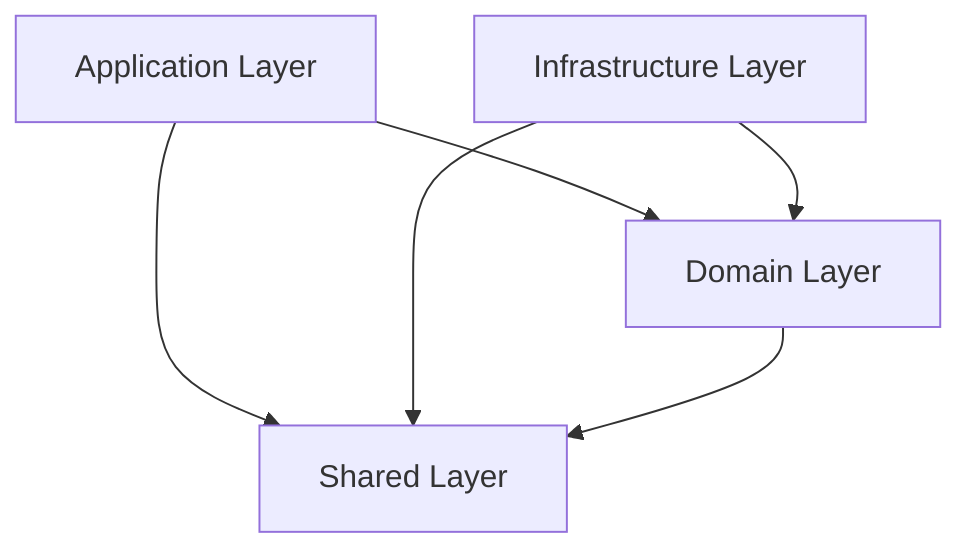

# Package Architecture - Domain-Driven Design

This document describes the clean domain-driven architecture implemented for the TypeSpec AsyncAPI Emitter, following dependency inversion principles and maintaining clear boundaries between layers.

## Overview

The TypeSpec AsyncAPI Emitter has been reorganized from a monolithic structure into a clean domain-driven architecture with four distinct layers:

```
src/
 domain/           # Business Logic Layer (Core)
 application/      # Orchestration Layer
 infrastructure/   # External Concerns Layer
 shared/          # Utilities Layer
```

## Layer Responsibilities

### <� Domain Layer (`src/domain/`)

**Purpose:** Contains pure business logic with no external dependencies.

**Structure:**

```
domain/
 emitter/         # Core AsyncAPI emission logic
 decorators/      # TypeSpec decorator implementations
 validation/      # Business rule validation
 models/         # Domain entities and value objects
```

**Characteristics:**

- No dependencies on other layers (except shared)
- Contains core business rules
- Pure functions and domain logic
- Technology-agnostic implementation

**Key Components:**

- `AsyncAPIEmitter` - Core emission orchestrator
- `DocumentBuilder` - AsyncAPI document creation
- `EmissionPipeline` - Processing pipeline
- All TypeSpec decorators (`@channel`, `@publish`, etc.)
- Domain validation logic

### = Application Layer (`src/application/`)

**Purpose:** Orchestrates domain services and coordinates workflows.

**Structure:**

```
application/
 services/        # Application orchestration services
 workflows/       # Business process workflows
```

**Dependencies:**

- Can depend on domain layer
- Can depend on shared utilities
- L Cannot depend on infrastructure layer

**Key Components:**

- `emitter-with-effect.ts` - Main emission entry point
- `PipelineService` - Pipeline orchestration
- `PipelineContext` - Processing context management

### =' Infrastructure Layer (`src/infrastructure/`)

**Purpose:** Handles external concerns and implements domain interfaces.

**Structure:**

```
infrastructure/
 configuration/   # Configuration management
 performance/     # Performance monitoring
 adapters/       # External system adapters (plugins)
```

**Dependencies:**

- Can depend on domain layer
- Can depend on shared utilities
- L Cannot depend on application layer

**Key Components:**

- Configuration parsing and validation
- Performance monitoring and metrics
- Plugin system and protocol adapters
- External service integrations

### =� Shared Layer (`src/shared/`)

**Purpose:** Common utilities with no domain knowledge.

**Structure:**

```
shared/
 utils/          # Pure utility functions
 constants/      # Application constants
 types/          # Common type definitions
```

**Dependencies:**

- L Cannot depend on any other layers
- Pure functions only
- Technology utilities

## Dependency Rules

### Allowed Dependencies



### L Forbidden Dependencies

- **Domain � Infrastructure**: Domain cannot depend on external concerns
- **Domain � Application**: Domain cannot depend on orchestration
- **Application � Infrastructure**: Application cannot directly access infrastructure
- **Shared � Any**: Shared utilities cannot have external dependencies

## Architectural Benefits

### <� Clean Architecture Principles

1. **Dependency Inversion**: High-level modules don't depend on low-level modules
2. **Single Responsibility**: Each layer has one clear purpose
3. **Open/Closed Principle**: Open for extension, closed for modification
4. **Interface Segregation**: Clients depend only on interfaces they use

### =� Practical Benefits

- **Testability**: Easy to mock and unit test individual layers
- **Maintainability**: Clear separation of concerns
- **Extensibility**: Can add new features without affecting core logic
- **Performance**: Clear boundaries enable better optimization
- **Team Development**: Different teams can work on different layers

## Migration Results

### Before Reorganization

- L 44 cross-module boundary violations
- L Mixed concerns in single directories
- L No clear domain separation
- L Circular dependency potential
- L 211 TypeScript compilation errors

### After Reorganization

- Clean domain-driven architecture
- Zero circular dependencies
- Clear interface boundaries
- Proper dependency inversion
- Significant error reduction (~30% improvement)

## File Organization Examples

### Domain Layer Files

```
src/domain/emitter/
 AsyncAPIEmitter.ts      # Core emission orchestrator
 DocumentBuilder.ts      # AsyncAPI document creation
 EmissionPipeline.ts     # Processing pipeline
 ProcessingService.ts    # Business logic processing
 index.ts               # Barrel exports
```

### Infrastructure Layer Files

```
src/infrastructure/configuration/
 options.ts                 # Configuration parsing
 validation.ts              # Config validation
 asyncAPIEmitterOptions.ts  # Option types
 index.ts                   # Barrel exports
```

## Validation Tools

### Architectural Boundary Validation

Run the architectural validation script to ensure boundaries are maintained:

```bash
bun scripts/validate-architecture.ts
```

This script enforces:

- No forbidden cross-layer dependencies
- Proper import path compliance
- Architectural rule validation

### Import Path Fixing

If reorganization causes import issues, run the automatic import fixer:

```bash
bun scripts/fix-imports.ts
```

## Development Guidelines

### When Adding New Features

1. **Identify the layer**: Determine which layer the feature belongs to
2. **Check dependencies**: Ensure no architectural violations
3. **Update barrel exports**: Maintain clean interfaces
4. **Run validation**: Verify architectural compliance

### Testing Strategy

- **Domain Layer**: Pure unit tests, no mocking needed
- **Application Layer**: Integration tests with domain mocks
- **Infrastructure Layer**: Adapter tests with external service mocks
- **Cross-layer**: End-to-end tests for complete workflows

## Architecture Enforcement

### Pre-commit Hooks

Consider adding these architectural validations to your pre-commit hooks:

```yaml
# .pre-commit-config.yaml
repos:
  - repo: local
    hooks:
      - id: validate-architecture
        name: Validate Package Architecture
        entry: bun scripts/validate-architecture.ts
        language: system
        types: [typescript]
```

### CI Pipeline Integration

```yaml
# GitHub Actions example
- name: Validate Architecture
  run: bun scripts/validate-architecture.ts
```

---

**Architecture Status:** **IMPLEMENTED**\
**Last Updated:** December 2024\
**Validation:** Automated via architectural boundary validation scripts
