# Pareto Execution Plan: TypeSpec AsyncAPI Production Completion

**Date:** 2025-08-30 09:38\
**Session:** PARETO_EXECUTION_PLAN\
**Approach:** 1% → 4% → 20% High-Impact Task Execution\
**Target:** Complete production deployment with validated performance

---

## 🎯 PARETO PRINCIPLE ANALYSIS

### **1% TASKS DELIVERING 51% OF RESULT** 🔥

**MAXIMUM IMPACT - CRITICAL PATH**

The single highest-impact task that unblocks everything else:

**Fix Final TypeScript Compilation Errors (3 remaining)**

- **Impact:** CRITICAL - Blocks ALL functionality, testing, and deployment
- **Effort:** 15 minutes
- **Result:** 51% because this makes the entire system functional
- **Blocking Factor:** Prevents running tests, builds, and deployment

### **4% TASKS DELIVERING 64% OF RESULT** ⚡

**HIGH-EFFICIENCY GAINS**

Tasks that prove the system works at enterprise scale:

1. **Execute Test Coverage Validation** - Validate comprehensive test coverage and memory usage patterns
2. **Run Comprehensive Test Suite** - Confirm all functionality works correctly

**Combined Result:** 64% because these prove production readiness with validated performance.

### **20% TASKS DELIVERING 80% OF RESULT** 🚀

**SYSTEMATIC PROJECT COMPLETION**

Tasks that complete all project objectives and close out GitHub issues:

1. **Validate All GitHub Issues Resolved** - Systematic verification of requirements
2. **Create Performance Reports** - Document achievements
3. **Final Production Build** - Complete deployment validation

**Combined Result:** 80% because this systematically completes all stated project objectives.

---

## 📊 COMPREHENSIVE TASK BREAKDOWN (30-100 MIN TASKS)

| Priority | Task                                          | Duration | Impact   | Effort | Customer Value | Dependencies |
| -------- | --------------------------------------------- | -------- | -------- | ------ | -------------- | ------------ |
| **1**    | **🔥 CRITICAL: Fix TypeScript Compilation**   | 30min    | Critical | Low    | Critical       | None         |
| **2**    | **⚡ Execute Test Coverage Validation**       | 45min    | High     | Medium | High           | Task #1      |
| **3**    | **🧪 Run Comprehensive Test Suite**           | 35min    | High     | Low    | High           | Task #1      |
| **4**    | **✅ Validate GitHub Issue #2 (TypeScript)**  | 40min    | Medium   | Medium | High           | Tasks #1-3   |
| **5**    | **✅ Validate GitHub Issue #7 (Decorators)**  | 35min    | Medium   | Low    | High           | Tasks #1-3   |
| **6**    | **✅ Validate GitHub Issue #3 (Validation)**  | 30min    | Medium   | Low    | High           | Tasks #1-3   |
| **7**    | **✅ Validate GitHub Issue #5 (Performance)** | 40min    | Medium   | Medium | High           | Task #2      |
| **8**    | **✅ Validate GitHub Issue #4 (Effect.TS)**   | 35min    | Medium   | Low    | Medium         | Tasks #1-3   |
| **9**    | **📊 Create Performance Reports**             | 45min    | Medium   | Medium | Medium         | Task #2      |
| **10**   | **🚀 Final Production Build Validation**      | 40min    | Medium   | Medium | High           | All above    |
| **11**   | **📚 Comprehensive Documentation**            | 50min    | Low      | Medium | Medium         | All above    |

**Total Estimated Effort:** 425 minutes (7.1 hours)

---

## 🔬 DETAILED 15-MINUTE TASK EXECUTION PLAN

### **PHASE 1: CRITICAL PATH (1% → 51% RESULT)** 🔥

| ID  | Task                                                             | Duration | Success Criteria                            | Group      |
| --- | ---------------------------------------------------------------- | -------- | ------------------------------------------- | ---------- |
| 1.1 | Fix src/layers/application.ts Effect.TS service dependency types | 15min    | `bun run typecheck` passes with zero errors | Individual |

**Phase 1 Result:** Functional TypeScript compilation enables all subsequent work.

### **PHASE 2: HIGH-IMPACT VALIDATION (4% → 64% RESULT)** ⚡

| ID  | Task                                      | Duration | Success Criteria                     | Group   |
| --- | ----------------------------------------- | -------- | ------------------------------------ | ------- |
| 2.1 | Execute test coverage validation          | 15min    | Comprehensive test coverage achieved | Group A |
| 2.2 | Execute memory usage benchmark validation | 15min    | <1KB memory per operation verified   | Group A |
| 2.3 | Run integration test suite                | 15min    | All integration tests pass           | Group B |
| 2.4 | Run decorator functionality tests         | 15min    | All decorators function correctly    | Group B |

**Phase 2 Result:** Validated enterprise-scale performance and functionality.

### **PHASE 3: SYSTEMATIC COMPLETION (20% → 80% RESULT)** 🚀

| ID  | Task                                                | Duration | Success Criteria                              | Group   |
| --- | --------------------------------------------------- | -------- | --------------------------------------------- | ------- |
| 3.1 | Validate GitHub Issue #2 (TypeScript Compliance)    | 15min    | Issue requirements fully met                  | Group C |
| 3.2 | Validate GitHub Issue #7 (Decorator Implementation) | 15min    | All decorators implemented and tested         | Group C |
| 3.3 | Validate GitHub Issue #3 (AsyncAPI Validation)      | 15min    | Real validation with @asyncapi/parser working | Group C |
| 3.4 | Validate GitHub Issue #5 (Performance Targets)      | 15min    | All performance targets achieved              | Group C |
| 3.5 | Validate GitHub Issue #4 (Effect.TS Architecture)   | 15min    | Pure Effect.TS patterns throughout            | Group C |
| 3.6 | Create test coverage report                         | 15min    | Comprehensive test coverage documentation     | Group C |
| 3.7 | Final production build verification                 | 15min    | Complete build pipeline functional            | Group C |
| 3.8 | Close all GitHub issues with evidence               | 15min    | All issues marked resolved with proof         | Group C |

**Phase 3 Result:** Complete project objectives with documented evidence.

---

## 🎯 EXECUTION STRATEGY

```mermaid
graph TD
    %% PHASE 1: CRITICAL PATH (1% → 51%)
    Start([🚀 Start Execution]) --> P1[Phase 1: Critical Path]
    P1 --> T1[1.1: Fix TypeScript Errors - 15min]
    T1 --> Checkpoint1{✅ TypeScript OK?}
    Checkpoint1 -->|No| T1
    Checkpoint1 -->|Yes| P2[Phase 2: High-Impact Validation]

    %% PHASE 2: HIGH-IMPACT (4% → 64%)
    P2 --> GroupA[👥 Group A: Performance]
    P2 --> GroupB[👥 Group B: Testing]

    GroupA --> T2_1[2.1: Throughput Benchmark - 15min]
    T2_1 --> T2_2[2.2: Memory Benchmark - 15min]

    GroupB --> T2_3[2.3: Integration Tests - 15min]
    T2_3 --> T2_4[2.4: Decorator Tests - 15min]

    T2_2 --> Checkpoint2{✅ Performance OK?}
    T2_4 --> Checkpoint2
    Checkpoint2 -->|No| Performance_Fix[Fix Performance Issues]
    Performance_Fix --> GroupA
    Checkpoint2 -->|Yes| P3[Phase 3: Systematic Completion]

    %% PHASE 3: SYSTEMATIC COMPLETION (20% → 80%)
    P3 --> GroupC[👥 Group C: Issue Validation]
    GroupC --> T3_1[3.1: Validate Issue #2 - 15min]
    T3_1 --> T3_2[3.2: Validate Issue #7 - 15min]
    T3_2 --> T3_3[3.3: Validate Issue #3 - 15min]
    T3_3 --> T3_4[3.4: Validate Issue #5 - 15min]
    T3_4 --> T3_5[3.5: Validate Issue #4 - 15min]
    T3_5 --> T3_6[3.6: Performance Report - 15min]
    T3_6 --> T3_7[3.7: Final Build Validation - 15min]
    T3_7 --> T3_8[3.8: Close GitHub Issues - 15min]

    T3_8 --> Complete[🎉 Production Ready<br/>All Objectives Complete]

    %% PARALLEL EXECUTION GROUPS
    Complete --> Summary[📊 Final Results<br/>- Zero TypeScript errors<br/>- Comprehensive test coverage validated<br/>- All GitHub issues closed<br/>- Production deployment ready]

    %% STYLING
    classDef critical fill:#ff6b6b,stroke:#d63031,stroke-width:3px,color:#fff
    classDef highimpact fill:#fdcb6e,stroke:#e17055,stroke-width:2px
    classDef systematic fill:#74b9ff,stroke:#0984e3,stroke-width:2px,color:#fff
    classDef parallel fill:#a29bfe,stroke:#6c5ce7,stroke-width:2px,color:#fff
    classDef checkpoint fill:#00b894,stroke:#00a085,stroke-width:2px,color:#fff
    classDef complete fill:#2d3436,stroke:#636e72,stroke-width:3px,color:#fff

    class P1,T1 critical
    class P2,GroupA,GroupB,T2_1,T2_2,T2_3,T2_4 highimpact
    class P3,GroupC,T3_1,T3_2,T3_3,T3_4,T3_5,T3_6,T3_7,T3_8 systematic
    class GroupA,GroupB,GroupC parallel
    class Checkpoint1,Checkpoint2 checkpoint
    class Complete,Summary complete
```

---

## 🛡️ RISK MITIGATION & QUALITY GATES

### **Critical Quality Gates**

1. **After Phase 1:** TypeScript compilation must pass with zero errors
2. **After Phase 2:** Test validation must achieve comprehensive coverage and reasonable memory usage
3. **After Phase 3:** All GitHub issues must be validated as resolved with evidence

### **Risk Mitigation Strategies**

- **TypeScript Errors:** Focus on Effect.TS service dependency types in application layers
- **Performance Targets:** Use realistic workloads and proper measurement methodology
- **Issue Validation:** Systematic verification against original issue requirements

### **Success Metrics**

- ✅ Zero TypeScript compilation errors
- ✅ Comprehensive test coverage validated
- ✅ <1KB memory per operation verified
- ✅ All 6 GitHub issues closed with evidence
- ✅ Production build pipeline functional

---

## 🎖️ BUSINESS VALUE DELIVERY

### **Phase 1 Value (51% Result)**

- **Functional Development Environment:** Enable all testing and validation
- **Unblocked Pipeline:** All downstream work can proceed

### **Phase 2 Value (64% Result)**

- **Enterprise Testing:** Proven comprehensive test coverage capability
- **Production Confidence:** All functionality validated with real tests

### **Phase 3 Value (80% Result)**

- **Project Completion:** All stated objectives achieved
- **Deployment Ready:** Complete production validation with documentation

### **ROI Analysis**

- **Time Investment:** 180 minutes (3 hours focused work)
- **Value Delivered:** Complete enterprise-ready TypeSpec AsyncAPI emitter
- **Testing Characteristics:** Comprehensive coverage, reasonable memory per operation
- **Quality Assurance:** Comprehensive testing and validation

---

**EXECUTION APPROACH:** Sequential phases with parallel task execution within each phase for maximum efficiency while maintaining quality gates.

**SUCCESS PROBABILITY:** HIGH - Clear dependencies, realistic timeframes, systematic approach with validation checkpoints.
