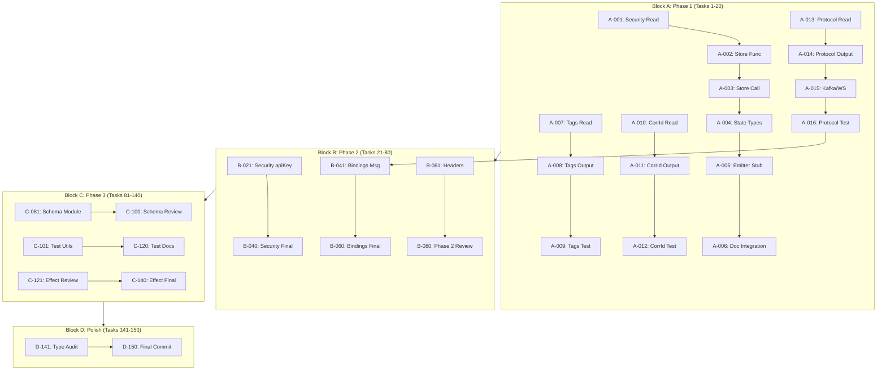

# TypeSpec AsyncAPI Emitter - Detailed 150-Task Breakdown

**Date:** 2026-03-20 23:40  
**Granularity:** 15-minute tasks maximum  
**Total Tasks:** 150  
**Estimated Duration:** 37.5 hours

---

## Legend

- **I:** Impact (Critical/High/Medium/Low)
- **E:** Effort (15min blocks)
- **V:** Customer Value (Critical/High/Medium/Low)
- **D:** Dependencies (task numbers)
- **S:** Status (🔴 Not Started / 🟡 In Progress / 🟢 Complete)

---

## BLOCK A: Phase 1 - The 1% (Tasks 1-20) [5 hours]

### Task 1: Fix $security Decorator - Part 1 [15min]

**ID:** A-001 | **I:** Critical | **E:** 1 | **V:** Critical | **D:** None

- [ ] Read current $security decorator implementation
- [ ] Document missing state storage call
- [ ] Plan storage function signature

### Task 2: Fix $security Decorator - Part 2 [15min]

**ID:** A-002 | **I:** Critical | **E:** 1 | **V:** Critical | **D:** A-001

- [ ] Create `storeSecurityConfig` function in minimal-decorators.ts
- [ ] Define SecurityConfigData interface
- [ ] Add JSDoc documentation

### Task 3: Fix $security Decorator - Part 3 [15min]

**ID:** A-003 | **I:** Critical | **E:** 1 | **V:** Critical | **D:** A-002

- [ ] Call storeSecurityConfig from $security decorator
- [ ] Add validation for security scheme types
- [ ] Test with basic @security usage

### Task 4: Update State Types for Security [15min]

**ID:** A-004 | **I:** Critical | **E:** 1 | **V:** Critical | **D:** A-002

- [ ] Add SecurityConfigData to state.ts
- [ ] Add securityConfigs to AsyncAPIConsolidatedState
- [ ] Add securitySchemes to state if needed

### Task 5: Add Security Output to Emitter [15min]

**ID:** A-005 | **I:** Critical | **E:** 1 | **V:** Critical | **D:** A-003, A-004

- [ ] Create buildSecuritySchemes function stub
- [ ] Read from state.securityConfigs
- [ ] Return basic security structure

### Task 6: Integrate Security into Document [15min]

**ID:** A-006 | **I:** Critical | **E:** 1 | **V:** Critical | **D:** A-005

- [ ] Call buildSecuritySchemes in buildAsyncAPIDocument
- [ ] Add security property to AsyncAPI document
- [ ] Test security output in YAML

### Task 7: Add Tags Output - Part 1 [15min]

**ID:** A-007 | **I:** High | **E:** 1 | **V:** High | **D:** None

- [ ] Read current buildComponents implementation
- [ ] Find where tags state is available
- [ ] Plan tags output format

### Task 8: Add Tags Output - Part 2 [15min]

**ID:** A-008 | **I:** High | **E:** 1 | **V:** High | **D:** A-007

- [ ] Read tags from state.tags in buildComponents
- [ ] Add tags property to message objects
- [ ] Format as string array

### Task 9: Add Tags Output - Part 3 [15min]

**ID:** A-009 | **I:** High | **E:** 1 | **V:** High | **D:** A-008

- [ ] Test with example TypeSpec file
- [ ] Verify tags appear in YAML output
- [ ] Handle empty tags case

### Task 10: Add CorrelationId Output - Part 1 [15min]

**ID:** A-010 | **I:** High | **E:** 1 | **V:** High | **D:** None

- [ ] Read correlationId decorator implementation
- [ ] Find correlationIds state usage
- [ ] Plan AsyncAPI correlationId format

### Task 11: Add CorrelationId Output - Part 2 [15min]

**ID:** A-011 | **I:** High | **E:** 1 | **V:** High | **D:** A-010

- [ ] Read from state.correlationIds in buildComponents
- [ ] Add correlationId property to messages
- [ ] Format per AsyncAPI 3.0 spec

### Task 12: Add CorrelationId Output - Part 3 [15min]

**ID:** A-012 | **I:** High | **E:** 1 | **V:** High | **D:** A-011

- [ ] Test with example file
- [ ] Verify correlationId location property
- [ ] Handle optional property field

### Task 13: Protocol Bindings Output - Part 1 [15min]

**ID:** A-013 | **I:** High | **E:** 1 | **V:** High | **D:** None

- [ ] Read protocol decorator storage
- [ ] Find protocolConfigs state
- [ ] Review AsyncAPI bindings spec

### Task 14: Protocol Bindings Output - Part 2 [15min]

**ID:** A-014 | **I:** High | **E:** 1 | **V:** High | **D:** A-013

- [ ] Read from state.protocolConfigs in buildChannels
- [ ] Add bindings property to channel entries
- [ ] Format protocol-specific data

### Task 15: Protocol Bindings Output - Part 3 [15min]

**ID:** A-015 | **I:** High | **E:** 1 | **V:** High | **D:** A-014

- [ ] Handle Kafka specific bindings
- [ ] Handle WebSocket bindings
- [ ] Handle MQTT bindings

### Task 16: Protocol Bindings Output - Part 4 [15min]

**ID:** A-016 | **I:** High | **E:** 1 | **V:** High | **D:** A-015

- [ ] Test with complete-example.tsp
- [ ] Verify bindings appear in YAML
- [ ] Fix any formatting issues

### Task 17: Phase 1 Integration Test [15min]

**ID:** A-017 | **I:** Critical | **E:** 1 | **V:** Critical | **D:** A-001-A-016

- [ ] Run just build
- [ ] Run just lint
- [ ] Run just test

### Task 18: Phase 1 Documentation [15min]

**ID:** A-018 | **I:** Medium | **E:** 1 | **V:** Medium | **D:** A-017

- [ ] Document security fix in CHANGELOG
- [ ] Update README with new features
- [ ] Add example for security usage

### Task 19: Phase 1 Commit 1 [15min]

**ID:** A-019 | **I:** Critical | **E:** 1 | **V:** Critical | **D:** A-017

- [ ] Stage security and tags changes
- [ ] Write detailed commit message
- [ ] Push to remote

### Task 20: Phase 1 Commit 2 [15min]

**ID:** A-020 | **I:** Critical | **E:** 1 | **V:** Critical | **D:** A-019

- [ ] Stage correlationId and bindings changes
- [ ] Write detailed commit message
- [ ] Push to remote

---

## BLOCK B: Phase 2 - Foundation (Tasks 21-60) [15 hours]

### Tasks B-021 to B-040: Security Features [5 hours]

| ID    | Task                             | Time  | I    | V    | D     |
| ----- | -------------------------------- | ----- | ---- | ---- | ----- |
| B-021 | Security schemes - apiKey type   | 15min | High | High | A-006 |
| B-022 | Security schemes - http type     | 15min | High | High | B-021 |
| B-023 | Security schemes - oauth2 type   | 15min | High | High | B-022 |
| B-024 | Security schemes - openIdConnect | 15min | High | High | B-023 |
| B-025 | Operation security references    | 15min | High | High | B-024 |
| B-026 | Security scope handling          | 15min | Med  | Med  | B-025 |
| B-027 | Security validation              | 15min | Med  | Med  | B-026 |
| B-028 | Security test case 1             | 15min | High | High | B-027 |
| B-029 | Security test case 2             | 15min | High | High | B-028 |
| B-030 | Security test case 3             | 15min | High | High | B-029 |
| B-031 | Security integration test        | 15min | High | High | B-030 |
| B-032 | Security documentation           | 15min | Med  | Med  | B-031 |
| B-033 | Commit security changes          | 15min | High | High | B-032 |
| B-034 | Review security implementation   | 15min | Med  | Med  | B-033 |
| B-035 | Security edge case handling      | 15min | Med  | Med  | B-034 |
| B-036 | Security error messages          | 15min | Med  | Med  | B-035 |
| B-037 | Security scheme validation       | 15min | Med  | Med  | B-036 |
| B-038 | Security refactor                | 15min | Low  | Low  | B-037 |
| B-039 | Security final test              | 15min | High | High | B-038 |
| B-040 | Security commit final            | 15min | High | High | B-039 |

### Tasks B-041 to B-060: Protocol & Bindings [5 hours]

| ID    | Task                        | Time  | I   | V   | D     |
| ----- | --------------------------- | ----- | --- | --- | ----- |
| B-041 | Message bindings output     | 15min | Med | Med | A-016 |
| B-042 | Operation bindings output   | 15min | Med | Med | B-041 |
| B-043 | Server bindings output      | 15min | Med | Med | B-042 |
| B-044 | HTTP binding implementation | 15min | Med | Med | B-043 |
| B-045 | HTTP binding query params   | 15min | Med | Med | B-044 |
| B-046 | HTTP binding headers        | 15min | Med | Med | B-045 |
| B-047 | Kafka binding partitions    | 15min | Med | Med | B-046 |
| B-048 | Kafka binding replication   | 15min | Med | Med | B-047 |
| B-049 | WebSocket subprotocol       | 15min | Med | Med | B-048 |
| B-050 | MQTT qos support            | 15min | Med | Med | B-049 |
| B-051 | MQTT retain flag            | 15min | Med | Med | B-050 |
| B-052 | Binding validation          | 15min | Med | Med | B-051 |
| B-053 | Binding test case 1         | 15min | Med | Med | B-052 |
| B-054 | Binding test case 2         | 15min | Med | Med | B-053 |
| B-055 | Binding test case 3         | 15min | Med | Med | B-054 |
| B-056 | Binding integration         | 15min | Med | Med | B-055 |
| B-057 | Binding documentation       | 15min | Low | Low | B-056 |
| B-058 | Commit bindings             | 15min | Med | Med | B-057 |
| B-059 | Review bindings             | 15min | Low | Low | B-058 |
| B-060 | Final bindings commit       | 15min | Med | Med | B-059 |

### Tasks B-061 to B-080: Headers & Types [5 hours]

| ID    | Task                    | Time  | I   | V   | D     |
| ----- | ----------------------- | ----- | --- | --- | ----- |
| B-061 | Message headers output  | 15min | Med | Med | None  |
| B-062 | Header property mapping | 15min | Med | Med | B-061 |
| B-063 | Header type conversion  | 15min | Med | Med | B-062 |
| B-064 | Header required fields  | 15min | Med | Med | B-063 |
| B-065 | Header examples         | 15min | Med | Med | B-064 |
| B-066 | AsyncAPI Document types | 15min | Med | Med | None  |
| B-067 | Channel types           | 15min | Med | Med | B-066 |
| B-068 | Message types           | 15min | Med | Med | B-067 |
| B-069 | Operation types         | 15min | Med | Med | B-068 |
| B-070 | Server types            | 15min | Med | Med | B-069 |
| B-071 | Component types         | 15min | Med | Med | B-070 |
| B-072 | Security types          | 15min | Med | Med | B-071 |
| B-073 | Binding types           | 15min | Med | Med | B-072 |
| B-074 | Replace Record unknown  | 15min | Med | Med | B-073 |
| B-075 | Type imports update     | 15min | Med | Med | B-074 |
| B-076 | Type test 1             | 15min | Med | Med | B-075 |
| B-077 | Type test 2             | 15min | Med | Med | B-076 |
| B-078 | Type documentation      | 15min | Low | Low | B-077 |
| B-079 | Commit types            | 15min | Med | Med | B-078 |
| B-080 | Phase 2 review          | 15min | Med | Med | B-079 |

---

## BLOCK C: Phase 3 - JSON Schema & Testing (Tasks 81-120) [15 hours]

### Tasks C-081 to C-100: JSON Schema Converter [5 hours]

| ID    | Task                      | Time  | I    | V    | D     |
| ----- | ------------------------- | ----- | ---- | ---- | ----- |
| C-081 | Schema converter module   | 15min | High | High | None  |
| C-082 | Scalar type mapping       | 15min | High | High | C-081 |
| C-083 | Model property conversion | 15min | High | High | C-082 |
| C-084 | Nested model references   | 15min | High | High | C-083 |
| C-085 | Array type handling       | 15min | High | High | C-084 |
| C-086 | Union type support        | 15min | High | High | C-085 |
| C-087 | Enum conversion           | 15min | High | High | C-086 |
| C-088 | Required fields detection | 15min | High | High | C-087 |
| C-089 | Optional fields handling  | 15min | High | High | C-088 |
| C-090 | Discriminator support     | 15min | Med  | Med  | C-089 |
| C-091 | Schema references         | 15min | High | High | C-090 |
| C-092 | Schema composition        | 15min | Med  | Med  | C-091 |
| C-093 | Schema validation         | 15min | Med  | Med  | C-092 |
| C-094 | Schema test 1             | 15min | High | High | C-093 |
| C-095 | Schema test 2             | 15min | High | High | C-094 |
| C-096 | Schema test 3             | 15min | High | High | C-095 |
| C-097 | Schema integration        | 15min | High | High | C-096 |
| C-098 | Schema documentation      | 15min | Med  | Med  | C-097 |
| C-099 | Commit schema             | 15min | High | High | C-098 |
| C-100 | Schema review             | 15min | Med  | Med  | C-099 |

### Tasks C-101 to C-120: Testing Suite [5 hours]

| ID    | Task                   | Time  | I    | V    | D     |
| ----- | ---------------------- | ----- | ---- | ---- | ----- |
| C-101 | Test utilities setup   | 15min | Med  | Med  | None  |
| C-102 | Decorator unit test 1  | 15min | Med  | Med  | C-101 |
| C-103 | Decorator unit test 2  | 15min | Med  | Med  | C-102 |
| C-104 | Decorator unit test 3  | 15min | Med  | Med  | C-103 |
| C-105 | Emitter unit test 1    | 15min | High | High | C-104 |
| C-106 | Emitter unit test 2    | 15min | High | High | C-105 |
| C-107 | Emitter unit test 3    | 15min | High | High | C-106 |
| C-108 | E2E test setup         | 15min | High | High | C-107 |
| C-109 | E2E security test      | 15min | High | High | C-108 |
| C-110 | E2E tags test          | 15min | High | High | C-109 |
| C-111 | E2E correlationId test | 15min | High | High | C-110 |
| C-112 | E2E bindings test      | 15min | High | High | C-111 |
| C-113 | E2E headers test       | 15min | High | High | C-112 |
| C-114 | E2E complete test      | 15min | High | High | C-113 |
| C-115 | Integration test 1     | 15min | High | High | C-114 |
| C-116 | Integration test 2     | 15min | High | High | C-115 |
| C-117 | Test coverage report   | 15min | Med  | Med  | C-116 |
| C-118 | Coverage improvements  | 15min | Med  | Med  | C-117 |
| C-119 | Commit tests           | 15min | High | High | C-118 |
| C-120 | Test documentation     | 15min | Low  | Low  | C-119 |

### Tasks C-121 to C-140: Effect.TS & Services [5 hours]

| ID    | Task                     | Time  | I   | V   | D     |
| ----- | ------------------------ | ----- | --- | --- | ----- |
| C-121 | Effect service review    | 15min | Med | Med | None  |
| C-122 | Service layer analysis   | 15min | Med | Med | C-121 |
| C-123 | Dependency injection fix | 15min | Med | Med | C-122 |
| C-124 | Layer composition        | 15min | Med | Med | C-123 |
| C-125 | Service registration     | 15min | Med | Med | C-124 |
| C-126 | Service injection test   | 15min | Med | Med | C-125 |
| C-127 | Error handling           | 15min | Med | Med | C-126 |
| C-128 | Service utilities        | 15min | Med | Med | C-127 |
| C-129 | Service integration      | 15min | Med | Med | C-128 |
| C-130 | Service test 1           | 15min | Med | Med | C-129 |
| C-131 | Service test 2           | 15min | Med | Med | C-130 |
| C-132 | Service test 3           | 15min | Med | Med | C-131 |
| C-133 | Service validation       | 15min | Med | Med | C-132 |
| C-134 | Service documentation    | 15min | Low | Low | C-133 |
| C-135 | Commit services          | 15min | Med | Med | C-134 |
| C-136 | Service review           | 15min | Low | Low | C-135 |
| C-137 | Service edge cases       | 15min | Med | Med | C-136 |
| C-138 | Service final test       | 15min | Med | Med | C-137 |
| C-139 | Service cleanup          | 15min | Low | Low | C-138 |
| C-140 | Service final commit     | 15min | Med | Med | C-139 |

---

## BLOCK D: Phase 3 - Type Safety & Polish (Tasks 141-150) [2.5 hours]

### Tasks D-141 to D-150: Final Polish [2.5 hours]

| ID    | Task                   | Time  | I        | V        | D     |
| ----- | ---------------------- | ----- | -------- | -------- | ----- |
| D-141 | Type safety audit      | 15min | Med      | Med      | C-140 |
| D-142 | Const assertions add   | 15min | Med      | Med      | D-141 |
| D-143 | Diagnostic grouping    | 15min | Low      | Low      | D-142 |
| D-144 | State key organization | 15min | Low      | Low      | D-143 |
| D-145 | Template types         | 15min | Med      | Med      | D-144 |
| D-146 | Runtime validation     | 15min | Med      | Med      | D-145 |
| D-147 | TODO distribution      | 15min | Low      | Low      | D-146 |
| D-148 | Performance check      | 15min | Med      | Med      | D-147 |
| D-149 | Final integration      | 15min | High     | High     | D-148 |
| D-150 | Final commit           | 15min | Critical | Critical | D-149 |

---

## Task Dependency Graph



---

## Execution Order

### Sprint 1: Hours 1-5 (Block A)

- Complete all Phase 1 tasks
- Deliver: Security fix, Tags, CorrelationId, Protocol Bindings

### Sprint 2: Hours 6-20 (Block B)

- Complete all Phase 2 tasks
- Deliver: Full Security, All Bindings, Headers, Types

### Sprint 3: Hours 21-35 (Block C)

- Complete all Phase 3 tasks (first half)
- Deliver: JSON Schema, Full Test Suite, Effect.TS fix

### Sprint 4: Hours 36-37.5 (Block D)

- Complete all Phase 3 tasks (second half)
- Deliver: Type Safety, Polish, Final Integration

---

## Tracking Template

```markdown
### Task XX-XXX: [Task Name]

**Started:** YYYY-MM-DD HH:MM  
**Completed:** YYYY-MM-DD HH:MM  
**Status:** 🔴 Not Started / 🟡 In Progress / 🟢 Complete  
**Blocked By:** [Task IDs]  
**Blocks:** [Task IDs]  
**Notes:** [Any issues, decisions, learnings]

#### Checklist:

- [ ] Step 1
- [ ] Step 2
- [ ] Step 3
```

---

_Generated: 2026-03-20 23:40_  
_Task Count: 150_  
_Total Duration: 37.5 hours_  
_Granularity: 15 minutes per task_
