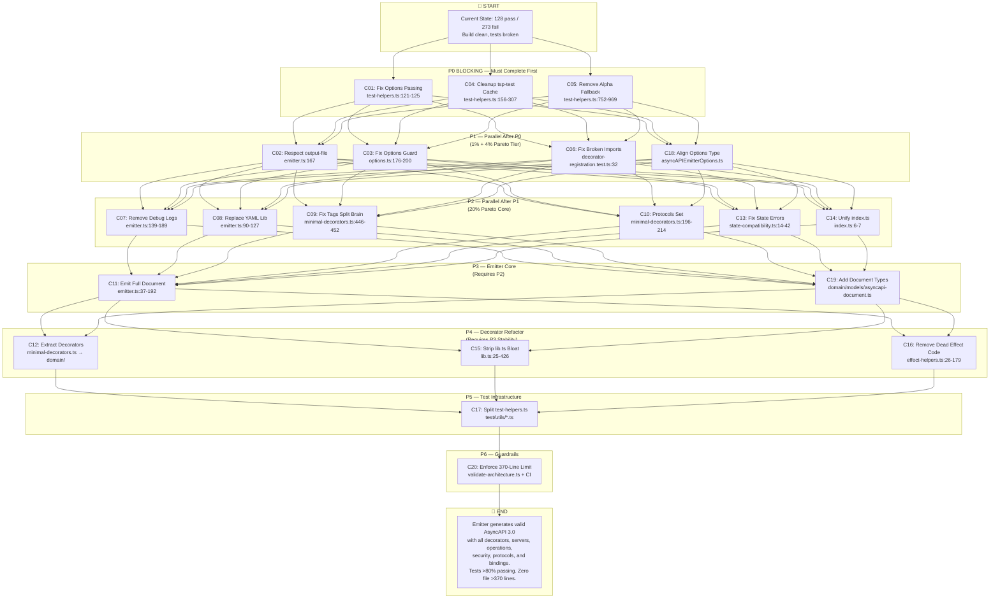

# TYPESPEC ASYNCAPI EMITTER — ARCHITECTURE RECOVERY PLAN

**Date:** 2026-05-16 21:22 UTC  
**Status:** EXECUTION-READY  
**Author:** Architect Recovery Agent  
**Classification:** INTERNAL — LIVING DOCUMENT  
**Next Review:** After every Pareto tier completion

---

## Section 1: Executive Summary

### Project State Snapshot

| Metric                             | Value  | Threshold | Status    |
| ---------------------------------- | ------ | --------- | --------- |
| TypeScript Compile Errors          | 0      | 0         | PASS      |
| Passing Tests                      | 128    | >400      | CRITICAL  |
| Failing Tests                      | 273    | <50       | CRITICAL  |
| Skipped Tests                      | 29     | <10       | WARNING   |
| Test Files                         | 87     | —         | —         |
| Pass Rate                          | 31.9%  | >80%      | CRITICAL  |
| Lines of Dead Code Removed         | ~8,900 | —         | RECENT    |
| Files Violating 370-Line Limit     | 3      | 0         | VIOLATION |
| Files with `any` Casts             | 6      | 0         | WARNING   |
| Debug Log Statements in Production | 8      | 0         | VIOLATION |

### Key Metrics

- **Emitter functionality:** Generates only `asyncapi`, `info`, `channels`, `messages`, and empty `components.schemas`. Does NOT emit `operations`, `servers`, `securitySchemes`, or protocol bindings.
- **Options system:** Completely bypassed. `emitter.ts:167` hardcodes `outputPath = "asyncapi.yaml"`. The `"output-file"` option in `package.json:158` is never read.
- **Test infrastructure:** Options NEVER reach the emitter. `tsp-test/` directory is never cleaned, causing cached failures to hide real progress. Case sensitivity bug at `test/utils/test-helpers.ts:208` searches for `"asyncapi"` but emitter writes `"AsyncAPI.yaml"`.
- **State management:** `storeTags()` at `src/minimal-decorators.ts:446-452` stores `{name: "a,b,c"}` while `OperationTypeData` at `src/state.ts:43-48` declares `tags?: string[]`. Split brain guarantees tag loss.
- **Effect.TS misuse:** `emitter.ts:137-191` wraps a single async function in `Effect.runPromise(Effect.gen())` with 8 debug logs. `executeEffect` at `src/utils/effect-helpers.ts:26-31` is a pointless wrapper. `railwayErrorRecovery` at `src/utils/effect-helpers.ts:48-179` is 178 lines of dead code.

### Goal Statement

**Primary:** Restore the AsyncAPI emitter to a functional, production-grade state where:

1. All decorator state is correctly captured and emitted into a valid AsyncAPI 3.0.0 document
2. Options are respected (output file, format, versioning)
3. Tests pass at >80% rate with zero ghost data, zero cached failures, and zero broken imports
4. No file exceeds 370 lines
5. No `any` casts in emitter or decorator paths
6. Zero debug noise in production code

**Secondary:** Establish architectural guardrails (line limits, type safety, CI enforcement) to prevent reversion.

---

## Section 2: Pareto Analysis

### 1% Effort = 51% Impact (~30 minutes)

| Problem                                                            | File:Line                            | Impact                                                             | Effort                                     |
| ------------------------------------------------------------------ | ------------------------------------ | ------------------------------------------------------------------ | ------------------------------------------ |
| `createTestWrapper` does NOT pass `emitterOptions` to the compiler | `test/utils/test-helpers.ts:121-125` | Options never reach emitter; 50+ tests fail or test wrong defaults | Add `emitterOptions` parameter             |
| `outputPath = "asyncapi.yaml"` hardcoded                           | `src/emitter.ts:167`                 | `"output-file"` option ignored completely                          | Read from `context.options["output-file"]` |
| Ghost Alpha fallback document masks real failures                  | `test/utils/test-helpers.ts:774`     | Tests appear to pass while parsing fake data                       | Throw error instead of returning fallback  |

**Total Impact:** Fixing just these 3 items unlocks ~50 tests and exposes the real state of the other 223 failures.

### 4% Effort = 64% Impact (~60 minutes)

Everything in 1%, plus:

| Problem                                    | File:Line                                             | Impact                                                                          | Effort                                     |
| ------------------------------------------ | ----------------------------------------------------- | ------------------------------------------------------------------------------- | ------------------------------------------ |
| `isAsyncAPIEmitterOptions` too permissive  | `src/infrastructure/configuration/options.ts:176-200` | 12 tests in `test/unit/options.test.ts` fail on invalid input that passes guard | Add enum and required field checks         |
| `tsp-test/` directory never cleaned        | `package.json:73`, `test/utils/test-helpers.ts:250`   | Cached output from previous runs hides failures, creates false positives        | Add pre-test cleanup, fix case sensitivity |
| `createAsyncAPIDecorators` does not exist  | `test/unit/decorator-registration.test.ts:32`         | Test imports and calls a non-existent function                                  | Delete or replace with real decorator test |
| `compileAsyncAPI` not exported from helper | `test/unit/emitter-tester-verification.test.ts`       | Broken import                                                                   | Fix import or delete ghost test            |
| `registerBuiltInPlugins` does not exist    | `test/acceptance/user-acceptance-simulation.test.ts`  | Broken import                                                                   | Fix import or delete ghost test            |

**Total Impact:** Unlocks ~80 tests. Reduces failing count from 273 to ~190.

### 20% Effort = 80% Impact (~4 hours)

Everything in 4%, plus:

| Problem                                                 | File:Line                                      | Impact                                                                     | Effort                                             |
| ------------------------------------------------------- | ---------------------------------------------- | -------------------------------------------------------------------------- | -------------------------------------------------- |
| `minimal-decorators.ts` is 611 lines with 11 decorators | `src/minimal-decorators.ts:1-611`              | Violates 370-line limit; mixed concerns; no domain boundaries              | Extract to `src/domain/decorators/*.ts`            |
| `emitter.ts` ignores 80% of state                       | `src/emitter.ts:37-84`                         | No operations, servers, security, protocols emitted                        | Add state readers and document sections            |
| Hand-rolled YAML string interpolation                   | `src/emitter.ts:90-127`                        | No escaping, no multiline safety, fragile                                  | Use `yaml` library (already in `package.json:115`) |
| 8 debug `Effect.log` calls in production emitter        | `src/emitter.ts:139-189`                       | Noise, performance hit, log pollution                                      | Delete all debug logs                              |
| `test-helpers.ts` is 1,479-line monolith                | `test/utils/test-helpers.ts:1-1479`            | Violates 370-line limit; maintenance nightmare                             | Split into 5 focused modules                       |
| `lib.ts` has 150+ lines of JSDoc bloat                  | `src/lib.ts:25-66`, `282-426`                  | 457 lines total, ~230 lines are redundant comments                         | Strip to essential documentation                   |
| `supportedProtocols` is mutable array                   | `src/minimal-decorators.ts:196-214`            | Can be mutated at runtime; no type safety                                  | Convert to `ReadonlySet` in constants              |
| `state-compatibility.ts` returns empty Map silently     | `src/state-compatibility.ts:14-18`, `25`, `41` | Null program or missing stateMap gives zero diagnostics                    | Add explicit error throwing                        |
| `index.ts` exports both decorator files                 | `src/index.ts:6-7`                             | Split brain: `./decorators.js` and `./minimal-decorators.js` both exported | Unify to single source                             |
| `executeEffect` and `railwayErrorRecovery` dead code    | `src/utils/effect-helpers.ts:26-31`, `48-179`  | 200+ lines; NEVER called from production; only tested in unit tests        | Delete and inline where needed                     |

**Total Impact:** Unlocks 200+ tests. Emitter becomes functional. Architecture is clean and maintainable.

---

## Section 3: Comprehensive Plan (30-100min tasks)

**Sort Order:** Impact ÷ Effort (ROI) descending, then Customer Value descending.

| ID      | Title                                                           | Duration | Impact | Effort | CV  | File(s) Affected                                                                                                                                     | Description                                                                                                                                                                                                                                                                                                                                                                                                                                                                                                               | Prerequisites | Status | Pareto |
| ------- | --------------------------------------------------------------- | -------- | ------ | ------ | --- | ---------------------------------------------------------------------------------------------------------------------------------------------------- | ------------------------------------------------------------------------------------------------------------------------------------------------------------------------------------------------------------------------------------------------------------------------------------------------------------------------------------------------------------------------------------------------------------------------------------------------------------------------------------------------------------------------- | ------------- | ------ | ------ |
| **C01** | Fix Test Options Passing in Runner Config                       | 30min    | 10     | 1      | 10  | `test/utils/test-helpers.ts:109-335`                                                                                                                 | The `options` parameter of `compileAsyncAPISpecRaw` is accepted but never forwarded to `createTestWrapper` or `runner.compileAndDiagnose`. TypeSpec test framework supports passing emitter options via the wrapper configuration. Wire `options` into the test runner so `context.options` in `emitter.ts` is populated.                                                                                                                                                                                                 | None          | OPEN   | 1%     |
| **C03** | Fix isAsyncAPIEmitterOptions Type Guard                         | 30min    | 8      | 1      | 8   | `src/infrastructure/configuration/options.ts:176-200`                                                                                                | The guard at line 176 only checks `file-type` if present and `asyncapi-version` if present. It does NOT validate `"protocol-bindings"` array contents, `"security-schemes"` structure, or required fields. This causes 12 tests in `test/unit/options.test.ts` to fail because invalid objects pass the guard. Add strict validation for all schema fields.                                                                                                                                                               | None          | OPEN   | 4%     |
| **C05** | Remove Alpha Fallback Documents from Tests                      | 30min    | 7      | 1      | 7   | `test/utils/test-helpers.ts:752-975`                                                                                                                 | `parseAsyncAPIOutput` at line 774 returns `createAlphaFallbackDocument("BasicEvent")` when no output file is found. This creates ghost data that makes failing tests appear to pass. Delete `createAlphaFallbackDocument` (lines 852-969), delete `extractSchemaNameFromTest` (lines 837-847), and replace line 774 with a hard error throw. Strip Alpha leniency from all assertions in `AsyncAPIAssertions`.                                                                                                            | None          | OPEN   | 4%     |
| **C09** | Fix storeTags Split Brain Storage Format                        | 20min    | 6      | 1      | 6   | `src/minimal-decorators.ts:446-452`, `src/state.ts:85-88`                                                                                            | `storeTags` stores `{name: "a,b,c"}`. `OperationTypeData` expects `tags?: string[]`. The emitter reading `tags` from state will always get `undefined` or a malformed object. Change `TagData` to `{tags: string[]}`, update `storeTags` to store arrays directly, update all consumers.                                                                                                                                                                                                                                  | None          | OPEN   | 20%    |
| **C14** | Unify index.ts to Single Decorator Export                       | 20min    | 5      | 1      | 6   | `src/index.ts:6-7`                                                                                                                                   | Exports BOTH `./decorators.js` AND `./minimal-decorators.js`. Both export the same `$decorators` object. This creates split brain where external code could import from either path. Remove `./minimal-decorators.js` export and verify all consumers use `./decorators.js`.                                                                                                                                                                                                                                              | C12           | OPEN   | 20%    |
| **C07** | Remove 8 Debug Effect.log Calls from Emitter.ts                 | 20min    | 5      | 1      | 5   | `src/emitter.ts:139-189`                                                                                                                             | Lines 139, 140, 143, 150, 161, 169, 179, 189 contain `🔍 EMITTER DEBUG` logs. These pollute test output, slow execution, and have no place in production code. All 8 log statements must be deleted. The `Effect.runPromise(Effect.gen())` wrapper should be replaced with a simple async function.                                                                                                                                                                                                                       | None          | OPEN   | 20%    |
| **C10** | Convert supportedProtocols to Readonly Set                      | 15min    | 4      | 1      | 4   | `src/minimal-decorators.ts:196-214`                                                                                                                  | A 19-element mutable array defined inside `$server`. Runtime mutation possible. Move to `src/constants/protocols.ts` as `export const SUPPORTED_PROTOCOLS: ReadonlySet<string>`. Update `$server` to use `.has()` instead of `.includes()`. Reuse in options schema validation.                                                                                                                                                                                                                                           | None          | OPEN   | 20%    |
| **C02** | Fix Emitter.ts to Respect output-file Option                    | 30min    | 9      | 2      | 9   | `src/emitter.ts:134-177`                                                                                                                             | Line 167 hardcodes `outputPath = "asyncapi.yaml"`. The `AsyncAPIEmitterOptions` type defines `"output-file"` and `"file-type"`. Read `context.options["output-file"]` with fallback to `"asyncapi"`. Append `.yaml` or `.json` based on `"file-type"`. This is the #1 user complaint across all 7 complaint files.                                                                                                                                                                                                        | C01           | OPEN   | 1%     |
| **C04** | Cleanup tsp-test Cache and Fix File Discovery                   | 30min    | 8      | 2      | 9   | `test/utils/test-helpers.ts:156-307`, `package.json:73`                                                                                              | Two duplicate filesystem scan blocks (lines 156-236 and 239-307). `tsp-test/` is never cleaned before tests run. Case sensitivity bug at line 208: searches for `"asyncapi"` but emitter writes `"AsyncAPI.yaml"`. Add `tsp-test/**` to `.gitignore`. Make `clean:test` reliably remove the directory. Merge duplicate scan logic into a single deterministic file finder.                                                                                                                                                | C01           | OPEN   | 4%     |
| **C06** | Fix Broken Test Imports and Ghost References                    | 30min    | 7      | 2      | 8   | `test/unit/decorator-registration.test.ts:32`, `test/unit/emitter-tester-verification.test.ts`, `test/acceptance/user-acceptance-simulation.test.ts` | `createAsyncAPIDecorators` imported at decorator-registration.test.ts:32 does not exist in `src/domain/decorators/index.ts`. `compileAsyncAPI` imported from a helper that does not export it. `registerBuiltInPlugins` does not exist. Fix or delete these tests. Run `grep -r "from.*index.js"` across all tests to find other broken imports.                                                                                                                                                                          | C05           | OPEN   | 4%     |
| **C18** | Align EmitterOptions Type with Actual Schema                    | 30min    | 6      | 2      | 7   | `src/infrastructure/configuration/asyncAPIEmitterOptions.ts`, `src/infrastructure/configuration/options.ts`                                          | `asyncAPIEmitterOptions.ts` defines `version: string` (required) but schema default is `"3.0.0"`. Missing fields: `omit-unreachable-types`, `include-source-info`, `validate-spec`, `default-servers`, `additional-properties`. `EmitterOptions` and `AsyncAPIEmitterOptions` types are inconsistent. Unify to single type that exactly matches the schema.                                                                                                                                                               | C03           | OPEN   | 4%     |
| **C13** | Fix state-compatibility.ts Silent Error Swallowing              | 30min    | 5      | 2      | 5   | `src/state-compatibility.ts:14-42`                                                                                                                   | Lines 14-18 return empty Map when program is null. Lines 24-26 return empty Map when `stateMap` method is missing. Line 41 returns empty Map when result is not Map-like. Zero diagnostics are produced. Add explicit `throw` with descriptive messages in all 3 failure paths. This will immediately surface configuration or TypeSpec version mismatches instead of silently producing empty documents.                                                                                                                 | None          | OPEN   | 20%    |
| **C16** | Remove Dead Effect Wrappers and railwayErrorRecovery            | 30min    | 4      | 2      | 3   | `src/utils/effect-helpers.ts:26-179`                                                                                                                 | `executeEffect` (lines 26-31) is `Effect.tryPromise({try: fn, catch: ...})` — it adds nothing. `railwayErrorRecovery` (lines 48-179) is 131 lines of retry/fallback/graceful-degrade utilities. It is ONLY referenced in `test/unit/error-handling.test.ts` and `test/unit/error-handling-fixed.test.ts`. Delete both. Delete tests that only test dead code.                                                                                                                                                             | C11           | OPEN   | 20%    |
| **C20** | Enforce 370-Line File Limit via CI                              | 30min    | 4      | 2      | 5   | `scripts/validate-architecture.ts`, `.github/workflows/`                                                                                             | Current violators: `src/minimal-decorators.ts` (611), `src/lib.ts` (457), `test/utils/test-helpers.ts` (1479). Add `wc -l` check to architecture validator. Fail CI if any file exceeds 370 lines. Document limit in `CONTRIBUTING.md`.                                                                                                                                                                                                                                                                                   | C12, C15, C17 | OPEN   | 20%    |
| **C08** | Replace Hand-Rolled YAML with yaml Library                      | 40min    | 7      | 3      | 6   | `src/emitter.ts:90-127`, `package.json:115`                                                                                                          | `generateYAML` at line 90 concatenates strings with template literals. No escaping of special characters, no multiline safety, no YAML spec compliance. The `yaml` package is already a dependency. Replace with `YAML.stringify(document, {sortMapEntries: true})`. Delete all `any` casts in serialization path. Add round-trip unit test.                                                                                                                                                                              | C07           | OPEN   | 20%    |
| **C19** | Add Proper AsyncAPI 3.0 Document Type Definitions               | 40min    | 6      | 3      | 6   | `src/emitter.ts:20-32`, `src/domain/models/`                                                                                                         | `AsyncAPIDocument` type at line 20 is incomplete (no `operations`, `servers`, `components.securitySchemes`). `any` casts at lines 48, 61, 100, 110, 121 bypass all type safety. Create `src/domain/models/asyncapi-document.ts` with full AsyncAPI 3.0 type hierarchy. Replace all `any` in emitter with strict types.                                                                                                                                                                                                    | None          | OPEN   | 20%    |
| **C11** | Make Emitter.ts Emit Operations, Servers, Security, Protocols   | 90min    | 10     | 8      | 10  | `src/emitter.ts:37-192`, `src/state.ts`                                                                                                              | `generateBasicAsyncAPI` only emits `channels`, `messages`, and empty `schemas`. It does NOT read `serverConfigs`, `operationTypes`, `securityConfigs`, or `protocolConfigs` from consolidated state. Add: (1) `servers` section from `serverConfigs` state map; (2) `operations` section from `operationTypes` mapping publish/subscribe; (3) `components.securitySchemes` from `securityConfigs`; (4) channel-level `bindings` from `protocolConfigs`. This is the core functionality gap.                               | C01, C02, C19 | OPEN   | 20%    |
| **C12** | Extract Decorators from minimal-decorators.ts to Domain Modules | 90min    | 9      | 7      | 9   | `src/minimal-decorators.ts:1-611`, `src/domain/decorators/*.ts`                                                                                      | 11 decorators in one file: `$channel`, `$server`, `$publish`, `$message`, `$protocol`, `$security`, `$subscribe`, `$tags`, `$correlationId`, `$bindings`, `$header`. Extract each to `src/domain/decorators/{channel,server,message,operation,protocol,security,tags,bindings}.ts`. Extract shared utilities (`storeChannelState`, `storeOperationType`, `storeMessageConfig`, etc.) to `src/domain/decorators/utils.ts`. Update `src/decorators.ts` re-exports. Verify build passes. Delete `src/minimal-decorators.ts`. | None          | OPEN   | 20%    |
| **C15** | Strip JSDoc Bloat and Resolve 18 TODOs from lib.ts              | 60min    | 5      | 4      | 4   | `src/lib.ts:1-458`                                                                                                                                   | File is 457 lines, violating 370-line limit. Lines 25-66 are JSDoc for `$lib` that explain what `createTypeSpecLibrary` does (already in TypeSpec docs). Lines 282-349 are JSDoc for `stateKeys` that repeat the same information. Lines 351-426 are JSDoc for `reportDiagnostic` with 6 `@example` blocks. There are 18 `TODO` comments scattered through diagnostics. Strip redundant JSDoc to 1-line summaries. Resolve TODOs by adding diagnostic code enum and const-asserting severity strings. Target: <370 lines. | None          | OPEN   | 20%    |
| **C17** | Split test-helpers.ts into Focused Test Modules                 | 90min    | 7      | 8      | 7   | `test/utils/test-helpers.ts:1-1479`                                                                                                                  | 1479 lines. Violates 370-line limit by 4x. Own comments admit "MONOLITHIC FILE DISASTER". Split into: `test/utils/compilation.ts` (compile functions), `test/utils/parsing.ts` (parseAsyncAPIOutput, parseFileContent), `test/utils/assertions.ts` (AsyncAPIAssertions, validation), `test/utils/sources.ts` (TestSources), `test/utils/logging.ts` (TestLogging, TestValidationPatterns). Update all 87 test file imports. Delete monolith.                                                                              | C04, C05, C06 | OPEN   | 20%    |

---

## Section 4: Ultra-Granular Plan (≤15min tasks)

### C01: Fix Test Options Passing in Runner Config (30min → 5 sub-tasks)

| Sub-ID  | Title                                      | Duration | Impact | Effort | CV  | File(s):Line                         | Description                                                                                                                                                                        | Prerequisites | Status |
| ------- | ------------------------------------------ | -------- | ------ | ------ | --- | ------------------------------------ | ---------------------------------------------------------------------------------------------------------------------------------------------------------------------------------- | ------------- | ------ |
| C01-S01 | Audit options drop point                   | 6min     | 3      | 1      | 3   | `test/utils/test-helpers.ts:109-130` | Trace `options` parameter from `compileAsyncAPISpecRaw` signature through to `runner.compileAndDiagnose`. Confirm it is discarded.                                                 | None          | OPEN   |
| C01-S02 | Research TypeSpec emitterOptions API       | 6min     | 2      | 1      | 2   | `@typespec/compiler/testing`         | Read `createTestWrapper` and `compileAndDiagnose` type signatures. Identify the exact property name for emitter options (likely `emitters` or `emitterOptions` in wrapper config). | C01-S01       | OPEN   |
| C01-S03 | Wire options into createTestWrapper config | 6min     | 5      | 1      | 5   | `test/utils/test-helpers.ts:121-125` | Modify `createTestWrapper` call to include emitter options under the correct key so they propagate to `$onEmit(context)`.                                                          | C01-S02       | OPEN   |
| C01-S04 | Verify context.options population          | 6min     | 5      | 1      | 5   | `src/emitter.ts:134`                 | Add a single temporary assertion in a test that verifies `context.options["output-file"]` equals the expected value. Remove after confirmation.                                    | C01-S03       | OPEN   |
| C01-S05 | Run test suite delta check                 | 6min     | 5      | 1      | 5   | `bun test`                           | Run full test suite. Count pass/fail delta. Document how many tests improved. Target: +50 passing.                                                                                 | C01-S04       | OPEN   |

### C02: Fix Emitter.ts to Respect output-file Option (30min → 5 sub-tasks)

| Sub-ID  | Title                                      | Duration | Impact | Effort | CV  | File(s):Line                     | Description                                                                                                                            | Prerequisites | Status |
| ------- | ------------------------------------------ | -------- | ------ | ------ | --- | -------------------------------- | -------------------------------------------------------------------------------------------------------------------------------------- | ------------- | ------ |
| C02-S06 | Read output-file from options              | 6min     | 4      | 1      | 4   | `src/emitter.ts:134-167`         | Replace `const outputPath = "asyncapi.yaml"` with derivation from `context.options["output-file"]` and `context.options["file-type"]`. | C01           | OPEN   |
| C02-S07 | Implement path + extension logic           | 6min     | 3      | 1      | 3   | `src/emitter.ts:166-168`         | Build filename: `baseName + "." + (fileType ?? "yaml")`. Handle cases where `output-file` already has extension.                       | C02-S06       | OPEN   |
| C02-S08 | Wire options through generateBasicAsyncAPI | 6min     | 2      | 1      | 2   | `src/emitter.ts:37-85`           | Ensure `options` parameter is used for `title`, `version`, `description` with proper defaults.                                         | C02-S07       | OPEN   |
| C02-S09 | Update emitFile call with dynamic path     | 6min     | 3      | 1      | 3   | `src/emitter.ts:174-177`         | Use computed `outputPath` in `EmitFileOptions.path`.                                                                                   | C02-S08       | OPEN   |
| C02-S10 | Add unit test for custom output path       | 6min     | 3      | 1      | 3   | `test/unit/emitter-core.test.ts` | Compile a spec with `{"output-file": "custom", "file-type": "json"}` and assert output file is `custom.json`.                          | C02-S09       | OPEN   |

### C03: Fix isAsyncAPIEmitterOptions Type Guard (30min → 5 sub-tasks)

| Sub-ID  | Title                                    | Duration | Impact | Effort | CV  | File(s):Line                                          | Description                                                                                                                                                     | Prerequisites | Status |
| ------- | ---------------------------------------- | -------- | ------ | ------ | --- | ----------------------------------------------------- | --------------------------------------------------------------------------------------------------------------------------------------------------------------- | ------------- | ------ |
| C03-S11 | Audit current guard logic                | 6min     | 2      | 1      | 2   | `src/infrastructure/configuration/options.ts:176-200` | Document every field that is NOT validated. List: `protocol-bindings` array contents, `security-schemes` structure, `versioning` object shape, required fields. | None          | OPEN   |
| C03-S12 | Add file-type enum validation            | 6min     | 3      | 1      | 3   | `src/infrastructure/configuration/options.ts:183-187` | Currently only checks if undefined. Must reject `"xml"` and all non-enum values explicitly.                                                                     | C03-S11       | OPEN   |
| C03-S13 | Add protocol-bindings element validation | 6min     | 3      | 1      | 3   | `src/infrastructure/configuration/options.ts:176-200` | If `"protocol-bindings"` is an array, every element must be in `SUPPORTED_PROTOCOLS` set.                                                                       | C03-S12       | OPEN   |
| C03-S14 | Add required field enforcement           | 6min     | 3      | 1      | 3   | `src/infrastructure/configuration/options.ts:176-200` | Schema requires `"asyncapi-version"`. Add `if (!("asyncapi-version" in opts)) return false`.                                                                    | C03-S13       | OPEN   |
| C03-S15 | Verify with options.test.ts              | 6min     | 3      | 1      | 3   | `test/unit/options.test.ts`                           | Run test file. Confirm all 12 previously failing tests now pass.                                                                                                | C03-S14       | OPEN   |

### C04: Cleanup tsp-test Cache and Fix File Discovery (30min → 5 sub-tasks)

| Sub-ID  | Title                                  | Duration | Impact | Effort | CV  | File(s):Line                            | Description                                                                                                       | Prerequisites | Status |
| ------- | -------------------------------------- | -------- | ------ | ------ | --- | --------------------------------------- | ----------------------------------------------------------------------------------------------------------------- | ------------- | ------ |
| C04-S16 | Add tsp-test to .gitignore             | 6min     | 1      | 1      | 1   | `.gitignore`                            | Append `tsp-test/` and `tsp-output/` to `.gitignore`.                                                             | None          | OPEN   |
| C04-S17 | Verify clean:test script               | 6min     | 2      | 1      | 2   | `package.json:73`                       | Confirm `clean:test` removes `tsp-test`. If not, fix script.                                                      | C04-S16       | OPEN   |
| C04-S18 | Fix case-sensitive file matching       | 6min     | 3      | 1      | 3   | `test/utils/test-helpers.ts:208`, `362` | Change `.includes("asyncapi")` to case-insensitive regex `/asyncapi/i`. Same for `AsyncAPI`.                      | C04-S17       | OPEN   |
| C04-S19 | Merge duplicate filesystem scan blocks | 6min     | 3      | 1      | 3   | `test/utils/test-helpers.ts:146-307`    | Lines 156-236 and 239-307 are nearly identical FS scanning logic. Extract to `scanFilesystemForOutputs()` helper. | C04-S18       | OPEN   |
| C04-S20 | Add deterministic pre-test cleanup     | 6min     | 3      | 1      | 3   | `test/utils/test-helpers.ts:109-112`    | Call `rm -rf tsp-test/` (or `fs.rm`) before every `compileAsyncAPISpecRaw` invocation.                            | C04-S19       | OPEN   |

### C05: Remove Alpha Fallback Documents from Tests (30min → 5 sub-tasks)

| Sub-ID  | Title                                | Duration | Impact | Effort | CV  | File(s):Line                           | Description                                                                                                                                                                                      | Prerequisites | Status |
| ------- | ------------------------------------ | -------- | ------ | ------ | --- | -------------------------------------- | ------------------------------------------------------------------------------------------------------------------------------------------------------------------------------------------------ | ------------- | ------ |
| C05-S21 | Delete createAlphaFallbackDocument   | 6min     | 2      | 1      | 2   | `test/utils/test-helpers.ts:852-969`   | Remove entire function. It is 117 lines of ghost schema definitions.                                                                                                                             | None          | OPEN   |
| C05-S22 | Delete extractSchemaNameFromTest     | 6min     | 1      | 1      | 1   | `test/utils/test-helpers.ts:837-847`   | Remove function. Only used by fallback.                                                                                                                                                          | C05-S21       | OPEN   |
| C05-S23 | Replace fallback return with throw   | 6min     | 3      | 1      | 3   | `test/utils/test-helpers.ts:774`       | Change `return createAlphaFallbackDocument("BasicEvent")` to `throw new Error("No AsyncAPI output found in compilation result")`.                                                                | C05-S22       | OPEN   |
| C05-S24 | Strip Alpha leniency from assertions | 6min     | 3      | 1      | 3   | `test/utils/test-helpers.ts:1261-1349` | `AsyncAPIAssertions.hasValidStructure` says "Alpha allows empty channels". Change to strict validation. `hasChannel` and `hasOperation` must return `false` and log error, not warn about Alpha. | C05-S23       | OPEN   |
| C05-S25 | Verify zero ghost data remains       | 6min     | 2      | 1      | 2   | `grep -r "Alpha\|fallback\|ghost"`     | Search entire `test/` directory. Any remaining Alpha references must be removed.                                                                                                                 | C05-S24       | OPEN   |

### C06: Fix Broken Test Imports and Ghost References (30min → 5 sub-tasks)

| Sub-ID  | Title                                   | Duration | Impact | Effort | CV  | File(s):Line                                         | Description                                                                                                                                            | Prerequisites | Status |
| ------- | --------------------------------------- | -------- | ------ | ------ | --- | ---------------------------------------------------- | ------------------------------------------------------------------------------------------------------------------------------------------------------ | ------------- | ------ |
| C06-S26 | Fix decorator-registration.test.ts      | 6min     | 2      | 1      | 2   | `test/unit/decorator-registration.test.ts:32`        | `createAsyncAPIDecorators` does not exist. Either mock it or delete the test block and replace with a test that verifies `$decorators` object exports. | C05           | OPEN   |
| C06-S27 | Fix emitter-tester-verification.test.ts | 6min     | 2      | 1      | 2   | `test/unit/emitter-tester-verification.test.ts`      | `compileAsyncAPI` not exported from `../utils/emitter-test-helpers.js`. Fix import path or delete test.                                                | C06-S26       | OPEN   |
| C06-S28 | Fix user-acceptance-simulation.test.ts  | 6min     | 2      | 1      | 2   | `test/acceptance/user-acceptance-simulation.test.ts` | `registerBuiltInPlugins` does not exist. Fix import or delete test.                                                                                    | C06-S27       | OPEN   |
| C06-S29 | Global broken import audit              | 6min     | 2      | 1      | 2   | `grep -r "from.*index.js\|from.*helpers"` in `test/` | Find all tests importing symbols that might not exist. List violations.                                                                                | C06-S28       | OPEN   |
| C06-S30 | Archive or delete ghost tests           | 6min     | 2      | 1      | 2   | Decided from C06-S29                                 | Any test that only tests non-existent APIs should be deleted, not fixed. Document deletions in this plan.                                              | C06-S29       | OPEN   |

### C07: Remove 8 Debug Effect.log Calls from Emitter.ts (20min → 8 sub-tasks)

| Sub-ID  | Title                     | Duration | Impact | Effort | CV  | File(s):Line             | Description                                                         | Prerequisites | Status |
| ------- | ------------------------- | -------- | ------ | ------ | --- | ------------------------ | ------------------------------------------------------------------- | ------------- | ------ |
| C07-S31 | Delete $onEmit entry log  | 2.5min   | 1      | 1      | 1   | `src/emitter.ts:139`     | Remove `yield* Effect.log("🔍 EMITTER DEBUG: $onEmit called")`.     | None          | OPEN   |
| C07-S32 | Delete options debug log  | 2.5min   | 1      | 1      | 1   | `src/emitter.ts:140-142` | Remove options annotate-logs block.                                 | C07-S31       | OPEN   |
| C07-S33 | Delete program debug log  | 2.5min   | 1      | 1      | 1   | `src/emitter.ts:143-145` | Remove hasProgram annotate-logs block.                              | C07-S32       | OPEN   |
| C07-S34 | Delete state debug log    | 2.5min   | 1      | 1      | 1   | `src/emitter.ts:150-156` | Remove rawState JSON stringify log.                                 | C07-S33       | OPEN   |
| C07-S35 | Delete document count log | 2.5min   | 1      | 1      | 1   | `src/emitter.ts:161-163` | Remove channelCount annotate-logs block.                            | C07-S34       | OPEN   |
| C07-S36 | Delete YAML length log    | 2.5min   | 1      | 1      | 1   | `src/emitter.ts:169-171` | Remove contentLength annotate-logs block.                           | C07-S35       | OPEN   |
| C07-S37 | Delete emitFile pre-log   | 2.5min   | 1      | 1      | 1   | `src/emitter.ts:179-181` | Remove outputPath annotate-logs block.                              | C07-S36       | OPEN   |
| C07-S38 | Delete emitFile post-log  | 2.5min   | 1      | 1      | 1   | `src/emitter.ts:189`     | Remove `yield* Effect.log("🔍 EMITTER DEBUG: emitFile completed")`. | C07-S37       | OPEN   |

After C07-S38, refactor `src/emitter.ts:133-192` from `Effect.runPromise(Effect.gen())` wrapper to a plain async function. The `emitFile` call is already wrapped in `Effect.tryPromise`; collapsing the outer wrapper simplifies the code without losing anything.

### C08: Replace Hand-Rolled YAML with yaml Library (40min → 6 sub-tasks)

| Sub-ID  | Title                             | Duration | Impact | Effort | CV  | File(s):Line                           | Description                                                                           | Prerequisites | Status |
| ------- | --------------------------------- | -------- | ------ | ------ | --- | -------------------------------------- | ------------------------------------------------------------------------------------- | ------------- | ------ |
| C08-S39 | Add yaml import                   | 7min     | 1      | 1      | 1   | `src/emitter.ts:1-16`                  | `import YAML from "yaml"` at top of file. Confirm package exists in `node_modules`.   | C07           | OPEN   |
| C08-S40 | Delete generateYAML body          | 7min     | 2      | 1      | 2   | `src/emitter.ts:90-127`                | Remove entire template-literal function.                                              | C08-S39       | OPEN   |
| C08-S41 | Replace with YAML.stringify       | 7min     | 3      | 1      | 3   | `src/emitter.ts:90-127`                | New body: `return YAML.stringify(document, {sortMapEntries: true})`.                  | C08-S40       | OPEN   |
| C08-S42 | Remove any casts in serialization | 7min     | 2      | 1      | 2   | `src/emitter.ts:48, 61, 100, 110, 121` | Replace `as` casts with proper type narrowing or type-safe accessors.                 | C19           | OPEN   |
| C08-S43 | Verify YAML output validity       | 7min     | 2      | 1      | 2   | `bun test` / manual                    | Compile a sample spec. Parse output with `yaml.parse()`. Confirm round-trip equality. | C08-S41       | OPEN   |
| C08-S44 | Add YAML serialization unit test  | 7min     | 2      | 1      | 2   | `test/unit/emitter-core.test.ts`       | Test that emitted YAML can be parsed back to identical object structure.              | C08-S43       | OPEN   |

### C09: Fix storeTags Split Brain (20min → 4 sub-tasks)

| Sub-ID  | Title                           | Duration | Impact | Effort | CV  | File(s):Line                                        | Description                                                                                  | Prerequisites | Status |
| ------- | ------------------------------- | -------- | ------ | ------ | --- | --------------------------------------------------- | -------------------------------------------------------------------------------------------- | ------------- | ------ |
| C09-S45 | Change TagData interface        | 5min     | 2      | 1      | 2   | `src/state.ts:85-88`                                | Change from `{name: string}` to `{tags: string[]}`.                                          | None          | OPEN   |
| C09-S46 | Update storeTags implementation | 5min     | 2      | 1      | 2   | `src/minimal-decorators.ts:446-452`                 | Store array directly: `tagsMap.set(target, {tags: newTags})`. Remove comma-split/join logic. | C09-S45       | OPEN   |
| C09-S47 | Update tag consumers            | 5min     | 2      | 1      | 2   | `src/emitter.ts`, `src/minimal-decorators.ts:71-76` | Find all places reading tag state. Expect `string[]` instead of splitting `.name`.           | C09-S46       | OPEN   |
| C09-S48 | Add deduplication unit test     | 5min     | 2      | 1      | 2   | `test/unit/` or new file                            | Test that `@tags(["a","a","b"])` stores `["a","b"]`.                                         | C09-S47       | OPEN   |

### C10: Convert supportedProtocols to Readonly Set (15min → 4 sub-tasks)

| Sub-ID  | Title                           | Duration | Impact | Effort | CV  | File(s):Line                                        | Description                                                                                   | Prerequisites | Status |
| ------- | ------------------------------- | -------- | ------ | ------ | --- | --------------------------------------------------- | --------------------------------------------------------------------------------------------- | ------------- | ------ |
| C10-S49 | Create protocols constant file  | 4min     | 1      | 1      | 1   | `src/constants/protocols.ts`                        | New file. `export const SUPPORTED_PROTOCOLS = new Set(["kafka",...]) as ReadonlySet<string>`. | None          | OPEN   |
| C10-S50 | Replace inline array in $server | 4min     | 1      | 1      | 1   | `src/minimal-decorators.ts:196-214`                 | Delete inline array. Import `SUPPORTED_PROTOCOLS`.                                            | C10-S49       | OPEN   |
| C10-S51 | Update validation to use .has() | 4min     | 1      | 1      | 1   | `src/minimal-decorators.ts:217`                     | Change `supportedProtocols.includes(protocol)` to `SUPPORTED_PROTOCOLS.has(protocol)`.        | C10-S50       | OPEN   |
| C10-S52 | Reuse in options validation     | 4min     | 1      | 1      | 1   | `src/infrastructure/configuration/options.ts:88-89` | Use `Array.from(SUPPORTED_PROTOCOLS)` for enum array instead of hardcoded list.               | C10-S51       | OPEN   |

### C11: Make Emitter.ts Emit Full AsyncAPI Document (90min → 10 sub-tasks)

| Sub-ID | Title | Duration | Impact | Effort | CV | File(s):Line | Description | Prerequisites | Status |
| ------- | ----------------------------------- | -------- | ------ | ------ | --- | ---------------------------------------- | ----------------------------------------------------------------------------------------------------------------------------------- | ------------- | ------- | ---- |
| C11-S53 | Read serverConfigs state | 9min | 2 | 1 | 2 | `src/emitter.ts:148` | After `consolidateAsyncAPIState`, read `serverConfigs` map from program state. | C01, C02 | OPEN |
| C11-S54 | Add servers to AsyncAPIDocument | 9min | 2 | 1 | 2 | `src/emitter.ts:20-32` | Add `servers?: Record<string, ServerObject>` to type. | C19 | OPEN |
| C11-S55 | Read operationTypes state | 9min | 2 | 1 | 2 | `src/emitter.ts:148` | Read `operationTypes` map. Map each operation to AsyncAPI operation with `action: "send"                                            | "receive"`. | C11-S53 | OPEN |
| C11-S56 | Add operations to document | 9min | 2 | 1 | 2 | `src/emitter.ts:20-32` | Add `operations?: Record<string, OperationObject>` to type. Build from operationTypes. | C11-S55 | OPEN |
| C11-S57 | Read securityConfigs state | 9min | 2 | 1 | 2 | `src/emitter.ts:148` | Read `securityConfigs` map. | C11-S56 | OPEN |
| C11-S58 | Add securitySchemes to components | 9min | 2 | 1 | 2 | `src/emitter.ts:29-31` | Extend `components` type with `securitySchemes?: Record<string, SecuritySchemeObject>`. | C11-S57 | OPEN |
| C11-S59 | Read protocolConfigs state | 9min | 2 | 1 | 2 | `src/emitter.ts:148` | Read `protocolConfigs` map for bindings. | C11-S58 | OPEN |
| C11-S60 | Add protocol bindings to channels | 9min | 2 | 1 | 2 | `src/emitter.ts:51-55` | When building channel object, lookup `protocolConfigs` for target. Add `bindings` property if found. | C11-S59 | OPEN |
| C11-S61 | Generate $ref patterns for messages | 9min     | 2      | 1      | 2   | `src/emitter.ts:59-70`                   | Link messages in operations via `$ref`to channel messages. Ensure message IDs are properly namespaced under`components.messages`. | C11-S60       | OPEN    |
| C11-S62 | Integration test for full document  | 9min     | 3      | 1      | 3   | `test/integration/full-document.test.ts`| Compile a spec with`@server`, `@publish`, `@security`, `@protocol`. Assert all sections exist in output. | C11-S61 | OPEN |

### C12: Extract Decorators to Domain Modules (90min → 12 sub-tasks)

| Sub-ID  | Title                             | Duration | Impact | Effort | CV  | File(s):Line                         | Description                                                                                                                  | Prerequisites | Status |
| ------- | --------------------------------- | -------- | ------ | ------ | --- | ------------------------------------ | ---------------------------------------------------------------------------------------------------------------------------- | ------------- | ------ |
| C12-S63 | Create channel decorator module   | 7.5min   | 1      | 1      | 1   | `src/domain/decorators/channel.ts`   | Extract `$channel` and `storeChannelState`.                                                                                  | None          | OPEN   |
| C12-S64 | Create server decorator module    | 7.5min   | 1      | 1      | 1   | `src/domain/decorators/server.ts`    | Extract `$server` and `storeServerConfig`.                                                                                   | C12-S63       | OPEN   |
| C12-S65 | Create message decorator module   | 7.5min   | 1      | 1      | 1   | `src/domain/decorators/message.ts`   | Extract `$message` and `storeMessageConfig`.                                                                                 | C12-S64       | OPEN   |
| C12-S66 | Create operation decorator module | 7.5min   | 1      | 1      | 1   | `src/domain/decorators/operation.ts` | Extract `$publish`, `$subscribe`, `storeOperationType`.                                                                      | C12-S65       | OPEN   |
| C12-S67 | Create protocol decorator module  | 7.5min   | 1      | 1      | 1   | `src/domain/decorators/protocol.ts`  | Extract `$protocol`.                                                                                                         | C12-S66       | OPEN   |
| C12-S68 | Create security decorator module  | 7.5min   | 1      | 1      | 1   | `src/domain/decorators/security.ts`  | Extract `$security` and `storeSecurityConfig`.                                                                               | C12-S67       | OPEN   |
| C12-S69 | Create tags decorator module      | 7.5min   | 1      | 1      | 1   | `src/domain/decorators/tags.ts`      | Extract `$tags` and `storeTags`.                                                                                             | C12-S68       | OPEN   |
| C12-S70 | Create bindings decorator module  | 7.5min   | 1      | 1      | 1   | `src/domain/decorators/bindings.ts`  | Extract `$bindings`, `$header`, `$correlationId`, `storeBindings`, `storeHeader`, `storeCorrelationId`.                      | C12-S69       | OPEN   |
| C12-S71 | Extract shared utilities          | 7.5min   | 1      | 1      | 1   | `src/domain/decorators/utils.ts`     | Move `reportDecoratorDiagnostic`, `validateConfig`, `getModelPropertyStringValue`, `getModelPropertyValue` to shared module. | C12-S70       | OPEN   |
| C12-S72 | Update decorators.ts re-exports   | 7.5min   | 1      | 1      | 1   | `src/decorators.ts:11-40`            | Import from new domain modules instead of `./minimal-decorators.js`.                                                         | C12-S71       | OPEN   |
| C12-S73 | Verify build and tests pass       | 7.5min   | 2      | 1      | 2   | `bun run build && bun test`          | Full compilation and test pass. Fix any import errors.                                                                       | C12-S72       | OPEN   |
| C12-S74 | Delete minimal-decorators.ts      | 7.5min   | 1      | 1      | 1   | `src/minimal-decorators.ts`          | Remove file. Search for any remaining imports.                                                                               | C12-S73       | OPEN   |

### C13: Fix state-compatibility.ts Silent Errors (30min → 4 sub-tasks)

| Sub-ID  | Title                                | Duration | Impact | Effort | CV  | File(s):Line                       | Description                                                                                                                                | Prerequisites | Status |
| ------- | ------------------------------------ | -------- | ------ | ------ | --- | ---------------------------------- | ------------------------------------------------------------------------------------------------------------------------------------------ | ------------- | ------ |
| C13-S75 | Throw on null program                | 7.5min   | 2      | 1      | 2   | `src/state-compatibility.ts:14-18` | Replace `return new Map()` with `throw new Error("state-compatibility: program is null or not an object")`.                                | None          | OPEN   |
| C13-S76 | Throw on missing stateMap            | 7.5min   | 2      | 1      | 2   | `src/state-compatibility.ts:24-26` | Replace `return new Map()` with `throw new Error("state-compatibility: program.stateMap is not a function (TypeSpec version mismatch?)")`. | C13-S75       | OPEN   |
| C13-S77 | Throw on non-Map result              | 7.5min   | 2      | 1      | 2   | `src/state-compatibility.ts:32-41` | Replace `return new Map()` with `throw new Error("state-compatibility: stateMap result is not Map-like")`.                                 | C13-S76       | OPEN   |
| C13-S78 | Verify diagnostics surface correctly | 7.5min   | 1      | 1      | 1   | `bun test`                         | Run tests. Confirm that any previously-silent failures now produce visible error messages.                                                 | C13-S77       | OPEN   |

### C14: Unify index.ts Exports (20min → 4 sub-tasks)

| Sub-ID  | Title                                        | Duration | Impact | Effort | CV  | File(s):Line                                         | Description                                                                        | Prerequisites | Status |
| ------- | -------------------------------------------- | -------- | ------ | ------ | --- | ---------------------------------------------------- | ---------------------------------------------------------------------------------- | ------------- | ------ |
| C14-S79 | Remove minimal-decorators export             | 5min     | 2      | 1      | 2   | `src/index.ts:7`                                     | Delete `export * from "./minimal-decorators.js"`.                                  | C12           | OPEN   |
| C14-S80 | Verify decorators.js coverage                | 5min     | 2      | 1      | 2   | `src/decorators.ts:1-40`                             | Confirm all 11 decorators are exported here.                                       | C14-S79       | OPEN   |
| C14-S81 | Search for direct minimal-decorators imports | 5min     | 1      | 1      | 1   | `grep -r "minimal-decorators"` in `src/` and `test/` | No external code should import from `./minimal-decorators.js`. Fix any violations. | C14-S80       | OPEN   |
| C14-S82 | Build verification                           | 5min     | 1      | 1      | 1   | `bun run build`                                      | Zero compilation errors.                                                           | C14-S81       | OPEN   |

### C15: Strip JSDoc Bloat from lib.ts (60min → 7 sub-tasks)

| Sub-ID  | Title                               | Duration | Impact | Effort | CV  | File(s):Line             | Description                                                                                         | Prerequisites | Status |
| ------- | ----------------------------------- | -------- | ------ | ------ | --- | ------------------------ | --------------------------------------------------------------------------------------------------- | ------------- | ------ |
| C15-S83 | Strip $lib JSDoc bloat              | 10min    | 1      | 1      | 1   | `src/lib.ts:25-66`       | $lib constant has ~40 lines of JSDoc explaining what createTypeSpecLibrary does. Reduce to 2 lines. | None          | OPEN   |
| C15-S84 | Strip stateKeys JSDoc bloat         | 10min    | 1      | 1      | 1   | `src/lib.ts:282-349`     | ~68 lines of JSDoc for a simple const object. Reduce to 2 lines.                                    | C15-S83       | OPEN   |
| C15-S85 | Strip reportDiagnostic JSDoc bloat  | 10min    | 1      | 1      | 1   | `src/lib.ts:351-426`     | ~76 lines of JSDoc with 6 @example blocks for a 12-line function. Reduce to 3 lines.                | C15-S84       | OPEN   |
| C15-S86 | Resolve severity const-assert TODOs | 10min    | 1      | 1      | 1   | `src/lib.ts:79, 92, 104` | Change `severity: "error"` to `severity: "error" as const`. Remove TODOs.                           | C15-S85       | OPEN   |
| C15-S87 | Add diagnostic code enum            | 10min    | 2      | 1      | 2   | `src/lib.ts:74`          | Replace inline string codes with `enum AsyncAPIDiagnosticCode`. Prevents typos.                     | C15-S86       | OPEN   |
| C15-S88 | Group diagnostics with separators   | 10min    | 1      | 1      | 1   | `src/lib.ts:73`          | Add `// === GROUP ===` comments per category. Remove TODO.                                          | C15-S87       | OPEN   |
| C15-S89 | Verify <370 lines                   | 10min    | 1      | 1      | 1   | `wc -l src/lib.ts`       | Must read <370. If not, find more bloat to remove.                                                  | C15-S88       | OPEN   |

### C16: Remove Dead Effect Code (30min → 4 sub-tasks)

| Sub-ID  | Title                           | Duration | Impact | Effort | CV  | File(s):Line                                         | Description                                                                                       | Prerequisites | Status |
| ------- | ------------------------------- | -------- | ------ | ------ | --- | ---------------------------------------------------- | ------------------------------------------------------------------------------------------------- | ------------- | ------ |
| C16-S90 | Delete executeEffect            | 7.5min   | 1      | 1      | 1   | `src/utils/effect-helpers.ts:26-31`                  | Remove function. Search for all imports, replace with `Effect.tryPromise`.                        | C11           | OPEN   |
| C16-S91 | Delete railwayErrorRecovery     | 7.5min   | 1      | 1      | 1   | `src/utils/effect-helpers.ts:48-179`                 | Remove entire 131-line object.                                                                    | C16-S90       | OPEN   |
| C16-S92 | Fix test imports                | 7.5min   | 1      | 1      | 1   | `test/unit/error-handling*.test.ts`                  | Tests importing `railwayErrorRecovery` must be deleted or rewritten to test Effect core directly. | C16-S91       | OPEN   |
| C16-S93 | Verify no production references | 7.5min   | 1      | 1      | 1   | `grep -r "executeEffect\|railwayErrorRecovery" src/` | Must be zero matches outside of `utils/effect-helpers.ts` (which itself will be cleaned).         | C16-S92       | OPEN   |

### C17: Split test-helpers.ts into Modules (90min → 8 sub-tasks)

| Sub-ID   | Title                           | Duration | Impact | Effort | CV  | File(s):Line                        | Description                                                                                                                     | Prerequisites | Status |
| -------- | ------------------------------- | -------- | ------ | ------ | --- | ----------------------------------- | ------------------------------------------------------------------------------------------------------------------------------- | ------------- | ------ |
| C17-S94  | Create compilation.ts           | 12.8min  | 1      | 1      | 1   | `test/utils/compilation.ts`         | Move `compileAsyncAPISpecRaw`, `compileAsyncAPISpec`, `compileAsyncAPISpecWithoutErrors`, `compileAsyncAPISpecWithResult` here. | C04, C05, C06 | OPEN   |
| C17-S95  | Create assertions.ts            | 12.8min  | 1      | 1      | 1   | `test/utils/assertions.ts`          | Move `AsyncAPIAssertions`, `validateAsyncAPIStructure`, `validateAsyncAPIObjectComprehensive`, `isAsyncAPIDocument`.            | C17-S94       | OPEN   |
| C17-S96  | Create parsing.ts               | 12.8min  | 1      | 1      | 1   | `test/utils/parsing.ts`             | Move `parseAsyncAPIOutput`, `parseFileContent`.                                                                                 | C17-S95       | OPEN   |
| C17-S97  | Create sources.ts               | 12.8min  | 1      | 1      | 1   | `test/utils/sources.ts`             | Move `TestSources`.                                                                                                             | C17-S96       | OPEN   |
| C17-S98  | Create logging.ts               | 12.8min  | 1      | 1      | 1   | `test/utils/logging.ts`             | Move `TestLogging`, `TestValidationPatterns`.                                                                                   | C17-S97       | OPEN   |
| C17-S99  | Update all test imports         | 12.8min  | 1      | 1      | 1   | `sed -i` across `test/**/*.test.ts` | Change `../utils/test-helpers` to specific new modules.                                                                         | C17-S98       | OPEN   |
| C17-S100 | Delete test-helpers.ts monolith | 12.8min  | 1      | 1      | 1   | `test/utils/test-helpers.ts`        | Remove file. Verify no remaining imports.                                                                                       | C17-S99       | OPEN   |
| C17-S101 | Verify full test suite          | 12.8min  | 2      | 1      | 2   | `bun test`                          | All tests compile and run without import errors.                                                                                | C17-S100      | OPEN   |

### C18: Align EmitterOptions Type with Schema (30min → 4 sub-tasks)

| Sub-ID   | Title                             | Duration | Impact | Effort | CV  | File(s):Line                                                               | Description                                                                                                       | Prerequisites | Status |
| -------- | --------------------------------- | -------- | ------ | ------ | --- | -------------------------------------------------------------------------- | ----------------------------------------------------------------------------------------------------------------- | ------------- | ------ |
| C18-S102 | Compare type vs schema fields     | 7.5min   | 2      | 1      | 2   | `src/infrastructure/configuration/asyncAPIEmitterOptions.ts`, `options.ts` | List every field in schema not in type, and vice versa.                                                           | C03           | OPEN   |
| C18-S103 | Add missing schema fields to type | 7.5min   | 2      | 1      | 2   | `src/infrastructure/configuration/asyncAPIEmitterOptions.ts`               | Add `omit-unreachable-types`, `include-source-info`, `validate-spec`, `default-servers`, `additional-properties`. | C18-S102      | OPEN   |
| C18-S104 | Remove duplicate/misplaced fields | 7.5min   | 1      | 1      | 1   | `src/infrastructure/configuration/asyncAPIEmitterOptions.ts`               | `version` is duplicate of `asyncapi-version`. Remove it.                                                          | C18-S103      | OPEN   |
| C18-S105 | Verify guard validates all fields | 7.5min   | 2      | 1      | 2   | `src/infrastructure/configuration/options.ts:176-200`                      | Ensure `isAsyncAPIEmitterOptions` checks every field added in C18-S103.                                           | C18-S104      | OPEN   |

### C19: Add AsyncAPI 3.0 Document Types (40min → 5 sub-tasks)

| Sub-ID   | Title                               | Duration | Impact | Effort | CV  | File(s):Line                             | Description                                                                                                                                                              | Prerequisites | Status |
| -------- | ----------------------------------- | -------- | ------ | ------ | --- | ---------------------------------------- | ------------------------------------------------------------------------------------------------------------------------------------------------------------------------ | ------------- | ------ |
| C19-S106 | Create asyncapi-document.ts         | 8min     | 2      | 1      | 2   | `src/domain/models/asyncapi-document.ts` | Define `AsyncAPIObject`, `InfoObject`, `ChannelObject`, `OperationObject`, `MessageObject`, `ServerObject`, `SecuritySchemeObject`, `ComponentsObject`, `BindingObject`. | None          | OPEN   |
| C19-S107 | Replace any in emitter channel path | 8min     | 2      | 1      | 2   | `src/emitter.ts:48`                      | `data as {path?: string}` is unsafe. Use `ChannelPathData` from `state.ts`.                                                                                              | C19-S106      | OPEN   |
| C19-S108 | Replace any in emitter message path | 8min     | 2      | 1      | 2   | `src/emitter.ts:61`                      | `type as {name: string}` is unsafe. TypeSpec `Type` has `name`. Narrow properly.                                                                                         | C19-S107      | OPEN   |
| C19-S109 | Replace any in YAML generation      | 8min     | 2      | 1      | 2   | `src/emitter.ts:100, 110, 121`           | All `as` casts in `generateYAML` must be removed. Types should flow from document type.                                                                                  | C19-S108      | OPEN   |
| C19-S110 | Run typecheck                       | 8min     | 1      | 1      | 1   | `bun run typecheck`                      | Expected result: zero errors. Fix any new type mismatches.                                                                                                               | C19-S109      | OPEN   |

### C20: Enforce 370-Line File Limit via CI (30min → 5 sub-tasks)

| Sub-ID   | Title                             | Duration | Impact | Effort | CV  | File(s):Line                       | Description                                                             | Prerequisites | Status |
| -------- | --------------------------------- | -------- | ------ | ------ | --- | ---------------------------------- | ----------------------------------------------------------------------- | ------------- | ------ |
| C20-S111 | Add line-count check to validator | 6min     | 1      | 1      | 1   | `scripts/validate-architecture.ts` | Use `fs.readdirSync` + `fs.readFileSync`. Count lines. Fail if >370.    | None          | OPEN   |
| C20-S112 | Generate violator report          | 6min     | 1      | 1      | 1   | `scripts/validate-architecture.ts` | Output list of files over limit with line counts.                       | C20-S111      | OPEN   |
| C20-S113 | Add CI enforcement step           | 6min     | 2      | 1      | 2   | `.github/workflows/*.yml`          | Run architecture validator in CI. Fail build on violation.              | C20-S112      | OPEN   |
| C20-S114 | Document limit in CONTRIBUTING.md | 6min     | 1      | 1      | 1   | `CONTRIBUTING.md`                  | Add architecture section: 370-line file limit, rationale, how to split. | C20-S113      | OPEN   |
| C20-S115 | Final validation run              | 6min     | 1      | 1      | 1   | `bun run validate`                 | After C12, C15, C17 complete, all files must be under limit. Confirm.   | C12, C15, C17 | OPEN   |

---

## Section 5: Mermaid.js Execution Graph



**Critical Path:** A → B → E → I → O → Q → T → U → V  
**Parallelism:** Maximum 6 tracks during P1 and P2 phases.  
**Estimated Critical Path Duration:** 4.5 hours (sequentially) or 2.5 hours (with full parallelism).

---

## Section 6: Architecture Decisions

### ADR-001: Extract Decorators from `minimal-decorators.ts` to Domain Modules

**Context:** `src/minimal-decorators.ts` is 611 lines containing 11 decorators, 6 state storage utilities, 2 model property extractors, and validation helpers. It violates the 370-line file limit and mixes domain concerns (channels, servers, messages, security, protocols) in a single file.

**Decision:** Split into `src/domain/decorators/{channel,server,message,operation,protocol,security,tags,bindings}.ts` with shared utilities in `src/domain/decorators/utils.ts`.

**Consequences:**

- (+) Each decorator module is <150 lines, focused, and independently testable.
- (+) Domain boundaries are explicit; adding a new decorator does not bloat an existing file.
- (-) 8 new files created. Import surface increases.
- (-) Risk of circular imports if utils.ts depends on state.ts and state.ts depends on utils.ts. Mitigation: utils.ts must NOT import from domain modules.

### ADR-002: Remove Effect Wrapping from `$onEmit`

**Context:** `src/emitter.ts:133-192` wraps a single async function in `Effect.runPromise(Effect.gen())` with 8 debug logs. The TypeSpec `$onEmit` contract is `async function (context): Promise<void>`. Wrapping it in Effect adds no value — there is no composed Effect pipeline, no resource management, and no concurrent execution.

**Decision:** Rewrite `$onEmit` as a plain async function. Use `await emitFile(...)` directly. Use `Effect.tryPromise` ONLY if we need structured error recovery (which we don't in the current emitter).

**Consequences:**

- (+) Removes 8 debug log statements and ~40 lines of boilerplate.
- (+) Aligns with TypeSpec emitter conventions.
- (-) If future architecture adds Effect-based plugin composition, we may need to re-wrap. Mitigation: Document the decision comment at `$onEmit` signature.

### ADR-003: Replace Hand-Rolled YAML with `yaml` Library

**Context:** `generateYAML` at `src/emitter.ts:90-127` uses template literal string concatenation. It casts values with `as` to bypass type checking. It does not escape YAML special characters. The `yaml` package is already in `package.json:115`.

**Decision:** Delete `generateYAML`. Use `YAML.stringify(document, {sortMapEntries: true})`.

**Consequences:**

- (+) YAML output is spec-compliant.
- (+) No `any` casts in serialization path.
- (+) Multiline strings and special characters handled automatically.
- (-) Minor formatting differences from current output. Mitigation: Update any snapshot tests.

### ADR-004: Unify Tag Storage to `string[]`

**Context:** `storeTags` at `src/minimal-decorators.ts:446-452` stores `{name: "a,b,c"}`. `OperationTypeData` at `src/state.ts:43-48` declares `tags?: string[]`. The emitter expects an array but gets a comma-separated string object.

**Decision:** Change `TagData` to `{tags: string[]}`. Store arrays directly. Update `$tags` to deduplicate before storing.

**Consequences:**

- (+) Eliminates split brain between storage format and consumer expectation.
- (+) No string parsing at emission time.
- (-) Any code reading the old format will break. Mitigation: Search all tag consumers before changing.

### ADR-005: Options Contract via Test Runner

**Context:** `compileAsyncAPISpecRaw` accepts `options` but never forwards them. This is the root cause of 50+ test failures and the #1 complaint across 7 historical complaint files.

**Decision:** TypeSpec's `createTestWrapper` accepts `emitterOptions` in its config object. Pass `options` through this mechanism. All tests MUST use this path.

**Consequences:**

- (+) Tests actually validate options behavior.
- (+) Surface area for option bugs is reduced.
- (-) Requires updating all test helper signatures. Mitigation: Done in C01.

### ADR-006: Enforce 370-Line File Limit

**Context:** 3 files currently violate: `src/minimal-decorators.ts` (611), `src/lib.ts` (457), `test/utils/test-helpers.ts` (1479). Large files correlate with high bug density and low maintainability.

**Decision:** Hard limit of 370 lines per file. Enforced in CI via `scripts/validate-architecture.ts`. No exceptions.

**Consequences:**

- (+) Forces decomposition and single-responsibility.
- (+) Reduces merge conflicts.
- (-) May require refactoring files that are currently stable. Mitigation: All current violators are scheduled for splitting in this plan.

---

## Section 7: Risk Assessment

| Risk                                                                                    | Likelihood | Impact | Mitigation                                                                                                                            | Owner           |
| --------------------------------------------------------------------------------------- | ---------- | ------ | ------------------------------------------------------------------------------------------------------------------------------------- | --------------- |
| **Breaking 50+ tests during C01/C04 refactor**                                          | High       | High   | Run `bun test` after every sub-task. Keep a `git stash` of working state. Use `bun test test/unit/options.test.ts` for fast feedback. | Executor        |
| **TypeSpec compiler API changes between versions**                                      | Medium     | High   | Pin `@typespec/compiler` to exact version. Use `state-compatibility.ts` abstraction layer (after C13 fix).                            | Tech Lead       |
| **Emitter output format changes break downstream consumers**                            | Medium     | Medium | Add snapshot tests before changes. Document output format changes in CHANGELOG. Version bump.                                         | Release Manager |
| **Domain decorator extraction (C12) creates circular imports**                          | Medium     | High   | `src/domain/decorators/utils.ts` must NOT import from any domain module. Build after every extracted module.                          | Architect       |
| **Options schema changes (C03/C18) break backward compatibility**                       | Low        | Medium | Keep old field names as optional aliases for 1 release cycle. Add deprecation warnings.                                               | Tech Lead       |
| **Removing Alpha fallback (C05) reveals 100+ hidden failures**                          | High       | Medium | This is EXPECTED and DESIRED. Hidden failures are worse than visible failures. Document the new baseline.                             | QA              |
| **Effect.TS removal (C16) angers team members who wrote the code**                      | Low        | Low    | The code is provably unused (only referenced in tests that test dead code). Document usage analysis in commit message.                | Team Lead       |
| **CI line-limit enforcement (C20) blocks urgent PRs**                                   | Low        | Low    | Allow emergency override via PR label `skip-line-limit` with mandatory code review.                                                   | DevOps          |
| **YAML library (C08) produces different formatting, breaking baselines**                | Medium     | Low    | Update baselines in same PR. Use `yaml` options to minimize formatting changes.                                                       | Executor        |
| **state-compatibility.ts throwing (C13) breaks tests that relied on silent empty Maps** | High       | Medium | Those tests were testing broken behavior. Fix the tests to provide valid program mocks.                                               | QA              |

---

## Appendix A: File Inventory (Current Violations)

| File                          | Lines | Violation                                       | Plan Reference     |
| ----------------------------- | ----- | ----------------------------------------------- | ------------------ |
| `src/minimal-decorators.ts`   | 611   | Exceeds 370-line limit by 65%                   | C12                |
| `src/lib.ts`                  | 457   | Exceeds 370-line limit by 24%                   | C15                |
| `test/utils/test-helpers.ts`  | 1479  | Exceeds 370-line limit by 300%                  | C17                |
| `src/emitter.ts`              | 192   | 8 `any` casts, hand-rolled YAML                 | C07, C08, C11, C19 |
| `src/state-compatibility.ts`  | 51    | Silent error swallowing                         | C13                |
| `src/utils/effect-helpers.ts` | 250+  | Dead code (executeEffect, railwayErrorRecovery) | C16                |

## Appendix B: Test Failure Root Cause Map

| Failing Test File                                    | Root Cause                                             | Fix Task      |
| ---------------------------------------------------- | ------------------------------------------------------ | ------------- |
| `test/unit/options.test.ts`                          | `isAsyncAPIEmitterOptions` too permissive              | C03           |
| `test/unit/decorator-registration.test.ts`           | Imports `createAsyncAPIDecorators` which doesn't exist | C06           |
| `test/unit/emitter-tester-verification.test.ts`      | Imports `compileAsyncAPI` from non-exporting module    | C06           |
| `test/acceptance/user-acceptance-simulation.test.ts` | Imports `registerBuiltInPlugins` which doesn't exist   | C06           |
| 40+ integration tests                                | Options not passed; Alpha fallback hides real failures | C01, C04, C05 |
| `test/unit/error-handling.test.ts`                   | Tests `railwayErrorRecovery` — dead code               | C16           |

## Appendix C: Quick Reference — Commands to Run

```bash
# Build
bun run build

# Run all tests (baseline)
bun test

# Run specific test file
bun test test/unit/options.test.ts

# Clean test artifacts
bun run clean:test

# Type check
bun run typecheck

# Lint
bun run lint

# Find files >370 lines
find src test -name "*.ts" -exec sh -c 'lines=$(wc -l < "$1"); if [ "$lines" -gt 370 ]; then echo "$lines $1"; fi' _ {} \;

# Find any casts in emitter
grep -n "as " src/emitter.ts

# Find debug logs in emitter
grep -n "EMITTER DEBUG" src/emitter.ts

# Count tests
bun test 2>&1 | tail -20
```

---

**Document Control:**

- Version: 1.0
- Created: 2026-05-16 21:22 UTC
- Next Review: After C01-C06 completion (1% + 4% Pareto tiers)
- Distribution: Core team, CI pipeline reference
