# TypeSpec AsyncAPI Emitter: Architectural Roadmap

## 1. CURRENT vs IDEAL ARCHITECTURE COMPARISON

### Current State Architecture (60% Complete)

```mermaid
graph TD
    subgraph "Current AsyncAPI Emitter"
        Index[index.ts<br/>Entry Point]
        SimpleEmitter[simple-emitter.ts<br/>154 lines - TOO LARGE]
        Types[types/asyncapi.ts<br/>274 lines]
        Options[options.ts<br/>BROKEN - No JSON Schema]

        subgraph "Decorators (INCOMPLETE)"
            ChannelDec[channel.ts<br/>52 lines - ONLY working decorator]
            MissingDecs[🚨 MISSING:<br/>@publish @subscribe<br/>@server @protocol<br/>@security etc.]
        end

        subgraph "Testing (CRITICAL GAP)"
            OneTest[basic-emit.test.ts<br/>99 lines - NO REAL TESTS]
            NoValidation[❌ No actual validation]
            NoAssertion[❌ No output assertions]
        end
    end

    subgraph "Critical Issues"
        NoAssetEmitter[❌ No @typespec/asset-emitter]
        BrokenValidation[❌ Broken options validation]
        LargeFiles[❌ Files too large/complex]
        MissingFeatures[❌ 90% decorators missing]
    end

    Index --> SimpleEmitter
    SimpleEmitter --> Types
    Index --> ChannelDec
    SimpleEmitter --> Options
    Options --> BrokenValidation
    ChannelDec --> MissingDecs
    OneTest --> NoValidation
```



### Ideal Target Architecture (Production Ready)

```mermaid
graph TD
    subgraph "Modern Asset-Based Emitter"
        Entry[index.ts<br/>Slim entry point]
        AssetEmitter[asset-emitter.ts<br/>Using @typespec/asset-emitter]
        EmitterLib[emitter-lib.ts<br/>Core emitter logic]

        subgraph "Modular Type System"
            Types[types/<br/>Split by concern]
            Schemas[schema-emitter.ts<br/>JSON Schema generation]
            Validation[validation.ts<br/>Proper JSON Schema]
        end

        subgraph "Complete Decorators"
            ChannelDec[channel.ts ✅]
            PubSub[publish.ts subscribe.ts ✅]
            Server[server.ts ✅]
            Protocol[protocol.ts ✅]
            Security[security.ts ✅]
            Message[message.ts ✅]
        end

        subgraph "Comprehensive Testing"
            UnitTests[Unit Tests<br/>45+ test files]
            IntegrationTests[Integration Tests<br/>Real TypeSpec compilation]
            SchemaValidation[Schema Validation Tests]
            E2ETests[End-to-end Tests]
        end
    end

    subgraph "Production Features"
        AssetFramework[✅ @typespec/asset-emitter]
        RobustValidation[✅ JSON Schema validation]
        ModularDesign[✅ Small, focused files]
        CompleteFeatures[✅ All AsyncAPI 3.0 features]
    end

    Entry --> AssetEmitter
    AssetEmitter --> EmitterLib
    EmitterLib --> Schemas
    Entry --> PubSub
    Entry --> Server
    AssetEmitter --> AssetFramework
    Validation --> RobustValidation
```



## 2. MISSING COMPONENTS MATRIX

### Critical Gap Analysis vs @typespec/openapi3

```mermaid
graph TB
    subgraph "AsyncAPI Current (60%)"
        AC1[✅ Basic Types]
        AC2[✅ 1 Decorator]
        AC3[❌ Asset Emitter]
        AC4[❌ JSON Schema]
        AC5[❌ Real Tests]
        AC6[❌ 90% Decorators]
    end

    subgraph "@typespec/openapi3 Reference (100%)"
        OA1[✅ Complete Types<br/>46KB types.ts]
        OA2[✅ 20+ Decorators<br/>Full feature set]
        OA3[✅ Asset Emitter<br/>Modern framework]
        OA4[✅ Robust Validation<br/>JSON Schema based]
        OA5[✅ 45+ Test Files<br/>Comprehensive coverage]
        OA6[✅ Production Ready<br/>Used by thousands]
    end

    subgraph "PRIORITY GAPS"
        P1[🔥 @typespec/asset-emitter<br/>CRITICAL - Modern framework]
        P2[🔥 JSON Schema validation<br/>BROKEN - Security risk]
        P3[🔥 Missing decorators<br/>BLOCKS - 90% functionality]
        P4[🔥 Zero real tests<br/>CRITICAL - Quality risk]
    end

    AC1 -.->|Gap Analysis| OA1
    AC2 -.->|Massive Gap| OA2
    AC3 -.->|Architecture Gap| OA3
    AC4 -.->|Security Gap| OA4
    AC5 -.->|Quality Gap| OA5
    AC6 -.->|Feature Gap| OA6

    OA3 --> P1
    OA4 --> P2
    OA2 --> P3
    OA5 --> P4
```



### Technical Debt Hotspots


## 3. IMPLEMENTATION ROADMAP TIMELINE

### 4-Week Implementation Plan


### Milestone Dependencies


## 4. PACKAGE DEPENDENCY ARCHITECTURE

### Current Package Structure (Broken)

```mermaid
graph TD
    subgraph "Current Structure"
        Root[package.json<br/>Missing asset-emitter]
        Src[src/<br/>Monolithic files]
        SingleTest[test/<br/>1 fake test]
        Lib[lib/main.tsp<br/>Decorator definitions]
    end

    subgraph "Dependencies (INCOMPLETE)"
        Compiler[@typespec/compiler<br/>Peer dependency ✅]
        AssetMissing[❌ @typespec/asset-emitter<br/>CRITICAL MISSING]
        ValidatorMissing[❌ JSON Schema validator<br/>SECURITY RISK]
        YAML[yaml ✅]
    end

    Root --> Compiler
    Root -.->|MISSING| AssetMissing
    Root -.->|MISSING| ValidatorMissing
    Root --> YAML

    Src --> Root
    SingleTest --> Root
    Lib --> Root
```

### Target Package Structure (Production Ready)

```mermaid
graph TD
    subgraph "Target Structure"
        NewRoot[package.json<br/>Complete dependencies]

        subgraph "src/ (Modular)"
            Entry[index.ts - Entry point]
            Emitter[emitter/ - Core logic]
            Decorators[decorators/ - All decorators]
            Types[types/ - Type definitions]
            Utils[utils/ - Shared utilities]
        end

        subgraph "test/ (Comprehensive)"
            Unit[unit/ - Unit tests]
            Integration[integration/ - Integration tests]
            Fixtures[fixtures/ - Test data]
            Utils2[utils/ - Test utilities]
        end
    end

    subgraph "Complete Dependencies"
        CompilerDep[@typespec/compiler ✅]
        AssetEmitter[@typespec/asset-emitter ✅]
        Validator[ajv - JSON Schema ✅]
        TestFramework[vitest + @typespec/testing ✅]
    end

    NewRoot --> CompilerDep
    NewRoot --> AssetEmitter
    NewRoot --> Validator
    NewRoot --> TestFramework

    Entry --> Emitter
    Entry --> Decorators
    Emitter --> Types
    Emitter --> Utils

    Integration --> Fixtures
    Integration --> Utils2
```

## 5. CRITICAL ACTION PLAN

### Immediate Actions (Next 48 Hours)


### Quality Gates


## 6. TECHNICAL IMPLEMENTATION PRIORITIES

### Phase 1: Critical Foundation (Week 1)

```mermaid
graph TD
    subgraph "Foundation Tasks"
        T1[Add @typespec/asset-emitter dependency]
        T2[Migrate from simple emitter to AssetEmitter]
        T3[Add proper JSON Schema validation]
        T4[Implement @publish/@subscribe decorators]
        T5[Write comprehensive integration tests]
        T6[Split large files into modules]
    end

    subgraph "Success Criteria"
        S1[✅ Modern emitter framework]
        S2[✅ Input validation works]
        S3[✅ Core decorators functional]
        S4[✅ Tests actually test output]
    end

    T1 --> S1
    T2 --> S1
    T3 --> S2
    T4 --> S3
    T5 --> S4
    T6 --> S1
```



### Phase 2: Feature Completeness (Week 2)


## 7. RISK MITIGATION STRATEGY

### High-Risk Areas

```mermaid
graph TB
    subgraph "Critical Risks"
        R1[💥 Asset emitter migration breaks everything]
        R2[💥 Complex decorator interactions]
        R3[💥 TypeSpec compiler version compatibility]
        R4[💥 JSON Schema validation performance]
    end

    subgraph "Mitigation Strategies"
        M1[Incremental migration with feature flags]
        M2[Comprehensive integration testing]
        M3[Pin compiler version + CI testing]
        M4[Performance benchmarks + caching]
    end

    subgraph "Rollback Plans"
        B1[Keep simple emitter as fallback]
        B2[Feature toggles for new decorators]
        B3[Version-specific compatibility matrix]
        B4[Performance regression alerts]
    end

    R1 --> M1 --> B1
    R2 --> M2 --> B2
    R3 --> M3 --> B3
    R4 --> M4 --> B4
```



## 8. SUCCESS METRICS DASHBOARD

### Key Performance Indicators


---

## IMMEDIATE NEXT STEPS

1. **Add @typespec/asset-emitter dependency** - Critical architecture upgrade
2. **Fix JSON Schema validation** - Security and reliability
3. **Implement @publish/@subscribe** - Core AsyncAPI functionality
4. **Write real integration tests** - Quality confidence
5. **Refactor large files** - Maintainability and modularity

**This roadmap transforms the emitter from 60% prototype to production-ready AsyncAPI 3.0 emitter matching @typespec/openapi3 quality standards.**
