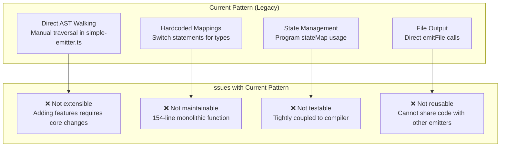
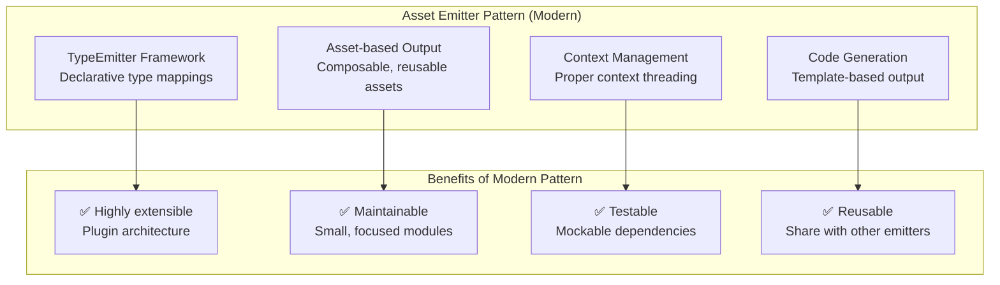
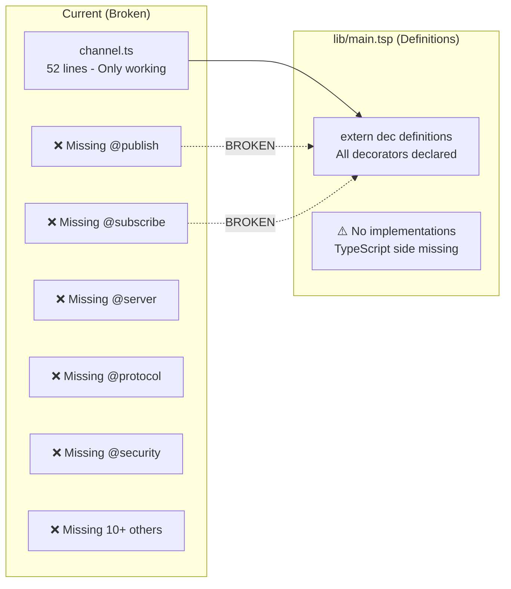
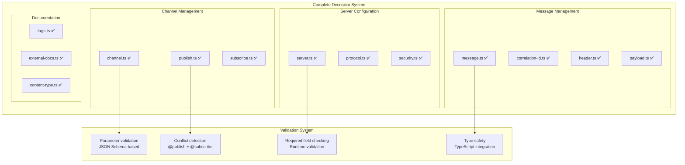
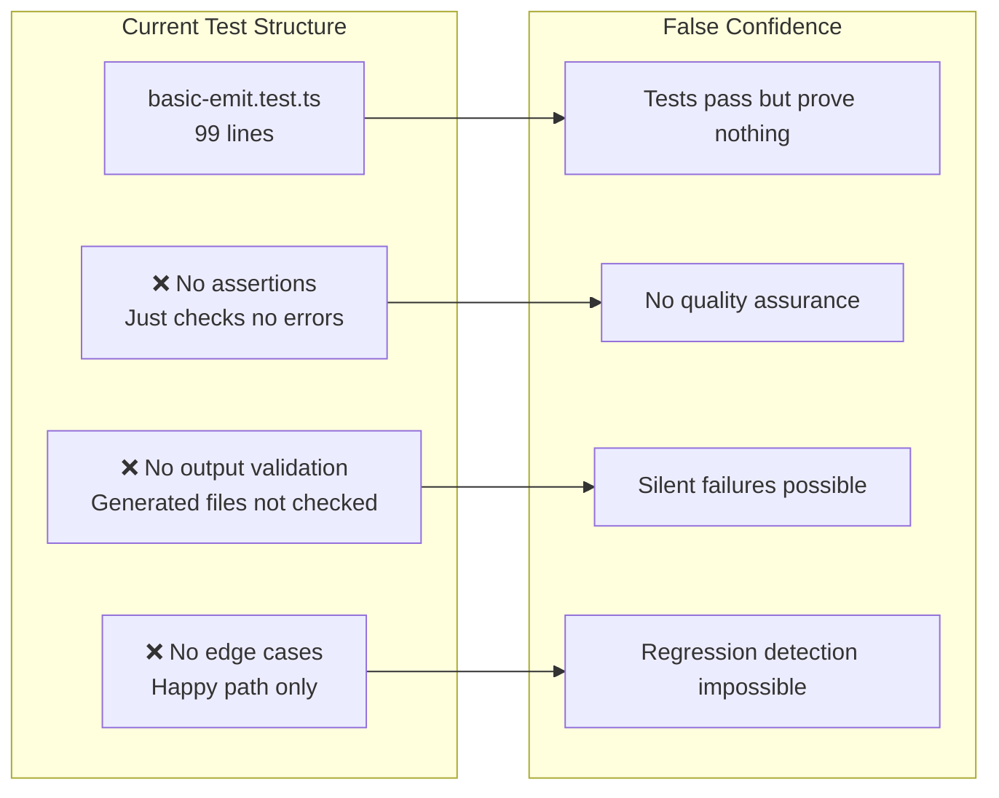
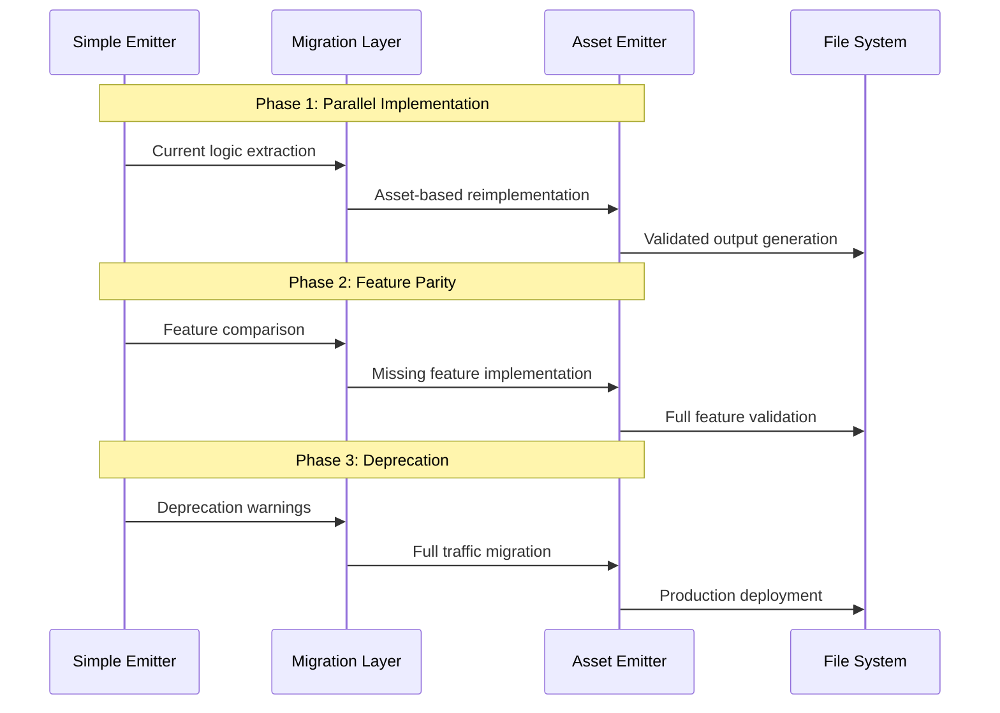
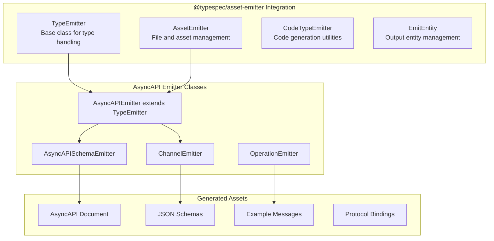
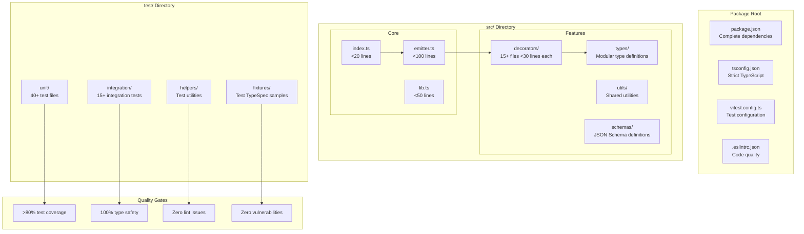

# TypeSpec AsyncAPI Technical Architecture Analysis

## CURRENT STATE ASSESSMENT

### Architecture Pattern Analysis



### Modern Asset Emitter Pattern (Target)



## DECORATOR ARCHITECTURE COMPARISON

### Current Decorator Implementation



### Target Decorator Architecture



## TESTING ARCHITECTURE TRANSFORMATION

### Current Testing (Inadequate)



### Target Testing Architecture

```mermaid
graph TD
    subgraph "Comprehensive Test Suite"
        subgraph "Unit Tests (40+ files)"
            U1[decorator/*.test.ts<br/>Each decorator isolated]
            U2[emitter/*.test.ts<br/>Core logic units]
            U3[types/*.test.ts<br/>Type validation]
            U4[utils/*.test.ts<br/>Utility functions]
        end

        subgraph "Integration Tests (15+ files)"
            I1[full-workflow.test.ts<br/>End-to-end scenarios]
            I2[schema-validation.test.ts<br/>Output verification]
            I3[error-handling.test.ts<br/>Error scenarios]
            I4[compatibility.test.ts<br/>TypeSpec versions]
        end

        subgraph "Test Infrastructure"
            TI1[test-runner-factory.ts<br/>Standardized setup]
            TI2[assertion-helpers.ts<br/>Custom matchers]
            TI3[fixture-generator.ts<br/>Test data creation]
            TI4[schema-validator.ts<br/>AsyncAPI validation]
        end
    end

    subgraph "Quality Assurance"
        QA1[✅ Real output validation]
        QA2[✅ Schema compliance checking]
        QA3[✅ Error case coverage]
        QA4[✅ Regression prevention]
    end

    U1 --> QA1
    I1 --> QA2
    I3 --> QA3
    TI4 --> QA4
```



## EMITTER FRAMEWORK MIGRATION PLAN

### Migration from Simple to Asset Emitter



### Asset Emitter Integration Points



## PERFORMANCE OPTIMIZATION STRATEGY

### Performance Bottlenecks (Current)

```mermaid
graph LR
    subgraph "Current Performance Issues"
        P1[Manual AST Walking<br/>O(n²) complexity]
        P2[No Caching<br/>Redundant computations]
        P3[Large Files<br/>Memory pressure]
        P4[Synchronous Processing<br/>Blocking operations]
    end

    subgraph "Performance Impact"
        I1[Slow compilation<br/>>5s for medium projects]
        I2[Memory leaks<br/>Large TypeSpec projects]
        I3[Poor developer experience<br/>Slow feedback loops]
    end

    P1 --> I1
    P2 --> I2
    P3 --> I2
    P4 --> I3
```

### Optimized Performance Architecture

```mermaid
graph TD
    subgraph "Performance Optimizations"
        O1[Asset Emitter Framework<br/>O(n) AST traversal]
        O2[Intelligent Caching<br/>Memoized computations]
        O3[Lazy Loading<br/>On-demand processing]
        O4[Streaming Output<br/>Incremental generation]
    end

    subgraph "Performance Targets"
        T1[<2s compilation<br/>For medium projects]
        T2[<100MB memory<br/>For large projects]
        T3[<500ms feedback<br/>Watch mode updates]
        T4[>10x throughput<br/>Vs current implementation]
    end

    O1 --> T1
    O2 --> T2
    O3 --> T3
    O4 --> T4
```

## FINAL TARGET PACKAGE ARCHITECTURE

### Production-Ready Package Structure



---

**CRITICAL SUCCESS FACTORS:**

1. **Asset Emitter Migration** - Non-negotiable for modern architecture
2. **Complete Decorator System** - 90% of missing functionality
3. **Robust Testing** - Quality confidence and regression prevention
4. **Modular Design** - Maintainability and extensibility
5. **JSON Schema Validation** - Security and reliability

This analysis provides actionable architectural guidance for transforming the TypeSpec AsyncAPI emitter from prototype to production quality.
