# TypeSpec AsyncAPI Emitter: Current State vs Required Integration

```mermaid
graph TB
    %% Define styles
    classDef working fill:#90EE90,stroke:#2E8B57,stroke-width:3px,color:#000
    classDef ghost fill:#FF6B6B,stroke:#DC143C,stroke-width:3px,color:#000
    classDef duplicate fill:#FFD700,stroke:#FFA500,stroke-width:3px,color:#000
    classDef missing fill:#FFA500,stroke:#FF4500,stroke-width:3px,color:#000
    classDef external fill:#ADD8E6,stroke:#4169E1,stroke-width:2px,color:#000

    %% ========================================
    %% WORKING COMPONENTS (GREEN) - Actually Integrated
    %% ========================================

    subgraph "🟢 WORKING CORE SYSTEM"
        TS_INPUT["TypeSpec Input Files\n(.tsp)"]:::external
        TSC_COMPILER["TypeSpec Compiler\n(Program AST)"]:::external

        INDEX["src/index.ts\n$onEmit entry point\n✅ 39 lines - clean"]:::working
        ASYNCAPI_EMITTER["src/asyncapi-emitter.ts\n✅ AssetEmitter integration\n✅ Real AST processing\n✅ 431 lines - production ready"]:::working

        DECORATORS_SYSTEM["src/decorators/*\n✅ @channel, @publish, @subscribe\n✅ State management\n✅ Working decorator system"]:::working

        LIB_TSP["lib/main.tsp\n✅ TypeSpec definitions\n✅ Extern declarations\n✅ Production ready"]:::working

        OUTPUT["AsyncAPI 3.0 Output\n(.yaml/.json)"]:::external
    end

    %% ========================================
    %% GHOST SYSTEMS (RED) - Built but Never Integrated
    %% ========================================

    subgraph "🔴 GHOST SYSTEMS - Built But Disconnected"
        INTEGRATION_EXAMPLE["src/integration-example.ts\n❌ 667 lines Effect.TS code\n❌ Pure functional programming\n❌ NEVER USED by emitter\n❌ Elaborate railway programming"]:::ghost

        PERFORMANCE_SYSTEM["src/performance/*\n❌ Elaborate monitoring\n❌ Memory tracking\n❌ Metrics collection\n❌ NOT connected to real emitter"]:::ghost

        FAKE_VALIDATION["test/validation/real-asyncapi-validation.test.ts\n❌ Uses yaml.parse() instead of asyncapi-validator\n❌ Manual validation logic\n❌ NOT using official AsyncAPI validation"]:::ghost

        BENCHMARK_RUNNER["benchmark-runner.ts\n❌ Root level file\n❌ NOT integrated with build system\n❌ NOT connected to real emitter"]:::ghost
    end

    %% ========================================
    %% DUPLICATE/QUESTIONABLE (YELLOW) - Confusing Multiple Approaches
    %% ========================================

    subgraph "🟡 DUPLICATE/QUESTIONABLE - Multiple Approaches"
        LIB_BASIC["src/lib.ts\n⚠️ Basic error messages\n⚠️ 30 lines"]:::duplicate
        LIB_ENHANCED["src/lib-enhanced.ts\n⚠️ Comprehensive error handling\n⚠️ What/Reassure/Why/Fix/Escape pattern\n⚠️ Which one is actually used?"]:::duplicate

        MULTIPLE_TESTS["Multiple Test Approaches\n⚠️ Unit tests\n⚠️ Integration tests\n⚠️ Validation tests\n⚠️ NOT unified strategy"]:::duplicate
    end

    %% ========================================
    %% MISSING CRITICAL INTEGRATIONS (ORANGE) - Required But Missing
    %% ========================================

    subgraph "🟠 MISSING CRITICAL INTEGRATIONS"
        ASYNCAPI_VALIDATOR["@asyncapi/parser\n🚨 INSTALLED but NOT USED\n🚨 Real validation needed\n🚨 Currently using yaml.parse()"]:::missing

        REAL_VALIDATION["Real AsyncAPI Validation\n🚨 Official schema validation\n🚨 Specification compliance\n🚨 Error reporting"]:::missing

        PROPER_ERROR_HANDLING["Proper Error Integration\n🚨 Connect lib.ts diagnostics\n🚨 Use TypeSpec diagnostic system\n🚨 Proper error propagation"]:::missing

        PERFORMANCE_INTEGRATION["Performance Integration\n🚨 Connect performance/* to real emitter\n🚨 Memory monitoring in production\n🚨 Benchmarks on real operations"]:::missing

        MS_PATTERNS["Microsoft TypeSpec Patterns\n🚨 Study TypeSpec monorepo patterns\n🚨 Follow official emitter architecture\n🚨 Use proper AssetEmitter patterns"]:::missing
    end

    %% ========================================
    %% FLOW CONNECTIONS - What Actually Works
    %% ========================================

    %% Working flow (solid green arrows)
    TS_INPUT -->|TypeSpec Compiler| TSC_COMPILER
    TSC_COMPILER -->|"$onEmit(context)"| INDEX
    INDEX -->|"generateAsyncAPI()"| ASYNCAPI_EMITTER
    ASYNCAPI_EMITTER -->|"Uses decorators"| DECORATORS_SYSTEM
    DECORATORS_SYSTEM -->|"References"| LIB_TSP
    ASYNCAPI_EMITTER -->|"Generates"| OUTPUT

    %% Ghost system disconnections (dashed red arrows)
    INTEGRATION_EXAMPLE -.->|"❌ NEVER CALLED"| ASYNCAPI_EMITTER
    PERFORMANCE_SYSTEM -.->|"❌ NOT INTEGRATED"| ASYNCAPI_EMITTER
    FAKE_VALIDATION -.->|"❌ FAKE VALIDATION"| OUTPUT
    BENCHMARK_RUNNER -.->|"❌ ISOLATED"| ASYNCAPI_EMITTER

    %% Missing connections (dashed orange arrows)
    ASYNCAPI_EMITTER -.->|"🚨 SHOULD USE"| ASYNCAPI_VALIDATOR
    ASYNCAPI_VALIDATOR -.->|"🚨 REAL VALIDATION"| OUTPUT
    PERFORMANCE_SYSTEM -.->|"🚨 SHOULD MONITOR"| ASYNCAPI_EMITTER

    %% Duplicate confusion (dashed yellow arrows)
    INDEX -.->|"❓ WHICH LIB?"| LIB_BASIC
    INDEX -.->|"❓ WHICH LIB?"| LIB_ENHANCED

    %% ========================================
    %% BRUTAL HONESTY ANNOTATIONS
    %% ========================================

    %% Add critical annotations
    INTEGRATION_EXAMPLE -.-|"🎭 THEATER:\n667 lines of pure\nEffect.TS that nobody\never calls"| PERFORMANCE_SYSTEM

    FAKE_VALIDATION -.-|"🎭 FAKE VALIDATION:\nUses yaml.parse()\ninstead of real\nAsyncAPI validation"| REAL_VALIDATION

    PERFORMANCE_SYSTEM -.-|"🎭 ELABORATE MONITORING:\nFor a system that\ndoes simple AST processing"| REAL_VALIDATION

    %% Title and summary
    subgraph "📊 BRUTAL REALITY CHECK"
        SUMMARY["✅ WORKING: TypeSpec → AsyncAPI generation (basic)\n❌ GHOST: 667 lines Effect.TS + elaborate performance monitoring\n⚠️ FAKE: yaml.parse() instead of real AsyncAPI validation\n🚨 MISSING: Official AsyncAPI validator integration\n🎯 FOCUS: Make fake validation real, delete theater code"]:::working
    end
```

## 📋 Critical Analysis

### ✅ What Actually Works

- **Core emitter flow**: TypeSpec input → AssetEmitter → AsyncAPI output
- **Decorator system**: `@channel`, `@publish`, `@subscribe` decorators work
- **AssetEmitter integration**: Modern TypeSpec architecture properly implemented
- **Basic AsyncAPI 3.0 generation**: Structure and schemas generated correctly

### 🔴 Ghost Systems (Built But Never Used)

- **src/integration-example.ts**: 667 lines of pure Effect.TS code that nobody calls
- **src/performance/\***: Elaborate monitoring system for simple AST processing
- **benchmark-runner.ts**: Root-level file not integrated with anything
- **Fake validation tests**: Using yaml.parse() instead of real AsyncAPI validation

### 🟠 Missing Critical Pieces

- **Real AsyncAPI validation**: Have @asyncapi/parser installed but using yaml.parse()
- **Proper error handling**: Two lib.ts files, unclear which is used
- **Performance integration**: Ghost performance system not connected to real emitter
- **Microsoft patterns**: Need to study TypeSpec monorepo for proper patterns

### 🎯 Action Items for Real Integration

1. **DELETE THEATER CODE**: Remove src/integration-example.ts (667 unused lines)
2. **FIX VALIDATION**: Replace yaml.parse() with @asyncapi/parser in tests
3. **UNIFY ERROR HANDLING**: Choose one lib.ts approach and delete the other
4. **INTEGRATE OR DELETE PERFORMANCE**: Either connect performance/\* or remove it
5. **STUDY MS PATTERNS**: Learn from TypeSpec monorepo for proper architecture

**Bottom Line**: We have a working core emitter buried under 667 lines of unused Effect.TS theater and fake validation tests. The path forward is deletion and real integration, not more elaborate patterns.
