# Current Architecture State

## 📊 Status Overview

```mermaid
graph TB
    subgraph "🔴 CRITICAL ISSUES"
        A1[AsyncAPI Validator NOT integrated]
        A2[Ghost Effect.TS system]
        A3[No real TypeSpec processing]
        A4[Fake test fixtures]
    end
    
    subgraph "🟡 EXISTING SYSTEMS"
        B1[TypeSpec Decorators<br/>@channel, @server, etc]
        B2[Effect.TS Infrastructure<br/>Unused/Ghost]
        B3[Protocol Bindings<br/>649 lines]
        B4[Performance Monitoring<br/>Over-engineered]
    end
    
    subgraph "🟢 WORKING PARTS"
        C1[Build System]
        C2[ESLint Config]
        C3[TypeScript Setup]
    end
    
    subgraph "⚠️ GHOST SYSTEMS"
        D1[integration-example.ts<br/>667 lines pure Effect]
        D2[lib-enhanced.ts<br/>183 lines unused]
        D3[Performance metrics<br/>494 lines overkill]
        D4[Memory monitor<br/>639 lines unused]
    end
    
    A1 --> |Should use| B1
    B2 --> |Not connected| B1
    D1 --> |Duplicates| B2
    D2 --> |Duplicates| B1
    D3 --> |Over-engineered| B4
    D4 --> |Over-engineered| B4
```

## 🚨 BRUTAL HONESTY

### What We're Doing WRONG:
1. **INSTALLED BUT NOT USING asyncapi-validator** - It's just sitting there!
2. **Ghost Effect.TS system** - 667 lines in integration-example.ts doing NOTHING
3. **Fake test fixtures** - Deleted hardcoded JSON files pretending to be tests
4. **Over-engineered performance** - 1133 lines of metrics for a simple emitter
5. **NO REAL ASYNCAPI GENERATION** - Just console.log statements

### What's Actually Working:
- Basic TypeSpec decorator definitions
- Build system compiles TypeScript
- Package structure is semi-reasonable

### Ghost Systems Found:
- `integration-example.ts` - Complete Effect.TS implementation disconnected from reality
- `lib-enhanced.ts` - Enhanced library that's never imported
- `performance/` directory - Over-engineered monitoring for nothing
- Test fixtures that were hardcoded JSON