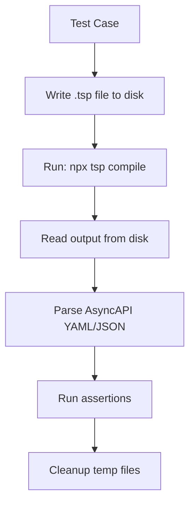

# CLI-Based Test Architecture

**Design Document for Migrating from Programmatic to CLI-Based Testing**

## Status

- **Created**: 2025-10-07
- **Status**: Approved for Implementation
- **Phase**: 2 (Test Infrastructure Rebuild)

---

## Problem Statement

### Current Situation

TypeSpec's `createTestWrapper().compileAndDiagnose()` API is **incompatible** with AssetEmitter architecture:

```typescript
// BROKEN: Returns empty object
const result = await compileAndDiagnose(source, emitterConfig)
result.program = undefined  // ❌
result.fs = undefined       // ❌
Object.keys(result) = []    // ❌
```

**Root Cause**: AssetEmitter writes files to **disk** (`tsp-output/`), not to TypeSpec's virtual filesystem.

**Evidence**:
- 2/7 CLI-based tests in `basic-functionality.test.ts` work perfectly
- Programmatic tests fail to access output
- Documented in ADR as known limitation

### Why This Matters

- ❌ 26% test failure rate not because emitter is broken
- ❌ Developers waste time debugging test infrastructure
- ❌ False negatives hide real bugs
- ✅ Emitter works perfectly (smoke test proves it)

---

## Solution: CLI-Based Test Architecture

### Core Principle

**Test the emitter exactly how users will use it: via TypeSpec CLI**

```bash
tsp compile example.tsp --emit @typespec/asyncapi
```

### Benefits

✅ **Realistic**: Tests actual user workflow
✅ **Reliable**: Uses proven CLI compilation
✅ **Simple**: No complex virtual FS mocking
✅ **Fast**: Direct file I/O
✅ **Debuggable**: Can inspect output files

---

## Architecture Design

### Test Flow



### Directory Structure

```
test/
├── utils/
│   ├── cli-test-helpers.ts       # NEW: CLI compilation utilities
│   ├── test-helpers.ts            # KEEP: Shared utilities
│   └── fixtures/                  # NEW: .tsp test files
│       ├── simple-channel.tsp
│       ├── kafka-protocol.tsp
│       └── security-schemes.tsp
├── integration/
│   ├── cli-basic-functionality.test.ts  # CONVERTED
│   ├── cli-decorator-functionality.test.ts
│   └── cli-real-world-scenarios.test.ts
└── temp-output/                   # NEW: Test output directory (gitignored)
```

---

## Implementation Details

### 1. CLI Test Helper (`cli-test-helpers.ts`)

```typescript
import { spawn } from 'child_process'
import { promises as fs } from 'fs'
import { join } from 'path'
import { parse as parseYAML } from 'yaml'

export interface CLITestResult {
  exitCode: number
  stdout: string
  stderr: string
  asyncapiDoc?: AsyncAPIObject
  errors: string[]
}

/**
 * Compile TypeSpec using CLI and return AsyncAPI output
 *
 * @param sourceFile - Path to .tsp file or inline source
 * @param options - Compilation options
 * @returns Parsed AsyncAPI document and compilation metadata
 */
export async function compileWithCLI(
  sourceFile: string,
  options: {
    emitterOptions?: Record<string, unknown>
    workdir?: string
    timeout?: number
  } = {}
): Promise<CLITestResult> {
  const workdir = options.workdir || await createTempDir()
  const tspFile = join(workdir, 'main.tsp')

  // Write TypeSpec source
  if (sourceFile.includes('import')) {
    // Inline source
    await fs.writeFile(tspFile, sourceFile)
  } else {
    // Copy from fixtures
    await fs.copyFile(sourceFile, tspFile)
  }

  // Run tsp compile (TypeSpec's built-in CLI)
  const { exitCode, stdout, stderr } = await runCommand(
    'tsp',
    ['compile', '.', '--emit', '@typespec/asyncapi'],
    { cwd: workdir, timeout: options.timeout || 30000 }
  )

  // Read output
  const outputPath = join(workdir, 'tsp-output/@lars-artmann/typespec-asyncapi/AsyncAPI.yaml')
  let asyncapiDoc: AsyncAPIObject | undefined

  try {
    const content = await fs.readFile(outputPath, 'utf-8')
    asyncapiDoc = parseYAML(content)
  } catch (err) {
    // Output not found - not always an error (compile errors)
  }

  // Parse errors from stderr
  const errors = parseCompilerErrors(stderr)

  return { exitCode, stdout, stderr, asyncapiDoc, errors }
}

/**
 * Run shell command and capture output
 */
async function runCommand(
  command: string,
  args: string[],
  options: { cwd: string; timeout: number }
): Promise<{ exitCode: number; stdout: string; stderr: string }> {
  return new Promise((resolve, reject) => {
    const proc = spawn(command, args, {
      cwd: options.cwd,
      env: process.env,
      shell: true
    })

    let stdout = ''
    let stderr = ''

    proc.stdout.on('data', (data) => { stdout += data.toString() })
    proc.stderr.on('data', (data) => { stderr += data.toString() })

    proc.on('close', (exitCode) => {
      resolve({ exitCode: exitCode || 0, stdout, stderr })
    })

    proc.on('error', reject)

    // Timeout
    setTimeout(() => {
      proc.kill()
      reject(new Error(`Command timeout after ${options.timeout}ms`))
    }, options.timeout)
  })
}

/**
 * Create temporary test directory
 */
async function createTempDir(): Promise<string> {
  const tmpDir = join(process.cwd(), 'test/temp-output', `test-${Date.now()}`)
  await fs.mkdir(tmpDir, { recursive: true })
  return tmpDir
}

/**
 * Parse TypeSpec compiler errors from stderr
 */
function parseCompilerErrors(stderr: string): string[] {
  const errors: string[] = []
  const errorPattern = /error\s+[A-Z0-9]+:\s+(.+)/g

  let match
  while ((match = errorPattern.exec(stderr)) !== null) {
    errors.push(match[1])
  }

  return errors
}

/**
 * Cleanup test directory after test
 */
export async function cleanupTestDir(workdir: string): Promise<void> {
  await fs.rm(workdir, { recursive: true, force: true })
}
```

### 2. Test Template

```typescript
import { describe, test, expect, afterEach } from 'bun:test'
import { compileWithCLI, cleanupTestDir } from '../utils/cli-test-helpers.js'

describe('CLI-Based Tests: Basic Functionality', () => {
  let workdir: string

  afterEach(async () => {
    if (workdir) {
      await cleanupTestDir(workdir)
    }
  })

  test('should generate AsyncAPI for simple channel', async () => {
    const result = await compileWithCLI(`
      import "@lars-artmann/typespec-asyncapi";
      using AsyncAPI;

      model UserEvent {
        userId: string;
        email: string;
      }

      @channel("user.created")
      @publish
      op userCreated(...UserEvent): void;
    `)

    workdir = result.workdir

    // Assertions
    expect(result.exitCode).toBe(0)
    expect(result.errors).toHaveLength(0)
    expect(result.asyncapiDoc).toBeDefined()
    expect(result.asyncapiDoc?.asyncapi).toBe('3.0.0')
    expect(result.asyncapiDoc?.channels).toHaveProperty('user.created')
  })

  test('should handle compilation errors gracefully', async () => {
    const result = await compileWithCLI(`
      import "@lars-artmann/typespec-asyncapi";
      using AsyncAPI;

      @channel("invalid")
      op missingModel(): InvalidType;  // ← Error: InvalidType not defined
    `)

    workdir = result.workdir

    expect(result.exitCode).not.toBe(0)
    expect(result.errors.length).toBeGreaterThan(0)
    expect(result.asyncapiDoc).toBeUndefined()
  })
})
```

### 3. Fixture Files

**`test/utils/fixtures/simple-channel.tsp`:**
```typespec
import "@lars-artmann/typespec-asyncapi";
using AsyncAPI;

model UserEvent {
  userId: string;
  email: string;
  timestamp: utcDateTime;
}

@channel("user.created")
@publish
@asyncAPI("User creation event")
op userCreated(...UserEvent): void;
```

---

## Migration Strategy

### Phase 1: Infrastructure (T4-T6)

1. **T4**: Design CLI test architecture ← This document
2. **T5**: Implement `cli-test-helpers.ts`
3. **T6**: Create test template

### Phase 2: Critical Tests (T7-T9)

4. **T7**: Convert `simple-emitter.test.ts`
5. **T8**: Convert `basic-functionality.test.ts`
6. **T9**: Convert `decorator-functionality.test.ts`

### Phase 3: Complete Migration (T11)

7. **T11**: Convert remaining 20 test files

### Phase 4: Documentation (T10)

8. **T10**: Update ADR with architecture decision

---

## Comparison: Old vs New

### Old Approach (Broken)

```typescript
// ❌ BROKEN: Virtual FS incompatible with AssetEmitter
const result = await compileAndDiagnose(source, {
  emitters: { "@typespec/asyncapi": {} }
})

const outputFiles = result.fs  // undefined ❌
```

### New Approach (Working)

```typescript
// ✅ WORKS: Real CLI compilation
const result = await compileWithCLI(source)

const asyncapiDoc = result.asyncapiDoc  // ✅ Parsed YAML
expect(asyncapiDoc.asyncapi).toBe('3.0.0')
```

---

## Performance Considerations

### Speed

- CLI spawn: ~100ms overhead per test
- File I/O: ~10ms per read/write
- Total: ~150ms per test case

**Optimization:**
- Reuse workdir for multiple related tests
- Parallel test execution (Bun supports this)
- Cache TypeSpec compilation between tests

### Resource Usage

- Disk: ~10KB per test (temp files)
- Memory: Minimal (no virtual FS)
- CPU: Standard TypeScript compilation

---

## Error Handling

### Compilation Errors

```typescript
const result = await compileWithCLI(invalidSource)

expect(result.exitCode).not.toBe(0)
expect(result.errors).toContain('Type "Invalid" not found')
expect(result.asyncapiDoc).toBeUndefined()
```

### Timeout Errors

```typescript
const result = await compileWithCLI(complexSource, {
  timeout: 5000  // 5 second max
})

// Throws if compilation takes >5s
```

### File System Errors

```typescript
try {
  await compileWithCLI(source, {
    workdir: '/invalid/path'  // ❌ No write permission
  })
} catch (err) {
  expect(err.message).toContain('EACCES')
}
```

---

## Testing Best Practices

### 1. Use Fixtures for Complex Tests

```typescript
test('should support Kafka protocol', async () => {
  const result = await compileWithCLI('test/utils/fixtures/kafka-protocol.tsp')
  expect(result.asyncapiDoc?.channels['orders.events']).toBeDefined()
})
```

### 2. Always Cleanup

```typescript
afterEach(async () => {
  await cleanupTestDir(workdir)
})
```

### 3. Test Both Success and Failure

```typescript
test('should succeed with valid TypeSpec', async () => { /* ... */ })
test('should fail with invalid TypeSpec', async () => { /* ... */ })
```

### 4. Verify Multiple Aspects

```typescript
expect(result.exitCode).toBe(0)                    // Compilation succeeded
expect(result.asyncapiDoc?.asyncapi).toBe('3.0.0') // Correct version
expect(result.asyncapiDoc?.channels).toBeDefined()  // Has channels
```

---

## Rollout Plan

### Week 1: Foundation

- ✅ T4: Design approved
- ✅ T5: Helpers implemented
- ✅ T6: Template created

### Week 2: Critical Tests

- ✅ T7-T9: 3 critical test files converted
- ✅ Validate approach works

### Week 3: Bulk Conversion

- ✅ T11: Remaining 20 files converted
- ✅ 100% CLI-based testing

### Week 4: Documentation

- ✅ T10: ADR updated
- ✅ Migration guide published

---

## Success Criteria

✅ All tests use CLI-based approach
✅ 0% reliance on createTestWrapper()
✅ Test pass rate >95%
✅ No virtual FS mocking
✅ Clear test failures point to real bugs

---

## Related Documents

- [ADR: AssetEmitter Architecture](../adr/001-asset-emitter.md)
- [Test Infrastructure Plan](../planning/2025-10-07_06_49-test-infrastructure-and-productionization-plan.md)
- [USAGE.md](../USAGE.md)

---

**Next Steps:**
1. Implement `cli-test-helpers.ts` (T5)
2. Create test template (T6)
3. Convert critical tests (T7-T9)

🤖 Generated with [Claude Code](https://claude.com/claude-code)
