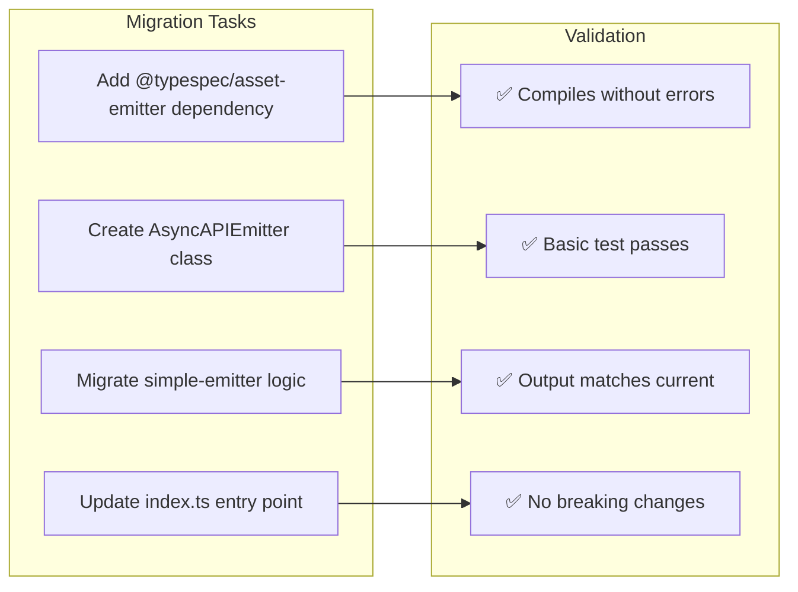
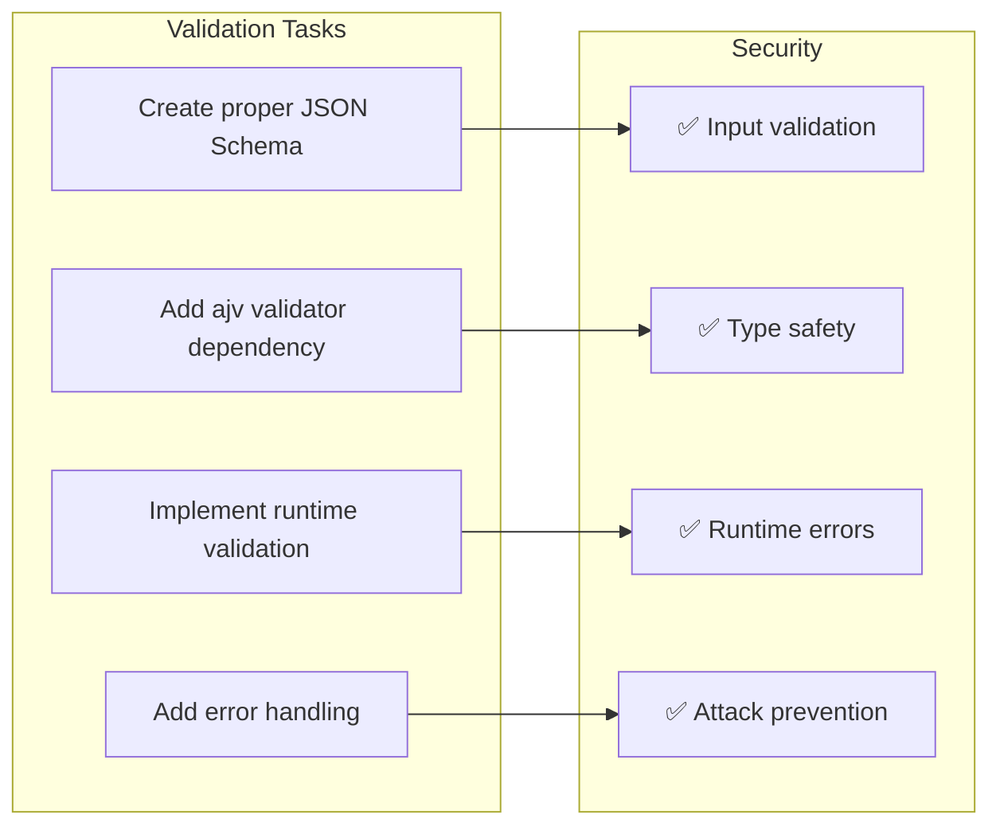
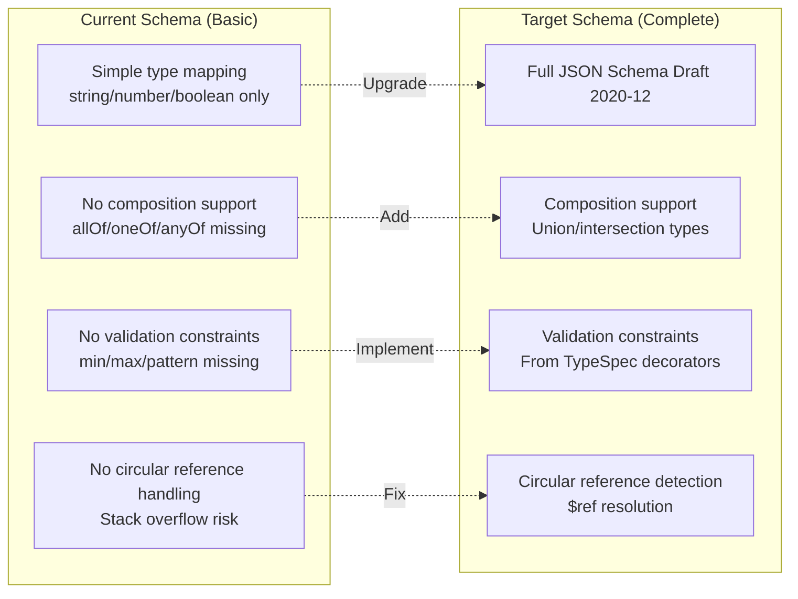
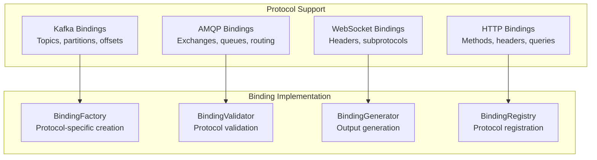
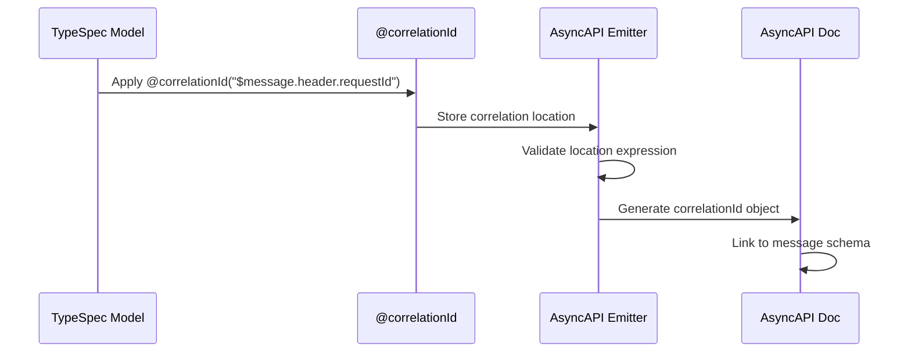
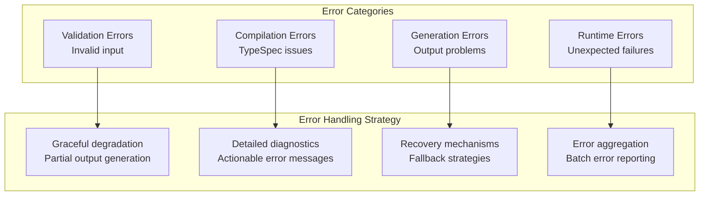
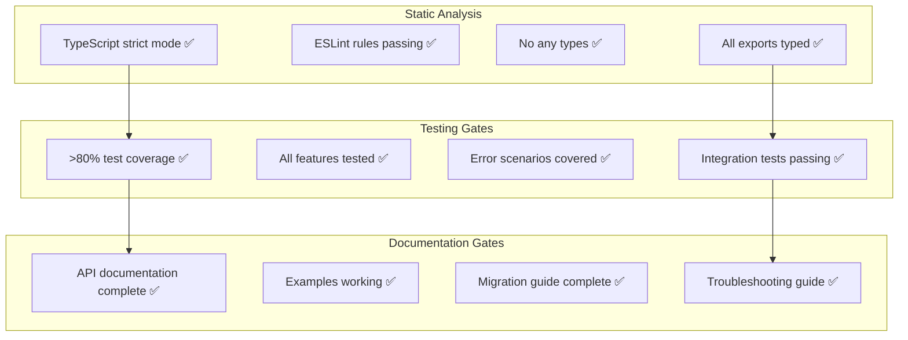
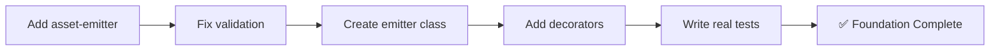

# TypeSpec AsyncAPI Implementation Checklist

## WEEK 1: CRITICAL FOUNDATION

### Day 1-2: Asset Emitter Migration


**Tasks:**
- [ ] `bun add @typespec/asset-emitter` - Add dependency
- [ ] Create `src/emitter/asyncapi-emitter.ts` extending TypeEmitter
- [ ] Create `src/emitter/schema-emitter.ts` for JSON Schema generation  
- [ ] Migrate logic from `simple-emitter.ts` to new architecture
- [ ] Update `src/index.ts` to use AssetEmitter
- [ ] Ensure existing test still passes

### Day 3-4: JSON Schema Validation Fix


**Tasks:**
- [ ] `bun add ajv ajv-formats` - JSON Schema validator
- [ ] Replace `AsyncAPIEmitterOptionsSchema = {} as any` with real schema
- [ ] Create `src/validation/options-schema.json` 
- [ ] Implement validation in `src/options.ts`
- [ ] Add validation tests
- [ ] Test malformed input handling

### Day 5: Core Decorators Implementation
```mermaid
graph TD
    subgraph "Priority Decorators"
        P1[@publish - Mark send operations]
        P2[@subscribe - Mark receive operations]  
        P3[@server - Server configuration]
        P4[@message - Message metadata]
    end
    
    subgraph "Implementation Pattern"
        I1[Create TypeScript implementation]
        I2[Add state management]
        I3[Add validation logic]
        I4[Export from index]
    end
    
    P1 --> I1
    P2 --> I2
    P3 --> I3
    P4 --> I4
```

**Tasks:**
- [ ] Create `src/decorators/publish.ts` - Implement @publish decorator
- [ ] Create `src/decorators/subscribe.ts` - Implement @subscribe decorator  
- [ ] Create `src/decorators/server.ts` - Implement @server decorator
- [ ] Create `src/decorators/message.ts` - Implement @message decorator
- [ ] Add conflict detection (publish + subscribe)
- [ ] Update `src/decorators/index.ts` exports
- [ ] Add decorator state to `lib.ts`

## WEEK 2: FEATURE COMPLETENESS

### Remaining Decorator Implementation
```mermaid
graph TB
    subgraph "AsyncAPI 3.0 Decorators"
        D1[@protocol - Protocol bindings]
        D2[@security - Security schemes]
        D3[@correlationId - Message correlation]
        D4[@header - Message headers]
        D5[@payload - Message payload]
        D6[@tags - Metadata tags]
        D7[@externalDocs - Documentation]
        D8[@contentType - Content type]
    end
    
    subgraph "Implementation Strategy"
        S1[Follow OpenAPI3 patterns<br/>Proven architecture]
        S2[Asset emitter integration<br/>Composable output]
        S3[Comprehensive validation<br/>Runtime safety]
        S4[Unit test each decorator<br/>Quality assurance]
    end
    
    D1 --> S1
    D2 --> S2
    D3 --> S3
    D4 --> S4
```

**Tasks:**
- [ ] Protocol bindings: Kafka, AMQP, WebSocket, HTTP
- [ ] Security schemes: All AsyncAPI 3.0 types
- [ ] Message correlation with location expressions
- [ ] Header and payload decorators  
- [ ] Tags and external documentation
- [ ] Content type handling
- [ ] Cross-decorator validation
- [ ] Integration with asset emitter

### Schema Generation Enhancement


## WEEK 3: ADVANCED FEATURES

### Protocol Binding Architecture


### Message Correlation System


## WEEK 4: PRODUCTION READINESS

### Error Handling Architecture


### Performance Optimization Plan
```mermaid
graph LR
    subgraph "Optimization Targets"
        OT1[AST Traversal<br/>Single pass optimization]
        OT2[Schema Generation<br/>Memoization strategy]
        OT3[File I/O<br/>Batched operations]
        OT4[Memory Usage<br/>Streaming generation]
    end
    
    subgraph "Performance Metrics"
        PM1[<2s compilation<br/>Medium projects]
        PM2[<100MB memory<br/>Large projects]  
        PM3[Linear scaling<br/>O(n) complexity]
        PM4[Incremental builds<br/>Watch mode efficiency]
    end
    
    OT1 --> PM1
    OT2 --> PM2
    OT3 --> PM3
    OT4 --> PM4
```

## QUALITY ASSURANCE CHECKLIST

### Code Quality Gates


### Release Readiness Criteria
- [ ] All AsyncAPI 3.0 decorators implemented
- [ ] Asset emitter framework fully integrated
- [ ] JSON Schema validation working correctly
- [ ] Test coverage >80% with real assertions
- [ ] No files >100 lines (modularity)
- [ ] Zero critical security vulnerabilities
- [ ] Performance benchmarks meeting targets
- [ ] Backward compatibility maintained
- [ ] Documentation complete with examples
- [ ] CI/CD pipeline configured

## IMMEDIATE ACTION ITEMS (NEXT 24 HOURS)

### Critical Path Tasks
1. **Add @typespec/asset-emitter** - `bun add @typespec/asset-emitter`
2. **Fix options validation** - Replace `{} as any` with real JSON Schema
3. **Create AsyncAPIEmitter class** - Modern emitter framework
4. **Implement @publish/@subscribe** - Core AsyncAPI functionality  
5. **Write real integration test** - Validate actual output

### Success Validation


**Each task should take 1-3 hours and immediately improve the emitter quality and capabilities.**