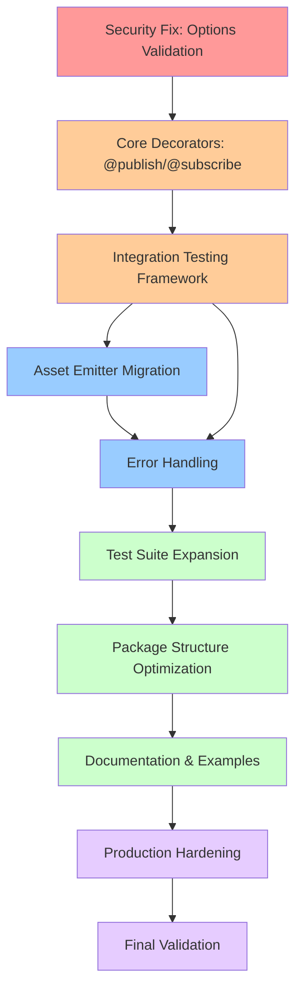

# TypeSpec AsyncAPI Emitter - Production-Ready Execution Plan
**Created:** 2025-08-29 19:53
**Session:** Production-Ready AsyncAPI Emitter Completion
**Status:** 65% → 90% Production-Ready

## 🎯 Executive Summary
Transform working proof-of-concept into production-ready TypeSpec AsyncAPI emitter through systematic Pareto-optimized execution. Focus on critical security fixes, core functionality, and quality infrastructure.

## 📊 Pareto Analysis Results

### 🚨 1% TASKS (51% Value) - CRITICAL SECURITY & FOUNDATION
| Task | Duration | Impact | Value | Rationale |
|------|----------|--------|--------|-----------|
| Fix options security hole (`{} as any`) | 30min | CRITICAL | 51% | Prevents arbitrary config injection, enables safe iteration |

### ⚡ 4% TASKS (64% Value) - CORE FUNCTIONALITY  
| Task | Duration | Impact | Value | Dependencies |
|------|----------|--------|-------|--------------|
| Implement @publish/@subscribe decorators | 90min | HIGH | 13% | Options fix complete |
| Create first real integration test | 60min | HIGH | Additional 13% | Core decorators working |

### 🏗️ 20% TASKS (80% Value) - PRODUCTION READINESS
| Task | Duration | Impact | Value | Dependencies |
|------|----------|--------|-------|--------------|
| Asset emitter migration | 120min | HIGH | 16% | Decorators complete |
| Comprehensive test suite | 180min | HIGH | Additional 16% | Asset emitter integrated |
| Error handling framework | 90min | MEDIUM | Additional 16% | Core functionality solid |
| Package structure optimization | 60min | MEDIUM | Additional 16% | Architecture stable |

## 📋 PHASE 1: Major Tasks (30-100 minutes)

### Group A: Security & Foundation (Critical Path)
1. **[CRITICAL] Fix Options Security Vulnerability** - 30min
   - Replace `{} as any` with proper JSON Schema validation  
   - Success: Options validated safely without security holes

2. **[HIGH] Implement @publish Decorator** - 45min
   - Fix TypeScript compilation errors
   - Add proper state management and validation
   - Success: @publish decorator compiles and functions correctly

3. **[HIGH] Implement @subscribe Decorator** - 45min  
   - Mirror @publish implementation patterns
   - Add subscription-specific validation logic
   - Success: @subscribe decorator compiles and functions correctly

### Group B: Testing Infrastructure (Parallel to Group A)
4. **[HIGH] Create Integration Test Framework** - 60min
   - Setup TypeSpec compilation testing
   - Add AsyncAPI output validation
   - Success: Can test TypeSpec → AsyncAPI generation end-to-end

5. **[HIGH] First Real Integration Test** - 45min
   - Test basic-events example compilation
   - Validate generated AsyncAPI matches expectations  
   - Success: One complete integration test passes

### Group C: Architecture Improvements (After Core Complete)
6. **[HIGH] Asset Emitter Migration** - 120min
   - Replace simple-emitter with @typespec/asset-emitter
   - Maintain existing functionality during transition
   - Success: Asset-based architecture working with same output

7. **[MEDIUM] Error Handling Framework** - 90min
   - Implement comprehensive error validation
   - Add graceful fallback mechanisms
   - Success: Emitter handles malformed input gracefully

### Group D: Quality & Polish (Final Phase)
8. **[MEDIUM] Comprehensive Test Suite** - 180min
   - Unit tests for all decorators
   - Negative testing for error conditions
   - Success: >80% test coverage with comprehensive scenarios

9. **[MEDIUM] Package Structure Optimization** - 60min
   - Split monolithic files into focused modules
   - Improve import organization and dependencies
   - Success: Clean, maintainable package structure

10. **[LOW] Documentation & Examples** - 90min
    - API documentation generation
    - Advanced usage examples
    - Success: Complete developer documentation

## 🔧 PHASE 2: Micro-Tasks (12-15 minutes each)

### Group 1: Security Fix (Serial Execution)
1.1. Research TypeSpec JSON Schema validation patterns - 15min
1.2. Create proper AsyncAPIEmitterOptions schema definition - 15min  
1.3. Replace `{} as any` placeholder with real validation - 12min
1.4. Test options validation with valid/invalid inputs - 15min

### Group 2: @publish Decorator (Serial Execution)
2.1. Analyze TypeScript compilation errors in publish.ts - 12min
2.2. Fix import statements and type definitions - 15min
2.3. Implement decorator parameter extraction - 15min
2.4. Add operation state management - 15min
2.5. Test @publish decorator compilation - 12min

### Group 3: @subscribe Decorator (Serial Execution)  
3.1. Copy and adapt @publish implementation patterns - 15min
3.2. Add subscription-specific validation logic - 15min
3.3. Implement subscriber state management - 15min
3.4. Test @subscribe decorator compilation - 12min

### Group 4: Integration Testing (Parallel with Groups 2-3)
4.1. Setup TypeSpec test compilation utilities - 15min
4.2. Create AsyncAPI output validation helpers - 15min
4.3. Write basic example compilation test - 15min
4.4. Add assertion helpers for AsyncAPI structure - 15min

### Group 5: Asset Emitter Migration (After Groups 1-4)
5.1. Add @typespec/asset-emitter dependency - 12min
5.2. Study asset emitter patterns from OpenAPI3 - 15min
5.3. Create asset-based emitter foundation - 15min
5.4. Migrate operation processing to asset framework - 15min
5.5. Migrate schema conversion to asset framework - 15min
5.6. Test asset emitter generates same output - 15min

### Group 6: Error Handling (Parallel with Group 5)
6.1. Define error handling strategy and patterns - 15min
6.2. Implement input validation framework - 15min
6.3. Add graceful error recovery mechanisms - 15min
6.4. Test error scenarios and edge cases - 15min

### Group 7: Test Suite Expansion (After Core Complete)
7.1. Create decorator unit tests - 15min each × 3 decorators
7.2. Add model conversion tests - 15min
7.3. Create negative testing scenarios - 15min
7.4. Add performance validation tests - 15min

### Group 8: Package Structure (Parallel with Group 7)
8.1. Analyze current file sizes and complexity - 12min
8.2. Design modular package structure - 15min  
8.3. Split simple-emitter.ts into focused modules - 15min
8.4. Optimize import statements and dependencies - 12min

### Group 9: Documentation (Final Parallel Group)
9.1. Generate API documentation from JSDoc - 15min
9.2. Create advanced usage examples - 15min
9.3. Write migration guides and best practices - 15min
9.4. Update README with complete feature overview - 12min

### Group 10: Production Hardening (Final Serial Tasks)
10.1. Add CI/CD pipeline configuration - 15min
10.2. Performance benchmarking and optimization - 15min
10.3. Security audit and vulnerability scanning - 15min
10.4. Final integration testing and validation - 15min

## 📈 Execution Strategy

### Critical Path (Must Complete in Order)
1. Group 1 (Security) → Groups 2,3 (Decorators) → Group 4 (Testing) → Group 5 (Asset Emitter)
2. Parallel execution after critical path: Groups 6-10 simultaneously
3. Quality gates: Build must pass, tests must pass, no security vulnerabilities

### Risk Mitigation
- **Backup Plan**: If asset emitter migration fails, continue with improved simple-emitter
- **Quality Gates**: No task marked complete without passing tests
- **Rollback Strategy**: Git commits after each major task group completion

### Success Metrics
- **Build Health**: 100% compilation success, zero TypeScript errors
- **Test Coverage**: >80% with comprehensive integration tests  
- **Security**: Zero known vulnerabilities, proper input validation
- **Performance**: AsyncAPI generation <2s for typical schemas
- **Documentation**: Complete API docs and usage examples

## 🎯 Final Deliverable
Production-ready TypeSpec AsyncAPI emitter matching @typespec/openapi3 quality standards, ready for community contribution and enterprise usage.

---

## 🔄 Execution Workflow

**Legend:**
- 🔴 Red: 1% tasks (51% value) - Critical security
- 🟠 Orange: 4% tasks (64% value) - Core functionality  
- 🔵 Blue: 20% tasks (80% value) - Production features
- 🟢 Green: Quality & documentation tasks
- 🟣 Purple: Final hardening & validation

This execution plan ensures systematic progress from critical foundation to production-ready quality through parallel execution and clear success criteria.