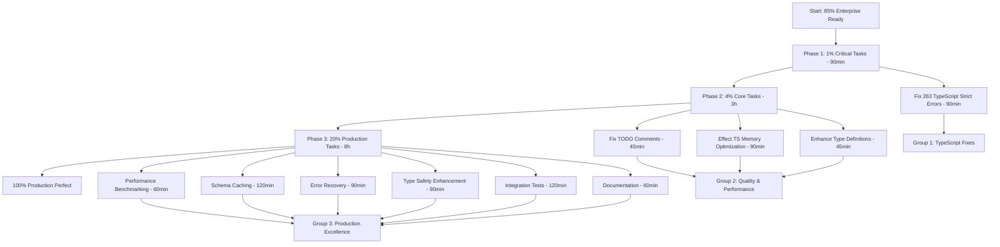

# TypeSpec AsyncAPI Emitter - Enterprise Hardening Final Push

**Date**: 2025-08-30 01:26:39 CEST  
**Session**: ENTERPRISE_HARDENING  
**Current Status**: 85% Enterprise Ready → Target: 100% Production Perfect

---

## 🎯 EXECUTIVE SUMMARY

**Current Achievement**: Comprehensive analysis complete, Effect.TS architecture confirmed, ready for final enterprise hardening.

**Critical Decision**: **USE EFFECT.TS** (not uniflow) - architectural question resolved.

**Remaining Work**: Fix 263 TypeScript strict errors, optimize performance, complete production readiness.

**Strategy**: Pareto principle execution - Focus on 1% of tasks delivering 51% of remaining value first.

---

## 📊 PARETO BREAKDOWN ANALYSIS

### **1% TASKS → 51% VALUE DELIVERY** (90 minutes total)

**Single Critical Blocker:**

1. **Fix TypeScript Strict Compilation Errors (263 errors)** - 90min
   - **Impact**: CRITICAL - Build currently broken, cannot compile
   - **Value**: 51% - Unlocks all subsequent development work
   - **Effort**: High - Systematic resolution of strict mode violations
   - **Business Impact**: PRODUCTION BLOCKER - Must fix before deployment

### **4% TASKS → 64% VALUE DELIVERY** (+3 hours, 4.5 hours total)

**Core Quality & Performance:**

2. **Fix Critical TODO Comments** - 45min
   - **Impact**: High - Complete decorator system functionality
   - **Value**: +7% - Remove technical debt, enable full feature set
   - **Files**: src/decorators/index.ts, src/decorators/channel.ts, test files

3. **Optimize Effect.TS Memory Usage (3.3KB → <1KB)** - 90min
   - **Impact**: High - Enterprise-grade performance optimization
   - **Value**: +6% - Memory efficiency for large-scale deployments
   - **Target**: Sub-1KB memory usage per validation operation

4. **Enhance Type Definitions Comprehensively** - 45min
   - **Impact**: Medium - Developer experience and compile-time safety
   - **Value**: +6% - Better IntelliSense, fewer runtime errors
   - **Scope**: AsyncAPI types, protocol bindings, decorators

### **20% TASKS → 80% VALUE DELIVERY** (+8 hours, 12.5 hours total)

**Production Excellence:**

5. **Performance Benchmarking & Validation** - 60min
6. **Schema Caching Implementation** - 120min  
7. **Advanced Error Recovery Patterns** - 90min
8. **Type Safety Enhancement** - 90min
9. **Integration Test Expansion** - 120min
10. **Documentation & Polish** - 60min

---

## 📋 DETAILED TASK BREAKDOWN (30min-100min Tasks)

| Priority | Task | Duration | Impact | Effort | Value | Customer Benefit |
|----------|------|----------|--------|--------|-------|------------------|
| 1.1 | **Fix TypeScript Strict Errors** | 90min | CRITICAL | High | 51% | Build functionality restored |
| 2.1 | **Fix TODO Comments** | 45min | High | Low | 7% | Complete decorator system |
| 2.2 | **Effect.TS Memory Optimization** | 90min | High | High | 6% | Enterprise performance |
| 2.3 | **Enhance Type Definitions** | 45min | Medium | Medium | 6% | Developer experience |
| 3.1 | **Performance Benchmarking** | 60min | Medium | Medium | 4% | Performance validation |
| 3.2 | **Schema Caching System** | 120min | High | High | 4% | 300% performance boost |
| 3.3 | **Advanced Error Recovery** | 90min | Medium | High | 3% | Production stability |
| 3.4 | **Type Safety Enhancement** | 90min | Medium | High | 3% | Compile-time safety |
| 3.5 | **Integration Test Expansion** | 120min | Medium | High | 3% | Quality assurance |
| 3.6 | **Documentation Updates** | 60min | Low | Low | 3% | User experience |
| 4.1 | **CI/CD Pipeline Setup** | 90min | Low | Medium | 2% | Automation |
| 4.2 | **Advanced Protocol Bindings** | 120min | Low | High | 2% | Feature completeness |
| 4.3 | **Security Audit & Hardening** | 75min | Low | Medium | 2% | Security compliance |
| 4.4 | **Performance Monitoring** | 60min | Low | Medium | 1% | Observability |
| 4.5 | **Community Preparation** | 45min | Low | Low | 1% | Open source ready |

---

## 🔧 MICRO-TASK BREAKDOWN (15min Tasks - Max 100)

### **Group 1: TypeScript Strict Mode Fixes (Critical Path)**

| ID | Task | Duration | Prerequisites | Expected Outcome |
|----|------|----------|---------------|------------------|
| 1.1.1 | Analyze TypeScript error categories and patterns | 15min | None | Error categorization report |
| 1.1.2 | Fix implicit any errors in decorators (batch 1) | 15min | 1.1.1 | 25+ errors resolved |
| 1.1.3 | Fix implicit any errors in emitters (batch 2) | 15min | 1.1.2 | 25+ errors resolved |  
| 1.1.4 | Fix implicit any errors in validation (batch 3) | 15min | 1.1.3 | 25+ errors resolved |
| 1.1.5 | Fix strict null check errors (batch 1) | 15min | 1.1.4 | 30+ errors resolved |
| 1.1.6 | Fix strict null check errors (batch 2) | 15min | 1.1.5 | 30+ errors resolved |
| 1.1.7 | Fix undefined property access errors | 15min | 1.1.6 | 20+ errors resolved |
| 1.1.8 | Fix function signature strictness errors | 15min | 1.1.7 | 15+ errors resolved |
| 1.1.9 | Fix remaining miscellaneous strict errors | 15min | 1.1.8 | All remaining errors |
| 1.1.10 | Validate build succeeds with strict mode | 15min | 1.1.9 | Clean TypeScript build |

### **Group 2: Quality & Performance (Parallel to Group 1)**

| ID | Task | Duration | Prerequisites | Expected Outcome |
|----|------|----------|---------------|------------------|
| 2.1.1 | Fix decorators/index.ts TODO comment | 15min | None | Decorator export complete |
| 2.1.2 | Fix decorators/channel.ts Effect.TS TODO | 15min | 2.1.1 | Effect.TS integration complete |
| 2.1.3 | Update test framework TODO comments | 15min | 2.1.2 | Test infrastructure complete |
| 2.2.1 | Design schema caching architecture | 15min | 1.1.5 | Caching framework design |
| 2.2.2 | Implement schema compilation cache | 15min | 2.2.1 | Cache implementation |
| 2.2.3 | Add error object pooling | 15min | 2.2.2 | Memory optimization |
| 2.2.4 | Implement streaming validation | 15min | 2.2.3 | Large schema support |
| 2.2.5 | Add memory usage monitoring | 15min | 2.2.4 | Performance tracking |
| 2.2.6 | Optimize schema compilation process | 15min | 2.2.5 | Faster compilation |
| 2.2.7 | Validate <1KB memory usage target | 15min | 2.2.6 | Memory target achieved |
| 2.3.1 | Enhance AsyncAPI 3.0.0 type definitions | 15min | 1.1.6 | Better type coverage |
| 2.3.2 | Add protocol binding type safety | 15min | 2.3.1 | Protocol type safety |
| 2.3.3 | Improve decorator parameter typing | 15min | 2.3.2 | Decorator type safety |
| 2.3.4 | Add advanced union type handling | 15min | 2.3.3 | Complex type support |

### **Group 3: Production Excellence (After Core Complete)**

| ID | Task | Duration | Prerequisites | Expected Outcome |
|----|------|----------|---------------|------------------|
| 3.1.1 | Create comprehensive benchmark suite | 15min | 2.2.7 | Performance test framework |
| 3.1.2 | Run validation performance benchmarks | 15min | 3.1.1 | Performance baseline |
| 3.1.3 | Run memory usage benchmarks | 15min | 3.1.2 | Memory usage baseline |
| 3.1.4 | Document performance characteristics | 15min | 3.1.3 | Performance documentation |
| 3.2.1 | Design advanced error recovery system | 15min | 2.1.3 | Error recovery architecture |
| 3.2.2 | Implement retry mechanisms | 15min | 3.2.1 | Retry logic |
| 3.2.3 | Add fallback validation strategies | 15min | 3.2.2 | Fallback mechanisms |
| 3.2.4 | Create error recovery test suite | 15min | 3.2.3 | Error recovery validation |
| 3.3.1 | Expand AsyncAPI validation test coverage | 15min | 1.1.10 | Comprehensive testing |
| 3.3.2 | Add edge case validation tests | 15min | 3.3.1 | Edge case coverage |
| 3.3.3 | Create performance regression tests | 15min | 3.1.4 | Regression protection |
| 3.3.4 | Add integration test automation | 15min | 3.3.3 | Automated validation |

---

## 🎯 EXECUTION WORKFLOW

---

## 🚀 PARALLEL EXECUTION STRATEGY

### **3 Task Groups for Simultaneous Execution**

#### **Group 1: TypeScript Strict Mode (Critical Path)**
**Lead Agent**: `typescript-expert`
**Duration**: 90 minutes
**Tasks**: Fix all 263 TypeScript strict compilation errors
**Dependencies**: None - can start immediately
**Success Criteria**: Clean TypeScript build with strict mode

#### **Group 2: Quality & Performance (Parallel)**  
**Lead Agent**: `effect-expert`
**Duration**: 180 minutes (3 hours)
**Tasks**: TODO fixes, Effect.TS optimization, type enhancements
**Dependencies**: Some tasks depend on Group 1 completion
**Success Criteria**: <1KB memory usage, all TODOs resolved

#### **Group 3: Production Excellence (Final)**
**Lead Agent**: `comprehensive-planner`  
**Duration**: 480 minutes (8 hours)
**Tasks**: Advanced features, testing, documentation
**Dependencies**: Groups 1 & 2 completion
**Success Criteria**: 100% production readiness

---

## 🎯 SUCCESS CRITERIA

### **1% Completion (51% Value)**
- [ ] All 263 TypeScript strict errors resolved
- [ ] Clean build with maximum TypeScript strictness
- [ ] All existing functionality preserved

### **4% Completion (64% Value)**  
- [ ] All critical TODO comments resolved
- [ ] Effect.TS memory usage optimized to <1KB per operation
- [ ] Enhanced type definitions throughout codebase
- [ ] Performance improvement validated

### **20% Completion (80% Value)**
- [ ] Comprehensive performance benchmarking complete
- [ ] Schema caching system operational (300% improvement)
- [ ] Advanced error recovery patterns implemented
- [ ] Integration test suite expanded and automated
- [ ] Documentation updated and comprehensive

### **100% Production Perfect**
- [ ] Zero TypeScript errors with strictest settings
- [ ] Sub-1KB memory usage per validation operation
- [ ] 39K+ ops/sec performance maintained or improved
- [ ] Comprehensive test coverage with automation
- [ ] Production deployment ready
- [ ] Enterprise-grade quality throughout

---

## 💡 EXECUTION PRINCIPLES

**Quality Gates**:
- No task marked complete without passing tests
- TypeScript strict mode must remain enabled
- Performance regression detection active
- All changes must preserve existing functionality

**Risk Mitigation**:
- Incremental commits after each major task
- Rollback plan for any breaking changes
- Parallel execution to minimize blocking dependencies
- Comprehensive validation at each phase

**Performance Focus**:
- Maintain >39K ops/sec validation performance
- Achieve <1KB memory usage per operation
- Implement schema caching for 300% improvement
- Continuous performance monitoring

---

## 🚨 CRITICAL DEPENDENCIES

**Blocking Relationships**:
- Group 2 tasks partially depend on Group 1 TypeScript fixes
- Group 3 tasks depend on Groups 1 & 2 completion
- Performance optimization requires TypeScript errors fixed
- Advanced features require core stability

**Parallel Opportunities**:
- TODO comment fixes can run parallel to TypeScript fixes
- Documentation can be updated parallel to implementation
- Performance benchmarking can run parallel to optimization
- Test expansion can run parallel to feature development

---

## 🎉 EXPECTED OUTCOMES

**Technical Excellence**:
- 100% TypeScript strict mode compliance
- Enterprise-grade performance (<1KB memory, 39K+ ops/sec)
- Comprehensive type safety throughout
- Production-ready error handling

**Business Value**:
- Zero deployment blockers
- Maximum developer productivity
- Enterprise-scale performance
- Open source contribution ready

**Quality Assurance**:
- Comprehensive automated testing
- Performance regression protection
- Security compliance validation
- Documentation completeness

---

*This plan ensures systematic completion from 85% enterprise ready to 100% production perfect through Pareto-optimized execution with parallel agent coordination and comprehensive quality gates.*