# TypeSpec AsyncAPI Emitter - Systematic Completion Plan
**Session:** 2025-08-30_05_18-SYSTEMATIC_COMPLETION  
**Status:** 109 TypeScript Errors → Zero Errors  
**Goal:** Enterprise Production Readiness

## Executive Summary

This plan systematically eliminates remaining TypeScript compilation errors using Pareto principle optimization. Current state shows 109 errors concentrated in validation and protocol binding files, with clear high-impact targets for maximum efficiency.

## Pareto Analysis Results

### 🎯 **1% OF TASKS → 51% OF VALUE (Ultra-High Impact)**
**Target:** Top 2 files (27 errors, 25% of total)
- `validation/performance-optimization.ts` (14 errors, 13% of total)
- `validation/performance-benchmark.ts` (13 errors, 12% of total)  

**Business Rationale:** These files contain core performance validation functionality that likely blocks basic emitter operation and testing capabilities.

### 🚀 **4% OF TASKS → 64% OF VALUE (High Impact)**  
**Target:** Top 3 files (38 errors, 35% of total)
- Previous 2 files PLUS
- `protocol-bindings.ts` (11 errors, 10% of total)

**Business Rationale:** Protocol integration is essential for AsyncAPI functionality across Kafka, WebSocket, and HTTP protocols.

### ⚡ **20% OF TASKS → 80% OF VALUE (Medium Impact)**
**Target:** Top 10 files covering ~80% of errors
- All remaining files from error distribution analysis
- Includes integration examples and validation utilities

## Comprehensive Task Breakdown (30-100 minute tasks)

| Priority | Task | Duration | Errors | Business Value | Effort | Parallel Group |
|----------|------|----------|---------|---------------|---------|----------------|
| **1** | Fix Layer import and Effect.TS integration | 60 min | 14 | Ultra-High | Medium | Group 1 |
| **2** | Fix performance benchmark Effect types | 45 min | 13 | Ultra-High | Medium | Group 1 |  
| **3** | Fix protocol bindings optional types | 75 min | 11 | High | High | Group 2 |
| **4** | Fix integration example Effect patterns | 45 min | 6 | High | Medium | Group 3 |
| **5** | Fix test integration optional properties | 30 min | 5 | Medium | Low | Group 1 |
| **6** | Fix AsyncAPI validator unused variables | 30 min | 4 | Medium | Low | Group 3 |
| **7** | Fix path templates undefined handling | 45 min | 4 | Medium | Medium | Group 2 |
| **8** | Clean up effect benchmark files | 30 min | 2 | Low | Low | Group 1 |
| **9** | Fix lib-enhanced LogLevel types | 30 min | 2 | Low | Low | Group 3 |
| **10** | Fix validation index exports | 15 min | 1 | Low | Low | Any |

## Micro-Task Breakdown (15-minute executable tasks)

### **Group 1: Validation System (Priority 1-2, 5, 8)**

| Task ID | Description | Duration | Success Criteria |
|---------|-------------|----------|------------------|
| 1.1 | Fix Layer import in performance-optimization.ts | 15 min | Layer import resolves |
| 1.2 | Fix Metric.record undefined property access | 15 min | Metric API calls work |
| 1.3 | Fix ValidationService type constraint | 15 min | Service instantiates properly |
| 1.4 | Fix Effect.repeat API usage | 15 min | Repeat schedule works |
| 1.5 | Fix Performance benchmark Promise→Effect conversion | 15 min | Returns Effect type |
| 1.6 | Fix async/await→Effect.gen conversion | 15 min | Generator pattern works |
| 1.7 | Fix Schema.decode error type handling | 15 min | Error types properly tagged |

### **Group 2: Protocol & Templates (Priority 3, 7)**

| Task ID | Description | Duration | Success Criteria |  
|---------|-------------|----------|------------------|
| 2.1 | Fix protocol bindings undefined parameter handling | 15 min | No undefined errors |
| 2.2 | Fix optional binding configuration types | 15 min | Optional props work |
| 2.3 | Fix Kafka binding type constraints | 15 min | Kafka types validate |
| 2.4 | Fix WebSocket binding optional properties | 15 min | WebSocket types work |
| 2.5 | Fix path template string validation | 15 min | Template validation works |
| 2.6 | Fix NODE_OPTIONS property access | 15 min | Environment access works |
| 2.7 | Fix template resolution undefined handling | 15 min | Resolution never undefined |

### **Group 3: Integration & Examples (Priority 4, 6, 9)**

| Task ID | Description | Duration | Success Criteria |
|---------|-------------|----------|------------------|
| 3.1 | Fix integration example generic constraints | 15 min | Generic types resolve |  
| 3.2 | Fix Promise→Effect type conversion | 15 min | Effect return types |
| 3.3 | Fix unused variable cleanup | 15 min | No TS6133 warnings |
| 3.4 | Fix validator benchmarking undefined | 15 min | Optional props work |
| 3.5 | Fix LogLevel enum consistency | 15 min | LogLevel types match |
| 3.6 | Fix validation index export types | 15 min | Exports properly typed |

## Execution Graph

```mermaid
graph TB
    A[Start: 109 TypeScript Errors] --> B{Launch 3 Parallel Groups}
    
    B --> C[Group 1: Validation System]
    B --> D[Group 2: Protocol & Templates]  
    B --> E[Group 3: Integration & Examples]
    
    C --> C1[1.1: Fix Layer import<br/>15min]
    C1 --> C2[1.2: Fix Metric.record<br/>15min]  
    C2 --> C3[1.3: Fix ValidationService<br/>15min]
    C3 --> C4[1.4: Fix Effect.repeat<br/>15min]
    C4 --> C5[1.5-1.7: Performance fixes<br/>45min]
    
    D --> D1[2.1: Fix undefined params<br/>15min]
    D1 --> D2[2.2: Fix optional configs<br/>15min]
    D2 --> D3[2.3-2.4: Protocol bindings<br/>30min]
    D3 --> D4[2.5-2.7: Path templates<br/>45min]
    
    E --> E1[3.1: Fix generic constraints<br/>15min]
    E1 --> E2[3.2: Promise→Effect<br/>15min]
    E2 --> E3[3.3-3.6: Cleanup tasks<br/>60min]
    
    C5 --> F{Integration Checkpoint}
    D4 --> F
    E3 --> F
    
    F --> G[TypeScript Validation]
    G --> H{All Errors Fixed?}
    H -->|No| I[Debug & Iterate]
    H -->|Yes| J[Build Validation]
    I --> G
    J --> K[Performance Testing]
    K --> L[Final Verification]
    L --> M[✅ Production Ready]
    
    style A fill:#ffeb3b
    style M fill:#4caf50
    style F fill:#2196f3
    style G fill:#ff9800
    style H fill:#9c27b0
```

## Technical Constraints & Quality Gates

### **TypeScript Strictness Requirements:**
- All 21 strict flags must remain enabled
- Zero tolerance for 'any' types
- exactOptionalPropertyTypes compliance (undefined ≠ missing)
- verbatimModuleSyntax compliance for all imports

### **Performance Targets:**
- >35,000 operations/second validation performance
- <1KB memory usage per validation operation
- Build time <10 seconds for incremental builds

### **Quality Validation Checkpoints:**
1. **After Group 1:** Validation system compiles and runs
2. **After Group 2:** Protocol bindings validate correctly  
3. **After Group 3:** Integration examples work end-to-end
4. **Final Integration:** All systems work together with performance targets

## Risk Mitigation

### **High-Risk Areas:**
- **Effect.TS Integration:** Complex type system requires careful handling
- **Performance Targets:** May require optimization beyond type fixes
- **Protocol Type Complexity:** Union types may need architectural changes

### **Contingency Plans:**
- Effect.TS issues: Start with documentation review, use simpler patterns
- Performance issues: Implement monitoring early, optimize incrementally
- Type complexity: Use progressive type narrowing, validate incrementally

## Success Criteria

### **Technical Excellence:**
- ✅ Zero TypeScript compilation errors  
- ✅ All tests pass with full coverage
- ✅ Build succeeds completely
- ✅ Performance targets achieved

### **Business Value:**
- ✅ Production-ready TypeSpec AsyncAPI 3.0.0 emitter
- ✅ Enterprise-grade tooling for event-driven architecture
- ✅ Accelerated AsyncAPI adoption through TypeSpec integration
- ✅ Developer productivity through type-safe configuration

---

**Estimated Completion Time:** 3-4 hours with parallel execution  
**Risk Level:** Medium (well-defined errors, clear resolution paths)  
**Success Probability:** High (systematic approach, proven patterns)