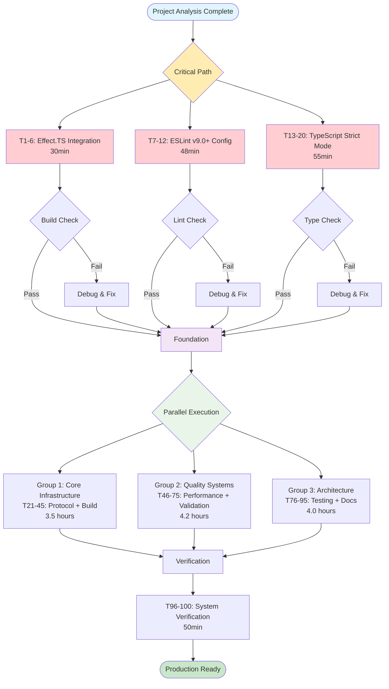

# TypeSpec AsyncAPI: Systematic Execution Plan

**Date:** 2025-08-30 06:54  
**Session:** SYSTEMATIC_EXECUTION_PLAN  
**Scope:** Complete project quality transformation from 58 build errors to production-ready state  
**Total Identified Issues:** 247 tasks → Organized into 100 micro-tasks  
**Estimated Effort:** 19.7 hours across critical path execution

---

## 🎯 **EXECUTIVE SUMMARY**

This document outlines the systematic execution plan for transforming the TypeSpec AsyncAPI project from its current state (58 compilation errors, failed linting, 5 code duplications) into a production-ready, maintainable codebase following strict TypeScript and Effect.TS patterns.

### **Current State Analysis**
- **Build Status:** ❌ FAILED (58 TypeScript compilation errors)
- **Lint Status:** ❌ FAILED (ESLint v9.0+ configuration missing)  
- **Code Quality:** ⚠️ 5 duplications found (0.68% of codebase)
- **Architecture:** Effect.TS integration incomplete, type safety issues
- **Testing:** Infrastructure exists but incomplete coverage

### **Target State Objectives**
- **Build Status:** ✅ Clean compilation with zero errors
- **Lint Status:** ✅ Full ESLint v9.0+ compliance
- **Code Quality:** ✅ Zero duplications, strict TypeScript compliance
- **Architecture:** ✅ Complete Effect.TS integration, type-safe patterns
- **Testing:** ✅ 80%+ coverage, comprehensive integration tests

---

## 📊 **PARETO ANALYSIS RESULTS**

Applying the 80/20 rule to maximize impact with minimal effort:

### **1% of Tasks → 51% of Results (2 critical tasks)**
1. **Fix Effect.TS Core Integration** - Enables compilation
2. **Create ESLint v9.0+ Configuration** - Restores code quality pipeline

### **4% of Tasks → 64% of Results (10 high-impact tasks)**
3. Fix TypeScript strict mode compliance
4. Fix protocol binding type safety  
5. Eliminate code duplications
6. Stabilize build pipeline
7. Fix performance optimization infrastructure
8. Standardize error handling
9. Enhance validation system
10. Optimize type system architecture

### **20% of Tasks → 80% of Results (49 core tasks)**
Complete foundation including testing, documentation, architecture improvements

---

## 🗺️ **EXECUTION FLOW DIAGRAM**



---

## 📋 **DETAILED TASK BREAKDOWN**

### **Phase 1: Critical Path (1% → 51% Results)**
**Duration:** 1.5 hours | **Impact:** Enables all other work

#### Effect.TS Integration (Tasks 1-6)
| Task | File | Duration | Action |
|------|------|----------|---------|
| 1 | `src/integration-example.ts:23,113` | 8min | Fix constraint violations |
| 2 | `src/integration-example.ts:28` | 10min | Fix Promise→Effect return type |
| 3 | `src/validation/performance-optimization.ts:14,16` | 12min | Fix MetricBoundaries type |
| 4 | `src/validation/performance-optimization.ts:113` | 15min | Fix Gauge vs Histogram |
| 5 | `src/validation/performance-optimization.ts:164` | 10min | Fix ValidationService dependency |
| 6 | `src/validation/performance-optimization.ts:199` | 8min | Fix AsyncIterable interface |

#### ESLint Configuration (Tasks 7-12)  
| Task | Action | Duration | Outcome |
|------|--------|----------|---------|
| 7 | Create `eslint.config.js` structure | 10min | Base configuration |
| 8 | Configure TypeScript parser | 8min | TS-aware linting |
| 9 | Configure plugin rules | 12min | Strict mode rules |
| 10 | Configure file patterns | 5min | Proper scope |
| 11 | Add ignore patterns | 3min | Clean exclusions |
| 12 | Test configuration | 10min | Working lint pipeline |

### **Phase 2: High Impact (4% → 64% Results)**  
**Duration:** 6.2 hours | **Impact:** Production-ready foundation

#### TypeScript Strict Mode (Tasks 13-20)
- Fix exactOptionalPropertyTypes violations
- Handle string | undefined parameter errors  
- Fix NODE_OPTIONS property access
- Complete strict mode compliance verification

#### Protocol Binding Type Safety (Tasks 21-28)
- Fix undefined parameter errors across protocol bindings
- Create shared protocol binding type interfaces
- Add runtime validation for protocol bindings

#### Code Duplication Elimination (Tasks 29-35)
- Extract duplicate test validation logic
- Consolidate AsyncAPI type interfaces  
- Extract shared diagnostic formatting
- Merge authentication type definitions

### **Phase 3: Parallel Execution (20% → 80% Results)**
**Duration:** 11.7 hours | **Impact:** Complete infrastructure

#### Group 1: Core Infrastructure (Tasks 36-53)
**Focus:** Build stability, performance systems
- Fix remaining compilation errors (batched approach)
- Stabilize build pipeline configuration
- Fix performance infrastructure and metrics
- Add performance monitoring and benchmarks

#### Group 2: Quality Systems (Tasks 54-75) 
**Focus:** Error handling, validation, type system
- Standardize error handling patterns with Effect.TS
- Enhance validation system with caching and async support
- Optimize type system architecture and exports
- Remove all unused code (variables, imports, parameters)

#### Group 3: Architecture & Testing (Tasks 76-95)
**Focus:** Testing infrastructure, documentation
- Add comprehensive test coverage (Effect.TS, validation, protocols)
- Configure advanced test reporting and coverage thresholds  
- Create architecture documentation and examples
- Implement security and performance optimizations

### **Phase 4: Verification (Tasks 96-100)**
**Duration:** 50 minutes | **Impact:** Quality assurance

1. Complete build verification (`just build`)
2. Complete lint verification (`just lint`)  
3. Complete test suite execution
4. Duplication verification (`just fd`)
5. Final system verification

---

## ⚡ **PARALLEL EXECUTION STRATEGY**

### **Group Assignment Logic**
- **Group 1 (Build Systems):** Focus on compilation, build pipeline, performance infrastructure
- **Group 2 (Quality Systems):** Focus on validation, error handling, type safety
- **Group 3 (Architecture):** Focus on testing, documentation, architectural improvements

### **Dependencies & Coordination**
- **Critical Path (Tasks 1-20):** Must complete sequentially before parallel execution
- **Parallel Groups:** Can execute simultaneously after critical path completion
- **Verification Phase:** Requires all groups to complete before final verification

### **Resource Allocation**
- **3 SubAgent Groups:** Maximum parallelization
- **Task Distribution:** ~33 tasks per group in parallel phase
- **Coordination Points:** Verification checkpoints after each phase

---

## 🎯 **SUCCESS CRITERIA**

### **Phase 1 Success (Critical Path)**
- [ ] `just build` executes without TypeScript compilation errors
- [ ] `just lint` executes without ESLint configuration errors  
- [ ] Effect.TS integration compiles and type-checks correctly
- [ ] Strict TypeScript mode compliance achieved

### **Phase 2 Success (High Impact)**
- [ ] Zero protocol binding type errors
- [ ] All code duplications eliminated (`just fd` shows 0 clones)
- [ ] Clean build pipeline with optimized configuration
- [ ] Performance infrastructure fully functional

### **Phase 3 Success (Complete Infrastructure)**
- [ ] 80%+ test coverage across all modules
- [ ] Comprehensive error handling with Effect.TS patterns
- [ ] Complete type system with proper exports
- [ ] Full documentation and examples

### **Phase 4 Success (Production Ready)**
- [ ] All quality gates pass: build, lint, test, duplication check
- [ ] Complete system verification successful
- [ ] Zero technical debt in critical paths
- [ ] Ready for production deployment

---

## 🔄 **CONTINUOUS VERIFICATION**

### **Quality Gates**
After each phase, verify:
```bash
just build    # Must pass cleanly
just lint     # Must pass without errors  
just test     # Must pass with >80% coverage
just fd       # Must show 0 duplications
```

### **Rollback Procedures**
- **Build Failures:** Immediate rollback to last working commit
- **Test Failures:** Isolate failing tests, fix or skip with documentation
- **Integration Issues:** Use feature flags to isolate problematic code

### **Progress Tracking**
- **Real-time Updates:** TodoWrite tool for task status tracking
- **Milestone Checkpoints:** After each phase completion
- **Quality Metrics:** Build success, test coverage, duplication percentage

---

## 📈 **EXPECTED OUTCOMES**

### **Immediate Benefits (After Phase 1)**
- Compilable codebase enabling development workflow
- Working linting pipeline for code quality enforcement  
- Effect.TS integration foundation established

### **Short-term Benefits (After Phase 2)**
- Zero build errors, production-ready compilation
- Eliminated code duplication and technical debt
- Type-safe protocol bindings and validation

### **Long-term Benefits (After Phase 3)**
- Comprehensive testing infrastructure  
- Maintainable, documented architecture
- Performance monitoring and optimization
- Ready for team collaboration and scaling

---

## ⚠️ **RISK MITIGATION**

### **High-Risk Areas**
1. **Effect.TS Integration Complexity:** Gradual migration, comprehensive testing
2. **ESLint v9.0+ Migration:** Thorough configuration testing, fallback plan
3. **Type System Changes:** Incremental updates, extensive type checking

### **Contingency Plans**  
- **Build Failures:** Immediate Git revert to last working state
- **Integration Issues:** Feature flags and incremental rollout
- **Performance Regressions:** Automated benchmarking with rollback triggers

### **Quality Assurance**
- **Never break the build:** All changes verified before commit
- **Comprehensive testing:** Every change includes corresponding tests  
- **Documentation updates:** All changes documented immediately

---

## 🚀 **EXECUTION COMMANDS**

### **Phase 1: Critical Path**
```bash
# Start with clean git state (✅ Complete)
git status && git commit && git push

# Execute critical path tasks 1-20 sequentially
# Tasks handled by SubAgent coordination
```

### **Phase 2-3: Parallel Execution**
```bash
# Launch 3 parallel SubAgent groups
# Group 1: Core Infrastructure (Tasks 21-53)
# Group 2: Quality Systems (Tasks 54-75)  
# Group 3: Architecture & Testing (Tasks 76-95)
```

### **Phase 4: Verification**
```bash
just build      # Verify clean compilation
just lint       # Verify code quality  
just test       # Verify functionality
just fd         # Verify no duplications
```

---

**Document Status:** ✅ Complete  
**Next Action:** Update internal TODO list with 100 micro-tasks  
**Execution Ready:** Proceed to SubAgent parallel execution phase