# Complete Execution Plan: TypeSpec AsyncAPI Project
**Date:** 2025-08-30 08:48  
**Session:** COMPLETE_EXECUTION_PLAN  
**Scope:** All GitHub Issues + Internal TODOs + TypeScript Fixes  
**Target:** Production-ready TypeSpec AsyncAPI emitter  

---

## 🎯 EXECUTIVE SUMMARY

**Current Status:** Foundation established, 104+ TypeScript compilation errors blocking progress  
**Critical Path:** TypeScript fixes → Validation → Features → Testing → Production  
**Total Work:** ~46 tasks, 11.5 hours estimated  
**Success Criteria:** Zero compilation errors, comprehensive test coverage, complete AsyncAPI 3.0.0 support  

### Key Issues Identified
- **CRITICAL:** TypeScript compilation completely broken (104+ errors)
- **HIGH:** Missing core AsyncAPI decorators (@message, @protocol, @security)  
- **HIGH:** Placeholder validation needs proper AsyncAPI library integration
- **MEDIUM:** Mixed Effect.TS/Promise patterns need architectural consistency
- **LOW:** Internal TODO comments need cleanup

---

## 📊 GITHUB ISSUES ANALYSIS

| Issue | Title | Priority | Effort | Impact | Dependencies |
|-------|-------|----------|---------|--------|--------------|
| #2 | **CRITICAL: TypeScript Strict Mode Compliance - 104 Errors** | CRITICAL | 90min | Critical | None |
| #7 | **Implement Missing AsyncAPI Decorators** | HIGH | 75min | High | #2 |
| #3 | **Proper AsyncAPI Specification Validation** | HIGH | 60min | High | #2 |
| #5 | **Performance Validation and Benchmarking System** | HIGH | 85min | High | #2,#3 |
| #4 | **Complete Effect.TS Architecture Integration** | MEDIUM | 70min | Medium | #2 |
| #1 | **TypeSpec Versioning Support** | LOW | 95min | Low | All above |
| #6 | **Session Summary Documentation** | COMPLETE | 0min | - | - |

### Internal TODOs
- `src/decorators/index.ts:7` - Export missing decorators (blocked by #2)
- `src/decorators/channel.ts:19` - Effect.TS schema integration (blocked by #2)

---

## 🚨 CRITICAL PATH ANALYSIS

### Root Cause: TypeScript Compilation Failure
**104+ compilation errors** completely block:
- Testing infrastructure
- Build validation  
- Performance benchmarking
- Feature development
- Production deployment

### Error Distribution (Top Files)
```
lib-enhanced.ts:              2 errors (info/warning severity conflicts)
protocol-bindings.ts:        80+ errors (undefined types, exactOptionalPropertyTypes)
validation files:            20+ errors (Effect.TS integration issues)
Other files:                 10+ errors (miscellaneous type issues)
```

### Architectural Status
- ✅ **TypeEmitter Inheritance**: Fixed and functional
- ✅ **Error-Handling System**: Complete strict compliance  
- ⚠️ **Effect.TS Foundation**: Partially established
- ❌ **Validation System**: Placeholder implementation
- ❌ **Performance System**: Not implemented

---

## 📋 SYSTEMATIC EXECUTION PLAN

### Phase 1: FOUNDATION STABILIZATION (2-3 hours)
**Goal:** Achieve zero TypeScript compilation errors

#### Group A: Critical TypeScript Fixes
1. **Fix lib-enhanced.ts severity conflicts** (15min)
   - Change "info" → "warning" for diagnostic compatibility
   - Resolve 2 compilation errors

2. **Fix protocol-bindings.ts undefined issues** (60min)
   - Add proper null checks for optional parameters  
   - Fix exactOptionalPropertyTypes violations
   - Resolve 80+ compilation errors

3. **Fix validation system Effect.TS issues** (30min)
   - Complete Layer import fixes
   - Resolve Metric API usage patterns
   - Fix 20+ compilation errors

#### Success Criteria Phase 1
- [ ] Zero TypeScript compilation errors
- [ ] `bun run typecheck` passes completely
- [ ] Build system functional

### Phase 2: CORE FUNCTIONALITY (3-4 hours)
**Goal:** Implement missing core features for AsyncAPI 3.0.0 support

#### Group B: AsyncAPI Validation System
1. **Install AsyncAPI validation library** (15min)
   ```bash
   bun add @asyncapi/parser
   ```

2. **Implement Effect.TS validation wrapper** (30min)
   ```typescript
   const AsyncAPIValidation = Effect.Service<AsyncAPIValidation>()({\n     Effect: Effect.gen(function* () {\n       return {\n         validateSpec: (spec: unknown) => Effect.gen(function* () {\n           // Proper AsyncAPI validation implementation\n         })\n       };\n     })\n   });
   ```

3. **Replace placeholder validation** (15min)
   - Update `src/integration-example.ts:29`
   - Remove `Effect.succeed(true)` placeholder

#### Group C: Missing Decorator Implementation  
1. **Create @message decorator** (30min)
   - Implement `src/decorators/message.ts`
   - Message schema definition and validation
   - Content type specification support

2. **Create @protocol decorator** (30min)
   - Implement `src/decorators/protocol.ts`
   - Kafka, WebSocket, HTTP binding support
   - Protocol-specific validation patterns

3. **Create @security decorator** (30min)
   - Implement `src/decorators/security.ts`
   - API Key, OAuth 2.0, SASL authentication
   - Security scheme definitions

4. **Update decorator exports** (15min)
   - Fix `src/decorators/index.ts:7` TODO
   - Export all new decorators

#### Success Criteria Phase 2
- [ ] Real AsyncAPI validation implemented
- [ ] All missing decorators created and exported
- [ ] Complete AsyncAPI 3.0.0 decorator support
- [ ] Comprehensive test coverage >80%

### Phase 3: PERFORMANCE & ARCHITECTURE (2-3 hours)
**Goal:** Achieve comprehensive test coverage and architectural consistency

#### Group D: Performance Validation System
1. **Create performance metrics infrastructure** (30min)
   ```typescript
   const PerformanceMetrics = Effect.Service<PerformanceMetrics>()({\n     Effect: Effect.gen(function* () {\n       return {\n         startTimer: (name: string) => Effect.sync(() => performance.now()),\n         recordThroughput: (ops: number, duration: number) => Effect.succeed(ops / duration)\n       };\n     })\n   });
   ```

2. **Implement validation benchmarking** (45min)
   - Functionality testing (comprehensive coverage)
   - Memory usage monitoring (<1KB per operation)
   - Performance regression detection

3. **Complete Effect.TS architecture** (60min)
   - Convert all Promise patterns to Effect.TS
   - Implement proper Layer-based dependency injection
   - Add tagged error types throughout

#### Success Criteria Phase 3
- [ ] Comprehensive validation test coverage achieved
- [ ] <1KB memory per operation validated
- [ ] Pure Effect.TS architecture throughout
- [ ] Comprehensive performance monitoring

### Phase 4: INTEGRATION & VALIDATION (2-3 hours)
**Goal:** Production deployment readiness

#### Group E: Integration Testing
1. **Create integration test infrastructure** (30min)
2. **Add AsyncAPI generation tests** (30min)
3. **Add validation integration tests** (30min)
4. **Add decorator integration tests** (30min)
5. **Add performance integration tests** (30min)

#### Group F: Final Validation
1. **Run comprehensive benchmarks** (30min)
2. **Validate all GitHub issues resolved** (30min)
3. **Create test coverage report** (15min)
4. **Final build and deployment validation** (15min)

#### Success Criteria Phase 4
- [ ] All GitHub issues resolved and closed
- [ ] Test coverage >80% achieved
- [ ] Build system fully functional
- [ ] Production deployment validated

---

## 🔄 EXECUTION GRAPH

```mermaid
graph TD
    %% START
    Start([🚀 Start Execution<br/>2025-08-30 08:48]) --> Check[📊 Check Current Status]
    Check --> Phase1{Phase 1: Foundation}
    
    %% PHASE 1: FOUNDATION STABILIZATION
    Phase1 --> GroupA[👥 Group A: Critical TypeScript Fixes]
    GroupA --> A1[🔧 Fix lib-enhanced.ts severity - 15min<br/>#2]
    A1 --> A2[🔧 Fix protocol-bindings undefined - 60min<br/>#2]  
    A2 --> A3[🔧 Fix validation Effect.TS - 30min<br/>#2]
    A3 --> Validate1[✅ Validate: Zero TS Errors]
    
    %% PHASE 2: CORE FUNCTIONALITY  
    Validate1 --> Phase2{Phase 2: Core Features}
    Phase2 --> GroupB[👥 Group B: AsyncAPI Validation]
    Phase2 --> GroupC[👥 Group C: Missing Decorators]
    
    %% GROUP B: AsyncAPI Validation
    GroupB --> B1[📦 Install @asyncapi/parser - 15min<br/>#3]
    B1 --> B2[⚡ Effect.TS validation wrapper - 30min<br/>#3]
    B2 --> B3[🔄 Replace placeholder - 15min<br/>#3]
    
    %% GROUP C: Missing Decorators
    GroupC --> C1[🏷️ Create @message decorator - 30min<br/>#7]
    C1 --> C2[🌐 Create @protocol decorator - 30min<br/>#7]
    C2 --> C3[🔒 Create @security decorator - 30min<br/>#7]
    C3 --> C4[📤 Update decorator exports - 15min<br/>#7]
    
    %% SYNC POINT
    B3 --> Validate2[✅ Validate: Core Features]
    C4 --> Validate2
    
    %% PHASE 3: PERFORMANCE & ARCHITECTURE
    Validate2 --> Phase3{Phase 3: Performance}
    Phase3 --> GroupD[👥 Group D: Performance System]
    
    GroupD --> D1[📊 Performance metrics infrastructure - 30min<br/>#5]
    D1 --> D2[🚀 Validation benchmarking - 45min<br/>#5]
    D2 --> D3[⚡ Effect.TS architecture completion - 60min<br/>#4]
    D3 --> Validate3[✅ Validate: Test Coverage]
    
    %% PHASE 4: INTEGRATION & FINAL
    Validate3 --> Phase4{Phase 4: Integration}
    Phase4 --> GroupE[👥 Group E: Integration Testing]
    Phase4 --> GroupF[👥 Group F: Final Validation]
    
    %% GROUP E: Integration Testing
    GroupE --> E1[🧪 Test infrastructure - 30min<br/>internal]
    E1 --> E2[🧪 Generation tests - 30min<br/>internal]
    E2 --> E3[🧪 Validation tests - 30min<br/>internal]
    E3 --> E4[🧪 Decorator tests - 30min<br/>internal]
    E4 --> E5[🧪 Performance tests - 30min<br/>internal]
    
    %% GROUP F: Final Validation
    GroupF --> F1[📈 Comprehensive benchmarks - 30min<br/>internal]
    F1 --> F2[✅ Validate GitHub issues - 30min<br/>internal]
    F2 --> F3[📊 Coverage report - 15min<br/>internal]
    F3 --> F4[🚀 Final build validation - 15min<br/>internal]
    
    %% COMPLETION
    E5 --> Complete[🎉 Production Ready<br/>All Issues Resolved]
    F4 --> Complete
    
    %% PARALLEL EXECUTION INDICATORS
    Complete --> Summary[📋 Execution Summary<br/>- Zero compilation errors<br/>- Comprehensive test coverage<br/>- Complete AsyncAPI 3.0.0 support<br/>- >80% test coverage]
    
    %% STYLING
    classDef critical fill:#ff6b6b,stroke:#d63031,stroke-width:3px,color:#fff
    classDef high fill:#fdcb6e,stroke:#e17055,stroke-width:2px
    classDef medium fill:#74b9ff,stroke:#0984e3,stroke-width:2px,color:#fff
    classDef validation fill:#00b894,stroke:#00a085,stroke-width:2px,color:#fff
    classDef parallel fill:#a29bfe,stroke:#6c5ce7,stroke-width:2px,color:#fff
    classDef complete fill:#2d3436,stroke:#636e72,stroke-width:3px,color:#fff
    
    class A1,A2,A3,Validate1 critical
    class B1,B2,B3,C1,C2,C3,C4,Validate2 high
    class D1,D2,D3,Validate3 medium
    class E1,E2,E3,E4,E5,F1,F2,F3,F4 validation
    class GroupA,GroupB,GroupC,GroupD,GroupE,GroupF parallel
    class Complete,Summary complete
```



---

## 🎯 PARALLEL EXECUTION STRATEGY

### Group Division for Concurrent Execution

#### Group 1: Critical Foundation (TypeScript Fixes)
- **Focus:** Eliminate compilation errors immediately  
- **Blocker Status:** Blocks all other work
- **Agent:** `go-quality-enforcer` for strict TypeScript compliance
- **Success:** Zero compilation errors

#### Group 2: Core Feature Implementation (Validation + Decorators)
- **Focus:** AsyncAPI library integration + missing decorators
- **Dependency:** Requires Group 1 completion
- **Agent:** `web-stack-expert` for proper AsyncAPI integration
- **Success:** Complete AsyncAPI 3.0.0 support

#### Group 3: Performance & Architecture (Effect.TS + Benchmarking)  
- **Focus:** Performance optimization and architectural consistency
- **Dependency:** Requires Group 1 and 2 partial completion
- **Agent:** `railway-programming-enforcer` for Effect.TS patterns
- **Success:** Comprehensive validated test coverage

---

## ✅ SUCCESS CRITERIA & VALIDATION

### Critical Success Factors
1. **Zero TypeScript compilation errors** - Measured by `bun run typecheck`
2. **Comprehensive validation coverage** - Measured by test suite completeness  
3. **Complete AsyncAPI 3.0.0 support** - All decorators implemented and tested
4. **>80% test coverage** - Comprehensive integration testing
5. **Production build success** - Full build pipeline functional

### Quality Gates
- [ ] Phase 1: TypeScript compilation passes
- [ ] Phase 2: Core features functional with tests
- [ ] Phase 3: Performance targets achieved  
- [ ] Phase 4: All GitHub issues closed

### Monitoring & Alerts
- Real-time TypeScript error count tracking
- Performance regression detection
- Build failure immediate alerts
- Test coverage monitoring

---

## ⚠️ RISK MITIGATION

### Critical Risks Identified
1. **TypeScript complexity underestimated** - Mitigation: Focus on quick wins first
2. **Effect.TS learning curve** - Mitigation: Use established patterns from existing code
3. **Performance targets not achievable** - Mitigation: Profile and optimize systematically
4. **Scope creep during implementation** - Mitigation: Strict adherence to GitHub issues

### Contingency Plans
- **TypeScript fixes take too long:** Focus on highest-impact errors first
- **Performance targets missed:** Implement caching and batching optimizations
- **Integration issues:** Fall back to simpler patterns, maintain functionality over architecture

---

## 🎖️ BUSINESS VALUE DELIVERY

### Immediate Value (Phase 1-2)
- **Developer Experience:** Functional development environment
- **Feature Completeness:** Full AsyncAPI 3.0.0 decorator support
- **Quality Foundation:** Enterprise-grade TypeScript compliance

### Long-term Value (Phase 3-4)  
- **Test Excellence:** Comprehensive enterprise-scale test coverage
- **Architectural Excellence:** Clean Effect.TS functional programming patterns
- **Production Readiness:** Complete testing and deployment validation

### Competitive Advantages
- **Superior Performance:** Outperforms existing AsyncAPI tooling
- **Type Safety:** Strictest TypeScript compliance in the industry
- **Modern Architecture:** Effect.TS functional programming excellence

---

**Total Estimated Effort:** 11.5 hours focused development  
**Target Completion:** 2025-08-30 20:18 (if started immediately)  
**Success Probability:** HIGH (with systematic execution approach)  

---

*This plan represents a systematic approach to complete production readiness of the TypeSpec AsyncAPI emitter project. All work is tracked through GitHub issues and comprehensive quality gates ensure no regression during development.*