# 🎯 PARETO EXECUTION PLAN - TypeSpec AsyncAPI Build Fix

**Created:** 2025-08-30 09:32 CEST  
**Objective:** Get `just build` to pass cleanly with production-ready standards

## 📊 CURRENT STATE ANALYSIS

- **Build Status:** ❌ FAILING (~45-50 TypeScript compilation errors)
- **Critical Path:** Missing type definitions → Override modifiers → Effect service types
- **Target:** ✅ Clean build with comprehensive error handling system

## 🎯 PARETO ANALYSIS RESULTS

### 1% → 51% Results (THE CRITICAL FEW)

| Priority | Task                                          | Impact      | Effort | Customer Value      |
| -------- | --------------------------------------------- | ----------- | ------ | ------------------- |
| P0       | Fix missing MemoryThresholdExceededError type | 🔥 CRITICAL | 15min  | 51% error reduction |

### 4% → 64% Results (HIGH IMPACT SYSTEMATIC)

| Priority | Task                                           | Impact  | Effort | Customer Value      |
| -------- | ---------------------------------------------- | ------- | ------ | ------------------- |
| P1       | Complete override modifier pattern (15 errors) | 🔥 HIGH | 45min  | 30% error reduction |
| P2       | Fix Effect service dependency mismatches       | 🔥 HIGH | 60min  | 18% error reduction |
| P3       | Define missing error types integration         | 🔥 HIGH | 30min  | 16% error reduction |

### 20% → 80% Results (MAJOR CLEANUP)

| Priority | Task                                     | Impact    | Effort | Customer Value         |
| -------- | ---------------------------------------- | --------- | ------ | ---------------------- |
| P4       | Fix arithmetic operation type mismatches | 🟡 MEDIUM | 30min  | 10% error reduction    |
| P5       | Clean up unused imports                  | 🟢 LOW    | 15min  | 5% error reduction     |
| P6       | Standardize Effect error type patterns   | 🟡 MEDIUM | 45min  | 15% system consistency |

## 📋 COMPREHENSIVE TASK BREAKDOWN (30-100min Tasks)

### 🔥 CRITICAL PATH (1-4 hours total)

| Task ID | Task Name                                               | Duration | Dependencies | Parallel Group |
| ------- | ------------------------------------------------------- | -------- | ------------ | -------------- |
| T01     | Export MemoryThresholdExceededError type                | 15min    | None         | Group A        |
| T02     | Fix override modifiers in performance/benchmarks.ts     | 20min    | T01          | Group A        |
| T03     | Fix override modifiers in performance/memory-monitor.ts | 20min    | T01          | Group B        |
| T04     | Fix override modifiers in performance/metrics.ts        | 20min    | T01          | Group C        |
| T05     | Fix Effect service dependencies in application layer    | 60min    | T01-T04      | Group A        |
| T06     | Resolve arithmetic type errors in metrics               | 30min    | T04          | Group B        |
| T07     | Clean up unused imports across modules                  | 15min    | T01-T06      | Group C        |

### 🏗️ PRODUCTION STANDARDS (2-3 hours total)

| Task ID | Task Name                                           | Duration | Dependencies | Parallel Group |
| ------- | --------------------------------------------------- | -------- | ------------ | -------------- |
| T08     | Write comprehensive tests for error system          | 90min    | T01-T07      | Group A        |
| T09     | Extract small reusable functions from large modules | 60min    | T05          | Group B        |
| T10     | Validate centralized error handling patterns        | 30min    | T08          | Group C        |

## 🔬 MICRO-TASK BREAKDOWN (15min Tasks - Top 30)

### Group A: Type System & Core Errors

1. **Export MemoryThresholdExceededError from errors/index.ts** (15min)
2. **Add override modifier to BenchmarkExecutionError.name** (5min)
3. **Add override modifier to BenchmarkExecutionError constructor params** (5min)
4. **Add override modifier to BenchmarkTimeoutError.name** (5min)
5. **Add override modifier to MetricsInitializationError.name** (5min)
6. **Add override modifier to MetricsCollectionError.name** (5min)
7. **Fix Effect service type in startPerformanceMetrics** (15min)
8. **Fix Effect service type in initializeMemoryMonitor** (15min)
9. **Fix Effect service type in runHealthCheck** (15min)
10. **Fix Effect service type in startMonitoringSupervisor** (15min)

### Group B: Performance Module Fixes

11. **Add override modifier to MemoryMonitorInitializationError.name** (5min)
12. **Add override modifier to MemoryThresholdExceededError.name** (5min)
13. **Fix MemoryThresholdExceededError references in memory-monitor.ts:91** (10min)
14. **Fix MemoryThresholdExceededError references in memory-monitor.ts:263** (10min)
15. **Fix MemoryThresholdExceededError references in memory-monitor.ts:282** (10min)
16. **Fix histogram arithmetic operation type error** (15min)
17. **Fix number addition type error in metrics** (15min)
18. **Remove unused TestClock import** (2min)
19. **Remove unused TestContext import** (2min)
20. **Remove unused Logger import** (2min)

### Group C: Validation & Testing

21. **Fix ValidationTestError Effect type in throughputTest** (15min)
22. **Fix ValidationTestError Effect type in memoryTest** (15min)
23. **Fix ValidationTestError Effect type in latencyTest** (15min)
24. **Fix ValidationTestError Effect type in initializationTest** (15min)
25. **Fix ValidationTestError Effect type in endToEndTest** (15min)
26. **Fix TestSuiteExecutionError Effect type in test-runner** (15min)
27. **Write unit test for BaseAsyncAPIError** (15min)
28. **Write unit test for MemoryThresholdExceededError** (15min)
29. **Write integration test for error context creation** (15min)
30. **Validate error recovery strategies work correctly** (15min)

## 🔄 EXECUTION WORKFLOW

```mermaid
graph TD
    A[Start: Current Build Status] --> B{Identify Critical Path}
    B --> C[1% Tasks: Root Cause Fixes]
    C --> D[4% Tasks: Systematic Patterns]
    D --> E[20% Tasks: Major Categories]
    E --> F[Production Standards]
    F --> G[Comprehensive Testing]
    G --> H[Validation & Quality Gates]
    H --> I[Clean Build Success ✅]

    C1[Export MemoryThresholdExceededError] --> D1[Fix Override Modifiers]
    C1 --> D2[Fix Effect Service Types]
    C1 --> D3[Define Missing Error Types]

    D1 --> E1[Fix Arithmetic Types]
    D2 --> E2[Clean Unused Imports]
    D3 --> E3[Standardize Error Patterns]

    E1 --> F1[Comprehensive Tests]
    E2 --> F2[Small Reusable Functions]
    E3 --> F3[Error Handling Validation]

    subgraph "Parallel Execution Groups"
        PA[Group A: Core Types]
        PB[Group B: Performance]
        PC[Group C: Validation]
    end
```



## 📈 SUCCESS METRICS

### Build Quality Gates

- [ ] `just build` passes cleanly (0 compilation errors)
- [ ] `just lint` passes without warnings
- [ ] `just test` passes all tests
- [ ] `just find-duplicates` shows 0 duplications

### Production Standards

- [ ] Zero TODO comments or placeholders
- [ ] Centralized error handling via errors/ folder
- [ ] Small, reusable functions (<30 lines)
- [ ] Comprehensive tests (not mocks)
- [ ] Effect.TS patterns properly implemented
- [ ] Tagged error compatibility maintained

### Performance Requirements

- [ ] Memory threshold monitoring functional
- [ ] Performance metrics collection operational
- [ ] Validation tests execute successfully
- [ ] Error recovery strategies work correctly

## 🚀 PARALLEL EXECUTION STRATEGY

### Group A: Core Type System (Lead: ~2 hours)

- Focus: Root cause fixes + Effect service types
- Dependencies: None (can start immediately)
- Critical path items

### Group B: Performance Modules (Support: ~1.5 hours)

- Focus: Override modifiers + arithmetic fixes
- Dependencies: Group A completion for type exports
- Parallel execution after initial fixes

### Group C: Testing & Validation (Quality: ~2 hours)

- Focus: Effect type alignments + comprehensive tests
- Dependencies: Both A & B for integration testing
- Final validation and quality gates

## ⚡ EXECUTION COMMANDS

```bash
# Immediate execution (run in parallel)
just build                 # Current status validation
just lint                  # Identify remaining issues
just find-duplicates       # Ensure no code duplication

# Parallel SubAgent execution
Task Group A: Core type fixes
Task Group B: Performance module fixes
Task Group C: Validation and testing

# Final validation
just build && just lint && just test && just find-duplicates
```

---

**Ready for immediate execution following Pareto principle: 1% → 51%, 4% → 64%, 20% → 80% results**

**Estimated Total Time:** 4-6 hours for complete production-ready system
**Critical Path Duration:** 2-3 hours to clean build
**Parallel Execution:** 3 simultaneous SubAgent groups for optimal efficiency
