# 🎯 ESLINT FIX EXECUTION PLAN - TypeSpec AsyncAPI
**Created:** 2025-08-30 17:20 CEST  
**Objective:** Fix all 705 ESLint errors to achieve production-ready code quality

## 📊 CURRENT STATE ANALYSIS
- **Build Status:** ✅ SUCCESS (0 TypeScript errors!)
- **Lint Status:** ❌ FAILING (705 ESLint errors)
- **Test Status:** ⏸️ BLOCKED (by lint failures)
- **Target:** ✅ Clean lint with production standards

## 🎯 PARETO ANALYSIS - 705 ESLINT ERRORS

### 1% → 51% Results (THE CRITICAL 99 ERRORS)
| Error Type | Count | Fix Method | Impact |
|------------|-------|------------|---------|
| prefer-nullish-coalescing | 52 | Automated: `\|\|` → `??` | 7.4% of all errors |
| consistent-type-definitions | 32 | Automated: interface → type | 4.5% of all errors |
| no-case-declarations | 15 | Automated: add blocks | 2.1% of all errors |
| **TOTAL** | **99** | **--fix flag** | **14% effort → 51% result** |

### 4% → 64% Results (SYSTEMATIC TYPE FIXES)
| Error Type | Count | Fix Method | Impact |
|------------|-------|------------|---------|
| no-explicit-any | 14 | Manual: specify types | 2.0% of all errors |
| no-unsafe-assignment | 12 | Manual: type safety | 1.7% of all errors |
| no-non-null-assertion | 11 | Manual: null checks | 1.6% of all errors |
| **TOTAL** | **37** | **Type patterns** | **5.3% effort → 13% result** |

### 20% → 80% Results (MAJOR CATEGORIES)
| Category | Count | Fix Method | Impact |
|----------|-------|------------|---------|
| Variable naming | 105 | Systematic: camelCase/UPPER_CASE | 14.9% of all errors |
| Return types | 76 | Manual: add type annotations | 10.8% of all errors |
| Template literals | 68 | Manual: fix expressions | 9.6% of all errors |
| Unnecessary conditions | 44 | Manual: simplify logic | 6.2% of all errors |
| **TOTAL** | **293** | **Mixed methods** | **41.5% effort → 16% result** |

## 📋 COMPREHENSIVE TASK BREAKDOWN (30-100min Tasks)

### Phase 1: AUTOMATED FIXES (30min total)
| Task ID | Task Name | Duration | Method | Error Count |
|---------|-----------|----------|--------|-------------|
| T01 | Run ESLint auto-fix for all files | 15min | `bun run lint --fix` | ~165 errors |
| T02 | Verify auto-fix results | 5min | `just lint` | Validate |
| T03 | Commit automated fixes | 10min | `git commit` | Checkpoint |

### Phase 2: TYPE SAFETY (90min total)
| Task ID | Task Name | Duration | Method | Error Count |
|---------|-----------|----------|--------|-------------|
| T04 | Fix explicit any types in core modules | 30min | Manual typing | 14 errors |
| T05 | Fix unsafe assignments across codebase | 30min | Type guards | 12 errors |
| T06 | Replace non-null assertions with checks | 30min | Null checks | 11 errors |

### Phase 3: CODE QUALITY (120min total)
| Task ID | Task Name | Duration | Method | Error Count |
|---------|-----------|----------|--------|-------------|
| T07 | Fix variable naming conventions | 45min | Rename to camelCase | 105 errors |
| T08 | Add missing return type annotations | 30min | Type annotations | 76 errors |
| T09 | Fix template literal expressions | 30min | Type conversions | 68 errors |
| T10 | Simplify unnecessary conditions | 15min | Logic cleanup | 44 errors |

### Phase 4: REMAINING FIXES (90min total)
| Task ID | Task Name | Duration | Method | Error Count |
|---------|-----------|----------|--------|-------------|
| T11 | Fix require imports → ES modules | 30min | Import conversion | 9 errors |
| T12 | Fix unsafe returns and calls | 30min | Type safety | 16 errors |
| T13 | Fix remaining type assertions | 30min | Type refinement | 7 errors |

## 🔬 MICRO-TASK BREAKDOWN (15min Tasks - Top 50)

### Group A: Automated Fixes (Execute First!)
1. **Run `bun run lint --fix` on src/asyncapi-emitter.ts** (5min)
2. **Run `bun run lint --fix` on src/bindings/** (5min)
3. **Run `bun run lint --fix` on src/emit/** (5min)
4. **Verify automated fixes with `just lint | wc -l`** (2min)
5. **Commit automated fixes** (3min)

### Group B: Type Safety Fixes
6. **Fix any types in asyncapi-emitter.ts:172** (5min)
7. **Fix any types in bindings/kafka.ts** (5min)
8. **Fix any types in bindings/ws.ts** (5min)
9. **Add type guards for unsafe assignments in emit/emit-asyncapi.ts** (10min)
10. **Replace non-null assertions in utils/channels.ts** (10min)
11. **Replace non-null assertions in utils/operations.ts** (10min)
12. **Add null checks in emit/emit-components.ts** (10min)
13. **Fix unsafe returns in emit/emit-messages.ts** (10min)
14. **Fix unsafe calls in emit/emit-operations.ts** (10min)
15. **Type template literal expressions in emit/emit-servers.ts** (10min)

### Group C: Code Quality Fixes
16. **Rename ValidationMetrics → validationMetrics** (5min)
17. **Rename AsyncAPIHelpers → asyncAPIHelpers** (5min)
18. **Rename PerformanceAssertions → performanceAssertions** (5min)
19. **Rename ValidationService → validationService** (5min)
20. **Rename LogicalExpressionNode → logicalExpressionNode** (5min)
21. **Add return type to getAsyncAPIDocument()** (5min)
22. **Add return type to resolveRef()** (5min)
23. **Add return type to parseRef()** (5min)
24. **Add return type to getMessagePayload()** (5min)
25. **Add return type to getSchemaFromRef()** (5min)
26. **Fix template literal in error messages** (10min)
27. **Fix template literal in log statements** (10min)
28. **Simplify always-truthy conditions in asyncapi-emitter.ts** (10min)
29. **Simplify always-falsy conditions in emit-bindings.ts** (10min)
30. **Remove unnecessary optional chains** (10min)

### Remaining Micro-Tasks (31-50)
31. **Convert require() to import in emit/index.ts** (5min)
32. **Convert require() to import in utils/index.ts** (5min)
33. **Fix generator functions without yield** (10min)
34. **Add readonly modifiers where needed** (10min)
35. **Fix missing awaits in async functions** (10min)
36. **Fix unsafe member access patterns** (10min)
37. **Add explicit boolean conversions** (10min)
38. **Fix enum member naming** (10min)
39. **Add missing semicolons** (5min)
40. **Fix trailing commas** (5min)
41. **Remove unused variables** (10min)
42. **Fix import ordering** (10min)
43. **Add missing type imports** (10min)
44. **Fix void type usage** (10min)
45. **Fix base-to-string errors** (10min)
46. **Add missing generic constraints** (10min)
47. **Fix array type syntax** (10min)
48. **Remove redundant type annotations** (10min)
49. **Final lint validation** (10min)
50. **Commit all fixes** (5min)

## 🔄 EXECUTION WORKFLOW

```mermaid
graph TD
    A[Start: 705 ESLint Errors] --> B[Phase 1: Automated Fixes]
    B --> C[Run eslint --fix]
    C --> D[~165 errors auto-fixed]
    D --> E[540 errors remaining]
    
    E --> F[Phase 2: Type Safety]
    F --> G[Fix any types]
    G --> H[Fix unsafe operations]
    H --> I[Fix non-null assertions]
    I --> J[503 errors remaining]
    
    J --> K[Phase 3: Code Quality]
    K --> L[Fix naming conventions]
    L --> M[Add return types]
    M --> N[Fix template literals]
    N --> O[Fix conditions]
    O --> P[210 errors remaining]
    
    P --> Q[Phase 4: Final Cleanup]
    Q --> R[Fix imports]
    R --> S[Fix remaining issues]
    S --> T[Validate all fixes]
    T --> U[✅ 0 ESLint Errors]
    
    subgraph "Parallel Execution Groups"
        PA[Group A: Automated - 99 errors]
        PB[Group B: Type Safety - 37 errors]
        PC[Group C: Code Quality - 569 errors]
    end
    
    style A fill:#ff6b6b
    style U fill:#51cf66
    style PA fill:#339af0
    style PB fill:#339af0
    style PC fill:#339af0
```



## 📈 SUCCESS METRICS

### Quality Gates
- [ ] `just lint` passes with 0 errors
- [ ] `just build` continues to pass
- [ ] `just test` runs successfully
- [ ] `just find-duplicates` shows 0 duplications

### Production Standards
- [ ] All `any` types eliminated or properly typed
- [ ] No unsafe operations or assertions
- [ ] Consistent naming conventions (camelCase/UPPER_CASE)
- [ ] All functions have explicit return types
- [ ] No template literal type errors
- [ ] ES modules throughout (no require())

### Code Quality Metrics
- [ ] Type coverage > 95%
- [ ] No ESLint disable comments added
- [ ] All auto-fixable issues resolved
- [ ] Manual fixes follow best practices

## 🚀 PARALLEL EXECUTION STRATEGY

### Group A: Automated Fixes (Lead: 30min)
```bash
# Immediate execution - can start NOW
bun run lint --fix
git add -A
git commit -m "fix: Apply ESLint automated fixes (99 errors resolved)"
```

### Group B: Type Safety (Support: 90min)
- Focus: Eliminate all `any` types and unsafe operations
- Dependencies: After Group A completes
- Critical for production readiness

### Group C: Code Quality (Quality: 120min)
- Focus: Naming conventions, return types, code clarity
- Dependencies: Can run parallel to Group B
- Improves maintainability

## ⚡ IMMEDIATE EXECUTION COMMANDS

```bash
# Phase 1: Automated fixes (DO THIS FIRST!)
bun run lint --fix
git diff --stat  # Review changes
git add -A && git commit -m "fix: ESLint automated fixes"

# Phase 2-4: Manual fixes via SubAgents
# Launch 3 parallel groups for maximum efficiency

# Final validation
just lint && just build && just test && echo "✅ ALL QUALITY GATES PASSED!"
```

## 🎯 EXPECTED OUTCOMES

### After Phase 1 (30min)
- **~165 errors fixed automatically**
- **540 errors remaining**
- **Clean git commit checkpoint**

### After Phase 2 (2 hours)
- **All type safety issues resolved**
- **~503 errors remaining**
- **No more `any` types**

### After Phase 3 (4 hours)
- **Code quality standards met**
- **~210 errors remaining**
- **Consistent codebase**

### After Phase 4 (5.5 hours)
- **✅ 0 ESLint errors**
- **✅ Production-ready code**
- **✅ All quality gates passing**

---

**CRITICAL PATH:** Start with automated fixes (Group A) immediately - this gives 51% results for 1% effort!

**Estimated Total Time:** 5.5 hours for complete resolution
**Parallel Execution:** 3 simultaneous SubAgent groups
**First Quick Win:** 99 errors fixed in 30 minutes with `--fix` flag