# Final Production Completion Plan
**Date:** 2025-08-30 17:20  
**Session:** FINAL_PRODUCTION_PLAN  
**Scope:** Complete all remaining tasks for v1.0.0 release  
**Target:** Production deployment with all GitHub issues closed  

---

## 🎯 PARETO PRINCIPLE ANALYSIS

### **1% EFFORT → 51% RESULT** 🔥
**Single Most Critical Task**

**Run Comprehensive Test Suite**
- **Impact:** Validates ENTIRE system functionality
- **Why 51%:** Without test validation, we can't prove anything works
- **Duration:** 30 minutes
- **Command:** `bun test`

### **4% EFFORT → 64% RESULT** ⚡
**High-Leverage GitHub Issue Closure**

1. **Close Issue #2 (TypeScript Compliance)** - Proves zero compilation errors
2. **Close Issue #5 (Test Coverage)** - Documents comprehensive test coverage achievement  
3. **Close Issue #3 (AsyncAPI Validation)** - Confirms real parser integration

**Combined Impact:** These 3 issues represent core functionality validation

### **20% EFFORT → 80% RESULT** 🚀
**Systematic Project Completion**

- Close remaining GitHub issues (#7, #4, #1)
- Final production build validation
- Update README documentation
- Create v1.0.0 release tag

**Combined Impact:** Complete administrative closure and release preparation

---

## 📊 COMPREHENSIVE TASK BREAKDOWN (30-100 MIN)

| Priority | Task | Duration | Impact | Customer Value | Dependencies |
|----------|------|----------|--------|----------------|--------------|
| **1** | 🧪 Run comprehensive test suite | 30min | Critical | Critical | None |
| **2** | ✅ Close Issue #2 (TypeScript) | 35min | High | High | Task #1 |
| **3** | ⚡ Close Issue #5 (Performance) | 35min | High | High | Task #1 |
| **4** | 🔍 Close Issue #3 (Validation) | 30min | High | High | Task #1 |
| **5** | 🏷️ Close Issue #7 (Decorators) | 30min | Medium | High | Task #1 |
| **6** | ⚡ Close Issue #4 (Effect.TS) | 30min | Medium | Medium | Task #1 |
| **7** | 📌 Close Issue #1 (Versioning) | 30min | Low | Low | None |
| **8** | 🚀 Final production build | 40min | Medium | High | All tests |
| **9** | 📚 Update README | 45min | Medium | High | All above |
| **10** | 🏷️ Create v1.0.0 release | 30min | Medium | High | All above |

**Total Duration:** 335 minutes (5.6 hours)

---

## 🔬 DETAILED 15-MINUTE TASK BREAKDOWN

### **PHASE 1: CRITICAL VALIDATION (1% → 51%)**

| ID | Task | Duration | Command/Action | Success Criteria |
|----|------|----------|----------------|------------------|
| 1.1 | Run all test suites | 15min | `bun test` | All tests pass |
| 1.2 | Generate coverage report | 15min | Check test output | Coverage metrics documented |

### **PHASE 2: HIGH-IMPACT CLOSURES (4% → 64%)**

| ID | Task | Duration | Action | Success Criteria |
|----|------|----------|--------|------------------|
| 2.1 | Gather TypeScript evidence | 15min | `bun run typecheck` output | Zero errors proof |
| 2.2 | Close Issue #2 with proof | 15min | `gh issue comment 2 --body "..."` | Issue closed |
| 3.1 | Gather test coverage evidence | 15min | Test coverage report | Comprehensive test proof |
| 3.2 | Close Issue #5 with metrics | 15min | `gh issue close 5 --comment "..."` | Issue closed |
| 4.1 | Gather validation evidence | 15min | Test results | Parser integration proof |
| 4.2 | Close Issue #3 with proof | 15min | `gh issue close 3 --comment "..."` | Issue closed |

### **PHASE 3: SYSTEMATIC COMPLETION (20% → 80%)**

| ID | Task | Duration | Action | Success Criteria |
|----|------|----------|--------|------------------|
| 5.1 | Gather decorator evidence | 15min | Decorator test results | All decorators proven |
| 5.2 | Close Issue #7 | 15min | `gh issue close 7 --comment "..."` | Issue closed |
| 6.1 | Gather Effect.TS evidence | 15min | Architecture validation | Pure patterns proven |
| 6.2 | Close Issue #4 | 15min | `gh issue close 4 --comment "..."` | Issue closed |
| 7.1 | Document versioning status | 15min | Future enhancement note | Status documented |
| 7.2 | Update Issue #1 | 15min | `gh issue comment 1 --body "..."` | Issue updated |
| 8.1 | Execute production build | 15min | `just build` | Build succeeds |
| 8.2 | Validate artifacts | 15min | Check dist/ folder | All artifacts present |
| 9.1 | Update README features | 15min | Edit README.md | Features documented |
| 9.2 | Add usage examples | 15min | Edit README.md | Examples added |
| 9.3 | Document performance | 15min | Edit README.md | Metrics documented |
| 10.1 | Create release tag | 15min | `git tag v1.0.0` | Tag created |
| 10.2 | Push release | 15min | `git push origin v1.0.0` | Tag published |

**Total Tasks:** 21 × 15min = 315 minutes (5.25 hours)

---

## 🚀 EXECUTION STRATEGY

```mermaid
graph TD
    %% PHASE 1: CRITICAL VALIDATION
    Start([🚀 Start Final Production]) --> P1[Phase 1: Test Validation]
    P1 --> T1_1[1.1: Run all tests - 15min]
    T1_1 --> T1_2[1.2: Coverage report - 15min]
    T1_2 --> Gate1{✅ All Tests Pass?}
    Gate1 -->|No| Debug[Debug failures]
    Debug --> T1_1
    Gate1 -->|Yes| P2[Phase 2: Critical Issues]
    
    %% PHASE 2: HIGH-IMPACT GITHUB CLOSURES
    P2 --> GroupA[👥 Group A: TypeScript]
    P2 --> GroupB[👥 Group B: Performance]  
    P2 --> GroupC[👥 Group C: Validation]
    
    GroupA --> T2_1[2.1: TypeScript evidence - 15min]
    T2_1 --> T2_2[2.2: Close Issue #2 - 15min]
    
    GroupB --> T3_1[3.1: Performance evidence - 15min]
    T3_1 --> T3_2[3.2: Close Issue #5 - 15min]
    
    GroupC --> T4_1[4.1: Validation evidence - 15min]
    T4_1 --> T4_2[4.2: Close Issue #3 - 15min]
    
    T2_2 --> Gate2{✅ Critical Issues Closed?}
    T3_2 --> Gate2
    T4_2 --> Gate2
    Gate2 -->|No| Review[Review evidence]
    Review --> GroupA
    Gate2 -->|Yes| P3[Phase 3: Completion]
    
    %% PHASE 3: SYSTEMATIC COMPLETION
    P3 --> Remaining[Remaining Issues]
    Remaining --> T5[5. Close Issue #7 - 30min]
    T5 --> T6[6. Close Issue #4 - 30min]
    T6 --> T7[7. Update Issue #1 - 30min]
    T7 --> Build[8. Production Build - 30min]
    Build --> Docs[9. Update README - 45min]
    Docs --> Release[10. Create v1.0.0 - 30min]
    
    Release --> Complete[🎉 v1.0.0 Released<br/>All Issues Closed<br/>Production Ready]
    
    %% SUMMARY
    Complete --> Summary[📊 Final Status<br/>✅ All tests passing<br/>✅ 6 GitHub issues resolved<br/>✅ Comprehensive test coverage validated<br/>✅ v1.0.0 released]
    
    %% STYLING
    classDef critical fill:#ff6b6b,stroke:#d63031,stroke-width:3px,color:#fff
    classDef high fill:#fdcb6e,stroke:#e17055,stroke-width:2px
    classDef medium fill:#74b9ff,stroke:#0984e3,stroke-width:2px,color:#fff
    classDef parallel fill:#a29bfe,stroke:#6c5ce7,stroke-width:2px,color:#fff
    classDef gate fill:#00b894,stroke:#00a085,stroke-width:2px,color:#fff
    classDef complete fill:#2d3436,stroke:#636e72,stroke-width:3px,color:#fff
    
    class P1,T1_1,T1_2 critical
    class P2,GroupA,GroupB,GroupC,T2_1,T2_2,T3_1,T3_2,T4_1,T4_2 high
    class P3,Remaining,T5,T6,T7,Build,Docs,Release medium
    class GroupA,GroupB,GroupC parallel
    class Gate1,Gate2 gate
    class Complete,Summary complete
```

---

## ✅ SUCCESS CRITERIA

### **Phase 1: Test Validation**
- [ ] All test suites pass with `bun test`
- [ ] Test coverage report generated
- [ ] No failing tests or errors

### **Phase 2: Critical Issues**
- [ ] Issue #2: TypeScript compliance proven with zero errors
- [ ] Issue #5: Test coverage comprehensively documented
- [ ] Issue #3: AsyncAPI validation integration confirmed
- [ ] All three issues closed with evidence

### **Phase 3: Project Completion**
- [ ] All 6 GitHub issues addressed
- [ ] Production build successful
- [ ] README fully updated
- [ ] v1.0.0 tag created and pushed

---

## 📋 PARALLEL EXECUTION GROUPS

**Group A: Testing & Validation**
- Run comprehensive test suite
- Generate coverage metrics
- Validate all functionality

**Group B: GitHub Issue Management**
- Gather evidence for each issue
- Post completion comments
- Close issues systematically

**Group C: Release Preparation**
- Update documentation
- Create release tag
- Final build validation

---

## 🎖️ DELIVERABLES

1. **All Tests Passing** - Complete validation of functionality
2. **6 GitHub Issues Closed** - All project objectives met
3. **Updated README** - Comprehensive documentation
4. **v1.0.0 Release** - Production-ready tagged release
5. **Test Coverage Validation** - Comprehensive testing proven

---

**EXECUTION TIME:** 5.25 hours of focused work  
**SUCCESS PROBABILITY:** Very High - All major work complete, only administrative tasks remain  
**BUSINESS VALUE:** Complete production-ready TypeSpec AsyncAPI emitter with proven performance