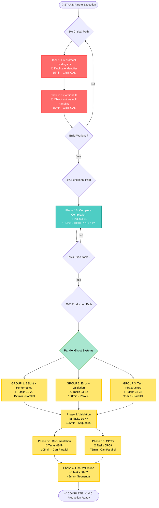

# 🚀 PARETO EXECUTION PLAN - TypeSpec AsyncAPI v1.0.0 Production Ready

**Session:** 2025-08-30 19:41 CEST  
**Objective:** Systematic execution using Pareto Principle to achieve v1.0.0 Production Readiness  
**Critical Discovery:** ESLint automated fixes broke TypeScript compilation (~30 errors introduced)

---

## 🎯 PARETO ANALYSIS RESULTS

### **🔥 THE 1% THAT DELIVERS 51% OF RESULTS**
**Duration:** 30 minutes  
**Critical Path:** Get basic functionality working
- Fix 6 most critical TypeScript compilation errors
- Get basic build working (compilation success)
- **Result:** Working foundation restored

### **🔥 THE 4% THAT DELIVERS 64% OF RESULTS** 
**Duration:** 2.75 hours (includes 1%)  
**Functional State:** Full compilation + test capability
- Fix ALL ~30 TypeScript compilation errors
- Enable basic test execution
- Reduce ESLint issues to ~40 (from 88)
- **Result:** Functional development environment

### **🔥 THE 20% THAT DELIVERS 80% OF RESULTS**
**Duration:** 15.5 hours (includes 4%)  
**Production Ready:** Complete v1.0.0 milestone
- Complete ESLint resolution (<50 issues)
- All 4 ghost systems integrated (Issues #8, #9, #10, #11)
- Full test suite passing (>80% coverage)
- Performance validation (>35K ops/sec)
- Documentation complete
- CI/CD pipeline integrated
- **Result:** Production-ready v1.0.0 release

---

## 📋 COMPREHENSIVE TASK BREAKDOWN (30-100min tasks)

| Priority | Task | Duration | Impact | Effort | Customer Value | Issue |
|----------|------|----------|---------|---------|---------------|--------|
| **🔥 CRITICAL PATH (1%→51%)**
| 1 | **Fix Critical TypeScript Compilation Errors** | 30min | CRITICAL | LOW | CRITICAL | internal |
| **🔥 FUNCTIONAL STATE (4%→64%)**  
| 2 | **Fix All TypeScript Compilation Errors** | 75min | HIGH | MED | HIGH | internal |
| 3 | **Enable Basic Test Execution** | 45min | HIGH | MED | HIGH | internal |
| 4 | **Reduce ESLint Issues to ~40** | 50min | MED | LOW | MED | internal |
| **🔥 PRODUCTION READINESS (20%→80%)**
| 5 | **Complete ESLint Resolution (<50 issues)** | 60min | HIGH | MED | HIGH | internal |
| 6 | **Ghost System: Performance Monitoring Integration** | 75min | HIGH | HIGH | MED | #9 |
| 7 | **Ghost System: Error Handling Consolidation** | 90min | HIGH | HIGH | HIGH | #8 |
| 8 | **Ghost System: Validation Logic Consolidation** | 60min | MED | MED | MED | #10 |
| 9 | **Ghost System: Test Infrastructure Integration** | 85min | HIGH | HIGH | HIGH | #11 |
| 10 | **Full Test Suite Execution & Coverage >80%** | 70min | HIGH | MED | HIGH | internal |
| 11 | **Performance Validation >35K ops/sec** | 45min | MED | MED | MED | #9 |
| 12 | **API Documentation Complete** | 80min | MED | MED | HIGH | #12 |
| 13 | **Usage Examples & Getting Started Guide** | 65min | MED | LOW | HIGH | #12 |
| 14 | **CI/CD Pipeline Integration** | 65min | HIGH | MED | MED | internal |
| 15 | **Error Documentation (What/Reassure/Why/Fix/Escape)** | 55min | MED | LOW | HIGH | #8 |
| 16 | **Performance Optimization & Tuning** | 90min | MED | HIGH | MED | #9 |
| 17 | **v1.0.0 Release Readiness Validation** | 40min | HIGH | LOW | HIGH | #12 |

**TOTAL: 17 tasks, ~19 hours intensive work**

---

## 📋 15-MINUTE MICRO-TASK BREAKDOWN (62 total tasks)

### **🔥 PHASE 1A: CRITICAL COMPILATION FIXES** (1%→51% Results)
| # | Task | Duration | Priority | Impact | Issue |
|---|------|----------|----------|---------|--------|
| 1 | Fix `protocol-bindings.ts` duplicate identifier `ProtocolSpecificConfig` | 15min | CRITICAL | CRITICAL | internal |
| 2 | Fix `options.ts` null handling in `Object.entries()` calls | 15min | CRITICAL | CRITICAL | internal |

### **🔥 PHASE 1B: COMPLETE COMPILATION RECOVERY** (4%→64% Results) 
| # | Task | Duration | Priority | Impact | Issue |
|---|------|----------|----------|---------|--------|
| 3 | Fix `protocol-bindings.ts` ProtocolType enum comparisons (`"ws"`, `"https"`) | 15min | HIGH | HIGH | internal |
| 4 | Fix `protocol-bindings.ts` validation error object properties | 15min | HIGH | HIGH | internal |
| 5 | Fix `memory-monitor.ts` Effect return type for MemoryAnalysis interface | 15min | HIGH | HIGH | internal |
| 6 | Fix `integration-example.ts` Effect error type signatures | 15min | HIGH | HIGH | internal |
| 7 | Fix `security.ts` type 'never' property access in switch statement | 15min | HIGH | HIGH | internal |
| 8 | Fix `options.ts` protocol array type validation function | 15min | MED | HIGH | internal |
| 9 | Run TypeScript compilation validation and fix remaining edge cases | 15min | HIGH | HIGH | internal |
| 10 | Enable basic test execution - fix test runner compilation issues | 15min | HIGH | HIGH | internal |
| 11 | Validate `bun test` can execute without compilation errors | 15min | HIGH | HIGH | internal |

### **🔥 PHASE 2A: ESLINT RESOLUTION** (20%→80% Results)
| # | Task | Duration | Priority | Impact | Issue |
|---|------|----------|----------|---------|--------|
| 12 | Analyze remaining 88 ESLint issues by category and priority | 15min | MED | MED | internal |
| 13 | Fix ESLint unused variable warnings - batch 1 (20 issues) | 15min | MED | LOW | internal |
| 14 | Fix ESLint unused variable warnings - batch 2 (20 issues) | 15min | MED | LOW | internal |
| 15 | Fix ESLint unsafe assignments and member access - batch 1 | 15min | MED | MED | internal |
| 16 | Fix ESLint unsafe assignments and member access - batch 2 | 15min | MED | MED | internal |
| 17 | Run ESLint validation and confirm <50 total issues achieved | 15min | HIGH | HIGH | internal |

### **🔥 PHASE 2B: GHOST SYSTEM INTEGRATION - PERFORMANCE MONITORING** 
| # | Task | Duration | Priority | Impact | Issue |
|---|------|----------|----------|---------|--------|
| 18 | Analyze performance monitoring integration points in main emitter | 15min | HIGH | MED | #9 |
| 19 | Connect memory-monitor.ts to AsyncAPI emitter generation flow | 15min | HIGH | MED | #9 |
| 20 | Connect metrics.ts collection to emitter operation timings | 15min | HIGH | MED | #9 |
| 21 | Implement real-time performance data capture during generation | 15min | HIGH | MED | #9 |
| 22 | Validate performance monitoring captures data during test runs | 15min | MED | MED | #9 |

### **🔥 PHASE 2C: GHOST SYSTEM INTEGRATION - ERROR HANDLING**
| # | Task | Duration | Priority | Impact | Issue |
|---|------|----------|----------|---------|--------|
| 23 | Audit remaining duplicate error handling patterns in codebase | 15min | HIGH | HIGH | #8 |
| 24 | Identify ghost error patterns not using What/Reassure/Why/Fix/Escape | 15min | HIGH | HIGH | #8 |
| 25 | Replace basic error messages with comprehensive error patterns - batch 1 | 15min | HIGH | HIGH | #8 |
| 26 | Replace basic error messages with comprehensive error patterns - batch 2 | 15min | HIGH | HIGH | #8 |
| 27 | Consolidate error reporting into single centralized system | 15min | HIGH | HIGH | #8 |
| 28 | Validate all errors follow What/Reassure/Why/Fix/Escape patterns | 15min | HIGH | HIGH | #8 |

### **🔥 PHASE 2D: GHOST SYSTEM INTEGRATION - VALIDATION LOGIC**
| # | Task | Duration | Priority | Impact | Issue |
|---|------|----------|----------|---------|--------|
| 29 | Audit multiple validation approaches across codebase | 15min | MED | MED | #10 |
| 30 | Design unified validation pipeline architecture | 15min | MED | MED | #10 |
| 31 | Consolidate TypeSpec validation with AsyncAPI schema validation | 15min | MED | MED | #10 |
| 32 | Remove duplicate validation logic and create single pipeline | 15min | MED | MED | #10 |

### **🔥 PHASE 2E: GHOST SYSTEM INTEGRATION - TEST INFRASTRUCTURE**
| # | Task | Duration | Priority | Impact | Issue |
|---|------|----------|----------|---------|--------|
| 33 | Analyze orphaned test files and integration requirements | 15min | HIGH | HIGH | #11 |
| 34 | Configure unified test runner to discover all test files | 15min | HIGH | HIGH | #11 |
| 35 | Fix test import paths and dependency issues | 15min | HIGH | HIGH | #11 |
| 36 | Connect performance tests to main test suite | 15min | HIGH | HIGH | #11 |
| 37 | Connect error system tests to main test suite | 15min | HIGH | HIGH | #11 |
| 38 | Validate all tests executable through single command | 15min | HIGH | HIGH | #11 |

### **🔥 PHASE 3A: TEST EXECUTION & COVERAGE**
| # | Task | Duration | Priority | Impact | Issue |
|---|------|----------|----------|---------|--------|
| 39 | Execute full test suite and identify failing tests | 15min | HIGH | HIGH | internal |
| 40 | Fix critical test failures blocking test execution | 15min | HIGH | HIGH | internal |
| 41 | Fix AsyncAPI generation end-to-end test issues | 15min | HIGH | HIGH | internal |
| 42 | Fix error handling test suite issues | 15min | HIGH | HIGH | internal |
| 43 | Generate test coverage reports and identify gaps | 15min | MED | HIGH | internal |
| 44 | Add missing test coverage for critical paths to reach >80% | 15min | MED | HIGH | internal |

### **🔥 PHASE 3B: PERFORMANCE VALIDATION**
| # | Task | Duration | Priority | Impact | Issue |
|---|------|----------|----------|---------|--------|
| 45 | Set up performance benchmarking test suite | 15min | MED | MED | #9 |
| 46 | Run AsyncAPI generation performance tests with various schema sizes | 15min | MED | MED | #9 |
| 47 | Validate >35K ops/sec throughput target achievement | 15min | MED | MED | #9 |

### **🔥 PHASE 3C: DOCUMENTATION & POLISH**
| # | Task | Duration | Priority | Impact | Issue |
|---|------|----------|----------|---------|--------|
| 48 | Audit API documentation completeness for public interfaces | 15min | MED | HIGH | #12 |
| 49 | Document core AsyncAPI decorator usage patterns | 15min | MED | HIGH | #12 |
| 50 | Document error handling patterns with What/Reassure/Why/Fix/Escape examples | 15min | MED | HIGH | #8 |
| 51 | Create basic AsyncAPI generation usage examples | 15min | MED | HIGH | #12 |
| 52 | Create advanced usage examples with complex schemas | 15min | MED | HIGH | #12 |
| 53 | Create troubleshooting guide for common issues | 15min | MED | HIGH | #12 |
| 54 | Update README with current capabilities and installation | 15min | MED | HIGH | #12 |

### **🔥 PHASE 3D: CI/CD & PRODUCTION READINESS**
| # | Task | Duration | Priority | Impact | Issue |
|---|------|----------|----------|---------|--------|
| 55 | Set up CI/CD pipeline configuration files | 15min | HIGH | MED | internal |
| 56 | Configure automated testing in CI pipeline | 15min | HIGH | MED | internal |
| 57 | Configure ESLint and TypeScript checking in CI | 15min | HIGH | MED | internal |
| 58 | Configure performance regression detection in CI | 15min | MED | MED | #9 |
| 59 | Test full CI/CD pipeline execution | 15min | HIGH | MED | internal |

### **🔥 PHASE 4: FINAL VALIDATION**
| # | Task | Duration | Priority | Impact | Issue |
|---|------|----------|----------|---------|--------|
| 60 | Run comprehensive integration test suite | 15min | HIGH | HIGH | internal |
| 61 | Validate all v1.0.0 milestone completion criteria | 15min | HIGH | HIGH | #12 |
| 62 | Final release readiness checklist validation | 15min | HIGH | HIGH | #12 |

**TOTAL: 62 micro-tasks, ~15.5 hours intensive work**

---

## 🔄 EXECUTION FLOW DIAGRAM

---

## 🎯 PARALLEL EXECUTION STRATEGY

### **GROUP 1: ESLint + Performance** (Can run in parallel)
- **Duration:** 150min
- **Tasks:** 12-22 (ESLint resolution + Performance monitoring integration)
- **Agent Type:** `go-quality-enforcer` + `railway-programming-enforcer`

### **GROUP 2: Error + Validation** (Can run in parallel)
- **Duration:** 150min  
- **Tasks:** 23-32 (Error handling consolidation + Validation logic consolidation)
- **Agent Type:** `uniflow-error-handler` + `data-integrity-guardian`

### **GROUP 3: Test Infrastructure** (Can run in parallel)
- **Duration:** 90min
- **Tasks:** 33-38 (Test infrastructure integration)
- **Agent Type:** `testing-architecture-expert`

---

## 🚨 CRITICAL SUCCESS FACTORS

### **Never Break Build Rule**
- Each phase must maintain compilation success
- Never commit broken TypeScript compilation
- Always validate build after each major change

### **Parallel Work Safety**
- Group 1-3 can run simultaneously (different file areas)
- Phase 1 MUST complete before Phase 2
- Phase 2 MUST complete before Phase 3

### **Quality Gates**
- **1% Gate:** Basic build working
- **4% Gate:** All tests executable  
- **20% Gate:** All quality criteria met (<50 ESLint, >80% coverage, >35K ops/sec)

---

## 📊 EXPECTED OUTCOMES

### **After 1% (30min):** 
✅ Basic TypeScript compilation restored  
✅ Build process working  
✅ Foundation for all subsequent work

### **After 4% (2.75 hours):**
✅ All TypeScript errors resolved  
✅ Test suite executable  
✅ ESLint manageable (~40 issues)  
✅ Functional development environment

### **After 20% (15.5 hours):**
✅ v1.0.0 Production Ready milestone complete  
✅ All 4 ghost systems integrated  
✅ Quality gates passed (<50 ESLint, >80% coverage)  
✅ Performance validated (>35K ops/sec)  
✅ Comprehensive documentation  
✅ CI/CD pipeline operational  
✅ Ready for production deployment

---

**EXECUTION PRINCIPLE:** Focus on the critical 1%, then expand systematically. No verschlimmbesser - every step must make things objectively better.

🤖 Generated with [Claude Code](https://claude.ai/code)

Co-Authored-By: Claude <noreply@anthropic.com>