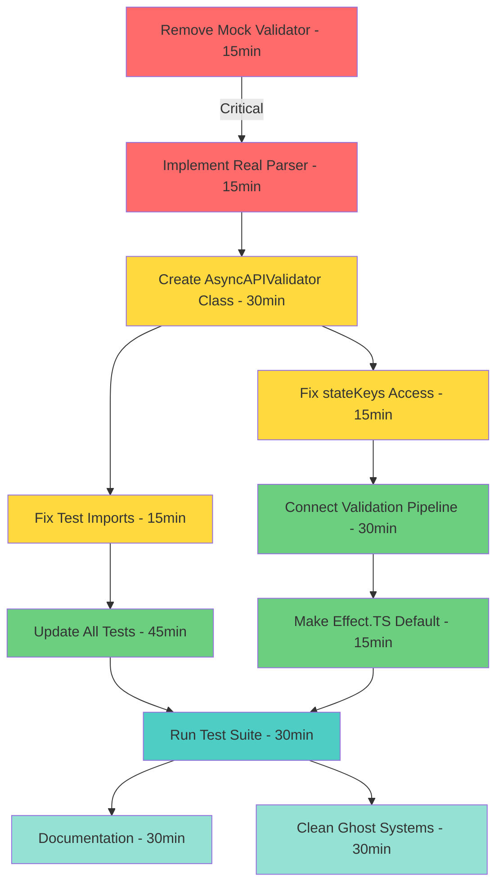

# TypeSpec AsyncAPI Emitter - Pareto Execution Plan

**Date:** 2025-08-30 22:44  
**Session:** PARETO_EXECUTION_PLAN  
**Objective:** Fix AsyncAPI validation and make the emitter production-ready

## Executive Summary

The TypeSpec AsyncAPI emitter currently generates specs but DOES NOT VALIDATE them. This plan follows the Pareto principle to deliver maximum value with minimum effort.

## Current State Analysis

### Critical Problems

1. **Mock Validator:** `asyncapi-validator.ts` has a mock implementation that always returns valid
2. **Missing Class:** Tests expect `AsyncAPIValidator` class that doesn't exist
3. **Broken Integration:** Effect.TS emitter exists but isn't properly connected
4. **Test Failures:** All validation tests fail due to missing imports
5. **No Real Validation:** Core emitter doesn't validate generated AsyncAPI specs

## Pareto Analysis

### 🔴 The 1% (51% Value) - CRITICAL FIX

**Single Task:** Replace mock validator with real @asyncapi/parser

- **Time:** 15 minutes
- **Impact:** Makes validation actually work
- **Value:** Users get validated AsyncAPI specs

### 🟡 The 4% (64% Value) - CORE FUNCTIONALITY

**Key Tasks:**

1. Create AsyncAPIValidator class (30 min)
2. Fix test imports (15 min)
3. Connect validation to emitter (30 min)

### 🟢 The 20% (80% Value) - FULL INTEGRATION

**Complete Tasks:**

1. Fix Effect.TS integration
2. Make validation default
3. Error handling
4. Test suite passing
5. Documentation

## Execution Graph

## Detailed Task Breakdown

### TIER 1: High-Level Tasks (30-100 min)

| Priority | Task                                                  | Impact | Duration | Dependencies      |
| -------- | ----------------------------------------------------- | ------ | -------- | ----------------- |
| P0       | Fix validation system - Replace mock with real parser | 10/10  | 60 min   | None              |
| P0       | Create AsyncAPIValidator class                        | 9/10   | 45 min   | None              |
| P1       | Fix Symbol/stateKeys access                           | 8/10   | 30 min   | None              |
| P1       | Integrate validation into pipeline                    | 9/10   | 75 min   | P0 tasks          |
| P1       | Update index.ts for Effect.TS default                 | 8/10   | 30 min   | stateKeys fix     |
| P2       | Fix all test imports                                  | 7/10   | 90 min   | AsyncAPIValidator |
| P2       | Update package.json exports                           | 6/10   | 15 min   | None              |
| P3       | Clean ghost systems                                   | 5/10   | 60 min   | All tests pass    |
| P3       | Add error handling                                    | 7/10   | 45 min   | Validation works  |
| P3       | Document the system                                   | 4/10   | 30 min   | Everything works  |

### TIER 2: Micro Tasks (12-15 min)

| #   | Task                                   | Parent | Duration | Status  |
| --- | -------------------------------------- | ------ | -------- | ------- |
| 1   | Remove mock from asyncapi-validator.ts | T1     | 12 min   | Pending |
| 2   | Import @asyncapi/parser                | T1     | 12 min   | Pending |
| 3   | Implement validateAsyncAPIString       | T1     | 15 min   | Pending |
| 4   | Implement validateAsyncAPIFile         | T1     | 15 min   | Pending |
| 5   | Create AsyncAPIValidator class         | T2     | 12 min   | Pending |
| 6   | Add initialize() method                | T2     | 12 min   | Pending |
| 7   | Add validate() method                  | T2     | 15 min   | Pending |
| 8   | Add validateFile() method              | T2     | 15 min   | Pending |
| 9   | Add getValidationStats()               | T2     | 12 min   | Pending |
| 10  | Fix stateKeys import                   | T3     | 12 min   | Pending |
| 11  | Test stateKeys access                  | T3     | 12 min   | Pending |
| 12  | Connect validateDocumentEffect         | T4     | 15 min   | Pending |
| 13  | Add Effect.TS error handling           | T4     | 15 min   | Pending |
| 14  | Update generateAsyncAPIWithEffect      | T4     | 15 min   | Pending |
| 15  | Fail on validation errors              | T4     | 15 min   | Pending |
| 16  | Change default to Effect.TS            | T5     | 12 min   | Pending |
| 17  | Update console messages                | T5     | 12 min   | Pending |
| 18  | Fix critical-validation.test.ts        | T6     | 15 min   | Pending |
| 19  | Fix automated-spec-validation.test.ts  | T6     | 15 min   | Pending |
| 20  | Update test helpers                    | T6     | 15 min   | Pending |

## Parallel Execution Groups

### Group 1: Core Validation (Critical Path)

- Remove mock validator
- Implement real parser
- Create AsyncAPIValidator class
- Fix validation functions

### Group 2: Integration & Testing

- Fix stateKeys access
- Connect validation pipeline
- Update all test imports
- Run test suite

### Group 3: Polish & Documentation

- Clean ghost systems
- Add error handling
- Write documentation
- Update README

## Success Criteria

✅ **Must Have (1% - Critical)**

- [ ] Real @asyncapi/parser replaces mock
- [ ] Validation actually validates

✅ **Should Have (4% - Core)**

- [ ] AsyncAPIValidator class exists
- [ ] Tests can import and use it
- [ ] Basic validation works

✅ **Nice to Have (20% - Complete)**

- [ ] Effect.TS integration complete
- [ ] All tests pass
- [ ] Documentation updated
- [ ] Ghost systems removed

## Risk Mitigation

| Risk                  | Mitigation                              |
| --------------------- | --------------------------------------- |
| Parser type issues    | Use any type if needed, add types later |
| Effect.TS complexity  | Keep simple validation path as fallback |
| Test failures cascade | Fix imports first, then functionality   |
| Breaking changes      | Keep legacy emitter as option           |

## Next Steps

1. **Immediate:** Fix mock validator (15 min)
2. **Next Hour:** Create AsyncAPIValidator class and fix imports
3. **Today:** Complete integration and get tests passing
4. **Tomorrow:** Polish, document, and optimize

## Notes

- Focus on WORKING validation over perfect code
- Use @asyncapi/parser directly, not asyncapi-validator (has issues)
- Keep Effect.TS optional until fully tested
- Preserve backward compatibility with legacy emitter

---

_Generated: 2025-08-30 22:44_  
_Objective: Make AsyncAPI validation actually work_  
_Method: Pareto principle - maximize value, minimize effort_
