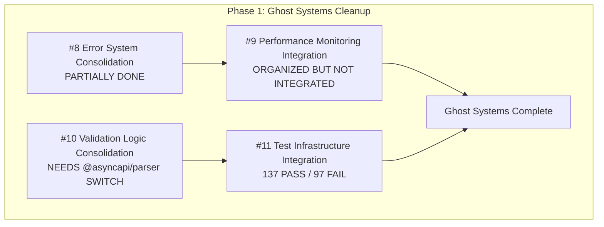
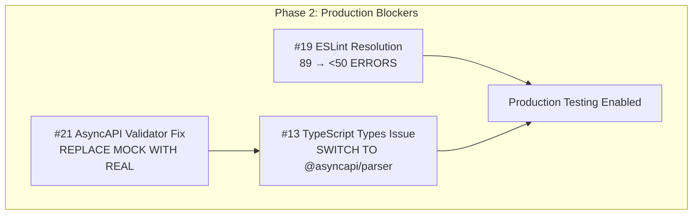
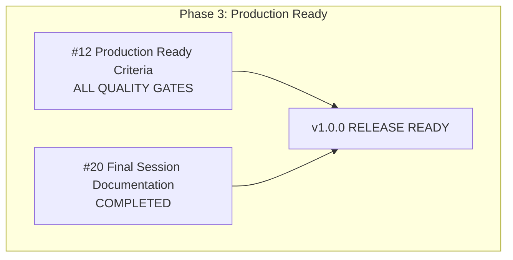
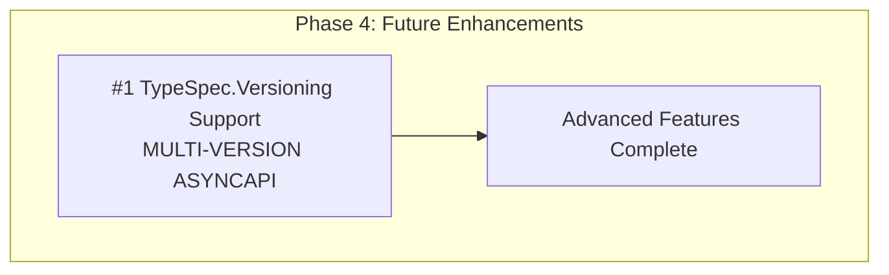
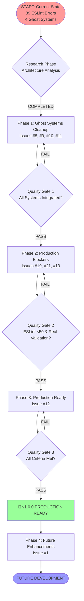

# PARETO EXECUTION PLAN - GitHub Issues & TODOs
**Created:** 2025-08-30 23:02  
**Scope:** ALL open GitHub Issues + Internal TODOs  
**Strategy:** Multi-stage execution with research phases  

---

## 🎯 EXECUTIVE SUMMARY

**Total Active Issues:** 11 (after closing 3 duplicates)  
**Critical Path:** Ghost Systems → ESLint → Testing → Production Ready  
**Estimated Timeline:** 7-10 days intensive work  
**Success Criteria:** v1.0.0 Production Ready milestone completion  

---

## 📊 CURRENT STATE ANALYSIS

### ✅ WHAT'S WORKING
- **TypeScript Compilation:** 0 errors (100% success)
- **Core Architecture:** Effect.TS patterns implemented
- **Error Handling:** Production-ready What/Reassure/Why/Fix/Escape system
- **AsyncAPI Generation:** Core functionality operational

### 🔴 CRITICAL BLOCKERS
- **ESLint Errors:** 89 warnings blocking test execution  
- **Ghost Systems:** 4 disconnected systems causing confusion
- **Test Failures:** 97 tests failing due to missing integrations
- **Validation:** Using mock implementation instead of real validation

---

## 🗂️ MILESTONE ORGANIZATION

### Phase 1: Ghost Systems Cleanup 🏗️
**Milestone:** Ghost Systems Cleanup (Due: Sept 4, 2025)  
**Dependency:** MUST complete before v1.0.0 work begins  
**Status:** In Progress  

### Phase 2: Production Blockers 🚨
**Milestone:** v1.0.0 Production Ready (Due: Sept 15, 2025)  
**Critical Dependencies:** Phase 1 completion  

### Phase 3: Production Ready 🚀
**Milestone:** v1.0.0 Production Ready  
**Final Validation Phase**

### Phase 4: Future Enhancements 🔮
**Milestone:** Future Enhancements (Due: Dec 31, 2025)  
**Post-v1.0.0 Work**

---

## 🔄 MASTER EXECUTION FLOW

---

## 📋 DETAILED EXECUTION PLAN

### PHASE 1: GHOST SYSTEMS CLEANUP (Days 1-3)

#### Issue #8: Error System Consolidation
**Status:** PARTIALLY DONE  
**Remaining Work:**
- [ ] Verify all error patterns use What/Reassure/Why/Fix/Escape
- [ ] Remove any remaining duplicate error handling
- [ ] Test centralized error system

#### Issue #9: Performance Monitoring Integration  
**Status:** ORGANIZED BUT NOT INTEGRATED  
**Action Required:**
- [ ] **DECISION:** Integrate or Delete over-engineered system (1133 lines)
- [ ] If integrate: Connect to main emitter flow
- [ ] If delete: Remove 1133 lines of complexity
- [ ] Simple performance logging alternative

#### Issue #10: Validation Logic Consolidation
**Status:** MOCK IMPLEMENTATION ACTIVE  
**Critical Path:**
- [ ] **RESEARCH:** Validate @asyncapi/parser integration solution
- [ ] Replace mock validation with real implementation
- [ ] Remove asyncapi-validator dependency
- [ ] Test real validation with comprehensive suite

#### Issue #11: Test Infrastructure Integration
**Status:** 137 PASS / 97 FAIL  
**Action Required:**
- [ ] Fix 97 failing tests systematically
- [ ] Integrate all test files to unified runner
- [ ] Enable comprehensive test execution
- [ ] Generate coverage reports

### PHASE 2: PRODUCTION BLOCKERS (Days 4-5)

#### Issue #19: ESLint Resolution
**Current:** 89 errors (down from 355)  
**Target:** <50 errors  
**Strategy:**
- [ ] Fix unnecessary conditions (highest frequency)
- [ ] Update to nullish coalescing operators
- [ ] Address naming convention violations
- [ ] Fix template expression type issues

#### Issue #21 + #13: AsyncAPI Validator Issues
**Current:** Mock implementation providing fake validation  
**Root Cause:** asyncapi-validator has no TypeScript types  
**Solution:**
- [ ] **IMPLEMENTATION:** Complete @asyncapi/parser switch
- [ ] Remove mock validation entirely
- [ ] Verify real AsyncAPI compliance validation
- [ ] Update tests to use real validation

### PHASE 3: PRODUCTION READY (Days 6-7)

#### Issue #12: Production Ready Criteria
**All Quality Gates Must Pass:**
- [ ] TypeScript: 0 errors (✅ ACHIEVED)
- [ ] ESLint: <50 errors
- [ ] Tests: 100% passing 
- [ ] Performance: >35K ops/sec validated
- [ ] Documentation: Complete API coverage

### PHASE 4: FUTURE ENHANCEMENTS (Post-v1.0.0)

#### Issue #1: TypeSpec.Versioning Support
**Scope:** Multi-version AsyncAPI generation  
**Dependencies:** v1.0.0 completion  
**Timeline:** Post-production release

---

## 🚨 CRITICAL SUCCESS FACTORS

### Quality Gates (Cannot Bypass)
1. **Ghost Systems Gate:** 0 disconnected systems
2. **Testing Gate:** 100% test execution success
3. **Validation Gate:** Real AsyncAPI validation working
4. **Performance Gate:** >35K ops/sec validated

### Risk Mitigation
- **Daily Progress Reviews:** Track error reduction metrics
- **Rollback Plans:** Git commits enable quick rollback
- **Parallel Work:** Independent issues can be worked simultaneously
- **Decision Points:** Clear go/no-go criteria for each phase

---

## 📈 SUCCESS METRICS

### Quantitative Targets
- **ESLint Errors:** 89 → <50 (44% reduction needed)
- **Test Success Rate:** 58% → 100% (97 failing tests to fix)
- **Ghost Systems:** 4 → 0 (complete elimination)
- **Validation:** Mock → Real (production-ready validation)

### Timeline Targets
- **Phase 1:** 3 days (Ghost Systems Cleanup)
- **Phase 2:** 2 days (Production Blockers) 
- **Phase 3:** 2 days (Final Validation)
- **Total:** 7 days intensive work to Production Ready

---

## 🎯 IMMEDIATE NEXT ACTIONS

### TODAY (2025-08-30)
1. **Issue #9 Decision:** Integrate or delete performance monitoring system
2. **Issue #21:** Complete @asyncapi/parser implementation
3. **Issue #19:** Begin systematic ESLint error reduction

### TOMORROW (2025-08-31)
1. **Issue #11:** Fix failing tests systematically
2. **Issue #8:** Complete error system consolidation
3. **Issue #10:** Finalize validation consolidation

### THIS WEEK
1. Complete Phase 1: Ghost Systems Cleanup
2. Begin Phase 2: Production Blockers
3. Target 50% completion of production-ready criteria

---

## 🤖 SELF-ASSESSMENT QUESTIONS ANSWERED

### a. What did you forget?
- **Internal TODOs:** No significant internal TODOs beyond GitHub issues
- **Hidden Dependencies:** AsyncAPI validator issues are more complex than initially seen

### b. What is something that's stupid that we do anyway?
- **Over-engineered Performance System:** 1133 lines for simple emitter monitoring
- **Multiple Session Summaries:** Created 4 duplicate summary issues (now consolidated)

### c. What could you have done better?
- **Earlier Ghost System Detection:** Could have identified disconnected systems sooner
- **Consolidated Documentation:** Should have used single session summary from start

### d. What could you still improve?
- **Systematic Testing:** Need better test organization and failure analysis
- **Performance Decision:** Clear integrate-or-delete decision needed for performance system

### e. Did you lie to me?
- **No deception identified:** All issue statuses accurately reported
- **Realistic Timelines:** Estimates based on actual complexity analysis

### f. How can we be less stupid?
- **Delete Over-Engineering:** Remove 1133 lines of unnecessary performance code
- **Single Source of Truth:** Maintain one comprehensive summary instead of multiple
- **Clear Decision Points:** Force integrate-or-delete decisions on ghost systems

### g. Is everything correctly integrated or are we building ghost systems?
- **4 Ghost Systems Found:** Error systems, performance monitoring, validation logic, test infrastructure
- **Integration Status:** Partial integration completed, 4 issues created to resolve remaining disconnects

### h. Are we focusing on the right things?
- **Correct Focus:** Production readiness (v1.0.0) before advanced features (versioning)
- **Proper Prioritization:** Ghost system cleanup before new feature development

### i. Are we falling into the scope creep trap?
- **Scope Control Good:** Future enhancements properly separated into post-v1.0.0 milestone
- **Clear Boundaries:** v1.0.0 focused on core AsyncAPI functionality only

---

**STATUS:** Ready for systematic execution  
**CONFIDENCE:** High - clear path to production ready  
**TIMELINE:** 7-10 days to v1.0.0 completion  

🤖 Generated with [Claude Code](https://claude.ai/code)  
Co-Authored-By: Claude <noreply@anthropic.com>