# TypeSpec AsyncAPI Project Planning - Final Session

**Date:** 2025-08-31 00:10 CEST  
**Session:** End-of-Day Comprehensive Planning

## Self-Reflection & Analysis

### a. What did we forget?

1. **Package.json is BROKEN** - Cannot publish to npm (#31)
2. **Test imports still broken** - Tests can't run properly (#27)
3. **TODOs in production code** - integration-example.ts has empty implementations
4. **No milestones/projects** - Issues not grouped strategically
5. **Documentation completely missing** - Zero README content, no examples

### b. What is stupid that we do anyway?

1. **Over-engineered performance monitoring** - 1100+ lines for text generation
2. **Mixed async paradigms** - Effect.TS + Promises everywhere
3. **432 console.logs** - Unprofessional logging strategy
4. **Multiple validation systems** - 3+ approaches for same thing
5. **Ghost systems** - Building features disconnected from main flow

### c. What could we have done better?

1. **Fix tests FIRST** - 97 failing tests = unknown risks
2. **Start with package.json** - Can't publish without it
3. **Choose ONE paradigm** - Effect OR Promise, not both
4. **Delete ghost code immediately** - Don't integrate what's not needed
5. **Focus on MVP** - Basic working emitter before advanced features

### d. What could we still improve?

1. **Split large files** - 1028-line types file is absurd
2. **Structured logging** - Replace all console.logs
3. **Domain-driven structure** - Organize by feature not file type
4. **Test coverage** - Currently unknown, probably <30%
5. **CI/CD pipeline** - No automation at all

### e. Did we lie?

- **"Performance monitoring integrated"** - It's there but adds no value
- **"Build working"** - Yes, but can't publish the package
- **"Tests executable"** - Only if you ignore the 97 failures

### f. How can we be less stupid?

1. **Delete before adding** - Remove complexity first
2. **Test-driven fixes** - Fix tests to reveal real issues
3. **MVP focus** - Working > Perfect
4. **One thing at a time** - Stop parallel ghost systems
5. **Measure what matters** - Not 35K ops/sec for text generation

### g. Ghost systems identified:

1. **Performance monitoring** - Integrated but over-engineered
2. **Protocol bindings** - Complex system barely used
3. **Integration-example.ts** - 667 lines of TODOs
4. **Multiple validation approaches** - Should be ONE

### h. Are we focusing on the right things?

**NO** - We integrated performance monitoring instead of:

- Fixing broken package.json
- Making tests pass
- Writing documentation
- Creating working examples

### i. Scope creep assessment:

**YES** - Major scope creep:

- Performance monitoring for text generation
- Complex protocol bindings for MVP
- Effect.TS everywhere when not needed
- Multiple validation systems

## Execution Plan - Mermaid Diagram

```mermaid
graph TD
    Start([Start: 13 Open Issues + 30 Internal TODOs])

    %% Phase 1: Critical Fixes (1% → 51% value)
    Start --> P1[Phase 1: Critical Foundation<br/>1% effort → 51% value]

    P1 --> I31[#31: Fix package.json<br/>CRITICAL: Can't publish]
    I31 --> I27[#27: Fix test imports<br/>Tests can't run]
    I27 --> TestRun[Internal: Run tests<br/>Identify failures]
    TestRun --> TODOFix[Internal: Fix TODOs in<br/>integration-example.ts]

    %% Phase 2: Core Stability (4% → 64% value)
    TODOFix --> P2[Phase 2: Core Stability<br/>4% effort → 64% value]

    P2 --> I11[#11: Fix orphaned tests<br/>Connect test infrastructure]
    I11 --> Coverage[Internal: Generate<br/>coverage report]
    Coverage --> I8[#8: Unify error handling<br/>Single system]
    I8 --> Validation[Internal: Consolidate<br/>validation pipeline]

    %% Phase 3: Code Quality (20% → 80% value)
    Validation --> P3[Phase 3: Code Quality<br/>20% effort → 80% value]

    P3 --> I25[#25: Split large files<br/>762-line options.ts]
    I25 --> I26[#26: Replace console.logs<br/>432 instances]
    I26 --> I15[#15: Delete ghost code<br/>If truly unused]
    I15 --> Paradigm[Internal: Choose Effect<br/>OR Promise]

    %% Phase 4: Production Ready
    Paradigm --> P4[Phase 4: Production Ready<br/>Remaining 80% effort]

    P4 --> I1[#1: Versioning support<br/>Multi-version API]
    I1 --> I30[#30: BDD/TDD tests<br/>Proper coverage]
    I30 --> Docs[Internal: Write README<br/>and examples]
    Docs --> I32[#32: Extract plugins<br/>Modular architecture]

    %% Phase 5: Release
    I32 --> P5[Phase 5: Release]
    P5 --> I12[#12: v1.0.0 Milestone<br/>Completion criteria]
    I12 --> CICD[Internal: Setup CI/CD]
    CICD --> Publish[bun publish<br/>v1.0.0-alpha]

    %% Decision Points
    I31 -.->|Blocks| Publish
    I27 -.->|Blocks| TestRun
    Coverage -.->|Reveals| I30

    %% Research Tasks
    I32 --> R1{Research: Plugin<br/>Architecture}
    I1 --> R2{Research: TypeSpec<br/>Versioning}

    %% Status Indicators
    classDef critical fill:#ff6b6b,stroke:#333,stroke-width:3px
    classDef high fill:#ffa500,stroke:#333,stroke-width:2px
    classDef medium fill:#87ceeb,stroke:#333,stroke-width:1px
    classDef complete fill:#90ee90,stroke:#333,stroke-width:1px
    classDef research fill:#dda0dd,stroke:#333,stroke-width:1px,stroke-dasharray: 5 5

    class I31,I27 critical
    class I11,I8,I25,I26,I15 high
    class I1,I30,I32,I12 medium
    class R1,R2 research
```

## Priority Execution Order

### 🔴 IMMEDIATE (Phase 1) - 1% Effort → 51% Value

1. **#31**: Fix package.json (30 min) - BLOCKS EVERYTHING
2. **#27**: Fix test imports (15 min)
3. **Internal**: Run tests, categorize failures (1 hr)
4. **Internal**: Implement TODOs in integration-example.ts (30 min)

### 🟠 HIGH (Phase 2) - 4% Effort → 64% Value

5. **#11**: Connect orphaned test infrastructure (2 hrs)
6. **Internal**: Generate test coverage report (30 min)
7. **#8**: Unify error handling system (2 hrs)
8. **Internal**: Consolidate validation pipeline (2 hrs)

### 🟡 MEDIUM (Phase 3) - 20% Effort → 80% Value

9. **#25**: Split large files (4 hrs)
10. **#26**: Replace 432 console.logs (2 hrs)
11. **#15**: Delete remaining ghost code (1 hr)
12. **Internal**: Choose single async paradigm (2 hrs)

### 🟢 ENHANCEMENT (Phase 4) - Remaining 80% Effort

13. **#1**: Add versioning support (8 hrs)
14. **#30**: Implement BDD/TDD tests (8 hrs)
15. **Internal**: Write documentation (4 hrs)
16. **#32**: Extract protocol bindings as plugins (6 hrs)

### ✅ RELEASE (Phase 5)

17. **#12**: Complete v1.0.0 milestone criteria
18. **Internal**: Setup CI/CD pipeline
19. **Internal**: Publish to npm

## Duplicates Identified & Closed

- **#29** → Duplicate of **#15** (Ghost code deletion)
- **#28** → Duplicate of **#25** (Large file splitting)

## Missing GitHub Issues to Create

1. **Paradigm Decision**: Choose Effect.TS OR Promises
2. **Test Coverage**: Achieve >80% coverage
3. **Documentation**: Complete README and examples
4. **CI/CD Pipeline**: GitHub Actions setup

## Success Metrics

- ✅ Package publishable to npm
- ✅ All tests passing (>95% pass rate)
- ✅ Test coverage >80%
- ✅ Zero console.logs in production
- ✅ All files <500 lines
- ✅ Single validation system
- ✅ Complete documentation

## Time Estimates

- **Phase 1**: 2.5 hours (Critical)
- **Phase 2**: 6.5 hours (High)
- **Phase 3**: 9 hours (Medium)
- **Phase 4**: 26 hours (Enhancement)
- **Phase 5**: 4 hours (Release)
- **TOTAL**: ~48 hours to v1.0.0

## Key Decisions Needed

1. **Performance Monitoring**: Keep or delete? (1100+ lines)
2. **Async Paradigm**: Effect.TS everywhere OR mixed with Promises?
3. **Protocol Bindings**: Built-in OR plugin architecture?
4. **Test Framework**: Bun test OR Vitest?

## Conclusion

The project has solid foundations but suffers from:

- Scope creep (performance monitoring, complex bindings)
- Technical indecision (Effect vs Promise)
- Basic issues ignored (package.json, tests)
- Over-engineering (NASA monitoring for text generation)

**Recommendation**: Focus on Phase 1 & 2 to get a working, publishable package. Then evaluate if Phase 3 & 4 features are actually needed based on user feedback.
