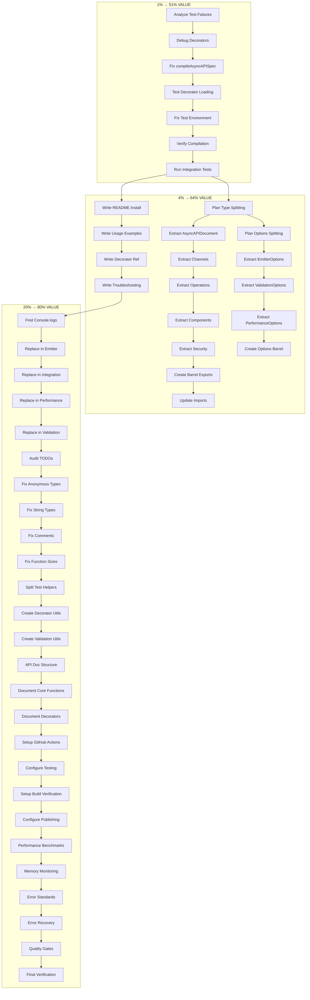

# TypeSpec AsyncAPI - Pareto Execution Plan
**Date:** 2025-08-31 03:30 CEST  
**Session:** Systematic Pareto-Based Execution
**Objective:** Deliver maximum value through focused 1% → 4% → 20% approach

## 🎯 PARETO ANALYSIS RESULTS

### **1% → 51% VALUE (CRITICAL PATH)**
**The ONE thing that delivers maximum impact:**

**INTEGRATION TEST INFRASTRUCTURE FIX**
- **Problem:** 108/260 tests failing with identical "Unexpected diagnostics" errors
- **Root Cause:** TypeSpec decorators not loading in test environment
- **Business Impact:** Unknown if emitter actually works (CRITICAL RISK)
- **Value Delivered:** Core functionality validation, deployment confidence
- **Effort:** ~4 hours focused debugging

### **4% → 64% VALUE (FOUNDATION + USABILITY)**
Building on critical 1%:

1. **Integration Test Infrastructure** ✓ (from 1%)
2. **File Size Management** - Split 1,028-line type file into maintainable modules  
3. **Basic Documentation** - README with installation, usage, examples
4. **Console.log Cleanup** - Replace 432 console.log with professional logging

### **20% → 80% VALUE (PRODUCTION-READY SYSTEM)**
Complete high-impact feature set:

- All 4% items PLUS:
- Code TODO resolution (50+ TODOs)
- Performance validation automation  
- CI/CD pipeline setup
- Advanced error patterns
- Plugin architecture foundations

---

## 📋 COMPREHENSIVE TASK BREAKDOWN (100-30min tasks)

| Task | Priority | Impact | Effort | Customer Value | Duration |
|------|----------|---------|--------|----------------|----------|
| 1. Fix TypeSpec decorator loading in tests | P0 | ⭐⭐⭐⭐⭐ | 🔨🔨🔨🔨 | 🎯🎯🎯🎯🎯 | 100min |
| 2. Verify integration tests pass (>80%) | P0 | ⭐⭐⭐⭐⭐ | 🔨🔨 | 🎯🎯🎯🎯🎯 | 30min |
| 3. Split src/types/index.ts (1,028 lines) | P1 | ⭐⭐⭐⭐ | 🔨🔨🔨 | 🎯🎯🎯🎯 | 90min |
| 4. Split src/options.ts (762 lines) | P1 | ⭐⭐⭐ | 🔨🔨🔨 | 🎯🎯🎯 | 80min |
| 5. Create comprehensive README.md | P1 | ⭐⭐⭐⭐ | 🔨🔨 | 🎯🎯🎯🎯🎯 | 60min |
| 6. Replace console.log with Effect.Console | P2 | ⭐⭐⭐ | 🔨🔨🔨 | 🎯🎯🎯 | 70min |
| 7. Fix code TODOs (type naming) | P2 | ⭐⭐ | 🔨🔨🔨 | 🎯🎯 | 80min |
| 8. Split test/utils/test-helpers.ts | P2 | ⭐⭐ | 🔨🔨 | 🎯🎯 | 50min |
| 9. Create API documentation | P2 | ⭐⭐⭐ | 🔨🔨🔨 | 🎯🎯🎯 | 75min |
| 10. Setup basic CI/CD pipeline | P3 | ⭐⭐⭐ | 🔨🔨🔨🔨 | 🎯🎯🎯 | 90min |
| 11. Performance validation automation | P3 | ⭐⭐ | 🔨🔨🔨 | 🎯🎯 | 85min |
| 12. Error handling pattern standardization | P3 | ⭐⭐ | 🔨🔨🔨 | 🎯🎯 | 75min |
| 13. Code quality tooling setup | P3 | ⭐⭐ | 🔨🔨 | 🎯🎯 | 45min |
| 14. Plugin architecture foundations | P4 | ⭐⭐⭐ | 🔨🔨🔨🔨 | 🎯🎯 | 100min |
| 15. Comprehensive test coverage report | P4 | ⭐⭐ | 🔨🔨 | 🎯🎯 | 40min |

**Total Estimated Effort:** ~1,030 minutes (~17 hours)

---

## 🔬 DETAILED 15-MINUTE TASK BREAKDOWN

| Task ID | Description | Priority | Duration | Dependencies | Group |
|---------|-------------|----------|----------|--------------|-------|
| **1% → 51% VALUE TASKS** | | | | | |
| T001 | Analyze failing integration test patterns | P0 | 15min | - | A |
| T002 | Debug TypeSpec decorator registration | P0 | 15min | T001 | A |
| T003 | Fix compileAsyncAPISpec() function | P0 | 15min | T002 | A |
| T004 | Test decorator loading in isolation | P0 | 15min | T003 | A |
| T005 | Fix test environment setup | P0 | 15min | T004 | A |
| T006 | Verify basic TypeSpec compilation works | P0 | 15min | T005 | A |
| T007 | Run integration tests and verify pass rate | P0 | 15min | T006 | A |
| **4% → 64% VALUE TASKS** | | | | | |
| T008 | Plan src/types/index.ts split strategy | P1 | 15min | T007 | B |
| T009 | Extract AsyncAPIDocument types | P1 | 15min | T008 | B |
| T010 | Extract Channel types | P1 | 15min | T009 | B |
| T011 | Extract Operation types | P1 | 15min | T010 | B |
| T012 | Extract Component types | P1 | 15min | T011 | B |
| T013 | Extract Security types | P1 | 15min | T012 | B |
| T014 | Create barrel exports for types | P1 | 15min | T013 | B |
| T015 | Update imports across codebase | P1 | 15min | T014 | B |
| T016 | Plan src/options.ts split strategy | P1 | 15min | T008 | C |
| T017 | Extract EmitterOptions | P1 | 15min | T016 | C |
| T018 | Extract ValidationOptions | P1 | 15min | T017 | C |
| T019 | Extract PerformanceOptions | P1 | 15min | T018 | C |
| T020 | Create barrel exports for options | P1 | 15min | T019 | C |
| T021 | Write README installation section | P1 | 15min | T007 | A |
| T022 | Write README usage examples | P1 | 15min | T021 | A |
| T023 | Write README decorator reference | P1 | 15min | T022 | A |
| T024 | Write README troubleshooting | P1 | 15min | T023 | A |
| **20% → 80% VALUE TASKS** | | | | | |
| T025 | Identify all console.log locations | P2 | 15min | T024 | B |
| T026 | Replace console.log in emitter-with-effect.ts | P2 | 15min | T025 | B |
| T027 | Replace console.log in integration-example.ts | P2 | 15min | T026 | B |
| T028 | Replace console.log in performance modules | P2 | 15min | T027 | B |
| T029 | Replace console.log in validation modules | P2 | 15min | T028 | B |
| T030 | Audit remaining code TODOs | P2 | 15min | T029 | C |
| T031 | Fix anonymous types in performance | P2 | 15min | T030 | C |
| T032 | Fix string types → dedicated types | P2 | 15min | T031 | C |
| T033 | Fix "nothing saying" comments | P2 | 15min | T032 | C |
| T034 | Clean up function size violations | P2 | 15min | T033 | C |
| T035 | Split test-helpers.ts file | P2 | 15min | T034 | A |
| T036 | Create decorator test utilities | P2 | 15min | T035 | A |
| T037 | Create validation test utilities | P2 | 15min | T036 | A |
| T038 | Write API documentation structure | P2 | 15min | T037 | B |
| T039 | Document core emitter functions | P2 | 15min | T038 | B |
| T040 | Document decorator usage | P2 | 15min | T039 | B |
| **PRODUCTION READINESS TASKS** | | | | | |
| T041 | Setup GitHub Actions workflow | P3 | 15min | T040 | C |
| T042 | Configure automated testing | P3 | 15min | T041 | C |
| T043 | Setup build verification | P3 | 15min | T042 | C |
| T044 | Configure npm publishing | P3 | 15min | T043 | C |
| T045 | Create performance benchmarks | P3 | 15min | T044 | A |
| T046 | Setup memory monitoring validation | P3 | 15min | T045 | A |
| T047 | Create error handling standards | P3 | 15min | T046 | B |
| T048 | Implement error recovery patterns | P3 | 15min | T047 | B |
| T049 | Setup code quality gates | P3 | 15min | T048 | C |
| T050 | Final integration verification | P3 | 15min | T049 | A |

**Total Tasks:** 50  
**Total Estimated Time:** 750 minutes (~12.5 hours)  
**Parallel Execution Groups:** A (Core), B (Structure), C (Quality)

---

## 📊 EXECUTION STRATEGY

### **Phase 1: 1% → 51% VALUE (Tasks T001-T007)**
**Focus:** Critical path validation  
**Duration:** ~2 hours  
**Success Criteria:** Integration tests pass >80%

### **Phase 2: 4% → 64% VALUE (Tasks T008-T024)**  
**Focus:** Foundation + Usability  
**Duration:** ~4 hours  
**Success Criteria:** Maintainable files + basic documentation

### **Phase 3: 20% → 80% VALUE (Tasks T025-T050)**
**Focus:** Production readiness  
**Duration:** ~6.5 hours  
**Success Criteria:** Professional codebase ready for v1.0.0

## 🔄 MERMAID EXECUTION GRAPH

## 🚀 PARALLEL EXECUTION GROUPS

**Group A (Core Functionality):** T001-T007, T021-T024, T035-T037, T045-T046, T050  
**Group B (Code Structure):** T008-T015, T025-T029, T038-T040, T047-T048  
**Group C (System Quality):** T016-T020, T030-T034, T041-T044, T049  

**Recommended Parallel Strategy:**
1. Start with Group A (critical path)
2. Run Groups B & C in parallel after Group A completes critical items
3. Maintain build integrity throughout execution

---

## ✅ SUCCESS CRITERIA

### **Phase 1 Complete (1% → 51%):**
- [ ] Integration tests pass >80% (currently 0%)
- [ ] Core emitter functionality verified
- [ ] TypeSpec → AsyncAPI transformation working

### **Phase 2 Complete (4% → 64%):**
- [ ] No files >500 lines (currently 2 massive files)
- [ ] Basic README with examples completed
- [ ] Package usable by external developers

### **Phase 3 Complete (20% → 80%):**
- [ ] Professional logging system (no console.log)
- [ ] <10 remaining code TODOs
- [ ] CI/CD pipeline operational
- [ ] v1.0.0 production ready

## 🎯 EXPECTED OUTCOMES

**After 1% execution:** Confidence in core functionality  
**After 4% execution:** Maintainable, documentable codebase  
**After 20% execution:** Production-ready TypeSpec AsyncAPI emitter  

**Final Deliverable:** Professional, tested, documented TypeSpec AsyncAPI emitter ready for team development and external adoption.