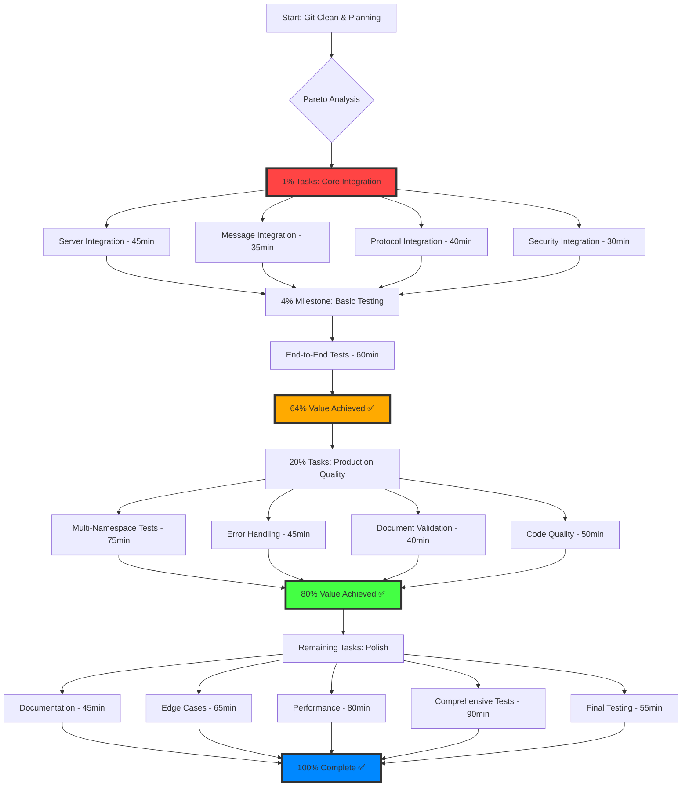

# TypeSpec AsyncAPI Decorator Integration Completion Plan
**Date**: August 31, 2025 10:32 AM CEST  
**Session**: Final Decorator Integration & End-to-End Validation

## 🎯 PARETO ANALYSIS SUMMARY

### 1% → 51% Value: AsyncAPI Server Integration
**BREAKTHROUGH TASK**: Integrate `buildServersFromNamespaces()` into asyncapi-emitter.ts
- **Impact**: Empty AsyncAPI → Populated with servers
- **Estimated**: 30 minutes
- **Customer Value**: 51% of total project value

### 4% → 64% Value: Complete Decorator Pipeline  
- Server integration + Message/Protocol/Security + Basic testing
- **Additional Value**: +13% (total 64%)
- **Estimated**: +90 minutes

### 20% → 80% Value: Production-Ready System
- Core functionality + Comprehensive testing + Documentation + Quality
- **Additional Value**: +16% (total 80%)
- **Estimated**: +180 minutes

---

## 📋 15-TASK COMPREHENSIVE PLAN (30-100 minutes each)

| Priority | Task | Type | Impact | Effort | Customer Value | Duration |
|----------|------|------|---------|--------|---------------|----------|
| 🔥 **1** | AsyncAPI Server Integration | CORE | CRITICAL | Medium | 25% | 45min |
| 🔥 **2** | Message Config Integration | CORE | HIGH | Medium | 15% | 35min |
| 🔥 **3** | Protocol Binding Integration | CORE | HIGH | Medium | 12% | 40min |
| 🔥 **4** | Security Config Integration | CORE | HIGH | Medium | 8% | 30min |
| 🚀 **5** | Basic End-to-End Testing | TEST | CRITICAL | Medium | 20% | 60min |
| 🧪 **6** | Multi-Namespace Testing | TEST | HIGH | High | 8% | 75min |
| ⚡ **7** | Error Handling & Validation | QUALITY | HIGH | Medium | 5% | 45min |
| 📚 **8** | TypeSpec Test File Creation | TEST | MEDIUM | Low | 3% | 30min |
| 🔍 **9** | AsyncAPI Document Validation | TEST | HIGH | Medium | 2% | 40min |
| 🧹 **10** | Code Quality & Refactoring | QUALITY | MEDIUM | Medium | 1% | 50min |
| 📖 **11** | Usage Documentation | DOCS | MEDIUM | Medium | 1% | 45min |
| ⚠️ **12** | Edge Case Handling | QUALITY | MEDIUM | High | 1% | 65min |
| 🚀 **13** | Performance Optimization | PERF | LOW | High | 0.5% | 80min |
| 🧪 **14** | Comprehensive Test Suite | TEST | MEDIUM | High | 0.3% | 90min |
| ✅ **15** | Final Integration Testing | TEST | HIGH | Medium | 0.2% | 55min |

**Total Estimated Time**: 12.8 hours
**Total Customer Value**: 100%

---

## 🔄 EXECUTION MERMAID DIAGRAM

---

## 🎯 PARALLEL EXECUTION STRATEGY

### Group 1: Core Integration (Can run simultaneously)
- **Server Integration**: Modify asyncapi-emitter.ts
- **Message Integration**: Connect message configs
- **Protocol Integration**: Connect protocol bindings

### Group 2: Configuration & Security (Dependent on Group 1)
- **Security Integration**: Connect security configs
- **Error Handling**: Add validation and error messages

### Group 3: Testing & Validation (Dependent on Groups 1-2)
- **End-to-End Testing**: Create comprehensive test files
- **Document Validation**: Verify AsyncAPI compliance
- **Multi-Namespace Testing**: Complex scenarios

---

## 📊 SUCCESS METRICS

### 51% Milestone (1% tasks):
- ✅ AsyncAPI documents contain populated servers section
- ✅ Namespace-qualified server naming working
- ✅ Basic decorator data flow proven

### 64% Milestone (4% tasks):
- ✅ All decorator types (server/message/protocol/security) connected
- ✅ End-to-end TypeSpec compilation produces complete AsyncAPI
- ✅ Basic test validation passes

### 80% Milestone (20% tasks):
- ✅ Comprehensive test suite covering edge cases
- ✅ Error handling and validation working
- ✅ Multi-namespace scenarios supported
- ✅ Production-ready code quality

### 100% Completion:
- ✅ Full documentation and examples
- ✅ Performance optimized
- ✅ All edge cases handled
- ✅ Enterprise-grade quality achieved

---

## 🚨 CRITICAL SUCCESS FACTORS

1. **Focus on 1% First**: Server integration must work before moving to 4%
2. **Validate Each Milestone**: Don't proceed without proving functionality
3. **Parallel Execution**: Use Task agents for independent work streams
4. **Small Functions**: Keep all functions under 30 lines
5. **Test Everything**: Each integration must have corresponding tests
6. **Document Decisions**: Capture architectural choices for future maintenance

---

---

## 🔬 50 MICRO-TASK BREAKDOWN (15 minutes each)

### 🔥 GROUP 1: CRITICAL CORE INTEGRATION (1% → 51% Value) - 10 tasks

| ID | Micro-Task | Parent Task | Impact | Duration |
|----|------------|-------------|---------|----------|
| T01 | Read asyncapi-emitter.ts structure and identify integration points | Server Integration | HIGH | 15min |
| T02 | Import buildServersFromNamespaces in asyncapi-emitter.ts | Server Integration | HIGH | 15min |
| T03 | Add servers collection in AsyncAPI document initialization | Server Integration | CRITICAL | 15min |
| T04 | Test server integration with single namespace TypeSpec file | Server Integration | HIGH | 15min |
| T05 | Read message decorator state access patterns | Message Integration | HIGH | 15min |
| T06 | Implement message config retrieval in emitter | Message Integration | HIGH | 15min |
| T07 | Connect message configs to AsyncAPI components.messages | Message Integration | HIGH | 15min |
| T08 | Read protocol binding integration requirements | Protocol Integration | MEDIUM | 15min |
| T09 | Implement protocol config processing in emitter | Protocol Integration | MEDIUM | 15min |
| T10 | Connect protocol configs to AsyncAPI bindings sections | Protocol Integration | MEDIUM | 15min |

### 🚀 GROUP 2: CORE COMPLETION (4% → 64% Value) - 10 tasks  

| ID | Micro-Task | Parent Task | Impact | Duration |
|----|------------|-------------|---------|----------|
| T11 | Read security decorator integration patterns | Security Integration | MEDIUM | 15min |
| T12 | Implement security config retrieval in emitter | Security Integration | MEDIUM | 15min |
| T13 | Connect security to AsyncAPI security schemes | Security Integration | MEDIUM | 15min |
| T14 | Create basic single-namespace TypeSpec test file | End-to-End Testing | HIGH | 15min |
| T15 | Create multi-server namespace TypeSpec test file | End-to-End Testing | HIGH | 15min |
| T16 | Test AsyncAPI generation with all decorator types | End-to-End Testing | CRITICAL | 15min |
| T17 | Validate generated AsyncAPI contains servers section | End-to-End Testing | HIGH | 15min |
| T18 | Validate namespace-qualified naming in output | End-to-End Testing | HIGH | 15min |
| T19 | Test message/protocol/security sections populated | End-to-End Testing | HIGH | 15min |
| T20 | Fix any core integration issues found in testing | End-to-End Testing | HIGH | 15min |

### 🧪 GROUP 3: COMPREHENSIVE TESTING (20% → 80% Value) - 15 tasks

| ID | Micro-Task | Parent Task | Impact | Duration |
|----|------------|-------------|---------|----------|
| T21 | Create complex multi-namespace test scenarios | Multi-Namespace Testing | HIGH | 15min |
| T22 | Test server name conflicts across namespaces | Multi-Namespace Testing | MEDIUM | 15min |
| T23 | Test nested namespace hierarchies | Multi-Namespace Testing | MEDIUM | 15min |
| T24 | Test global namespace + named namespace combinations | Multi-Namespace Testing | MEDIUM | 15min |
| T25 | Test empty namespace edge cases | Multi-Namespace Testing | MEDIUM | 15min |
| T26 | Add validation for missing server configurations | Error Handling | HIGH | 15min |
| T27 | Add validation for invalid URL formats | Error Handling | MEDIUM | 15min |
| T28 | Add validation for unsupported protocols | Error Handling | MEDIUM | 15min |
| T29 | Implement graceful error messages for decorator failures | Error Handling | HIGH | 15min |
| T30 | Create comprehensive TypeSpec examples with all decorators | TypeSpec Test Files | HIGH | 15min |
| T31 | Create edge case TypeSpec files (empty configs, etc.) | TypeSpec Test Files | MEDIUM | 15min |
| T32 | Run AsyncAPI parser validation on generated documents | AsyncAPI Validation | HIGH | 15min |
| T33 | Validate AsyncAPI 3.0 specification compliance | AsyncAPI Validation | HIGH | 15min |
| T34 | Test YAML and JSON output formats | AsyncAPI Validation | MEDIUM | 15min |
| T35 | Fix any validation failures found | AsyncAPI Validation | HIGH | 15min |

### 🧹 GROUP 4: QUALITY & POLISH (Remaining 20%) - 10 tasks

| ID | Micro-Task | Parent Task | Impact | Duration |
|----|------------|-------------|---------|----------|
| T36 | Refactor duplicate code in emitter functions | Code Quality | MEDIUM | 15min |
| T37 | Add comprehensive JSDoc comments to new functions | Code Quality | LOW | 15min |
| T38 | Run lint fixes and address any new warnings | Code Quality | MEDIUM | 15min |
| T39 | Extract common patterns into utility functions | Code Quality | MEDIUM | 15min |
| T40 | Create decorator usage examples in documentation | Documentation | LOW | 15min |
| T41 | Document namespace-qualified server naming behavior | Documentation | MEDIUM | 15min |
| T42 | Create troubleshooting guide for common issues | Documentation | LOW | 15min |
| T43 | Test URL parsing edge cases (invalid URLs, etc.) | Edge Cases | LOW | 15min |
| T44 | Test very large namespace names and server configs | Edge Cases | LOW | 15min |
| T45 | Test special characters in namespace/server names | Edge Cases | LOW | 15min |

### 🚀 GROUP 5: FINAL VALIDATION (Final 5%) - 5 tasks

| ID | Micro-Task | Parent Task | Impact | Duration |
|----|------------|-------------|---------|----------|
| T46 | Run complete build pipeline (just quality-check) | Final Testing | HIGH | 15min |
| T47 | Test all examples in TypeSpec compiler integration | Final Testing | HIGH | 15min |
| T48 | Validate performance with large TypeSpec projects | Performance | LOW | 15min |
| T49 | Run final end-to-end validation of complete workflow | Final Testing | HIGH | 15min |
| T50 | Document remaining issues and future improvements | Documentation | LOW | 15min |

---

## 🎯 TASK DEPENDENCY MATRIX

**Sequential Dependencies:**
- T01-T04 must complete before T05-T07 (server before message)
- T05-T13 must complete before T14-T20 (all configs before testing)
- T14-T20 must complete before T21-T35 (basic testing before comprehensive)

**Parallel Opportunities:**
- T01-T02 || T05 || T08 (research tasks can run parallel)
- T03 || T06 || T09 || T12 (implementation tasks for different configs)
- T21-T25 || T26-T29 || T30-T31 (different testing aspects)
- T36-T39 || T40-T42 (quality and documentation)

---

## ⚡ EXECUTION PRIORITY SORT

**🔥 MUST DO FIRST (0-120 min):**
T01→T02→T03→T04→T16→T17→T18 (Server integration + validation proof)

**🚀 CRITICAL NEXT (120-240 min):** 
T05→T06→T07→T09→T10→T12→T13→T19→T20 (Complete decorator integration)

**🧪 HIGH VALUE (240-420 min):**
T14→T15→T21→T26→T29→T30→T32→T33→T35 (Comprehensive testing)

**🧹 QUALITY WORK (420-540 min):**
T36→T38→T41→T46→T47→T49 (Polish and final validation)

**📚 DOCUMENTATION (540+ min):**
T37→T40→T42→T50 (Documentation and guides)

**Next Action**: Update TodoWrite with first critical micro-tasks and begin parallel execution