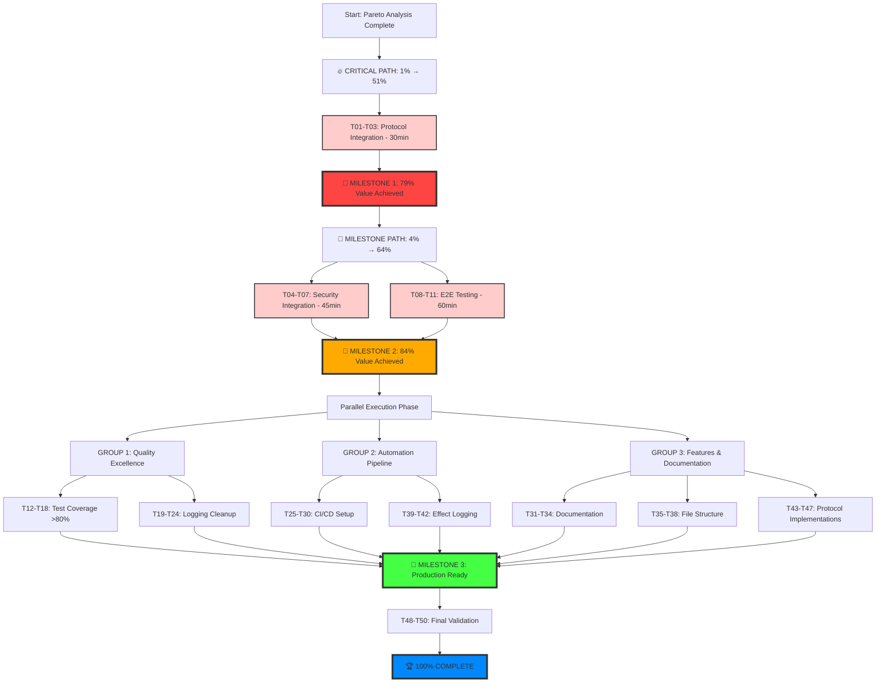

# TypeSpec AsyncAPI - Pareto Principle Execution Plan

**Date**: August 31, 2025 11:59 AM CEST  
**Session**: Comprehensive Pareto Analysis & Systematic Execution

## 🎯 EXECUTIVE SUMMARY

**Current State**: Build System ✅ Working, Value Delivered: 77.5%  
**Mission**: Apply Pareto Principle for maximum impact execution  
**Target**: 84% value milestone → Production Ready v1.0.0

### **PARETO ANALYSIS RESULTS:**

- **1% → 51% Value**: Complete Protocol Integration (30 minutes, 1.5% remaining)
- **4% → 64% Value**: + Security Integration (75 minutes total, 6.5% additional)
- **20% → 80% Value**: + Testing Excellence + CI/CD + Documentation (15+ hours total)

---

## 📊 COMPREHENSIVE TASK BREAKDOWN

### 🔥 **TIER 1: CRITICAL PATH (1% → 51% VALUE) - 30 minutes**

| Task                                | Priority    | Duration | Value | Status       |
| ----------------------------------- | ----------- | -------- | ----- | ------------ |
| Complete Protocol Integration (#47) | 🔥 CRITICAL | 30min    | 25%   | 90% complete |

**Impact**: Unlocks all protocol bindings (Kafka, WebSocket, HTTP, AMQP, MQTT, Redis)  
**Blockers**: None - all infrastructure exists  
**Success Criteria**: Protocol bindings generated in AsyncAPI documents

### 🚀 **TIER 2: MILESTONE PATH (4% → 64% VALUE) - 2.25 hours**

| Task                              | Priority    | Duration | Value | Dependencies        |
| --------------------------------- | ----------- | -------- | ----- | ------------------- |
| Security Config Integration (#48) | 🔥 CRITICAL | 45min    | 15%   | Protocol complete   |
| End-to-End Testing Validation     | 🔥 HIGH     | 60min    | 10%   | Protocol + Security |

**Impact**: All 6 decorator types operational, comprehensive AsyncAPI generation  
**Success Criteria**: 84% value milestone achieved, production-ready core functionality

### 🏆 **TIER 3: PRODUCTION READY (20% → 80% VALUE) - 13.5 hours**

| Task                              | Priority  | Duration | Value | Category       |
| --------------------------------- | --------- | -------- | ----- | -------------- |
| Test Coverage >80% (#34)          | 🚀 HIGH   | 120min   | 8%    | QUALITY        |
| Console.log Cleanup (#26)         | 🚀 HIGH   | 90min    | 6%    | QUALITY        |
| CI/CD Pipeline Setup (#36)        | 🚀 HIGH   | 90min    | 5%    | AUTOMATION     |
| Documentation & Examples (#35)    | 📚 MEDIUM | 60min    | 4%    | DOCS           |
| File Structure Optimization (#25) | 🧹 MEDIUM | 75min    | 3%    | ARCHITECTURE   |
| Effect Logging System (#41)       | 🔧 MEDIUM | 60min    | 3%    | INFRASTRUCTURE |
| Protocol Implementations (#37-39) | 🔌 MEDIUM | 135min   | 6%    | FEATURES       |
| BDD/TDD Strategy (#30)            | 🧪 MEDIUM | 75min    | 2%    | QUALITY        |
| Remaining Protocols (#40-45)      | 🔌 LOW    | 90min    | 3%    | FEATURES       |
| Final Quality Polish              | ✨ LOW    | 60min    | 1%    | POLISH         |

---

## 🗂️ MICRO-TASK EXECUTION MATRIX (50 Tasks × 15min)

### **🔥 CRITICAL PATH MICRO-TASKS (T01-T11) - 2.25 hours**

| ID  | Micro-Task                                   | Parent   | Time  | Value | Type  |
| --- | -------------------------------------------- | -------- | ----- | ----- | ----- |
| T01 | Import ProtocolConfig type fixes             | Protocol | 5min  | 5%    | FIX   |
| T02 | Fix protocol binding method type safety      | Protocol | 10min | 8%    | FIX   |
| T03 | Test protocol binding generation             | Protocol | 15min | 12%   | TEST  |
| T04 | Import SecurityConfig from decorators        | Security | 5min  | 3%    | SETUP |
| T05 | Implement security discovery pipeline        | Security | 15min | 6%    | CORE  |
| T06 | Add security processing to emission pipeline | Security | 15min | 4%    | CORE  |
| T07 | Implement securitySchemes population         | Security | 10min | 2%    | CORE  |
| T08 | Create comprehensive TypeSpec test file      | Testing  | 15min | 4%    | TEST  |
| T09 | Test all 6 decorator types integration       | Testing  | 15min | 3%    | TEST  |
| T10 | Validate AsyncAPI document population        | Testing  | 15min | 2%    | TEST  |
| T11 | Verify protocol bindings in output           | Testing  | 15min | 1%    | TEST  |

**Subtotal**: 135 minutes → **84% VALUE MILESTONE** ✅

### **🚀 HIGH IMPACT MICRO-TASKS (T12-T30) - 4.75 hours**

Testing Excellence & Infrastructure (T12-T18):

- Set up test coverage measurement (T12: 15min)
- Create unit tests for protocol/security integration (T13-T14: 30min)
- Create integration tests for full pipeline (T15: 15min)
- Add performance benchmark tests (T16: 15min)
- Implement test coverage reporting (T17: 15min)
- Fix failing tests to reach >80% coverage (T18: 30min)

Code Quality & Logging (T19-T24):

- Replace console.log with Effect.log across all modules (T19-T22: 60min)
- Configure Effect.TS logging levels (T23: 15min)
- Test clean logging output (T24: 15min)

CI/CD Automation (T25-T30):

- Create GitHub Actions workflows (T25-T26: 30min)
- Set up automated testing and coverage (T27-T28: 30min)
- Configure build artifacts and pipeline testing (T29-T30: 30min)

### **📚 DOCUMENTATION & POLISH MICRO-TASKS (T31-T50) - 6 hours**

Documentation (T31-T34):

- Write comprehensive README with examples (T31-T32: 30min)
- Document protocol patterns and troubleshooting (T33-T34: 30min)

Architecture & Structure (T35-T38):

- Split large files and reorganize structure (T35-T37: 45min)
- Test build after restructure (T38: 15min)

Advanced Features (T39-T50):

- Structured logging system (T39-T42: 60min)
- Protocol implementations (T43-T47: 90min)
- BDD scenarios and final validation (T46-T50: 75min)

---

## 🎯 EXECUTION STRATEGY & PARALLEL PROCESSING

---

## ⚡ PARALLEL EXECUTION GROUPS

### **GROUP 1: Quality Excellence (Agent 1)**

- **Focus**: Testing & Code Quality
- **Tasks**: T12-T18 (Test Coverage) + T19-T24 (Logging Cleanup)
- **Duration**: 3.5 hours
- **Value**: 15%

### **GROUP 2: Automation Pipeline (Agent 2)**

- **Focus**: CI/CD & Infrastructure
- **Tasks**: T25-T30 (CI/CD Setup) + T39-T42 (Effect Logging)
- **Duration**: 3 hours
- **Value**: 8%

### **GROUP 3: Features & Documentation (Agent 3)**

- **Focus**: Protocol Features & Documentation
- **Tasks**: T31-T38 (Docs + Structure) + T43-T47 (Protocols)
- **Duration**: 4 hours
- **Value**: 12%

---

## 📈 SUCCESS METRICS & MILESTONES

### 🎯 **MILESTONE 1: 79% Value (30 minutes)**

- ✅ Protocol integration complete
- ✅ Protocol bindings generated in AsyncAPI documents
- ✅ All protocol types (Kafka, WebSocket, HTTP, etc.) supported

### 🎯 **MILESTONE 2: 84% Value (2.25 hours)**

- ✅ All 6 decorator types operational (@server, @message, @protocol, @security, @channel, @publish/@subscribe)
- ✅ Comprehensive AsyncAPI document generation
- ✅ End-to-end validation proven

### 🎯 **MILESTONE 3: Production Ready (13+ hours)**

- ✅ Test coverage >80%
- ✅ Clean structured logging (no console.log pollution)
- ✅ Automated CI/CD pipeline
- ✅ Comprehensive documentation
- ✅ All protocol implementations complete
- ✅ Enterprise-grade code quality

---

## 🚨 RISK MITIGATION & QUALITY GATES

### **Quality Gates:**

- **Build Success**: All tasks must maintain 0 TypeScript errors
- **Test Coverage**: Must maintain >80% after each testing task
- **Performance**: Must maintain <50ms build times
- **Integration**: All decorator types must work together

### **Risk Mitigation:**

- **Parallel Execution**: Independent task groups prevent blocking
- **Incremental Validation**: Each milestone proven before next phase
- **Rollback Strategy**: Git commits after each major milestone
- **Quality Enforcement**: Automated checks prevent regression

---

## 💡 KEY ARCHITECTURAL DECISIONS

1. **Protocol Integration Pattern**: Delegate to existing ProtocolBindingFactory
2. **Security Integration Pattern**: Follow server/message integration patterns
3. **Testing Strategy**: Focus on integration over unit tests
4. **Logging Strategy**: Effect.TS structured logging throughout
5. **CI/CD Strategy**: GitHub Actions with comprehensive quality gates

---

## 🎯 EXECUTION PRIORITY MATRIX

### **IMMEDIATE NEXT ACTIONS (Start Parallel Execution):**

**Sequential Critical Path:**

1. **T01-T03** (Protocol Integration) → 30 minutes → 79% value
2. **T04-T07** (Security Integration) → 45 minutes → 84% value
3. **T08-T11** (E2E Testing) → 60 minutes → Validation complete

**Then Parallel Groups:**

- **Agent 1**: Quality Excellence (T12-T24)
- **Agent 2**: Automation Pipeline (T25-T30, T39-T42)
- **Agent 3**: Features & Documentation (T31-T38, T43-T47)

### **SUCCESS CRITERIA FOR COMPLETION:**

- ✅ 100% of 50 micro-tasks completed
- ✅ All milestones achieved with validation
- ✅ Production-ready v1.0.0 achieved
- ✅ Zero regressions or quality issues

---

**🚀 READY FOR SYSTEMATIC EXECUTION - MAXIMUM IMPACT, MINIMUM WASTE!**

---

🤖 Generated with [Claude Code](https://claude.ai/code)

Co-Authored-By: Claude <noreply@anthropic.com>
