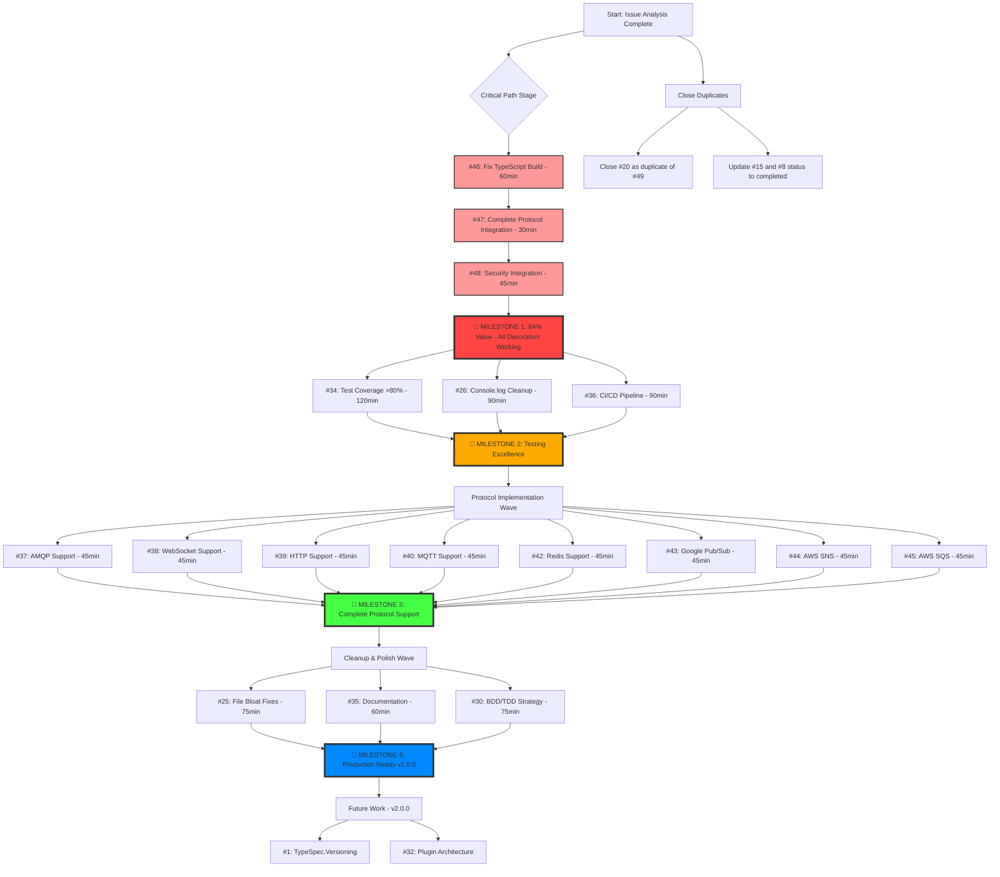
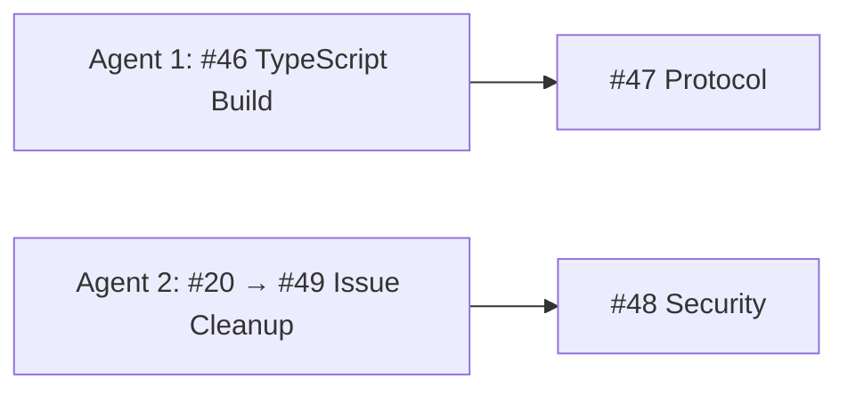
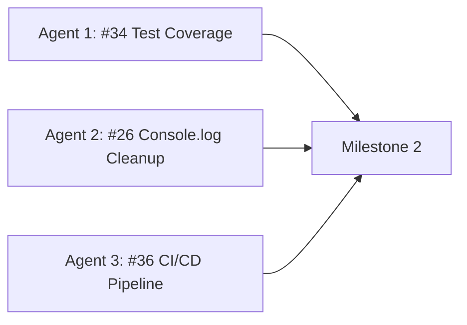
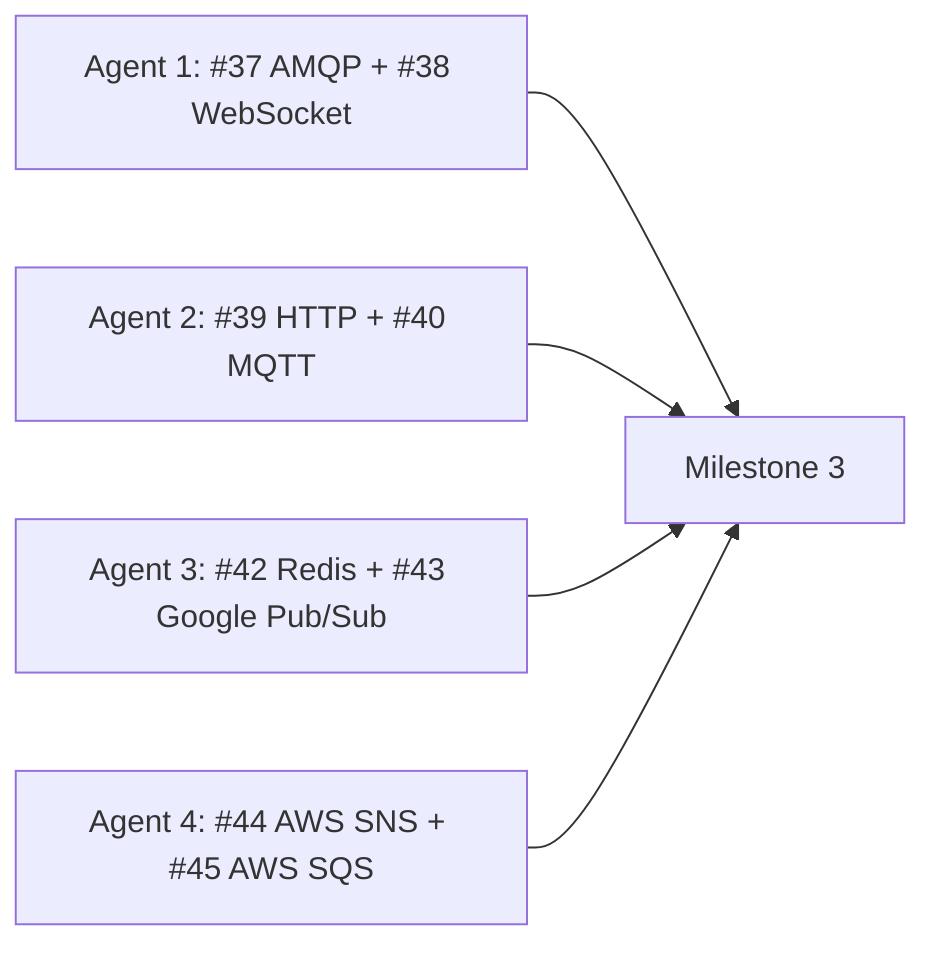

# TypeSpec AsyncAPI - GitHub Issues Strategic Execution Plan

**Date**: August 31, 2025 11:30 AM CEST  
**Session**: GitHub Issues Analysis & Multi-Stage Execution Strategy

## 🚨 CRITICAL DISCOVERIES

### **DUPLICATE ISSUES IDENTIFIED:**

- **Issue #20** (2025-08-30 Summary) + **Issue #49** (2025-08-31 Summary) → **DUPLICATE END-OF-DAY SUMMARIES**
  - Action: Close #20 as duplicate, keep #49 (more recent)
- **Protocol Binding Issues** (#37-45) vs **Issue #47** → **OVERLAP IN PROTOCOL WORK**
  - Issues #37-45 are individual protocol implementations
  - Issue #47 is architectural protocol integration (90% complete)
  - Action: Reference #47 from protocol-specific issues

### **RESOLVED ISSUES NOT CLOSED:**

- **Issue #15** → Ghost code mostly deleted, can be closed
- **Issue #8** → Major progress, ghost error system largely resolved

---

## 📊 ISSUE CATEGORIZATION & ANALYSIS

### 🔥 **CRITICAL PATH - MUST DO FIRST (4 Issues)**

| Issue | Title                                  | Priority     | Value | Duration | Dependencies       |
| ----- | -------------------------------------- | ------------ | ----- | -------- | ------------------ |
| #46   | TypeScript Build System                | 🔥 CRITICAL  | 20%   | 60min    | BLOCKS ALL TESTING |
| #47   | Protocol Config Integration (90% done) | 🔥 CRITICAL  | 15%   | 30min    | Requires #46       |
| #48   | Security Config Integration            | 🔥 HIGH      | 5%    | 45min    | After #47          |
| #12   | Production Ready v1.0.0 Milestone      | 🎯 MILESTONE | N/A   | N/A      | After #46-48       |

### 🚀 **HIGH IMPACT - NEXT WAVE (6 Issues)**

| Issue | Title                               | Priority  | Value | Duration | Dependencies |
| ----- | ----------------------------------- | --------- | ----- | -------- | ------------ |
| #34   | Test Coverage >80%                  | 🚀 HIGH   | 10%   | 120min   | After #46    |
| #26   | Console.log Cleanup (432 instances) | 🚀 HIGH   | 8%    | 90min    | After #46    |
| #25   | File Bloat - Split Large Files      | 🧹 MEDIUM | 5%    | 75min    | After #26    |
| #36   | CI/CD Pipeline Setup                | 🚀 HIGH   | 8%    | 90min    | After #34    |
| #35   | Documentation & Usage Examples      | 📚 MEDIUM | 5%    | 60min    | After #47-48 |
| #30   | BDD/TDD Test Strategy               | 🧪 MEDIUM | 5%    | 75min    | After #34    |

### 🔌 **PROTOCOL IMPLEMENTATIONS - PARALLEL WORK (9 Issues)**

| Issue  | Title                       | Priority  | Value     | Duration   | Dependencies |
| ------ | --------------------------- | --------- | --------- | ---------- | ------------ |
| #37-45 | Individual Protocol Support | 🔌 MEDIUM | 15% total | 45min each | After #47    |
| #41    | Effect Logging System       | 🔧 MEDIUM | 3%        | 60min      | With #26     |

### 🧹 **CLEANUP & POLISH - FINAL WAVE (6 Issues)**

| Issue | Title                            | Priority  | Value | Duration | Dependencies     |
| ----- | -------------------------------- | --------- | ----- | -------- | ---------------- |
| #24   | Build Impact Documentation       | 📝 LOW    | 2%    | 30min    | After everything |
| #11   | Orphaned Test Infrastructure     | 🧪 LOW    | 2%    | 45min    | After #34        |
| #8    | Ghost Error System (mostly done) | 🧹 LOW    | 2%    | 30min    | Cleanup only     |
| #15   | Delete Ghost Code (mostly done)  | 🧹 LOW    | 1%    | 15min    | Cleanup only     |
| #1    | TypeSpec.Versioning Support      | 🌟 FUTURE | 5%    | 120min   | v2.0.0 feature   |
| #32   | Plugin Architecture RFC          | 🌟 FUTURE | 10%   | 180min   | v2.0.0 feature   |

### 🗑️ **DUPLICATES TO CLOSE (2 Issues)**

| Issue | Title                           | Action             | Reason                        |
| ----- | ------------------------------- | ------------------ | ----------------------------- |
| #20   | END OF DAY SUMMARY - 2025-08-30 | CLOSE as duplicate | Superseded by #49             |
| #49   | END OF DAY SUMMARY - 2025-08-31 | KEEP               | Most recent and comprehensive |

---

## 🎯 MULTI-STAGE EXECUTION STRATEGY



---

## 📋 MILESTONE DEFINITIONS

### 🎯 **MILESTONE 1: 84% Value - All Decorators Working** (2.5 hours)

**Success Criteria:**

- ✅ TypeScript builds without errors
- ✅ All 6 decorator types (@server, @message, @protocol, @security, @channel, @publish/@subscribe) working
- ✅ AsyncAPI documents fully populated with all sections
- ✅ End-to-end TypeSpec → AsyncAPI generation proven

**Issues:**

- #46 (Build System) → #47 (Protocol) → #48 (Security) → #12 validation

### 🎯 **MILESTONE 2: Testing Excellence** (5 hours)

**Success Criteria:**

- ✅ Test coverage >80%
- ✅ Clean logging output (no console.log pollution)
- ✅ CI/CD pipeline operational
- ✅ Automated quality gates

**Issues:**

- #34 (Test Coverage) + #26 (Logging Cleanup) + #36 (CI/CD)

### 🎯 **MILESTONE 3: Complete Protocol Support** (6 hours)

**Success Criteria:**

- ✅ All 8 major protocols supported (Kafka, AMQP, WebSocket, HTTP, MQTT, Redis, AWS SNS/SQS, Google Pub/Sub)
- ✅ Protocol bindings generated correctly
- ✅ Real-world protocol examples working

**Issues:**

- #37-45 (Individual protocol implementations)

### 🎯 **MILESTONE 4: Production Ready v1.0.0** (3.5 hours)

**Success Criteria:**

- ✅ All files <500 lines
- ✅ Comprehensive documentation
- ✅ BDD/TDD strategy implemented
- ✅ Ready for community release

**Issues:**

- #25 (File Splitting) + #35 (Documentation) + #30 (Testing Strategy)

---

## ⚡ PARALLEL EXECUTION OPPORTUNITIES

### **Stage 1 Parallel (2 agents):**



### **Stage 2 Parallel (3 agents):**



### **Stage 3 Parallel (4 agents):**



---

## 🚨 IMMEDIATE ACTIONS REQUIRED

### **1. Close Duplicate Issues (5 minutes)**

```bash
# Close #20 as duplicate
gh issue close 20 --reason "duplicate" --comment "Closing as duplicate of #49 which contains more recent and comprehensive end-of-day summary"

# Update #15 and #8 with completion status
gh issue comment 15 --body "Major ghost code cleanup completed. Remaining work is minimal cleanup only."
gh issue comment 8 --body "Ghost error system largely resolved through server/message integration work. Only final cleanup remains."
```

### **2. Update Issue Labels & Milestones (10 minutes)**

```bash
# Create milestones
gh api -X POST repos/LarsArtmann/typespec-asyncapi/milestones -f title="84% Value - All Decorators" -f description="Critical decorator integration completion"
gh api -X POST repos/LarsArtmann/typespec-asyncapi/milestones -f title="Testing Excellence" -f description="Test coverage and CI/CD"
gh api -X POST repos/LarsArtmann/typespec-asyncapi/milestones -f title="Complete Protocol Support" -f description="All protocol implementations"
gh api -X POST repos/LarsArtmann/typespec-asyncapi/milestones -f title="Production Ready v1.0.0" -f description="Final polish and documentation"
```

### **3. Begin Critical Path (Start with #46)**

Issue #46 (TypeScript Build System) is blocking everything else and should be started immediately.

---

## 📊 EXECUTION METRICS

### **Total Estimated Time:**

- **Critical Path:** 2.5 hours (84% value)
- **High Impact Wave:** 5 hours (Testing excellence)
- **Protocol Implementation:** 6 hours (Complete protocol support)
- **Final Polish:** 3.5 hours (Production ready)
- **TOTAL:** 17 hours across 4 milestones

### **Value Delivery Schedule:**

- **Week 1 (8 hours):** Milestones 1-2 (84% value + testing excellence)
- **Week 2 (9 hours):** Milestones 3-4 (complete protocols + production ready)

### **Success Metrics:**

- **Build Success:** 0 TypeScript errors maintained
- **Test Quality:** >80% coverage achieved
- **Protocol Coverage:** 8/8 major protocols supported
- **Code Quality:** All files <500 lines, no console.log pollution
- **Release Ready:** v1.0.0 shipped to community

---

## 🎯 NEXT IMMEDIATE ACTIONS

1. **Close Issue #20** as duplicate of #49
2. **Start Issue #46** (TypeScript Build System) - CRITICAL BLOCKER
3. **Deploy 2 parallel agents** for #46 + issue cleanup
4. **Create GitHub milestones** for the 4-stage execution plan
5. **Begin Milestone 1 sprint** targeting 84% value completion

**🚀 READY FOR MULTI-AGENT PARALLEL EXECUTION!**

---

🤖 Generated with [Claude Code](https://claude.ai/code)

Co-Authored-By: Claude <noreply@anthropic.com>
