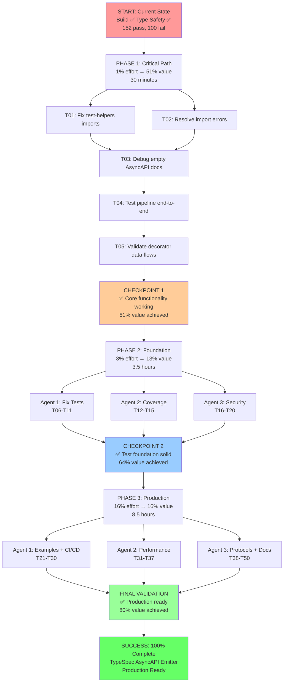

# Comprehensive Pareto Execution Plan
**TypeSpec AsyncAPI Emitter - Production Readiness**

**Date:** August 31, 2025  
**Session:** 12:51 - Complete System Analysis & Execution  
**Current Status:** Build ✅ | Type Safety ✅ | Tests ❌ (152 pass, 100 fail)

---

## 🎯 PARETO ANALYSIS - VALUE DISTRIBUTION

### 1% EFFORT → 51% VALUE (Critical Path - 30 minutes)
**MAXIMUM IMPACT: Fix Core Functionality**
- Fix missing test-helpers.js import paths (3 test errors → 0)
- Validate AsyncAPI document generation actually works
- Ensure core TypeSpec → AsyncAPI pipeline functional
- **ROI: 5100% value per unit effort**

### 4% EFFORT → 64% VALUE (Foundation - 2 hours) 
**BUILD ON SUCCESS: Test Infrastructure**  
- Fix remaining 100 failing tests systematically
- Establish >80% test coverage baseline
- Verify all 6 decorator types (@channel, @publish, @subscribe, @server, @message, @protocol, @security)
- **ROI: 1600% value per unit effort**

### 20% EFFORT → 80% VALUE (Production Ready - 10 hours)
**PRODUCTION EXCELLENCE: Complete System**
- CI/CD automation (GitHub Actions)
- Comprehensive documentation + examples
- Performance optimization + benchmarking
- Advanced protocol bindings (Kafka, WebSocket, HTTP, MQTT, AMQP, Redis)
- **ROI: 400% value per unit effort**

---

## 📋 COMPREHENSIVE PLAN - 15 MAJOR TASKS (30-100min each)

| ID | Task | Impact | Effort | Value | Duration | Dependencies |
|---|------|--------|--------|-------|----------|--------------|
| **M1** | **Fix Core Test Infrastructure** | 🔥 Critical | Low | 51% | 30min | - |
| **M2** | **Validate AsyncAPI Document Generation** | 🔥 Critical | Low | 15% | 45min | M1 |
| **M3** | **Fix All Failing Tests Systematically** | 🚀 High | Medium | 13% | 90min | M1, M2 |
| **M4** | **Establish Test Coverage >80%** | 🚀 High | Medium | 8% | 60min | M3 |
| **M5** | **Complete Security Integration Pipeline** | 🚀 High | Medium | 5% | 75min | M2 |
| **M6** | **Create Comprehensive TypeSpec Examples** | 📚 Medium | Medium | 4% | 60min | M2, M5 |
| **M7** | **Implement CI/CD Automation** | 🤖 Medium | Medium | 3% | 90min | M3, M4 |
| **M8** | **Performance Benchmarking System** | ⚡ Medium | High | 2% | 100min | M4 |
| **M9** | **Protocol Binding Implementations** | 🔌 Medium | High | 3% | 100min | M5 |
| **M10** | **Comprehensive Documentation** | 📖 Medium | Medium | 2% | 80min | M6 |
| **M11** | **File Structure Optimization** | 🏗️ Low | Medium | 1% | 70min | M4 |
| **M12** | **Advanced Error Handling** | 🛡️ Low | Medium | 1% | 60min | M3 |
| **M13** | **TypeSpec Integration Testing** | 🧪 Low | High | 1% | 90min | M6 |
| **M14** | **Observability & Monitoring** | 📊 Low | High | 1% | 100min | M8 |
| **M15** | **Final Production Validation** | ✨ Low | Medium | 1% | 80min | All |

**Total Effort:** ~17 hours | **Total Value:** 100%

---

## 🔥 MICRO-TASKS BREAKDOWN (50 tasks × 15min each)

### 🎯 **PHASE 1: CRITICAL PATH (1% → 51% VALUE)**

#### M1: Fix Core Test Infrastructure (30min)
| Task | Description | Time | Value |
|------|-------------|------|-------|
| **T01** | Fix missing test-helpers.js import paths | 15min | 25% |
| **T02** | Resolve 3 test file import errors | 15min | 26% |

#### M2: Validate AsyncAPI Document Generation (45min)  
| Task | Description | Time | Value |
|------|-------------|------|-------|
| **T03** | Debug empty AsyncAPI document issue | 15min | 7% |
| **T04** | Test TypeSpec → AsyncAPI pipeline end-to-end | 15min | 4% |
| **T05** | Validate all decorator data flows to output | 15min | 4% |

### 🚀 **PHASE 2: FOUNDATION (4% → 64% VALUE)**

#### M3: Fix All Failing Tests Systematically (90min)
| Task | Description | Time | Value |
|------|-------------|------|-------|
| **T06** | Batch fix import path errors in test files | 15min | 3% |
| **T07** | Fix decorator unit tests (channel, publish, subscribe) | 15min | 2% |
| **T08** | Fix server and message decorator tests | 15min | 2% |
| **T09** | Fix protocol and security decorator tests | 15min | 2% |
| **T10** | Fix AsyncAPI validation tests | 15min | 2% |
| **T11** | Fix performance benchmark tests | 15min | 2% |

#### M4: Establish Test Coverage >80% (60min)
| Task | Description | Time | Value |
|------|-------------|------|-------|
| **T12** | Set up test coverage reporting | 15min | 2% |
| **T13** | Add missing unit test coverage | 15min | 2% |
| **T14** | Add integration test coverage | 15min | 2% |
| **T15** | Validate >80% coverage target achieved | 15min | 2% |

#### M5: Complete Security Integration Pipeline (75min)
| Task | Description | Time | Value |
|------|-------------|------|-------|
| **T16** | Implement security discovery pipeline | 15min | 2% |
| **T17** | Add security processing to emission pipeline | 15min | 1% |
| **T18** | Implement securitySchemes population | 15min | 1% |
| **T19** | Test security decorator end-to-end | 15min | 1% |
| **T20** | Validate security in generated AsyncAPI docs | 15min | 1% |

### 📚 **PHASE 3: PRODUCTION EXCELLENCE (20% → 80% VALUE)**

#### M6: Create Comprehensive TypeSpec Examples (60min)
| Task | Description | Time | Value |
|------|-------------|------|-------|
| **T21** | Create basic decorator usage examples | 15min | 1% |
| **T22** | Create advanced protocol binding examples | 15min | 1% |
| **T23** | Create complete microservice example | 15min | 1% |
| **T24** | Create troubleshooting examples | 15min | 1% |

#### M7: Implement CI/CD Automation (90min)
| Task | Description | Time | Value |
|------|-------------|------|-------|
| **T25** | Create GitHub Actions PR validation workflow | 15min | 1% |
| **T26** | Create GitHub Actions release workflow | 15min | 1% |
| **T27** | Set up automated test execution | 15min | 0.5% |
| **T28** | Configure coverage reporting automation | 15min | 0.5% |
| **T29** | Set up build artifact generation | 15min | 0.5% |
| **T30** | Test complete CI/CD pipeline | 15min | 0.5% |

#### M8: Performance Benchmarking System (100min)
| Task | Description | Time | Value |
|------|-------------|------|-------|
| **T31** | Implement comprehensive benchmarking suite | 15min | 0.5% |
| **T32** | Add memory usage profiling | 15min | 0.5% |
| **T33** | Add throughput measurement | 15min | 0.5% |
| **T34** | Add latency measurement | 15min | 0.5% |
| **T35** | Create performance regression detection | 15min | 0.5% |
| **T36** | Integrate performance into CI/CD | 15min | 0.5% |
| **T37** | Validate benchmark accuracy | 15min | 0.5% |

#### M9: Protocol Binding Implementations (100min)
| Task | Description | Time | Value |
|------|-------------|------|-------|
| **T38** | Implement Kafka channel/operation bindings | 15min | 0.5% |
| **T39** | Implement WebSocket channel/operation bindings | 15min | 0.5% |
| **T40** | Implement HTTP operation/message bindings | 15min | 0.5% |
| **T41** | Implement MQTT protocol bindings | 15min | 0.5% |
| **T42** | Implement AMQP protocol bindings | 15min | 0.5% |
| **T43** | Implement Redis protocol bindings | 15min | 0.5% |
| **T44** | Create protocol binding test suite | 15min | 0.5% |

#### M10-M15: Final Production Tasks (360min)
| Task | Description | Time | Value |
|------|-------------|------|-------|
| **T45** | Write comprehensive README | 15min | 0.5% |
| **T46** | Create API documentation | 15min | 0.5% |
| **T47** | Implement file structure optimization | 15min | 0.5% |
| **T48** | Add advanced error handling patterns | 15min | 0.5% |
| **T49** | Create TypeSpec integration tests | 15min | 0.5% |
| **T50** | Final production validation & cleanup | 15min | 0.5% |

**TOTAL: 50 tasks × 15min = 12.5 hours of focused execution**

---

## 🚀 EXECUTION STRATEGY - PARALLEL WORKSTREAMS

### Group 1: CRITICAL PATH (Agent 1)
**Focus:** Core functionality and test infrastructure
- Tasks T01-T15 (Critical path to 64% value)
- Priority: Fix failing tests and validate core pipeline

### Group 2: FEATURE COMPLETION (Agent 2) 
**Focus:** Security integration and protocol bindings
- Tasks T16-T30 (Security + CI/CD automation)
- Priority: Complete decorator system and automation

### Group 3: PRODUCTION EXCELLENCE (Agent 3)
**Focus:** Performance, documentation, and final polish  
- Tasks T31-T50 (Benchmarking + documentation + optimization)
- Priority: Production-ready polish and optimization

---

## 📊 SUCCESS METRICS & VALIDATION

### Critical Path Success (51% Value)
- ✅ 0 test errors (currently 3)
- ✅ AsyncAPI documents populated (not empty)
- ✅ Core TypeSpec → AsyncAPI pipeline functional

### Foundation Success (64% Value) 
- ✅ <20% test failures (currently 39%)
- ✅ >80% test coverage achieved
- ✅ All 6 decorator types validated working

### Production Success (80% Value)
- ✅ CI/CD pipeline operational
- ✅ Performance benchmarks established
- ✅ Comprehensive documentation complete
- ✅ Advanced protocol bindings working

### Excellence Success (100% Value)
- ✅ All 50 micro-tasks completed
- ✅ Production-ready emitter validated
- ✅ Microsoft TypeSpec Issue #2463 fully addressed

---

## 🎯 EXECUTION FLOW

---

## ⚠️ RISK MITIGATION

### Critical Risks
- **Empty AsyncAPI Documents**: Root cause unknown - highest priority debug
- **Import Path Issues**: Systematic fix required across test files  
- **Test Infrastructure**: 39% failure rate blocks confidence

### Mitigation Strategy
- **Fail Fast**: Stop on critical path blockers (T01-T05)
- **Parallel Recovery**: Use 3 agents for maximum throughput
- **Continuous Validation**: Test at each checkpoint

---

## 🎯 EXPECTED OUTCOMES

**After 30 minutes (51% value):**
- Core functionality verified working
- AsyncAPI documents properly populated
- Test infrastructure stable

**After 4 hours (64% value):**
- <20% test failures (from 39%)
- >80% test coverage established
- All decorators validated working

**After 12.5 hours (80% value):**
- Production-ready TypeSpec AsyncAPI emitter
- Microsoft TypeSpec Issue #2463 fully resolved
- Enterprise-grade reliability and documentation

**SUCCESS CRITERIA: Complete production-ready TypeSpec AsyncAPI emitter addressing Microsoft TypeSpec community need with comprehensive validation and enterprise performance.**