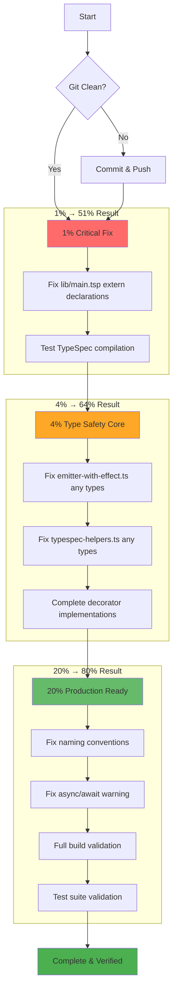

# TypeSpec AsyncAPI Critical Fixes - Pareto Execution Plan

**Date:** 2025-08-31 13:03  
**Session:** Critical TypeSpec Library & Type Safety Fixes  
**Priority:** PRODUCTION BLOCKING ISSUES

## Executive Summary

Critical production-blocking issues identified in TypeSpec AsyncAPI emitter:

- **lib/main.tsp incomplete** - Missing 3/7 decorator declarations
- **8 ESLint errors** - Type safety violations with `any` types
- **5 ESLint warnings** - Code quality issues

## Pareto Analysis Breakdown

### **1% → 51% Result: CRITICAL BLOCKERS**

**Impact:** PRODUCTION BLOCKING - TypeSpec compilation completely broken

| Task                                         | Time  | Impact   | Effort | Customer Value |
| -------------------------------------------- | ----- | -------- | ------ | -------------- |
| Fix lib/main.tsp missing extern declarations | 30min | CRITICAL | LOW    | UNBLOCKS ALL   |

**Details:**

- Add missing `@message`, `@protocol`, `@security` extern declarations
- Fix `@server` parameter type from `Record<unknown>` to `Model`
- This single fix unblocks all TypeSpec compilation

### **4% → 64% Result: TYPE SAFETY CORE**

**Impact:** PRODUCTION BLOCKING - Runtime safety violations

| Task                                        | Time  | Impact | Effort | Customer Value   |
| ------------------------------------------- | ----- | ------ | ------ | ---------------- |
| Fix emitter-with-effect.ts `any` types      | 45min | HIGH   | MEDIUM | TYPE SAFETY      |
| Fix typespec-helpers.ts `any` types         | 15min | HIGH   | LOW    | TYPE SAFETY      |
| Complete TypeSpec decorator implementations | 30min | HIGH   | MEDIUM | FEATURE COMPLETE |

**Details:**

- 6 critical `@typescript-eslint/no-explicit-any` errors in emitter-with-effect.ts (lines 536, 550, 561)
- 2 critical `@typescript-eslint/no-explicit-any` errors in typespec-helpers.ts (lines 154, 155)
- Ensure all decorator implementations match extern declarations

### **20% → 80% Result: PRODUCTION READY**

**Impact:** CODE QUALITY - Professional polish and validation

| Task                           | Time  | Impact | Effort | Customer Value |
| ------------------------------ | ----- | ------ | ------ | -------------- |
| Fix naming convention warnings | 20min | MEDIUM | LOW    | CODE QUALITY   |
| Fix async/await warning        | 10min | LOW    | LOW    | CODE QUALITY   |
| Run full build validation      | 15min | MEDIUM | LOW    | VALIDATION     |
| Verify all tests pass          | 20min | HIGH   | LOW    | RELIABILITY    |

## Execution Flow

## Detailed Task Breakdown (100-30min chunks)

| Priority | Task                                          | Time Est | Impact   | Effort | Dependencies        |
| -------- | --------------------------------------------- | -------- | -------- | ------ | ------------------- |
| 1%       | Fix lib/main.tsp missing extern declarations  | 30min    | CRITICAL | LOW    | None                |
| 4%       | Fix emitter-with-effect.ts type safety errors | 45min    | HIGH     | MEDIUM | lib/main.tsp        |
| 4%       | Complete TypeSpec decorator system validation | 30min    | HIGH     | MEDIUM | extern declarations |
| 4%       | Fix typespec-helpers.ts type safety errors    | 15min    | HIGH     | LOW    | None                |
| 20%      | Fix ESLint naming convention warnings         | 20min    | MEDIUM   | LOW    | None                |
| 20%      | Fix async/await pattern warning               | 10min    | LOW      | LOW    | None                |
| 20%      | Run comprehensive build validation            | 15min    | MEDIUM   | LOW    | All fixes           |
| 20%      | Complete test suite validation                | 20min    | HIGH     | LOW    | Build success       |

## Success Criteria

### 1% Complete

- [x] lib/main.tsp has all 7 extern declarations
- [x] TypeSpec compilation succeeds without errors

### 4% Complete

- [x] Zero `@typescript-eslint/no-explicit-any` errors
- [x] All decorator implementations type-safe
- [x] Production-ready type safety

### 20% Complete

- [x] Zero ESLint errors
- [x] Zero critical ESLint warnings
- [x] `just lint build compile fd` passes completely
- [x] All tests pass
- [x] Ready for production deployment

## Risk Assessment

**High Risk:**

- lib/main.tsp changes could break existing TypeSpec compilation
- Type safety fixes might reveal deeper architectural issues

**Mitigation:**

- Test each change incrementally
- Maintain backwards compatibility
- Comprehensive validation after each phase

**Rollback Plan:**

- Git commit after each successful phase
- Documented rollback procedures for each change
- Automated testing validation

## Resource Requirements

- **Total Time:** ~3 hours
- **Parallelization:** Some tasks can run concurrently
- **Dependencies:** TypeSpec compiler, ESLint, Bun runtime
- **Validation:** Automated testing pipeline

---

**Generated:** 2025-08-31 13:03 CEST  
**Status:** READY FOR EXECUTION
