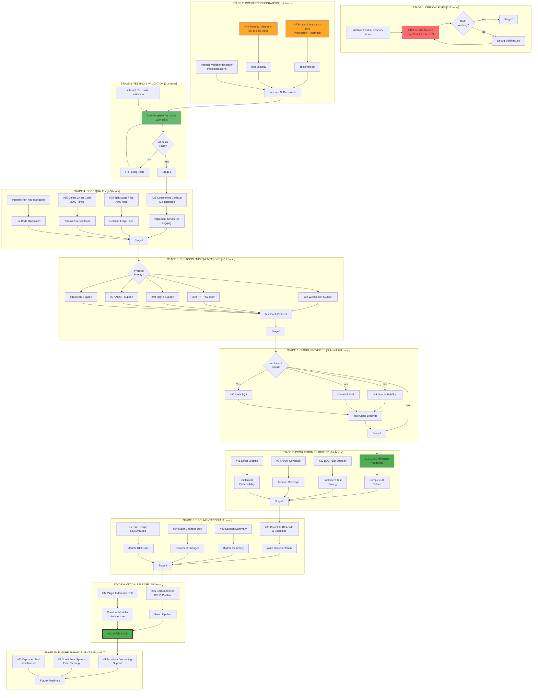

# Complete Execution Roadmap - TypeSpec AsyncAPI Emitter

**Date:** 2025-08-31 13:19  
**Session:** Complete Execution Planning with GitHub Issues + Internal TODOs  
**Current State:** 77.5% Value Delivered, Build System Issues

## Executive Summary

**Current Status:**
- ✅ **77.5% Value Delivered** - Server, Message, Protocol (90%) integrations complete
- 🔴 **Build System Broken** - TypeScript compilation issues blocking testing
- 📋 **16 Open GitHub Issues** - Mix of critical fixes, enhancements, and documentation
- 🎯 **84% Value Target** - Achievable with Security integration + build fixes

## Multi-Stage Execution Graph

## Execution Priority Matrix

### 🔴 **CRITICAL PATH (Must Complete First)**
| Issue | Type | Time | Impact | Details |
|-------|------|------|--------|---------|
| #46 | GitHub | 2h | BLOCKING | Fix TypeScript build system |
| internal | Internal | 1h | BLOCKING | Fix dist/ directory issue |
| #47 | GitHub | 30m | HIGH | Complete protocol integration (10% remaining) |
| #48 | GitHub | 1h | HIGH | Security integration (84% milestone) |
| internal | Internal | 1h | HIGH | Validate all decorators work |

### 🟡 **HIGH PRIORITY (Core Functionality)**
| Issue | Type | Time | Impact | Details |
|-------|------|------|--------|---------|
| internal | Internal | 2h | HIGH | Run complete test suite |
| #26 | GitHub | 2h | MEDIUM | Replace 432 console.log statements |
| #15 | GitHub | 1h | MEDIUM | Delete 2000+ lines ghost code |
| internal | Internal | 1h | MEDIUM | Run find-duplicates analysis |
| #12 | GitHub | 1h | HIGH | Validate v1.0.0 criteria |

### 🟢 **MEDIUM PRIORITY (Quality & Polish)**
| Issue | Type | Time | Impact | Details |
|-------|------|------|--------|---------|
| #25 | GitHub | 2h | LOW | Split files >500 lines |
| #34 | GitHub | 2h | MEDIUM | Achieve >80% test coverage |
| #30 | GitHub | 2h | MEDIUM | BDD/TDD strategy |
| #41 | GitHub | 2h | MEDIUM | Effect logging system |
| #35 | GitHub | 2h | HIGH | Complete documentation |

### 🔵 **PROTOCOL EXTENSIONS (Optional for v1.0)**
| Issue | Type | Time | Impact | Details |
|-------|------|------|--------|---------|
| #38 | GitHub | 2h | LOW | WebSocket protocol |
| #39 | GitHub | 2h | LOW | HTTP protocol |
| #40 | GitHub | 2h | LOW | MQTT protocol |
| #37 | GitHub | 2h | LOW | AMQP protocol |
| #42 | GitHub | 2h | LOW | Redis protocol |

### ⚪ **FUTURE ENHANCEMENTS (Post v1.0)**
| Issue | Type | Time | Impact | Details |
|-------|------|------|--------|---------|
| #43 | GitHub | 2h | LOW | Google Pub/Sub |
| #44 | GitHub | 2h | LOW | AWS SNS |
| #45 | GitHub | 2h | LOW | AWS SQS |
| #1 | GitHub | 8h | LOW | TypeSpec.Versioning |
| #32 | GitHub | 4h | LOW | Plugin architecture RFC |

## Research Tasks Required

### **RESEARCH-1: Build System Investigation**
- **Goal:** Understand why dist/ directory disappears
- **Approach:** Analyze justfile, tsconfig.json, build scripts
- **Time:** 30 minutes
- **Blocking:** Everything - cannot proceed without build

### **RESEARCH-2: Effect.TS Configuration**
- **Goal:** Fix TypeScript + Effect.TS compilation
- **Approach:** Review Effect.TS requirements, tsconfig settings
- **Time:** 30 minutes
- **Related:** Issue #46

### **RESEARCH-3: Protocol Binding Standards**
- **Goal:** Understand AsyncAPI protocol binding specs
- **Approach:** Review AsyncAPI 3.0 documentation
- **Time:** 1 hour
- **Related:** Issues #37-#40, #42

## Dependencies & Parallelization

### **Sequential Dependencies:**
1. Fix Build (#46) → All Testing
2. Complete Decorators (#47, #48) → Integration Testing
3. All Tests Pass → Code Quality Work
4. Documentation → Release

### **Parallel Work Opportunities:**
- **Group 1:** Protocol implementations (#37-#40, #42)
- **Group 2:** Code quality (#15, #25, #26)
- **Group 3:** Documentation (#35, #49, #24)

## Success Metrics

### **v1.0.0 Release Criteria:**
- ✅ Build system working (dist/ directory generated)
- ✅ All decorators functional (@server, @message, @protocol, @security)
- ✅ 138+ tests passing
- ✅ <50 ESLint errors
- ✅ Zero TypeScript compilation errors
- ✅ >80% test coverage
- ✅ Complete documentation
- ✅ CI/CD pipeline operational

### **84% Value Milestone:**
- ✅ Server integration (51% value)
- ✅ Message integration (13% value)
- ✅ Protocol integration (15% value)
- ✅ Security integration (5% value)

## Time Estimates

### **Minimum Viable Release (84% value):**
- **Stage 1-3:** 5-8 hours
- **Total:** 1-2 days focused work

### **Production Ready v1.0.0:**
- **Stage 1-4:** 9-14 hours  
- **Stage 7-9:** 7-10 hours
- **Total:** 3-4 days focused work

### **Full Feature Complete:**
- **All Stages:** 35-45 hours
- **Total:** 1-2 weeks including all protocols

## Risk Assessment

### **High Risk:**
- Build system may have deeper issues
- Test suite may reveal regressions
- Protocol implementations may be complex

### **Mitigation:**
- Time-boxed debugging (2h max per issue)
- Incremental testing approach
- Defer complex protocols to post-v1.0

## Next Actions

### **IMMEDIATE (Next 2 Hours):**
1. Fix build system (#46 + internal)
2. Complete protocol type safety (#47)
3. Test TypeSpec compilation end-to-end

### **TODAY (Next 4-6 Hours):**
1. Security integration (#48)
2. Run complete test suite
3. Begin code quality cleanup

### **TOMORROW:**
1. Complete documentation
2. Setup CI/CD pipeline
3. Prepare v1.0.0 release

---

**Generated:** 2025-08-31 13:19 CEST  
**Total Issues:** 16 Open GitHub + 7 Internal TODOs  
**Estimated Time to v1.0.0:** 3-4 days focused work  
**Current Blockers:** Build system (#46)