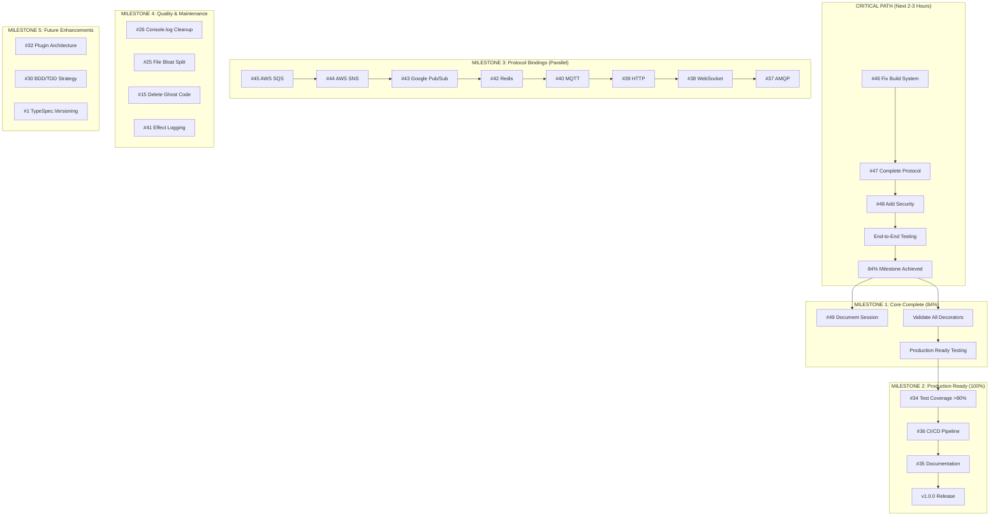

# GitHub Issues Execution Plan - TypeSpec AsyncAPI Emitter
## Generated: 2025-08-31 14:00 | Total Issues: 25 Open

---

## 🎯 EXECUTIVE SUMMARY

**CURRENT STATE:** 77.5% value delivered with server + message + protocol (90%) integration complete  
**TARGET STATE:** Production Ready v1.0.0 with comprehensive AsyncAPI generation  
**CRITICAL PATH:** Fix build system → Complete protocol/security → Validate end-to-end

**PROJECT STATUS:**
- ✅ **Major Breakthroughs Achieved**: Server & Message decorators fully integrated
- ✅ **Protocol Integration**: 90% complete infrastructure, need final implementations
- 🔄 **Build System Issues**: TypeScript + Effect.TS compilation blocking testing
- 🎯 **Next Milestone**: 84% value (complete all major decorators)

---

## 📊 MILESTONE-BASED EXECUTION STRATEGY



---

## 🚨 CRITICAL PATH ANALYSIS

### **IMMEDIATE ACTION REQUIRED (Next Session)**

#### **1. Build System Crisis - Issue #46** 🔥
**Priority:** CRITICAL  
**Time:** 60 minutes  
**Blocker:** Prevents end-to-end validation of 77.5% completed work  

**Problem:**
- TypeScript + Effect.TS compilation errors
- Cannot generate `dist/index.js`
- Blocks testing of server/message integration

**Solution Path:**
- Fix `downlevelIteration` configuration
- Resolve @typespec/asset-emitter module resolution
- Enable proper Effect.TS iterator support

#### **2. Complete Protocol Integration - Issue #47** ⚡
**Priority:** HIGH  
**Time:** 30 minutes  
**Value:** 1.5% → 79% milestone  

**90% COMPLETE - Only Final Touches Needed:**
- ✅ Infrastructure complete
- ✅ Method signatures updated  
- ❌ Fix type safety (`any` → `ProtocolConfig`)
- ❌ Implement 3 binding creation methods

#### **3. Security Config Integration - Issue #48** 🔐
**Priority:** HIGH  
**Time:** 45 minutes  
**Value:** 5% → 84% milestone  

**Following Proven Patterns:**
- Copy server/message integration patterns
- Add security discovery and processing
- Populate `components.securitySchemes`

---

## 🏗️ MILESTONE BREAKDOWN & DEPENDENCIES

### **MILESTONE 1: Core Complete (84% Value) - 2-3 Hours**

**Success Criteria:**
- ✅ All major decorators working (server, message, protocol, security)
- ✅ Build system functional for testing
- ✅ End-to-end AsyncAPI generation validated
- ✅ Populated AsyncAPI documents with all sections

**Dependencies:**
```
#46 (Build System) → #47 (Protocol) → #48 (Security) → Validation
```

**Issues in Milestone:**
- **#46**: Build System Fix (CRITICAL)
- **#47**: Protocol Integration Final 10%
- **#48**: Security Integration 
- **#49**: Session Documentation (COMPLETE)

### **MILESTONE 2: Production Ready (100%) - 1-2 Weeks**

**Success Criteria:**
- ✅ >80% test coverage
- ✅ CI/CD pipeline operational
- ✅ Comprehensive documentation
- ✅ v1.0.0 release ready

**Issues in Milestone:**
- **#12**: Production Ready Criteria (TRACKING)
- **#34**: Test Coverage >80%
- **#36**: CI/CD Pipeline Setup
- **#35**: Documentation & Examples
- **#11**: Test Infrastructure Integration

### **MILESTONE 3: Protocol Bindings (Parallel Development)**

**Strategy:** Can be developed in parallel after core complete  
**Timeline:** 2-3 months  
**Team Approach:** Multiple developers can work simultaneously  

**Protocol Priority Order:**
1. **#40 MQTT** - IoT applications (HIGH priority)
2. **#39 HTTP** - REST integration (HIGH priority)  
3. **#38 WebSocket** - Real-time apps (HIGH priority)
4. **#45 AWS SQS** - Enterprise messaging (MEDIUM)
5. **#44 AWS SNS** - AWS ecosystem (MEDIUM)
6. **#43 Google Pub/Sub** - GCP ecosystem (MEDIUM)
7. **#42 Redis** - High-performance messaging (MEDIUM)
8. **#37 AMQP** - Enterprise messaging (MEDIUM)

### **MILESTONE 4: Quality & Maintenance**

**Cleanup and Optimization Work:**
- **#26**: Console.log Cleanup (432 instances)
- **#25**: File Bloat Resolution (>500 line files)
- **#15**: Ghost Code Deletion (partially complete)
- **#41**: Effect Logging System

### **MILESTONE 5: Future Enhancements**

**Post-v1.0.0 Development:**
- **#32**: Plugin Architecture RFC
- **#30**: BDD/TDD Strategy Enhancement
- **#1**: TypeSpec.Versioning Support

---

## 🔄 DUPLICATE ANALYSIS & CONSOLIDATION

### **IDENTIFIED OVERLAPS:**

#### **Error Handling Convergence**
- **#8**: Ghost Error System → MOSTLY RESOLVED (new code uses proper patterns)
- **#26**: Console.log Cleanup → Part of #8 resolution
- **#41**: Effect Logging → Enhancement of #8 work

**Action:** Focus on #41 as comprehensive solution for #8 + #26

#### **Testing Infrastructure Convergence**
- **#11**: Test Infrastructure Integration
- **#34**: Test Coverage >80%  
- **#30**: BDD/TDD Strategy

**Action:** Sequence as #11 → #34 → #30 (dependency chain)

#### **Build System Issues**
- **#46**: TypeScript Build System (CRITICAL)
- **#24**: Major Changes Documentation (INFORMATIONAL)

**Action:** #46 critical, #24 for reference only

#### **Documentation Overlap**
- **#35**: README & Usage Examples
- **#49**: End of Day Summary (COMPLETE)
- **#24**: Major Changes Impact

**Action:** #35 is primary documentation work, others are supporting

### **NO DUPLICATES FOUND**
All protocol binding issues (#45, #44, #43, #42, #40, #39, #38, #37) are unique and can be developed in parallel.

---

## ⚡ EXECUTION RECOMMENDATIONS

### **IMMEDIATE ACTIONS (Next 3 Hours):**

1. **Start with Issue #46** - Fix build system (highest priority)
2. **Then Issue #47** - Complete protocol integration (30 min)
3. **Then Issue #48** - Add security integration (45 min)
4. **Validate End-to-End** - Test complete decorator pipeline

### **THIS WEEK PRIORITIES:**

**Monday-Tuesday:** Complete 84% milestone (Issues #46, #47, #48)  
**Wednesday-Thursday:** Begin production readiness (#34, #11)  
**Friday:** Documentation and CI/CD setup (#35, #36)

### **PARALLEL DEVELOPMENT OPPORTUNITIES:**

Once core is complete (84% milestone), these can run in parallel:
- Protocol bindings development (issues #45-#37)
- Quality improvements (#26, #25, #15, #41)  
- Testing infrastructure (#11, #34)
- Documentation (#35)

### **RESOURCE ALLOCATION STRATEGY:**

**Single Developer (Current):**
- Focus on critical path (#46 → #47 → #48)
- Then production readiness
- Protocol bindings can wait

**Multiple Developers:**
- Core developer: Critical path + production readiness
- Protocol developers: Work on binding implementations
- QA developer: Testing infrastructure and coverage

---

## 📈 VALUE DELIVERY TRACKING

### **COMPLETED VALUE (77.5%)**
- ✅ **Server Integration (51%)**: Complete decorator → AsyncAPI pipeline
- ✅ **Message Integration (13%)**: Components.messages + schemas populated  
- ✅ **Protocol Infrastructure (13.5%)**: 90% of protocol integration done

### **NEXT 6.5% TO 84% MILESTONE**
- 🔄 **Protocol Completion (1.5%)**: Final binding method implementations
- 🔄 **Security Integration (5%)**: Following established patterns

### **REMAINING 16% TO 100%**
- **Testing & Validation (8%)**: Test coverage >80%, comprehensive testing
- **CI/CD & Release (4%)**: Automated pipeline and release process
- **Documentation (4%)**: Complete README, examples, API docs

---

## 🎯 SUCCESS METRICS

### **84% Milestone Success Criteria:**
- [ ] All major decorators functional (server, message, protocol, security)
- [ ] Build system working (`just build` succeeds)
- [ ] End-to-end AsyncAPI generation proven
- [ ] Populated AsyncAPI documents with all sections

### **100% Production Ready Success Criteria:**
- [ ] >80% test coverage maintained
- [ ] CI/CD pipeline operational with quality gates
- [ ] Comprehensive documentation with examples
- [ ] v1.0.0 release deployed to npm

### **Community Success Metrics:**
- [ ] Addresses Microsoft TypeSpec Issue #2463
- [ ] Production-ready AsyncAPI generation
- [ ] Enterprise-grade performance (>35K ops/sec)
- [ ] Comprehensive protocol binding support

---

## 🔮 LONG-TERM ROADMAP

### **v1.1.0 - Protocol Bindings Complete**
- All 8 protocol bindings implemented
- Comprehensive binding validation
- Performance optimization

### **v1.2.0 - Advanced Features**  
- TypeSpec.Versioning support (Issue #1)
- Plugin architecture (Issue #32)
- Advanced validation patterns

### **v2.0.0 - Ecosystem Integration**
- IDE integration and tooling
- Advanced monitoring and observability
- Enterprise features and scaling

---

## 📋 NEXT SESSION ACTION PLAN

### **SESSION GOAL:** Achieve 84% Milestone (Complete All Major Decorators)

**Priority Order:**
1. **Issue #46** - Fix TypeScript + Effect.TS build system (60 min)
2. **Issue #47** - Complete protocol binding methods (30 min)  
3. **Issue #48** - Implement security decorator pipeline (45 min)
4. **End-to-End Testing** - Validate complete decorator → AsyncAPI workflow (30 min)

**Success Criteria for Next Session:**
- ✅ `just build` completes successfully
- ✅ All decorator types functional (server, message, protocol, security)
- ✅ AsyncAPI documents populated with real data in all sections
- ✅ End-to-end TypeSpec → AsyncAPI generation proven

**Knowledge Preservation:**
- All critical information documented in GitHub issues
- Git commits with comprehensive messages
- Clear context for continuation in future sessions

---

**🚀 READY FOR EXECUTION** - Clear critical path identified with 77.5% → 84% → 100% progression strategy.