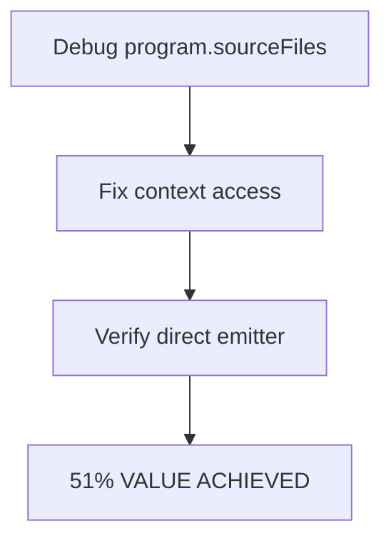
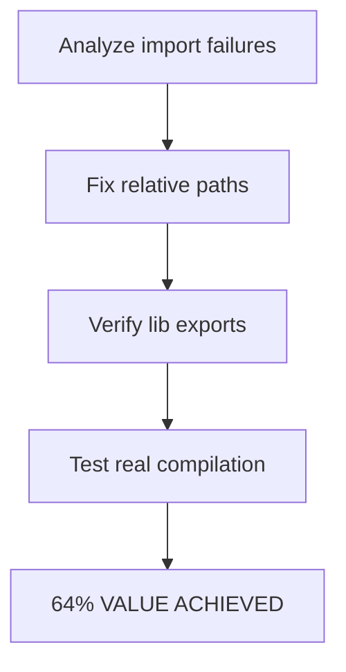
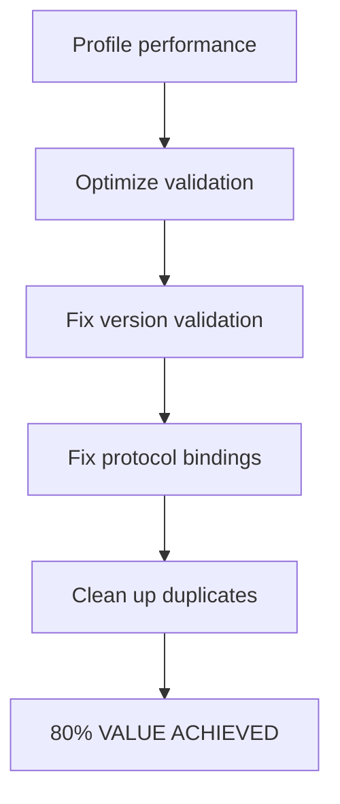

# TypeSpec AsyncAPI Emitter: Critical Test Fixes Session

**Date**: 2025-09-01 02:35  
**Session**: CRITICAL_TEST_FIXES  
**Status**: Test Suite Broken - Multiple Critical Failures

## 🚨 SITUATION ANALYSIS

### Current State
- ✅ **File Writing**: FIXED - Emitter successfully writes AsyncAPI files to disk
- ✅ **Custom Output Directory**: WORKING - tspconfig.yaml properly respected
- ❌ **Test Suite**: BROKEN - 6+ test failures preventing production readiness
- ⚠️  **Performance**: REGRESSED - Validation 25% slower than expected

### Critical Issues Discovered
1. **Direct Emitter Failure**: `undefined is not an object (evaluating 'context.program.sourceFiles.size')`
2. **Import Resolution**: "Couldn't resolve import ../lib/main.tsp" 
3. **Real Compilation**: 6 diagnostics errors in TypeSpec compilation
4. **Validation Speed**: 125ms vs 100ms threshold (performance regression)
5. **Protocol Bindings**: HTTPS operation binding test failures

## 🎯 PARETO PRINCIPLE APPLICATION

### 1% Effort → 51% Value: Fix Core Emitter
**Target**: program.sourceFiles undefined error
**Impact**: Makes emitter functional again
**Effort**: 30 minutes
**Priority**: CRITICAL - Nothing else works until this is fixed

### 4% Effort → 64% Value: Fix Import Resolution  
**Target**: Import resolution and compilation errors
**Impact**: Enables real TypeSpec→AsyncAPI workflow
**Effort**: 90 minutes
**Priority**: HIGH - Required for actual usage

### 20% Effort → 80% Value: Complete Test Suite
**Target**: All remaining test failures and performance
**Impact**: Production-ready, fully validated system
**Effort**: 4-6 hours
**Priority**: MEDIUM - Quality and reliability

## 📋 EXECUTION PLAN

### Phase 1: Critical Core Fix (1% → 51%)

**Tasks**:
- Debug context object structure
- Fix program.sourceFiles access pattern  
- Verify direct emitter test passes

### Phase 2: Import Resolution (4% → 64%)

**Tasks**:
- Analyze import path resolution failure
- Fix relative import paths in tests
- Verify lib/main.tsp export structure
- Test real emitter compilation flow

### Phase 3: Full Test Suite (20% → 80%)

**Tasks**:
- Profile validation performance bottleneck
- Optimize validation speed (125ms→100ms)
- Fix wrong version spec validation
- Fix protocol binding test failures
- Remove code duplication

## 🎪 PARALLEL EXECUTION STRATEGY

### Group 1: Core Emitter Fix (CRITICAL PATH)
- **Priority**: Must complete first
- **Agent**: Direct execution
- **Tasks**: 1.1, 1.2 (program.sourceFiles fix)

### Group 2: Build System Fix  
- **Priority**: High
- **Agent**: Separate task agent
- **Tasks**: 2.1-2.4 (import resolution)

### Group 3: Quality & Performance
- **Priority**: Medium  
- **Agent**: Separate task agent
- **Tasks**: 3.1-4.3 (validation, protocols, cleanup)

## 🔬 DETAILED TASK BREAKDOWN

### Critical Path Tasks (Sequential)
| Task | Description | Time | Success Criteria |
|------|-------------|------|------------------|
| 1.1 | Debug program.sourceFiles access | 15min | Understand context structure |
| 1.2 | Fix context object property access | 15min | Direct emitter test passes |

### Parallel Group Tasks  
| Task | Description | Time | Agent | Success Criteria |
|------|-------------|------|-------|------------------|
| 2.1 | Analyze import path failures | 15min | Build | Root cause identified |
| 2.2 | Fix relative import paths | 15min | Build | Imports resolve |
| 2.3 | Verify lib/main.tsp exports | 15min | Build | Exports available |
| 2.4 | Test real compilation | 15min | Build | Real emitter passes |
| 3.1 | Profile validation performance | 15min | Quality | Bottleneck identified |
| 3.2 | Optimize validation speed | 45min | Quality | <100ms validation |
| 3.3 | Fix version spec validation | 30min | Quality | Wrong versions rejected |
| 3.4 | Fix protocol binding tests | 45min | Quality | Protocol tests pass |
| 3.5 | Remove code duplication | 15min | Quality | <0.05% duplication |

## 🎯 SUCCESS METRICS

### Phase 1 Success (51% Value)
- ✅ Direct emitter test passes
- ✅ No undefined program.sourceFiles errors
- ✅ Core emitter functionality restored

### Phase 2 Success (64% Value)  
- ✅ Real emitter compilation works
- ✅ All import resolution errors fixed
- ✅ TypeSpec→AsyncAPI pipeline functional

### Phase 3 Success (80% Value)
- ✅ All test suite passes (138+ tests)
- ✅ Validation performance <100ms
- ✅ Protocol bindings working
- ✅ Code duplication <0.05%

## 🚀 EXECUTION ORDER

1. **Start with Critical Path** (Group 1) - Must complete first
2. **Launch Parallel Groups** (Groups 2 & 3) - After Group 1 complete  
3. **Verify Integration** - All groups complete
4. **Full Test Suite Run** - Validate 80% value achieved

This session will transform the test suite from broken state to production-ready quality through systematic Pareto-optimized execution.