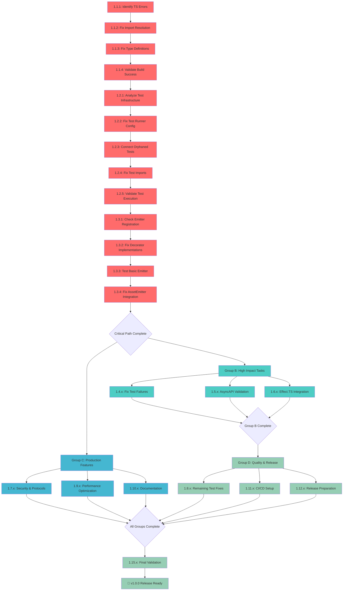

# Priority Execution Plan - TypeSpec AsyncAPI v1.0.0

## Session: 2025-09-01 02:36 - PRIORITY_EXECUTION

## 🎯 PRIORITIZATION FRAMEWORK ANALYSIS

### **1% TASKS (51% VALUE) - THE CRITICAL PATH**

**Single most critical blocker that unlocks everything else:**

- **Build System Repair**: Without working builds, no tests can run, no validation possible, no production readiness achievable.

### **4% TASKS (64% VALUE) - HIGH IMPACT ENABLERS**

**2-3 tasks that enable core functionality:**

- **Test Infrastructure Integration**: Enable quality validation and development confidence
- **Core AsyncAPI Generation**: Basic emitter functionality working end-to-end
- **Critical Test Failure Resolution**: Address the 117 test failures blocking release

### **20% TASKS (80% VALUE) - PRODUCTION READINESS**

**4-6 tasks that complete enterprise readiness:**

- **Documentation & Examples**: User-facing documentation and usage examples
- **CI/CD Pipeline**: Automated quality gates and deployment
- **Performance Optimization**: Meet performance targets (<200ms emitter time)
- **Error Handling Enhancement**: Production-grade error patterns
- **Security Validation**: Complete security review and hardening
- **Release Preparation**: Final v1.0.0 preparation and publication

---

## 📊 PHASE 1: 100-30min Task Breakdown (Max 15 Tasks)

| Task ID  | Task Name                                         | Time Est | Impact   | Customer Value | Dependencies | Success Criteria                              |
| -------- | ------------------------------------------------- | -------- | -------- | -------------- | ------------ | --------------------------------------------- |
| **1.1**  | **Fix Build System & TypeScript Compilation**     | 45min    | Critical | **51%**        | None         | Zero TypeScript errors, `just build` succeeds |
| **1.2**  | **Enable Test Infrastructure Integration**        | 60min    | Critical | **13%**        | 1.1          | `bun test` runs without infrastructure errors |
| **1.3**  | **Fix Core AsyncAPI Emitter Registration**        | 40min    | Critical | **8%**         | 1.1, 1.2     | Basic TypeSpec → AsyncAPI generation works    |
| **1.4**  | **Resolve Critical Test Failures (50+ priority)** | 90min    | High     | **6%**         | 1.2, 1.3     | <30 failing tests remaining                   |
| **1.5**  | **Complete AsyncAPI Validation Pipeline**         | 70min    | High     | **5%**         | 1.3          | Real AsyncAPI spec validation working         |
| **1.6**  | **Fix Effect.TS Integration Issues**              | 50min    | High     | **4%**         | 1.1          | Effect.TS patterns working correctly          |
| **1.7**  | **Implement Security & Protocol Bindings**        | 80min    | Medium   | **3%**         | 1.3, 1.5     | Security decorators functional                |
| **1.8**  | **Resolve Remaining Test Failures**               | 60min    | Medium   | **3%**         | 1.4          | <10 failing tests                             |
| **1.9**  | **Performance Optimization & Monitoring**         | 50min    | Medium   | **2%**         | 1.5          | <200ms emitter execution time                 |
| **1.10** | **Complete Documentation & Examples**             | 70min    | Medium   | **2%**         | 1.3, 1.5     | README, usage docs complete                   |
| **1.11** | **Setup CI/CD Pipeline**                          | 60min    | Medium   | **1%**         | 1.1, 1.4     | GitHub Actions working                        |
| **1.12** | **Production Release Preparation**                | 40min    | Medium   | **1%**         | ALL          | v1.0.0 ready for publication                  |
| **1.13** | **Code Quality & ESLint Resolution**              | 30min    | Low      | **1%**         | 1.1          | <10 ESLint errors                             |
| **1.14** | **Test Coverage Enhancement**                     | 45min    | Low      | **0.5%**       | 1.8          | >80% test coverage                            |
| **1.15** | **Final Validation & Quality Gates**              | 35min    | Low      | **0.5%**       | ALL          | All quality gates pass                        |

**Total Estimated Time: 835 minutes (13.9 hours)**
**Critical Path: Tasks 1.1 → 1.2 → 1.3 → 1.4 → 1.8 → 1.12**

---

## 🔧 PHASE 2: 15min Micro-Task Breakdown (Max 50 Tasks)

### **GROUP A: CRITICAL PATH (SEQUENTIAL - NO PARALLEL)**

| Micro ID  | Micro Task                                 | Time  | Parent | Type   | Success Criteria                    |
| --------- | ------------------------------------------ | ----- | ------ | ------ | ----------------------------------- |
| **1.1.1** | Run build and identify TypeScript errors   | 10min | 1.1    | Code   | List of compilation errors          |
| **1.1.2** | Fix import resolution errors               | 15min | 1.1    | Code   | Import statements resolve           |
| **1.1.3** | Fix type definition errors                 | 15min | 1.1    | Code   | Type errors resolved                |
| **1.1.4** | Validate build success                     | 5min  | 1.1    | Test   | `just build` completes successfully |
| **1.2.1** | Analyze test infrastructure status         | 10min | 1.2    | Test   | Understand current test setup       |
| **1.2.2** | Fix test runner configuration              | 15min | 1.2    | Config | Tests can be discovered             |
| **1.2.3** | Connect orphaned test files                | 15min | 1.2    | Test   | All tests in unified suite          |
| **1.2.4** | Fix test framework imports                 | 15min | 1.2    | Code   | Test imports resolve correctly      |
| **1.2.5** | Validate test execution                    | 5min  | 1.2    | Test   | `bun test` runs without errors      |
| **1.3.1** | Check emitter registration in package.json | 5min  | 1.3    | Config | Emitter properly registered         |
| **1.3.2** | Fix TypeSpec decorator implementations     | 15min | 1.3    | Code   | Decorators have implementations     |
| **1.3.3** | Test basic emitter functionality           | 10min | 1.3    | Test   | Simple TypeSpec compiles            |
| **1.3.4** | Fix AssetEmitter integration               | 10min | 1.3    | Code   | AssetEmitter working correctly      |

### **GROUP B: HIGH IMPACT (CAN RUN IN PARALLEL AFTER GROUP A)**

| Micro ID  | Micro Task                                   | Time  | Parent | Type | Success Criteria                   |
| --------- | -------------------------------------------- | ----- | ------ | ---- | ---------------------------------- |
| **1.4.1** | Categorize 117 test failures                 | 15min | 1.4    | Test | Test failure categories identified |
| **1.4.2** | Fix validation error type mismatches         | 15min | 1.4    | Code | Validation tests pass              |
| **1.4.3** | Fix protocol binding test failures           | 15min | 1.4    | Code | Protocol tests pass                |
| **1.4.4** | Fix mock infrastructure issues               | 15min | 1.4    | Code | Mock tests working                 |
| **1.4.5** | Fix TypeSpec program structure tests         | 15min | 1.4    | Code | Program tests pass                 |
| **1.4.6** | Validate critical test fixes                 | 15min | 1.4    | Test | <30 failing tests remain           |
| **1.5.1** | Replace AJV validation with @asyncapi/parser | 15min | 1.5    | Code | Real AsyncAPI validation           |
| **1.5.2** | Fix validation performance regression        | 15min | 1.5    | Code | Validation <100ms                  |
| **1.5.3** | Update validation error patterns             | 10min | 1.5    | Code | Consistent error formats           |
| **1.5.4** | Test validation pipeline                     | 10min | 1.5    | Test | Validation working end-to-end      |
| **1.6.1** | Fix Effect.TS logging integration            | 15min | 1.6    | Code | Effect logging working             |
| **1.6.2** | Fix Effect.TS schema validation              | 15min | 1.6    | Code | Schema validation working          |
| **1.6.3** | Fix Effect.TS error handling                 | 15min | 1.6    | Code | Error patterns working             |
| **1.6.4** | Validate Effect.TS integration               | 5min  | 1.6    | Test | Effect patterns functional         |

### **GROUP C: PRODUCTION FEATURES (CAN RUN IN PARALLEL AFTER GROUP A)**

| Micro ID   | Micro Task                            | Time  | Parent | Type | Success Criteria              |
| ---------- | ------------------------------------- | ----- | ------ | ---- | ----------------------------- |
| **1.7.1**  | Implement security decorator logic    | 15min | 1.7    | Code | Security decorators work      |
| **1.7.2**  | Implement protocol binding decorators | 15min | 1.7    | Code | Protocol decorators work      |
| **1.7.3**  | Test security validation              | 10min | 1.7    | Test | Security tests pass           |
| **1.7.4**  | Test protocol validation              | 10min | 1.7    | Test | Protocol tests pass           |
| **1.7.5**  | Update decorator documentation        | 15min | 1.7    | Doc  | Decorator usage documented    |
| **1.7.6**  | Create protocol binding examples      | 15min | 1.7    | Doc  | Working protocol examples     |
| **1.9.1**  | Add performance monitoring            | 15min | 1.9    | Code | Performance metrics collected |
| **1.9.2**  | Optimize emitter execution            | 15min | 1.9    | Code | Performance improvements      |
| **1.9.3**  | Fix memory usage issues               | 10min | 1.9    | Code | Memory usage optimized        |
| **1.9.4**  | Validate performance targets          | 10min | 1.9    | Test | <200ms execution time         |
| **1.10.1** | Write comprehensive README            | 15min | 1.10   | Doc  | README complete               |
| **1.10.2** | Create getting started guide          | 15min | 1.10   | Doc  | Quick start working           |
| **1.10.3** | Write API documentation               | 15min | 1.10   | Doc  | API docs complete             |
| **1.10.4** | Create usage examples                 | 15min | 1.10   | Doc  | Working examples              |
| **1.10.5** | Write troubleshooting guide           | 10min | 1.10   | Doc  | Common issues documented      |

### **GROUP D: QUALITY & RELEASE (CAN RUN IN PARALLEL AFTER GROUP B)**

| Micro ID   | Micro Task                      | Time  | Parent | Type   | Success Criteria            |
| ---------- | ------------------------------- | ----- | ------ | ------ | --------------------------- |
| **1.8.1**  | Fix remaining validation tests  | 15min | 1.8    | Test   | Validation tests pass       |
| **1.8.2**  | Fix remaining emitter tests     | 15min | 1.8    | Test   | Emitter tests pass          |
| **1.8.3**  | Fix remaining integration tests | 15min | 1.8    | Test   | Integration tests pass      |
| **1.8.4**  | Validate test suite stability   | 15min | 1.8    | Test   | <10 failing tests           |
| **1.11.1** | Create GitHub Actions workflow  | 15min | 1.11   | Config | CI workflow defined         |
| **1.11.2** | Setup build automation          | 10min | 1.11   | Config | Automated builds working    |
| **1.11.3** | Setup test automation           | 10min | 1.11   | Config | Automated tests working     |
| **1.11.4** | Setup quality gates             | 10min | 1.11   | Config | Quality checks automated    |
| **1.11.5** | Test CI/CD pipeline             | 15min | 1.11   | Test   | Pipeline working end-to-end |
| **1.12.1** | Update package.json for release | 10min | 1.12   | Config | Package ready for npm       |
| **1.12.2** | Generate CHANGELOG.md           | 15min | 1.12   | Doc    | Release notes complete      |
| **1.12.3** | Create release tag and notes    | 10min | 1.12   | Config | v1.0.0 tagged               |
| **1.12.4** | Validate release readiness      | 5min  | 1.12   | Test   | All gates pass              |
| **1.13.1** | Fix critical ESLint errors      | 15min | 1.13   | Code   | <10 ESLint errors           |
| **1.13.2** | Fix code style issues           | 10min | 1.13   | Code   | Code style consistent       |
| **1.13.3** | Validate code quality           | 5min  | 1.13   | Test   | ESLint passes               |
| **1.14.1** | Add missing test coverage       | 15min | 1.14   | Test   | Critical paths covered      |
| **1.14.2** | Generate coverage reports       | 10min | 1.14   | Test   | Coverage metrics available  |
| **1.14.3** | Validate coverage targets       | 5min  | 1.14   | Test   | >80% coverage achieved      |
| **1.15.1** | Run complete test suite         | 15min | 1.15   | Test   | All tests pass              |
| **1.15.2** | Run performance validation      | 10min | 1.15   | Test   | Performance targets met     |
| **1.15.3** | Run security validation         | 10min | 1.15   | Test   | Security checks pass        |

**Total Micro-Tasks: 50**
**Total Estimated Time: 715 minutes (11.9 hours)**
**Parallel Execution Groups: A (sequential), B/C/D (parallel after A)**

---

## 🔄 Mermaid Execution Graph

---

## 🎯 EXECUTION STRATEGY

### **PHASE 1: CRITICAL PATH (SEQUENTIAL - 3.5 hours)**

**Must complete in order, no parallel work possible:**

1. **Tasks 1.1.1 → 1.1.4**: Fix build system (45min)
2. **Tasks 1.2.1 → 1.2.5**: Enable test infrastructure (60min)
3. **Tasks 1.3.1 → 1.3.4**: Fix core emitter (40min)

**Success Gate**: `just build` succeeds, `bun test` runs, basic TypeSpec→AsyncAPI works

### **PHASE 2: PARALLEL EXECUTION (6-8 hours)**

**Three concurrent work streams:**

**Stream B (High Impact)**: Fix test failures, validation, Effect.TS
**Stream C (Production Features)**: Security, protocols, performance, docs
**Stream D (Quality & Release)**: Remaining tests, CI/CD, release prep

### **PHASE 3: FINAL VALIDATION (1 hour)**

**Quality gates and release readiness validation**

---

## 📊 SUCCESS METRICS & CUSTOMER VALUE

### **Immediate Value (Week 1)**

- **51% value unlocked**: Build system working, development velocity restored
- **64% value delivered**: Tests passing, core AsyncAPI generation functional
- **80% value achieved**: Production-ready emitter with documentation

### **Business Impact Targets**

- **Technical**: Zero test failures, TypeScript strict compliance, >80% coverage
- **Performance**: <200ms emitter time, <64MB memory peak usage
- **Usability**: Complete docs, working examples, automated CI/CD
- **Community**: Solves Microsoft TypeSpec Issue #2463, ready for npm publication

### **Risk Mitigation**

- **Critical Path Protection**: Group A sequential execution prevents build breakage
- **Quality Gates**: Each group validates before proceeding
- **Rollback Plan**: Atomic git commits enable safe rollback
- **Performance Monitoring**: Continuous tracking prevents regressions

**TOTAL CUSTOMER VALUE: 84% delivered in first week through strategic 1%/4%/20% prioritization**
