# AsyncAPI Binding Migration Plan

**Session:** 2025-09-01 03:05 - AsyncAPI Binding Migration  
**Objective:** Migrate from custom protocol bindings to AsyncAPI standard bindings  
**Impact:** 80% value delivery through ecosystem alignment and code reduction  

## 🎯 Executive Summary

This plan executes the migration from 5000+ lines of custom protocol binding code to AsyncAPI standard bindings, delivering immediate ecosystem compatibility and resolving 117 test failures. The systematic approach prioritizes the 1% of tasks delivering 51% of value, followed by the 4% delivering 64%, then the remaining 20%.

## 📊 Pareto Analysis Results

### 1% TASKS → 51% VALUE ⚡
**Core Protocol Migration** - Replace custom implementations with AsyncAPI standards
- **Business Impact**: Immediate compatibility with AsyncAPI tooling ecosystem
- **Technical Impact**: Eliminates 2000+ lines of duplicated functionality  
- **Customer Value**: Standard-compliant AsyncAPI documents work with existing tools
- **Effort**: 2 hours focused migration work

### 4% TASKS → 64% VALUE 🔥  
**Infrastructure Cleanup** - Delete custom protocol infrastructure
- **Business Impact**: Resolves 117 test failures, eliminates maintenance burden
- **Technical Impact**: 5000+ lines of code removal, simplified architecture
- **Customer Value**: Reliable build system and predictable behavior
- **Effort**: 4-6 hours systematic cleanup

### 20% TASKS → 80% VALUE 📈
**Production Readiness** - Testing, documentation, optimization, CI/CD
- **Business Impact**: Enterprise-grade package ready for production use
- **Technical Impact**: Complete test coverage, performance optimization, documentation
- **Customer Value**: Professional developer experience with comprehensive support
- **Effort**: 8-12 hours comprehensive finalization

## 🏗️ Architecture Overview

```mermaid
graph TB
    %% Current State (Problems)
    subgraph Current["🚨 CURRENT STATE - PROBLEMS"]
        CustomTypes["Custom Protocol Types<br/>2000+ LOC"]
        CustomValidation["Custom Validation Logic<br/>1500+ LOC"]
        CustomBinding["Custom Binding Factory<br/>1500+ LOC"]
        FailingTests["117 Test Failures<br/>Ecosystem Fragmentation"]
        
        CustomTypes --> CustomValidation
        CustomValidation --> CustomBinding
        CustomBinding --> FailingTests
    end

    %% Migration Process
    subgraph Migration["🔄 MIGRATION PROCESS"]
        Phase1["1% TIER - Core Migration<br/>51% Value - 2 hours"]
        Phase2["4% TIER - Infrastructure Cleanup<br/>64% Value - 4-6 hours"] 
        Phase3["20% TIER - Production Ready<br/>80% Value - 8-12 hours"]
        
        Phase1 --> Phase2
        Phase2 --> Phase3
    end

    %% Target State (Solution)
    subgraph Target["✅ TARGET STATE - SOLUTION"]
        AsyncAPITypes["AsyncAPI Standard Types<br/>@asyncapi/parser"]
        JSONSchemaValid["JSON Schema Validation<br/>Official AsyncAPI Schemas"]
        StandardBindings["Standard Binding Format<br/>Community Maintained"]
        EcosystemCompat["Ecosystem Compatibility<br/>50+ AsyncAPI Tools"]
        
        AsyncAPITypes --> JSONSchemaValid
        JSONSchemaValid --> StandardBindings
        StandardBindings --> EcosystemCompat
    end

    Current --> Migration
    Migration --> Target
```

## 🚀 Execution Plan

### Phase 1: Core Migration (1% → 51% Value) 
**Duration:** 2 hours | **Tasks:** 13 micro tasks

**Critical Success Metrics:**
- ✅ All custom types replaced with `@asyncapi/parser` types
- ✅ Generated bindings validate against AsyncAPI JSON schemas
- ✅ Simple Kafka example produces standard-compliant output

### Phase 2: Infrastructure Cleanup (4% → 64% Value)
**Duration:** 4-6 hours | **Tasks:** 15 micro tasks

**Critical Success Metrics:**
- ✅ 5000+ lines of custom code removed
- ✅ All tests pass with standard AsyncAPI bindings
- ✅ Build system runs cleanly without custom dependencies

### Phase 3: Production Readiness (20% → 80% Value)  
**Duration:** 8-12 hours | **Tasks:** 22 micro tasks

```mermaid
gantt
    title Phase 3 - Production Readiness (80% Value Delivery)
    dateFormat  HH:mm  
    axisFormat %H:%M

    section Documentation
    Update README examples         :doc1, 00:00, 15m
    Update decorator guide         :doc2, after doc1, 15m
    Add AsyncAPI spec links        :doc3, after doc2, 15m

    section Testing & QA
    Run full test suite            :qa1, after doc3, 15m
    Fix import resolution          :qa2, after qa1, 15m
    Fix TypeScript compilation     :qa3, after qa2, 15m
    Fix ESLint errors              :qa4, after qa3, 15m

    section Performance  
    Measure build performance      :perf1, after qa4, 15m
    Optimize memory usage          :perf2, after perf1, 15m
    Update benchmarks              :perf3, after perf2, 15m

    section CI/CD & Release
    Validate CI pipeline           :ci1, after perf3, 15m
    Test NPM publishing            :ci2, after ci1, 15m

    section Examples & Validation
    Update standard examples       :ex1, after ci2, 15m
    Create Kafka example           :ex2, after ex1, 15m
    Create WebSocket example       :ex3, after ex2, 15m
    Clean dependencies            :clean1, after ex3, 15m
    Clean unused imports          :clean2, after clean1, 15m
    Install AsyncAPI CLI          :valid1, after clean2, 15m
    Validate generated specs      :valid2, after valid1, 15m
    Test AsyncAPI Studio          :valid3, after valid2, 15m

    section Final Integration
    Update protocol decorator     :final1, after valid3, 15m
    Final integration test        :final2, after final1, 15m
```

**Critical Success Metrics:**
- ✅ All tests pass consistently  
- ✅ Generated specs validate with `asyncapi validate`
- ✅ Compatible with AsyncAPI Studio and other ecosystem tools
- ✅ CI/CD pipeline runs successfully
- ✅ Performance benchmarks meet or exceed current standards

## 📋 Detailed Task Breakdown

### 1% TIER - CORE MIGRATION (51% Value)

#### Task 1: Replace Custom Protocol Types (90min)
- **M01:** Audit custom protocol types in src/protocol-bindings.ts ⏱️ 15min
- **M02:** Replace KafkaBindingConfig with AsyncAPI types ⏱️ 15min  
- **M03:** Replace WebSocketBindingConfig with AsyncAPI types ⏱️ 15min
- **M04:** Replace HTTPBindingConfig with AsyncAPI types ⏱️ 15min
- **M05:** Replace AMQPBindingConfig with AsyncAPI types ⏱️ 15min
- **M06:** Replace RedisBindingConfig with AsyncAPI types ⏱️ 15min

#### Task 2: Update Emitter to Standard Format (100min)
- **M07:** Update ProtocolBindingFactory to return standard AsyncAPI objects ⏱️ 15min
- **M08:** Modify createChannelBindings to use AsyncAPI binding schemas ⏱️ 15min
- **M09:** Update createOperationBindings for standard format ⏱️ 15min  
- **M10:** Update createMessageBindings for standard format ⏱️ 15min
- **M11:** Update emitter-with-effect.ts protocol binding calls ⏱️ 15min
- **M12:** Test standard binding generation with simple Kafka example ⏱️ 15min
- **M13:** Validate standard binding format against AsyncAPI JSON schema ⏱️ 15min

### 4% TIER - INFRASTRUCTURE CLEANUP (64% Value)

#### Task 3: Delete Custom Protocol Files (60min)
- **M14:** Delete src/protocol-bindings.ts (2000+ lines) ⏱️ 15min
- **M15:** Delete src/bindings/kafka.ts custom implementation ⏱️ 15min
- **M16:** Delete custom validation functions in protocol decorators ⏱️ 15min
- **M17:** Remove custom protocol type exports from index.ts ⏱️ 15min

#### Task 4: Fix Failing Tests (80min) 
- **M18:** Update failing tests in test/protocol-bindings.test.ts ⏱️ 15min
- **M19:** Fix test imports after custom binding removal ⏱️ 15min
- **M20:** Update test expectations to use AsyncAPI standard format ⏱️ 15min
- **M21:** Fix emitter tests that depend on custom binding types ⏱️ 15min
- **M22:** Update validation tests to use AsyncAPI JSON schema ⏱️ 15min

#### Task 5: Update Protocol Binding Factory (70min)
- **M23:** Replace ProtocolBindingFactory with AsyncAPI schema refs ⏱️ 15min
- **M24:** Update createServerBindings to return standard format ⏱️ 15min
- **M25:** Simplify protocol binding creation logic ⏱️ 15min
- **M26:** Remove custom binding validation in favor of JSON Schema ⏱️ 15min

#### Task 6: Remove Custom Validation Logic (50min)
- **M27:** Delete validateKafkaChannelBinding custom function ⏱️ 15min
- **M28:** Remove protocol-specific validation utilities ⏱️ 15min

### 20% TIER - PRODUCTION READINESS (80% Value)

#### Tasks 7-15: Comprehensive Production Preparation (545min)
- **M29-M50:** Documentation, testing, performance, CI/CD, examples, validation, integration ⏱️ 15min each

## 🔄 Parallel Execution Strategy

### Execution Groups for SubAgent Coordination:

**🟢 Group 1 - Core Migration (Tasks M01-M13)**
- Focus: Replace custom types and update emitter logic
- Dependencies: None (can start immediately)  
- Agent: `protocol-migration-expert`

**🟡 Group 2 - Infrastructure Cleanup (Tasks M14-M28)**  
- Focus: Delete custom code and fix tests
- Dependencies: Must wait for Group 1 completion
- Agent: `code-cleanup-specialist`

**🔵 Group 3 - Production Readiness (Tasks M29-M50)**
- Focus: Documentation, testing, validation, release prep
- Dependencies: Can run in parallel with Group 2 (partial)
- Agent: `production-readiness-coordinator`

## 🎯 Success Criteria & Validation

### Phase 1 Validation Gates:
- [ ] All custom protocol types replaced with `@asyncapi/parser` imports
- [ ] Simple test generates valid AsyncAPI 3.0 binding format
- [ ] Generated bindings pass AsyncAPI JSON Schema validation

### Phase 2 Validation Gates:  
- [ ] 5000+ lines of custom code successfully removed
- [ ] Zero TypeScript compilation errors
- [ ] All tests pass with standard binding format
- [ ] Build process completes without custom dependencies

### Phase 3 Validation Gates:
- [ ] `asyncapi validate` passes on generated specifications
- [ ] AsyncAPI Studio can import and display generated specs  
- [ ] CI/CD pipeline runs successfully end-to-end
- [ ] Performance benchmarks meet current standards
- [ ] Documentation reflects standard binding usage

## 📊 Business Impact Metrics

### Immediate Benefits (Phase 1 Complete):
- ✅ **Ecosystem Compatibility**: Generated AsyncAPI specs work with 50+ community tools
- ✅ **Standard Compliance**: Official AsyncAPI 3.0 binding format
- ✅ **Reduced Technical Debt**: Eliminates custom protocol type maintenance

### Short-term Benefits (Phase 2 Complete):  
- ✅ **Build Stability**: 117 test failures resolved
- ✅ **Code Reduction**: 5000+ lines of custom code removed  
- ✅ **Simplified Architecture**: Clear separation between TypeSpec and AsyncAPI concerns

### Long-term Benefits (Phase 3 Complete):
- ✅ **Production Ready**: Enterprise-grade package with comprehensive testing
- ✅ **Developer Experience**: Professional documentation and examples
- ✅ **Community Adoption**: Standard-compliant implementation encourages usage
- ✅ **Maintenance Efficiency**: Leverage AsyncAPI community for binding evolution

## 🚨 Risk Mitigation

### Technical Risks:
- **Breaking Changes**: Maintain backward compatibility through careful type mapping
- **Test Failures**: Systematic test update following standard binding format
- **Performance Regression**: Monitor and optimize after code removal

### Execution Risks:
- **Coordination Complexity**: Clear task dependencies and SubAgent coordination
- **Quality Gates**: Mandatory validation at each phase completion
- **Rollback Plan**: Git-based rollback strategy if critical issues emerge

## 📈 Expected Outcomes

### Code Quality Improvements:
- **-5000 LOC**: Massive reduction in codebase complexity
- **+100% Standard Compliance**: Official AsyncAPI binding format  
- **0 Test Failures**: Stable, reliable build system

### Developer Experience Enhancement:
- **AsyncAPI Ecosystem Compatibility**: Works with all community tools
- **Professional Documentation**: Comprehensive usage guides and examples  
- **Performance Optimization**: Faster builds after code reduction

### Business Value Delivery:
- **Immediate**: Ecosystem compatibility enables tool integration  
- **Short-term**: Stable builds enable reliable development workflow
- **Long-term**: Community-standard implementation drives adoption

---

## 🎬 Execution Command

**Ready to execute systematic migration with parallel SubAgent coordination.**

**Estimated Total Duration:** 14-20 hours  
**Value Delivery Timeline:** 51% → 64% → 80%  
**Quality Gates:** 3 mandatory validation checkpoints  
**Parallel Execution:** 3 coordinated SubAgent groups  

This plan transforms the TypeSpec AsyncAPI emitter from a custom implementation to a community-standard, ecosystem-compatible solution while maintaining all existing functionality and dramatically reducing maintenance burden.