# MULTI-STAGE EXECUTION GRAPH
**Generated:** 2025-09-01_09_22  
**Session:** MERMAID_VISUALIZATION_PLANNING

## 🎯 GITHUB ISSUES & INTERNAL TODOS EXECUTION FLOW

```mermaid
graph TD
    %% RESEARCH PHASE
    R1[🔍 Research: TypeSpec Testing Best Practices #66] --> R2[🔍 Research: AMQP Binding Spec #37]
    R2 --> R3[🔍 Research: MQTT Binding Spec #40] 
    R3 --> R4[🔍 Research: Cloud Protocol Specs #43-45]
    
    %% PHASE 1: CRITICAL FOUNDATION
    A1[🚨 Verify Plugin System Integration - INTERNAL] --> A2[🔥 Replace Mock Infrastructure #61 #66]
    A2 --> A3[⚡ Fix Performance Regression #63]
    A3 --> A4[🧪 Create End-to-End Integration Test - INTERNAL]
    
    %% PHASE 2: CORE FUNCTIONALITY
    A4 --> B1[📂 Split Large Emitter File #25]
    B1 --> B2[🔌 Implement AMQP Protocol #37]
    B2 --> B3[🔌 Implement MQTT Protocol #40]
    B3 --> B4[🔌 Implement Redis Protocol #42]
    B4 --> B5[🧪 Fix Test Suite Instability #51]
    
    %% PHASE 3: PRODUCTION READINESS
    B5 --> C1[📊 Achieve >80% Test Coverage #34]
    C1 --> C2[🚀 Setup CI/CD Pipeline #36]
    C2 --> C3[📚 Complete Documentation #35]
    C3 --> C4[📋 Production Ready Criteria #12]
    
    %% PHASE 4: ADVANCED FEATURES
    C4 --> D1[☁️ AWS SQS/SNS Support #44 #45]
    D1 --> D2[☁️ GCP Pub/Sub Support #43]
    D2 --> D3[🎯 TypeSpec.Versioning Support #1]
    D3 --> D4[🔌 Plugin Architecture RFC #32]
    
    %% PARALLEL TRACKS
    P1[🔧 Enhanced Emitter Logging #59] 
    P2[📁 Automated File Verification #58]
    P3[📖 AssetEmitter Documentation #57]
    P4[🔧 Error Type Hierarchy #54]
    P5[📋 Replace Magic Numbers #53]
    P6[📚 Architectural Documentation #56]
    P7[⚠️ High-Priority TODO Resolution #55]
    
    %% DEPENDENCIES
    R1 --> A2
    R2 --> B2
    R3 --> B3
    R4 --> D1
    
    %% PARALLEL INTEGRATION
    B1 --> P1
    B1 --> P2
    C3 --> P3
    B5 --> P4
    B1 --> P5
    C3 --> P6
    C4 --> P7
    
    %% CRITICAL PATH
    A1 -.->|CRITICAL BLOCKER| A2
    A2 -.->|CRITICAL BLOCKER| A3
    A3 -.->|CRITICAL BLOCKER| A4
    
    %% MILESTONE GATES
    A4 --> M1{Milestone 1: Critical Foundation Complete}
    B5 --> M2{Milestone 2: Core Functionality Complete}
    C4 --> M3{Milestone 3: Production Ready}
    D4 --> M4{Milestone 4: Advanced Features}
    
    %% FINAL VALIDATION
    M4 --> F1[🎯 Final Integration Test - INTERNAL]
    F1 --> F2[📊 Performance Validation - INTERNAL]
    F2 --> F3[✅ Production Sign-Off - INTERNAL]
    
    %% STYLING
    classDef critical fill:#ff6b6b,stroke:#d63031,color:#fff
    classDef high fill:#fdcb6e,stroke:#e17055,color:#000
    classDef medium fill:#74b9ff,stroke:#0984e3,color:#fff
    classDef low fill:#00b894,stroke:#00a085,color:#fff
    classDef milestone fill:#6c5ce7,stroke:#5f3dc4,color:#fff
    classDef research fill:#fd79a8,stroke:#e84393,color:#fff
    classDef parallel fill:#a29bfe,stroke:#6c5ce7,color:#fff
    
    class A1,A2,A3,A4 critical
    class B1,B2,B3,B4,B5 high
    class C1,C2,C3,C4 medium
    class D1,D2,D3,D4 low
    class M1,M2,M3,M4 milestone
    class R1,R2,R3,R4 research
    class P1,P2,P3,P4,P5,P6,P7 parallel
```



## 🔄 EXECUTION STAGES BREAKDOWN

### **🔍 RESEARCH STAGE (Parallel Execution)**
**Duration:** 2-3 hours  
**Purpose:** Gather requirements and specifications

- **#66** TypeSpec Testing Best Practices Research
- **#37** AMQP Binding Specification Analysis  
- **#40** MQTT Binding Specification Analysis
- **#43-45** Cloud Protocol Specifications (AWS SQS/SNS, GCP Pub/Sub)

### **🚨 STAGE 1: CRITICAL FOUNDATION**
**Duration:** 6-8 hours  
**Blockers:** None - highest priority  
**Success Criteria:** Ghost systems eliminated, real testing, performance fixed

#### Critical Path:
1. **INTERNAL** - Verify Plugin System Integration (90min)
2. **#61 #66** - Replace Mock Infrastructure with Real TypeSpec (120min)
3. **#63** - Fix Performance Regression 678ms → <500ms (90min)  
4. **INTERNAL** - Create End-to-End Integration Test (100min)

### **🔧 STAGE 2: CORE FUNCTIONALITY**
**Duration:** 8-12 hours  
**Dependencies:** Stage 1 complete  
**Success Criteria:** Modular architecture, protocol implementations working

#### Sequential Execution:
1. **#25** - Split Large Emitter File (1,250 lines → modules) (90min)
2. **#37** - Implement AMQP Protocol Plugin (120min)
3. **#40** - Implement MQTT Protocol Plugin (100min)
4. **#42** - Implement Redis Protocol Plugin (80min)
5. **#51** - Fix Test Suite Instability (269 → 0 failures) (150min)

### **🚀 STAGE 3: PRODUCTION READINESS**
**Duration:** 6-8 hours  
**Dependencies:** Stage 2 complete  
**Success Criteria:** Production deployment ready

#### Sequential Execution:
1. **#34** - Achieve >80% Test Coverage (100min)
2. **#36** - Setup CI/CD Pipeline (90min)
3. **#35** - Complete Documentation & Examples (120min)
4. **#12** - Production Ready Criteria Validation (60min)

### **📈 STAGE 4: ADVANCED FEATURES**
**Duration:** 8-12 hours  
**Dependencies:** Stage 3 complete  
**Success Criteria:** Enterprise-grade features implemented

#### Sequential Execution:
1. **#44 #45** - AWS SQS/SNS Protocol Support (120min + 100min)
2. **#43** - GCP Pub/Sub Protocol Support (100min)
3. **#1** - TypeSpec.Versioning Support (180min)
4. **#32** - Plugin Architecture RFC Implementation (150min)

### **⚡ PARALLEL STAGE: POLISH & DOCUMENTATION**
**Duration:** 4-6 hours  
**Dependencies:** Can run parallel to Stages 2-4  
**Success Criteria:** Professional polish and documentation

#### Parallel Execution:
- **#59** - Enhanced Emitter Logging (60min)
- **#58** - Automated File System Verification (50min)
- **#57** - AssetEmitter Documentation (70min)
- **#54** - Error Type Hierarchy Implementation (70min)
- **#53** - Replace Magic Numbers with Constants (45min)
- **#56** - Architectural Documentation (90min)
- **#55** - High-Priority TODO Resolution (80min)

---

## 📊 MILESTONE VALIDATION GATES

### **🎯 Milestone 1: Critical Foundation Complete**
**Validation Criteria:**
- [ ] Plugin system verified to work with real TypeSpec compilation
- [ ] Mock infrastructure completely replaced with real TypeSpec objects
- [ ] Performance regression fixed (<500ms validation time)
- [ ] End-to-end integration test passing
- [ ] Zero critical blocking issues remain

### **🎯 Milestone 2: Core Functionality Complete**  
**Validation Criteria:**
- [ ] Large files split into focused modules (<500 lines each)
- [ ] AMQP protocol binding working with real TypeSpec
- [ ] MQTT protocol binding working with real TypeSpec  
- [ ] Redis protocol binding working with real TypeSpec
- [ ] Test suite stability achieved (<10 failing tests)

### **🎯 Milestone 3: Production Ready**
**Validation Criteria:**
- [ ] Test coverage >80% achieved and validated
- [ ] CI/CD pipeline operational and tested
- [ ] Complete documentation with usage examples
- [ ] Production readiness criteria checklist 100% complete
- [ ] Performance targets met consistently

### **🎯 Milestone 4: Advanced Features**
**Validation Criteria:**
- [ ] Cloud protocol bindings (AWS, GCP) operational
- [ ] TypeSpec.Versioning support implemented  
- [ ] Plugin architecture RFC patterns working
- [ ] Community extensibility demonstrated

---

## 🚨 CRITICAL PATH & BLOCKERS

### **CRITICAL PATH SEQUENCE:**
```
Plugin Verification → Mock Replacement → Performance Fix → E2E Test → File Split → Protocols → Production
```

### **POTENTIAL BLOCKERS:**
1. **Plugin System Ghost** - If plugins don't actually integrate with TypeSpec compilation
2. **Test Framework Limits** - If TypeSpec testing framework has limitations
3. **Performance Bottleneck** - If root cause is architectural rather than implementation
4. **Protocol Complexity** - If AMQP/MQTT specifications are more complex than estimated

### **RISK MITIGATION:**
- **Daily checkpoint validation** after each major task
- **Rollback procedures** for each stage if critical issues discovered
- **Alternative approaches** documented for each major component

---

## 📈 BUSINESS VALUE DELIVERY

### **Stage 1 (6-8 hours) → 40% Business Value**
- **Ghost systems eliminated** → Confidence in architecture
- **Real testing foundation** → Development velocity improvement  
- **Performance regression fixed** → User experience improvement

### **Stage 2 (8-12 hours) → 70% Business Value**
- **Modular architecture** → Maintainability and extensibility
- **Core protocol support** → Enterprise messaging systems supported
- **Stable test suite** → Development team confidence

### **Stage 3 (6-8 hours) → 90% Business Value**  
- **Production deployment** → Real user value delivery
- **CI/CD automation** → Development team efficiency
- **Complete documentation** → User adoption enablement

### **Stage 4 (8-12 hours) → 100% Business Value**
- **Enterprise features** → Advanced use case support
- **Community extensibility** → Ecosystem growth potential

**TOTAL ESTIMATED TIME: 28-40 hours**  
**TOTAL ESTIMATED VALUE: Complete TypeSpec AsyncAPI solution**

---

**EXECUTION RECOMMENDATION:** Focus on Stages 1-2 first for maximum impact and risk reduction. Stages 3-4 can be prioritized based on business requirements and timeline constraints.