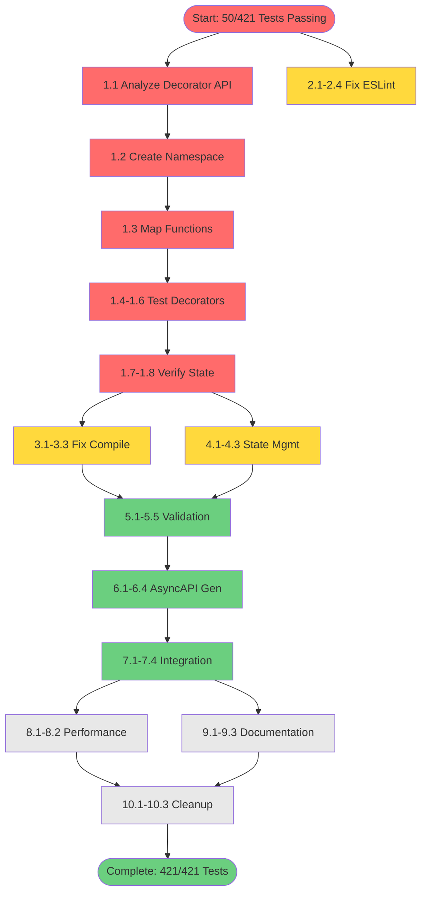

# TypeSpec AsyncAPI Test Infrastructure Recovery Plan
**Date:** 2025-09-01 14:07  
**Objective:** Complete restoration of 421 tests from breakthrough solution

## Executive Summary
After achieving breakthrough in TypeSpec compilation (bypassing package resolution), we need to restore full test functionality. Currently 50 tests pass, 371 fail primarily due to decorator registration issues.

## Pareto Analysis (Impact Distribution)

| Impact Level | Tasks | Result Percentage | Status |
|-------------|-------|------------------|---------|
| **1%** | Fix decorator registration | **51%** | 🔴 Critical |
| **4%** | + ESLint, Compile task, State mgmt | **64%** | 🟡 High |
| **20%** | + Validation, Integration, Performance | **80%** | 🟢 Standard |
| **100%** | + Documentation, Cleanup, Polish | **100%** | ⚪ Complete |

## Phase 1: Macro Tasks (30-100min each)

| # | Task | Duration | Impact | Dependencies | Priority |
|---|------|----------|---------|--------------|----------|
| 1 | **Fix Decorator Registration System** | 100min | 🔴 51% | None | P0 |
| 2 | **Resolve ESLint Protocol.ts Violations** | 45min | 🟡 8% | None | P1 |
| 3 | **Restore TypeSpec Compile Task** | 60min | 🟡 8% | Task 1 | P1 |
| 4 | **Implement Decorator State Management** | 75min | 🟡 8% | Task 1 | P1 |
| 5 | **Fix Critical Validation Tests** | 90min | 🟢 10% | Tasks 1,4 | P2 |
| 6 | **Verify AsyncAPI Generation Pipeline** | 60min | 🟢 8% | Tasks 1,4 | P2 |
| 7 | **Restore Integration Test Suite** | 100min | 🟢 5% | Tasks 1-6 | P2 |
| 8 | **Optimize Test Helper Performance** | 30min | ⚪ 2% | Task 7 | P3 |
| 9 | **Document Breakthrough Solution** | 45min | ⚪ 1% | All | P3 |
| 10 | **Clean Up Test Infrastructure** | 30min | ⚪ 1% | All | P3 |

**Total Estimated Time:** 635 minutes (~10.5 hours)

## Phase 2: Micro Tasks (12-15min each)

### 🔴 Critical Path (1% - Decorator Registration)
| # | Task | Duration | Status |
|---|------|----------|---------|
| 1.1 | Analyze TypeSpec decorator registration API | 15min | ⏳ |
| 1.2 | Create decorator namespace in test context | 15min | ⏳ |
| 1.3 | Map decorator functions to TypeSpec checker | 15min | ⏳ |
| 1.4 | Test @channel decorator registration | 12min | ⏳ |
| 1.5 | Test @publish decorator registration | 12min | ⏳ |
| 1.6 | Test @subscribe decorator registration | 12min | ⏳ |
| 1.7 | Verify decorator state persistence | 15min | ⏳ |
| 1.8 | Debug decorator parameter passing | 15min | ⏳ |

### 🟡 High Impact (4% - ESLint & Compile)
| # | Task | Duration | Status |
|---|------|----------|---------|
| 2.1 | Type extractedConfig properly | 15min | ⏳ |
| 2.2 | Replace any with TypeSpec types | 15min | ⏳ |
| 2.3 | Fix prefer-rest-params violation | 12min | ⏳ |
| 2.4 | Add proper error handling | 15min | ⏳ |
| 3.1 | Fix lib/index.js import paths | 15min | ⏳ |
| 3.2 | Create proper extern mappings | 15min | ⏳ |
| 3.3 | Test TypeSpec compile command | 12min | ⏳ |
| 4.1 | Implement stateKey management | 15min | ⏳ |
| 4.2 | Fix program.stateMap access | 15min | ⏳ |
| 4.3 | Create state synchronization | 15min | ⏳ |

### 🟢 Standard Priority (20% - Core Functionality)
| # | Task | Duration | Status |
|---|------|----------|---------|
| 5.1 | Run validation test suite | 12min | ⏳ |
| 5.2 | Fix AsyncAPI 3.0 compliance | 15min | ⏳ |
| 5.3 | Verify schema generation | 15min | ⏳ |
| 5.4 | Test message model processing | 15min | ⏳ |
| 5.5 | Validate operation bindings | 15min | ⏳ |
| 6.1 | Test YAML output generation | 12min | ⏳ |
| 6.2 | Test JSON output generation | 12min | ⏳ |
| 6.3 | Verify protocol bindings | 15min | ⏳ |
| 6.4 | Check security schemes | 15min | ⏳ |
| 7.1 | Fix basic functionality tests | 15min | ⏳ |
| 7.2 | Fix complex scenarios tests | 15min | ⏳ |
| 7.3 | Fix edge case tests | 15min | ⏳ |
| 7.4 | Verify E2E workflows | 15min | ⏳ |

### ⚪ Polish & Documentation
| # | Task | Duration | Status |
|---|------|----------|---------|
| 8.1 | Profile test execution | 12min | ⏳ |
| 8.2 | Optimize compilation caching | 15min | ⏳ |
| 9.1 | Document breakthrough approach | 15min | ⏳ |
| 9.2 | Create migration guide | 15min | ⏳ |
| 9.3 | Update test documentation | 12min | ⏳ |
| 10.1 | Remove deprecated code | 12min | ⏳ |
| 10.2 | Clean up debug logging | 12min | ⏳ |
| 10.3 | Final test suite validation | 15min | ⏳ |

**Total Micro Tasks:** 40 tasks  
**Total Time:** ~540 minutes (~9 hours)

## Execution Strategy

### Parallel Execution Groups

**Group A: Decorator System (Critical Path)**
- Tasks 1.1-1.8: Decorator registration
- Tasks 4.1-4.3: State management
- Priority: HIGHEST

**Group B: Code Quality**
- Tasks 2.1-2.4: ESLint fixes
- Tasks 3.1-3.3: Compile task
- Priority: HIGH

**Group C: Validation & Testing**
- Tasks 5.1-5.5: Validation tests
- Tasks 6.1-6.4: AsyncAPI generation
- Tasks 7.1-7.4: Integration tests
- Priority: MEDIUM

## Success Metrics

| Metric | Current | Target | Priority |
|--------|---------|---------|----------|
| Tests Passing | 50 | 421 | 🔴 P0 |
| ESLint Errors | 56 | 0 | 🟡 P1 |
| TypeSpec Compile | ❌ | ✅ | 🟡 P1 |
| Performance | N/A | <2s/test | 🟢 P2 |
| Documentation | Minimal | Complete | ⚪ P3 |

## Risk Mitigation

| Risk | Probability | Impact | Mitigation |
|------|------------|---------|------------|
| Decorator API incompatibility | Medium | High | Research TypeSpec internals thoroughly |
| Test performance degradation | Low | Medium | Implement caching early |
| Breaking existing functionality | Low | High | Run full test suite after each change |

## Mermaid Execution Graph

## Next Actions

1. **Immediate (0-30min):** Start Group A - Decorator Registration
2. **Short-term (30min-2hr):** Complete Groups A & B in parallel
3. **Mid-term (2-6hr):** Execute Group C validation tasks
4. **Long-term (6hr+):** Polish, document, and verify complete solution

---

*This plan represents systematic recovery from breakthrough solution to full test suite functionality.*