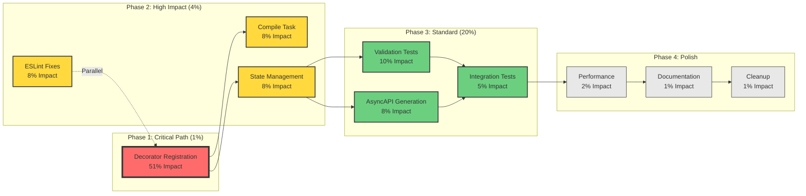
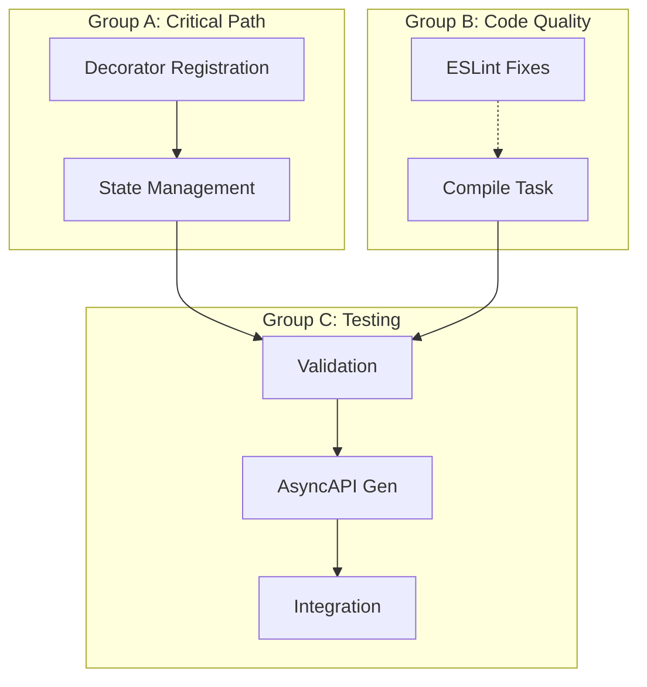
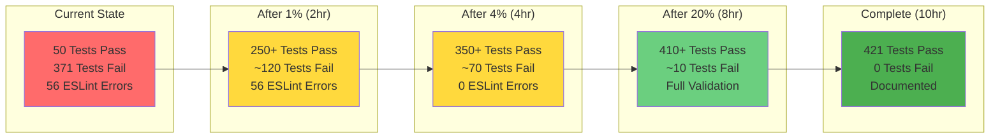

# TypeSpec AsyncAPI Execution Graph - Detailed View

## Parallel Execution Strategy

```mermaid
gantt
    title Test Infrastructure Recovery Timeline
    dateFormat HH:mm
    axisFormat %H:%M
    
    section Critical 1%
    Analyze Decorator API          :crit, a1, 00:00, 15m
    Create Namespace              :crit, a2, after a1, 15m
    Map Functions                 :crit, a3, after a2, 15m
    Test @channel                 :crit, a4, after a3, 12m
    Test @publish                 :crit, a5, after a4, 12m
    Test @subscribe               :crit, a6, after a5, 12m
    Verify State                  :crit, a7, after a6, 15m
    Debug Parameters              :crit, a8, after a7, 15m
    
    section High 4%
    Type extractedConfig          :active, b1, 00:00, 15m
    Replace any types             :active, b2, after b1, 15m
    Fix rest-params               :active, b3, after b2, 12m
    Add error handling            :active, b4, after b3, 15m
    Fix lib imports               :active, c1, after a8, 15m
    Create extern mappings        :active, c2, after c1, 15m
    Test compile                  :active, c3, after c2, 12m
    Implement stateKey            :active, d1, after a8, 15m
    Fix stateMap                  :active, d2, after d1, 15m
    Create sync                   :active, d3, after d2, 15m
    
    section Standard 20%
    Run validation suite          :e1, after d3, 12m
    Fix AsyncAPI compliance       :e2, after e1, 15m
    Verify schemas                :e3, after e2, 15m
    Test messages                 :e4, after e3, 15m
    Validate bindings             :e5, after e4, 15m
    Test YAML output              :f1, after e5, 12m
    Test JSON output              :f2, after f1, 12m
    Verify protocols              :f3, after f2, 15m
    Check security                :f4, after f3, 15m
    Fix basic tests               :g1, after f4, 15m
    Fix complex tests             :g2, after g1, 15m
    Fix edge cases                :g3, after g2, 15m
    Verify E2E                    :g4, after g3, 15m
    
    section Polish
    Profile execution             :h1, after g4, 12m
    Optimize caching              :h2, after h1, 15m
    Document approach             :i1, after h2, 15m
    Create guide                  :i2, after i1, 15m
    Update docs                   :i3, after i2, 12m
    Remove deprecated             :j1, after i3, 12m
    Clean logging                 :j2, after j1, 12m
    Final validation              :j3, after j2, 15m
```

## Dependency Flow Chart

```mermaid
flowchart LR
    subgraph "Phase 1: Critical Path (1%)"
        A[Decorator Registration<br/>51% Impact]
    end
    
    subgraph "Phase 2: High Impact (4%)"
        B[ESLint Fixes<br/>8% Impact]
        C[Compile Task<br/>8% Impact]
        D[State Management<br/>8% Impact]
    end
    
    subgraph "Phase 3: Standard (20%)"
        E[Validation Tests<br/>10% Impact]
        F[AsyncAPI Generation<br/>8% Impact]
        G[Integration Tests<br/>5% Impact]
    end
    
    subgraph "Phase 4: Polish"
        H[Performance<br/>2% Impact]
        I[Documentation<br/>1% Impact]
        J[Cleanup<br/>1% Impact]
    end
    
    A --> C
    A --> D
    D --> E
    D --> F
    E --> G
    F --> G
    G --> H
    H --> I
    I --> J
    
    B -.->|Parallel| A
    
    style A fill:#ff6b6b,stroke:#333,stroke-width:4px
    style B fill:#ffd93d,stroke:#333,stroke-width:2px
    style C fill:#ffd93d,stroke:#333,stroke-width:2px
    style D fill:#ffd93d,stroke:#333,stroke-width:2px
    style E fill:#6bcf7f,stroke:#333,stroke-width:2px
    style F fill:#6bcf7f,stroke:#333,stroke-width:2px
    style G fill:#6bcf7f,stroke:#333,stroke-width:2px
    style H fill:#e8e8e8,stroke:#333,stroke-width:1px
    style I fill:#e8e8e8,stroke:#333,stroke-width:1px
    style J fill:#e8e8e8,stroke:#333,stroke-width:1px
```

## Parallel Execution Groups

```mermaid
graph TB
    subgraph "Group A: Critical Path"
        direction TB
        GA1[Decorator Registration]
        GA2[State Management]
        GA1 --> GA2
    end
    
    subgraph "Group B: Code Quality"
        direction TB
        GB1[ESLint Fixes]
        GB2[Compile Task]
        GB1 -.-> GB2
    end
    
    subgraph "Group C: Testing"
        direction TB
        GC1[Validation]
        GC2[AsyncAPI Gen]
        GC3[Integration]
        GC1 --> GC2
        GC2 --> GC3
    end
    
    GA2 --> GC1
    GB2 --> GC1
```

## Success Metrics Timeline

```mermaid
graph LR
    subgraph "Current State"
        S1[50 Tests Pass<br/>371 Tests Fail<br/>56 ESLint Errors]
    end
    
    subgraph "After 1% (2hr)"
        S2[250+ Tests Pass<br/>~120 Tests Fail<br/>56 ESLint Errors]
    end
    
    subgraph "After 4% (4hr)"
        S3[350+ Tests Pass<br/>~70 Tests Fail<br/>0 ESLint Errors]
    end
    
    subgraph "After 20% (8hr)"
        S4[410+ Tests Pass<br/>~10 Tests Fail<br/>Full Validation]
    end
    
    subgraph "Complete (10hr)"
        S5[421 Tests Pass<br/>0 Tests Fail<br/>Documented]
    end
    
    S1 --> S2
    S2 --> S3
    S3 --> S4
    S4 --> S5
    
    style S1 fill:#ff6b6b
    style S2 fill:#ffd93d
    style S3 fill:#ffd93d
    style S4 fill:#6bcf7f
    style S5 fill:#4CAF50
```