# 🎯 ALPHA v0.1.0 PARETO EXECUTION PLAN

**Date:** 2025-09-01 18:16 CEST  
**Session:** Alpha v0.1.0 Final Sprint - Pareto Optimized Execution

## 📊 PARETO ANALYSIS BREAKDOWN

### 🔴 1% TASKS → 51% IMPACT (CRITICAL PATH)

**THE GOLDEN 1%** - Absolute blockers for Alpha v0.1.0 release:

1. **Create Manual Decorator Registration Function** (15min)
   - **Impact:** CRITICAL - Enables 562+ tests to recognize decorators
   - **Effort:** LOW - Single function export in `src/decorators/index.ts`
   - **Customer Value:** HIGH - Unblocks entire test suite
   - **Blocker:** Without this, NO tests pass, NO Alpha possible

### 🟡 4% TASKS → 64% IMPACT (HIGH PRIORITY CORE)

**THE VITAL 4%** - Core functionality enabling Alpha release:

2. **Fix ESLint Error in security.ts** (5min)
   - **Impact:** HIGH - Enables clean build pipeline
   - **Effort:** VERY LOW - Single line optional-chain fix
   - **Customer Value:** MEDIUM - Quality gate compliance

3. **Execute Alpha Manual Validation Checklist** (30min)
   - **Impact:** HIGH - Verifies end-to-end AsyncAPI generation works
   - **Effort:** MEDIUM - Follow documented validation steps
   - **Customer Value:** CRITICAL - Proves Alpha readiness

4. **Update Package Version to 0.1.0-alpha** (10min)
   - **Impact:** HIGH - Correct versioning for Alpha release
   - **Effort:** LOW - package.json update + validation
   - **Customer Value:** HIGH - Clear Alpha release signal

### 🟢 20% TASKS → 80% IMPACT (COMPLETION SET)

**THE IMPORTANT 20%** - Completing professional Alpha release:

5. **Eliminate Code Duplication** (45min)
   - **Impact:** MEDIUM - Code maintainability and quality
   - **Effort:** MEDIUM - Fix 4 duplicate blocks via refactoring
   - **Customer Value:** LOW - Internal quality improvement

6. **Comprehensive Quality Check Pipeline** (20min)
   - **Impact:** MEDIUM - Validates all systems working
   - **Effort:** LOW - Run build + lint + test suite
   - **Customer Value:** MEDIUM - Confidence in release quality

7. **Test Suite Restoration Verification** (60min)
   - **Impact:** MEDIUM - Proves test infrastructure fixes work
   - **Effort:** HIGH - Debug and fix remaining test failures
   - **Customer Value:** MEDIUM - Development velocity improvement

## 🎯 DETAILED EXECUTION BREAKDOWN

### Phase 1: CRITICAL PATH (1% → 51% Impact) - 15 minutes

#### Task 1.1: Create Manual Decorator Registration Function (15min)

**File:** `src/decorators/index.ts`
**Action:** Export `createAsyncAPIDecorators(program)` function
**Dependencies:** None
**Success Criteria:** Function exists, can be imported by test-helpers.ts

### Phase 2: HIGH PRIORITY CORE (4% → 64% Impact) - 45 minutes

#### Task 2.1: Fix ESLint Error (5min)

**File:** `src/decorators/security.ts:167`
**Action:** Replace `condition && condition.property` with `condition?.property`
**Dependencies:** None
**Success Criteria:** `just lint` passes with zero errors

#### Task 2.2: Execute Alpha Validation Checklist (30min)

**Steps:**

1. Clean build verification (5min)
2. Create test TypeSpec file (5min)
3. Compile with emitter (10min)
4. Validate AsyncAPI output (10min)
   **Dependencies:** Task 1.1 completed
   **Success Criteria:** Valid AsyncAPI 3.0 output generated and validated

#### Task 2.3: Update Package Version (10min)

**File:** `package.json`
**Action:** Change version from "1.0.0-rc.1" to "0.1.0-alpha"
**Dependencies:** None
**Success Criteria:** Version updated, npm pack succeeds

### Phase 3: COMPLETION SET (20% → 80% Impact) - 125 minutes

#### Task 3.1: Eliminate Code Duplication (45min)

**Locations:**

- `src/utils/typespec-helpers.ts` (2 clones) - 15min
- `src/performance/memory-monitor.ts` (2 clones) - 15min
- `src/decorators/server.ts` (1 clone) - 10min
- `src/decorators/publish.ts` (1 clone) - 5min
  **Dependencies:** None
  **Success Criteria:** `just find-duplicates` reports <2 duplicates

#### Task 3.2: Quality Check Pipeline (20min)

**Steps:**

1. Clean build (`just clean && just build`) - 5min
2. Lint check (`just lint`) - 2min
3. Type check (`just typecheck`) - 3min
4. Test execution (`just test`) - 10min
   **Dependencies:** Tasks 1.1, 2.1 completed
   **Success Criteria:** All pipeline steps pass

#### Task 3.3: Test Suite Restoration (60min)

**Actions:**

1. Verify decorator registration in tests - 20min
2. Fix remaining test import issues - 20min
3. Validate test categories working - 20min
   **Dependencies:** Task 1.1 completed
   **Success Criteria:** >70% tests passing, critical test categories functional

## 🚀 EXECUTION PLAN SUMMARY

**Total Estimated Time:** 185 minutes (3 hours 5 minutes)
**Critical Path:** 15 minutes to Alpha readiness
**Parallel Execution Opportunities:**

- Group A: Tasks 2.1, 2.3 (ESLint + version update)
- Group B: Task 3.1 (code deduplication)
- Group C: Tasks 2.2, 3.2, 3.3 (validation + quality checks)

## 📈 SUCCESS METRICS

**Alpha v0.1.0 READY when:**

- [x] Manual decorator registration function exists
- [x] ESLint pipeline clean (0 errors)
- [x] Package version set to 0.1.0-alpha
- [x] Manual validation checklist passes 100%
- [x] Valid AsyncAPI 3.0 output generated
- [x] Core test categories functional
- [x] Build + lint + typecheck pipeline green

## 🎖️ IMPACT VALIDATION

**51% Impact Achieved:** Core decorator registration enables test suite
**64% Impact Achieved:** Clean build + validation + correct versioning
**80% Impact Achieved:** Professional quality + comprehensive testing

**GOAL:** Transform from "broken test suite" to "Alpha-ready AsyncAPI emitter" in <4 hours with systematic Pareto execution.

## 📋 MICRO-TASK BREAKDOWN (15min each)

| Priority                        | Task                                                                    | Time  | Impact   | Effort   | Customer Value | Dependencies |
| ------------------------------- | ----------------------------------------------------------------------- | ----- | -------- | -------- | -------------- | ------------ |
| **🔴 CRITICAL (1% → 51%)**      |
| P1                              | Create `createAsyncAPIDecorators()` function in src/decorators/index.ts | 15min | CRITICAL | LOW      | HIGH           | None         |
| **🟡 HIGH PRIORITY (4% → 64%)** |
| P2                              | Fix ESLint optional-chain error in security.ts:167                      | 5min  | HIGH     | VERY LOW | MEDIUM         | None         |
| P3                              | Update package.json version to 0.1.0-alpha                              | 10min | HIGH     | LOW      | HIGH           | None         |
| P4                              | Clean build verification (just clean && just build)                     | 5min  | HIGH     | LOW      | HIGH           | P1, P2       |
| P5                              | Create Alpha test TypeSpec file                                         | 5min  | HIGH     | LOW      | CRITICAL       | P1           |
| P6                              | Compile TypeSpec with AsyncAPI emitter                                  | 10min | HIGH     | MEDIUM   | CRITICAL       | P4, P5       |
| P7                              | Validate generated AsyncAPI output with parser                          | 10min | HIGH     | MEDIUM   | CRITICAL       | P6           |
| **🟢 COMPLETION (20% → 80%)**   |
| P8                              | Fix code duplication in src/utils/typespec-helpers.ts                   | 15min | MEDIUM   | MEDIUM   | LOW            | None         |
| P9                              | Fix code duplication in src/performance/memory-monitor.ts               | 15min | MEDIUM   | MEDIUM   | LOW            | None         |
| P10                             | Fix code duplication in src/decorators/server.ts                        | 10min | MEDIUM   | LOW      | LOW            | None         |
| P11                             | Fix code duplication in src/decorators/publish.ts                       | 5min  | MEDIUM   | LOW      | LOW            | None         |
| P12                             | Run lint pipeline verification                                          | 2min  | MEDIUM   | VERY LOW | MEDIUM         | P2, P8-P11   |
| P13                             | Run type check pipeline verification                                    | 3min  | MEDIUM   | VERY LOW | MEDIUM         | P1           |
| P14                             | Execute test suite with decorator registration                          | 10min | MEDIUM   | MEDIUM   | MEDIUM         | P1           |
| P15                             | Verify breakthrough test categories working                             | 20min | MEDIUM   | HIGH     | MEDIUM         | P14          |
| P16                             | Debug and fix remaining test failures                                   | 30min | MEDIUM   | HIGH     | MEDIUM         | P15          |

**Total Tasks:** 16  
**Total Time:** 170 minutes (2h 50min)  
**Parallel Execution Groups:**

- **Group A (Critical Path):** P1 → P4 → P5 → P6 → P7 (45min sequential)
- **Group B (Quality):** P2, P3, P8, P9, P10, P11 (50min parallel)
- **Group C (Validation):** P12, P13, P14, P15, P16 (75min after Group A+B)

## 🔄 EXECUTION FLOW DIAGRAM

```mermaid
graph TD
    Start([🚀 Start Alpha Sprint]) --> P1[P1: Create Decorator Function<br/>15min - CRITICAL]

    P1 --> GroupB[🟡 Group B: Quality Tasks<br/>Parallel Execution]
    P1 --> GroupA[🔴 Group A: Critical Path<br/>Sequential Execution]

    GroupB --> P2[P2: Fix ESLint Error<br/>5min]
    GroupB --> P3[P3: Update Package Version<br/>10min]
    GroupB --> P8[P8: Fix Duplicates typespec-helpers<br/>15min]
    GroupB --> P9[P9: Fix Duplicates memory-monitor<br/>15min]
    GroupB --> P10[P10: Fix Duplicates server.ts<br/>10min]
    GroupB --> P11[P11: Fix Duplicates publish.ts<br/>5min]

    GroupA --> P4[P4: Clean Build Verification<br/>5min]
    P4 --> P5[P5: Create Test TypeSpec File<br/>5min]
    P5 --> P6[P6: Compile with Emitter<br/>10min]
    P6 --> P7[P7: Validate AsyncAPI Output<br/>10min]

    P2 --> GroupC[🟢 Group C: Final Validation]
    P3 --> GroupC
    P7 --> GroupC
    P8 --> GroupC
    P9 --> GroupC
    P10 --> GroupC
    P11 --> GroupC

    GroupC --> P12[P12: Lint Pipeline Check<br/>2min]
    GroupC --> P13[P13: Type Check Pipeline<br/>3min]
    P12 --> P14[P14: Test Suite Execution<br/>10min]
    P13 --> P14
    P14 --> P15[P15: Verify Test Categories<br/>20min]
    P15 --> P16[P16: Debug Remaining Failures<br/>30min]

    P16 --> Success([🎉 Alpha v0.1.0 READY!])

    classDef critical fill:#ff6b6b,stroke:#333,stroke-width:3px,color:#fff
    classDef high fill:#4ecdc4,stroke:#333,stroke-width:2px,color:#fff
    classDef medium fill:#45b7d1,stroke:#333,stroke-width:1px,color:#fff
    classDef success fill:#96ceb4,stroke:#333,stroke-width:3px,color:#fff

    class P1 critical
    class P2,P3,P4,P5,P6,P7 high
    class P8,P9,P10,P11,P12,P13,P14,P15,P16 medium
    class Success success
```

## ⚡ PARALLEL EXECUTION STRATEGY

### 🎯 Phase 1: Critical Foundation (15min)

- **Task 1:** Create decorator registration function (SEQUENTIAL - BLOCKS EVERYTHING)

### 🎯 Phase 2: Parallel Sprint (50min)

- **Agent A:** P2, P3 (ESLint + version) - 15min
- **Agent B:** P8, P9 (major duplications) - 30min
- **Agent C:** P4 → P5 → P6 → P7 (validation chain) - 30min

### 🎯 Phase 3: Final Validation (75min)

- **Agent A:** P10, P11, P12 (minor fixes + lint) - 17min
- **Agent B:** P13, P14 (type check + tests) - 13min
- **Agent C:** P15 → P16 (test debugging) - 50min

## 🏆 SUCCESS CRITERIA MATRIX

| Milestone       | Criteria                       | Validation Method                          |
| --------------- | ------------------------------ | ------------------------------------------ |
| **51% Impact**  | Decorator registration working | `bun test` shows decorator recognition     |
| **64% Impact**  | Clean build + validation       | Manual checklist passes 100%               |
| **80% Impact**  | Professional quality           | All pipelines green, duplicates eliminated |
| **Alpha Ready** | End-to-end functionality       | Real AsyncAPI generated and validated      |

**EXECUTION COMMAND:** Deploy 3 parallel agents after P1 completion, systematic validation at each milestone.
