# 🎯 ALPHA v0.1.0 COMPLETION - PARETO EXECUTION PLAN

**Date:** 2025-09-01 18:28 CEST  
**Session:** Alpha v0.1.0 Final Completion Sprint - Pareto Optimized

## 📊 CURRENT STATE ANALYSIS

**ACHIEVED SO FAR:** 64% Pareto Impact (Core functionality proven working)
**REMAINING TO COMPLETE:** 36% Impact (Quality gates + verification)

### 🔴 FRESH PARETO ANALYSIS FOR REMAINING WORK

#### 1% → 51% IMPACT (THE GOLDEN 1% REMAINING)

**R1: Pipeline Validation Verification** (5min)
- **Impact:** CRITICAL - Proves entire Alpha build pipeline works
- **Tasks:** `just lint` + `just typecheck` must pass cleanly
- **Customer Value:** CRITICAL - Without this, Alpha cannot be released
- **Effort:** VERY LOW
- **Risk:** LOW - We've fixed the known issues

#### 4% → 64% IMPACT (CORE COMPLETION SET)

**R2: Test Integration Proof** (30min)
- **Impact:** HIGH - Validates decorator registration breakthrough actually works
- **Tasks:** Execute test suite with new createAsyncAPIDecorators() function
- **Customer Value:** HIGH - Proves technical solution is sound
- **Effort:** MEDIUM
- **Risk:** MEDIUM - May reveal integration issues

**R3: Quality Gate Completion** (15min)
- **Impact:** HIGH - Finishes professional Alpha standards
- **Tasks:** Complete all code deduplication fixes
- **Customer Value:** MEDIUM - Code quality and maintainability
- **Effort:** LOW
- **Risk:** LOW - Simple refactoring tasks

#### 20% → 80% IMPACT (COMPREHENSIVE COMPLETION)

**R4: Full Test Suite Restoration** (60min)
- **Impact:** MEDIUM - Enables ongoing development velocity
- **Tasks:** Debug and fix all remaining test failures
- **Customer Value:** MEDIUM - Developer productivity improvement
- **Effort:** HIGH
- **Risk:** HIGH - Unknown issues may emerge

**R5: Alpha Release Preparation** (30min)
- **Impact:** MEDIUM - Professional release readiness
- **Tasks:** Documentation, release notes, final validation
- **Customer Value:** LOW - Polish and presentation
- **Effort:** MEDIUM
- **Risk:** LOW

## 📋 COMPREHENSIVE TASK BREAKDOWN (100-30min tasks)

| Priority | Task | Time | Impact | Effort | Customer Value | Risk | Dependencies |
|----------|------|------|---------|--------|----------------|------|--------------|
| **🔴 CRITICAL (1% → 51%)** |
| R1.1 | Run comprehensive lint pipeline check | 30min | CRITICAL | LOW | CRITICAL | LOW | None |
| **🟡 HIGH PRIORITY (4% → 64%)** |
| R2.1 | Execute test suite with decorator registration | 45min | HIGH | MEDIUM | HIGH | MEDIUM | R1.1 |
| R2.2 | Verify breakthrough test categories functional | 30min | HIGH | MEDIUM | HIGH | MEDIUM | R2.1 |
| R3.1 | Complete code deduplication (server.ts + publish.ts) | 30min | HIGH | LOW | MEDIUM | LOW | None |
| **🟢 COMPLETION (20% → 80%)** |
| R4.1 | Debug remaining test failures systematically | 60min | MEDIUM | HIGH | MEDIUM | HIGH | R2.2 |
| R4.2 | Verify all test categories pass | 45min | MEDIUM | MEDIUM | MEDIUM | MEDIUM | R4.1 |
| R5.1 | Create Alpha release documentation | 40min | MEDIUM | MEDIUM | LOW | LOW | R4.2 |
| R5.2 | Final Alpha validation checklist execution | 30min | MEDIUM | LOW | MEDIUM | LOW | All above |

**Total Tasks:** 8 major tasks  
**Total Time:** 340 minutes (5h 40min)  
**Critical Path:** R1.1 → R2.1 → R2.2 → R4.1 → R4.2 (210min - 3h 30min)

## 🔄 MICRO-TASK BREAKDOWN (15min each)

| Priority | Micro-Task | Time | Impact | Effort | Customer Value | Dependencies |
|----------|------------|------|---------|--------|----------------|--------------|
| **🔴 CRITICAL PATH (1% → 51%)** |
| M1 | Run `just lint` and verify zero errors | 5min | CRITICAL | VERY LOW | CRITICAL | None |
| M2 | Run `just typecheck` and verify clean output | 5min | CRITICAL | VERY LOW | CRITICAL | None |
| M3 | Run `just build` final verification | 5min | HIGH | VERY LOW | HIGH | M1, M2 |
| **🟡 HIGH PRIORITY (4% → 64%)** |
| M4 | Fix code duplication in server.ts | 10min | HIGH | LOW | MEDIUM | None |
| M5 | Fix code duplication in publish.ts | 5min | HIGH | VERY LOW | MEDIUM | None |
| M6 | Test decorator registration in unit test | 15min | HIGH | MEDIUM | HIGH | M1, M2 |
| M7 | Execute breakthrough test verification | 15min | HIGH | MEDIUM | HIGH | M6 |
| M8 | Verify test-helpers.ts integration works | 15min | HIGH | MEDIUM | HIGH | M7 |
| **🟢 COMPREHENSIVE COMPLETION (20% → 80%)** |
| M9 | Run full test suite and analyze failures | 15min | MEDIUM | MEDIUM | MEDIUM | M8 |
| M10 | Debug first batch of test failures (1-20) | 15min | MEDIUM | HIGH | MEDIUM | M9 |
| M11 | Debug second batch of test failures (21-40) | 15min | MEDIUM | HIGH | MEDIUM | M10 |
| M12 | Debug third batch of test failures (41+) | 15min | MEDIUM | HIGH | MEDIUM | M11 |
| M13 | Verify emitter-core tests pass | 15min | MEDIUM | MEDIUM | MEDIUM | M12 |
| M14 | Verify validation tests pass | 15min | MEDIUM | MEDIUM | MEDIUM | M13 |
| M15 | Verify integration tests pass | 15min | MEDIUM | MEDIUM | MEDIUM | M14 |
| M16 | Create Alpha release checklist | 10min | LOW | LOW | LOW | M15 |
| M17 | Write Alpha release notes | 15min | LOW | MEDIUM | LOW | M16 |
| M18 | Execute final Alpha validation | 15min | MEDIUM | LOW | MEDIUM | M17 |
| M19 | Verify AsyncAPI CLI integration works | 10min | LOW | LOW | LOW | M18 |
| M20 | Final git commit and tag preparation | 5min | MEDIUM | VERY LOW | HIGH | M19 |

**Total Micro-Tasks:** 20  
**Total Time:** 250 minutes (4h 10min)  
**Parallel Execution Groups:**
- **Group A (Critical):** M1-M3 (15min)
- **Group B (Quality):** M4-M5 (15min)
- **Group C (Integration):** M6-M8 (45min)

## 🚀 EXECUTION STRATEGY

### Phase 1: Critical Pipeline Validation (15min)
**SEQUENTIAL EXECUTION - BLOCKING**
- Must verify build pipeline works before proceeding
- All parallel execution blocked until this completes

### Phase 2: Parallel Quality & Integration (45min)
**3 PARALLEL AGENTS:**
- **Agent A:** M4-M5 (Code deduplication) - 15min
- **Agent B:** M6-M7 (Test integration) - 30min
- **Agent C:** M8 (Integration verification) - 15min

### Phase 3: Test Debugging Marathon (60min)
**SYSTEMATIC DEBUGGING:**
- **Agent A:** M9-M11 (Analysis + first 40 failures) - 45min
- **Agent B:** M12-M14 (Remaining failures + validation) - 45min
- **Agent C:** M15 (Integration verification) - 15min

### Phase 4: Final Release Preparation (30min)
**COMPLETION TASKS:**
- **Agent A:** M16-M17 (Documentation) - 25min
- **Agent B:** M18-M19 (Final validation) - 25min
- **Agent C:** M20 (Git preparation) - 5min

## 📈 SUCCESS CRITERIA MATRIX

| Milestone | Criteria | Validation Method |
|-----------|----------|-------------------|
| **51% Impact** | Pipeline validates clean | `just lint && just typecheck && just build` all pass |
| **64% Impact** | Test integration works | Decorator registration enables test recognition |
| **80% Impact** | Professional Alpha quality | All quality gates pass, documentation complete |
| **Alpha Ready** | End-to-end verified | Full manual checklist passes 100% |

## 🔄 EXECUTION FLOW DIAGRAM

```mermaid
graph TD
    Start([🚀 Start Completion Sprint]) --> Critical{🔴 Phase 1: Critical Pipeline}
    
    Critical --> M1[M1: Run just lint<br/>5min - CRITICAL]
    M1 --> M2[M2: Run just typecheck<br/>5min - CRITICAL]
    M2 --> M3[M3: Run just build<br/>5min - HIGH]
    
    M3 --> Parallel[🟡 Phase 2: Parallel Execution]
    
    Parallel --> AgentA[👤 Agent A: Quality<br/>M4-M5: Deduplication<br/>15min]
    Parallel --> AgentB[👤 Agent B: Integration<br/>M6-M7: Test Integration<br/>30min]
    Parallel --> AgentC[👤 Agent C: Verification<br/>M8: Integration Check<br/>15min]
    
    AgentA --> Testing[🟢 Phase 3: Test Marathon]
    AgentB --> Testing
    AgentC --> Testing
    
    Testing --> TestA[👤 Agent A: Analysis<br/>M9-M11: First 40 Failures<br/>45min]
    Testing --> TestB[👤 Agent B: Debugging<br/>M12-M14: Remaining Tests<br/>45min]
    Testing --> TestC[👤 Agent C: Integration<br/>M15: Final Integration<br/>15min]
    
    TestA --> Final[🏆 Phase 4: Release Prep]
    TestB --> Final
    TestC --> Final
    
    Final --> DocA[👤 Agent A: Docs<br/>M16-M17: Documentation<br/>25min]
    Final --> ValB[👤 Agent B: Validation<br/>M18-M19: Final Checks<br/>25min]
    Final --> GitC[👤 Agent C: Git<br/>M20: Commit Prep<br/>5min]
    
    DocA --> Success([🎉 Alpha v0.1.0 COMPLETE!])
    ValB --> Success
    GitC --> Success
    
    classDef critical fill:#ff6b6b,stroke:#333,stroke-width:3px,color:#fff
    classDef high fill:#4ecdc4,stroke:#333,stroke-width:2px,color:#fff
    classDef medium fill:#45b7d1,stroke:#333,stroke-width:1px,color:#fff
    classDef success fill:#96ceb4,stroke:#333,stroke-width:3px,color:#fff
    
    class M1,M2,Critical critical
    class M3,AgentA,AgentB,AgentC,Parallel high
    class Testing,TestA,TestB,TestC,Final,DocA,ValB,GitC medium
    class Success success
```

## 🎯 PARETO IMPACT PREDICTION

**After Phase 1 (15min):** 51% additional impact → 115% total impact (Alpha pipeline validated)
**After Phase 2 (60min):** 64% additional impact → 128% total impact (Integration proven)
**After Phase 3 (120min):** 80% additional impact → 144% total impact (Test suite restored)
**After Phase 4 (150min):** 100% additional impact → 164% total impact (Professional Alpha complete)

## 🏆 COMPLETION DEFINITION

**Alpha v0.1.0 is COMPLETE when:**
- [ ] All pipeline validation passes (M1-M3)
- [ ] Code quality gates pass (M4-M5)
- [ ] Test integration proven working (M6-M8)
- [ ] Test suite failures debugged and resolved (M9-M15)
- [ ] Release documentation complete (M16-M17)
- [ ] Final validation passes 100% (M18-M19)
- [ ] Git preparation ready for release (M20)

**EXECUTION COMMAND:** Deploy systematic 4-phase approach with parallel agents maximizing velocity while maintaining quality gates.