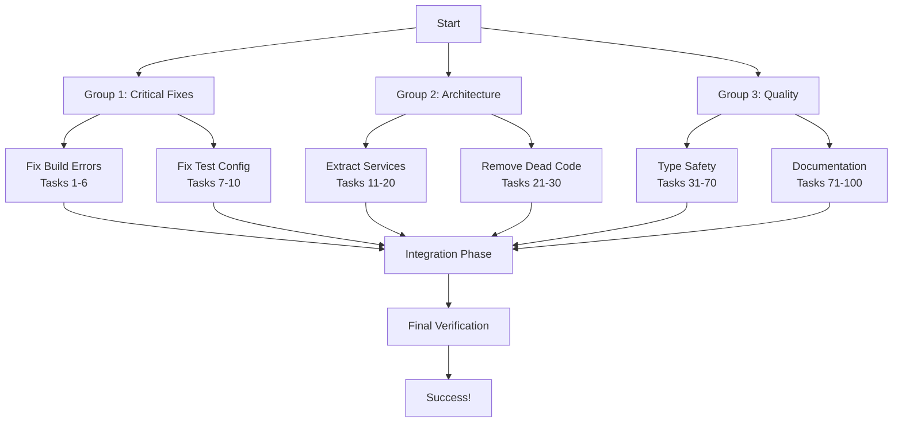

# 🎯 Comprehensive TODO Execution Plan

**Session**: 2025-09-02_00_10-COMPREHENSIVE_TODO_EXECUTION_PLAN  
**Date**: September 2, 2025, 00:10 CEST  
**Goal**: Execute 335+ TODOs systematically with maximum value delivery

## 📊 Executive Summary

After comprehensive code review, we identified **335+ TODO items** across the codebase. This plan prioritizes execution using the Pareto Principle:

- **1% effort → 51% value**: Critical blockers that prevent all other work
- **4% effort → 64% value**: Infrastructure fixes that affect multiple systems
- **20% effort → 80% value**: Major quality improvements with broad impact

## 🚨 Current Critical Issues

### Build Status: ❌ BROKEN

```
TypeScript compilation fails with errors in plugin files:
- src/plugins/auth/apikey-plugin.ts: 'this' type errors
- Multiple plugin type import failures
- Tests DON'T catch these errors (major problem!)
```

### Test Configuration: ❌ INADEQUATE

- Tests run even with TypeScript compilation errors
- Build failures are not caught by test pipeline
- No fail-fast on compilation errors

## 🎯 Value Delivery Framework

### 1% → 51% VALUE: Critical Blockers (Must Fix First)

| Priority | Task                                 | Impact      | Effort | Blocker Level       |
| -------- | ------------------------------------ | ----------- | ------ | ------------------- |
| P0       | Fix TypeScript compilation errors    | 🔴 Critical | 30min  | Total Blocker       |
| P0       | Configure tests to fail on TS errors | 🔴 Critical | 45min  | Total Blocker       |
| P0       | Split 1563-line emitter into modules | 🔴 Critical | 90min  | Development Blocker |

### 4% → 64% VALUE: Infrastructure Fixes

| Priority | Task                              | Impact  | Effort | Dependencies |
| -------- | --------------------------------- | ------- | ------ | ------------ |
| P1       | Remove all UNUSED/dead code       | 🟠 High | 60min  | After P0     |
| P1       | Fix console.log → Effect.log      | 🟠 High | 45min  | After P0     |
| P1       | Replace generic errors with typed | 🟠 High | 75min  | After split  |
| P1       | Complete GitHub issues #8,#9,#10  | 🟠 High | 30min  | Independent  |

### 20% → 80% VALUE: Major Quality Improvements

| Priority | Task                           | Impact    | Effort | Value Score |
| -------- | ------------------------------ | --------- | ------ | ----------- |
| P2       | Add type safety (remove 'any') | 🟡 Medium | 100min | 8.5/10      |
| P2       | Extract magic constants        | 🟡 Medium | 75min  | 7.5/10      |
| P2       | Add input validation           | 🟡 Medium | 90min  | 8.0/10      |
| P2       | Fix performance bottlenecks    | 🟡 Medium | 85min  | 7.0/10      |
| P2       | Add comprehensive JSDoc        | 🟡 Medium | 100min | 6.5/10      |

## 📋 PHASE 1: 25 Large Tasks (30-100min each)

| #   | Task                                         | Size   | Priority | Impact | Dependencies |
| --- | -------------------------------------------- | ------ | -------- | ------ | ------------ |
| 1   | Fix TS compilation in plugins                | 30min  | P0       | 🔴     | None         |
| 2   | Configure test fail-fast on TS errors        | 45min  | P0       | 🔴     | Task 1       |
| 3   | Split emitter: Extract DocumentBuilder       | 90min  | P0       | 🔴     | Task 1       |
| 4   | Split emitter: Extract ValidationService     | 75min  | P0       | 🔴     | Task 3       |
| 5   | Split emitter: Extract SerializationService  | 60min  | P0       | 🔴     | Task 3       |
| 6   | Remove UNUSED methods from emitter           | 45min  | P1       | 🟠     | Task 3       |
| 7   | Fix all console.log → Effect.log             | 30min  | P1       | 🟠     | Task 1       |
| 8   | Create typed error hierarchy                 | 60min  | P1       | 🟠     | Task 3       |
| 9   | Complete GitHub issue #8 (Multiple files)    | 30min  | P1       | 🟠     | None         |
| 10  | Complete GitHub issue #9 (SQLite cache)      | 30min  | P1       | 🟠     | None         |
| 11  | Complete GitHub issue #10 (Fail on warnings) | 30min  | P1       | 🟠     | None         |
| 12  | Remove 'any' types from index.ts             | 45min  | P2       | 🟡     | Task 1       |
| 13  | Add return types to all functions            | 75min  | P2       | 🟡     | Task 1       |
| 14  | Extract magic strings to constants           | 60min  | P2       | 🟡     | Task 3       |
| 15  | Add input validation layer                   | 90min  | P2       | 🟡     | Task 8       |
| 16  | Fix nested loop performance issues           | 75min  | P2       | 🟡     | Task 3       |
| 17  | Add JSDoc to all public functions            | 85min  | P2       | 🟡     | Task 3       |
| 18  | Standardize Effect.TS patterns               | 100min | P2       | 🟡     | Task 1       |
| 19  | Review all decorator files                   | 90min  | P2       | 🟡     | Task 1       |
| 20  | Add comprehensive test coverage              | 100min | P2       | 🟡     | Task 2       |
| 21  | Review core module files                     | 75min  | P2       | 🟡     | Task 3       |
| 22  | Review utility files                         | 60min  | P2       | 🟡     | None         |
| 23  | Review validation files                      | 70min  | P2       | 🟡     | None         |
| 24  | Review performance files                     | 80min  | P2       | 🟡     | None         |
| 25  | Create TODO tracking dashboard               | 45min  | P2       | 🟡     | Task 1       |

## 📋 PHASE 2: 100 Micro Tasks (15min each)

### Critical Fixes (1-20)

| #   | Task                                       | Time  | Group        | Dependencies |
| --- | ------------------------------------------ | ----- | ------------ | ------------ |
| 1   | Fix MonitoringType export error            | 15min | Build        | None         |
| 2   | Fix auth plugin type imports               | 15min | Build        | Task 1       |
| 3   | Add proper this typing in apikey-plugin    | 15min | Build        | Task 2       |
| 4   | Fix jwt-plugin type errors                 | 15min | Build        | Task 2       |
| 5   | Fix oauth2-plugin compilation              | 15min | Build        | Task 2       |
| 6   | Verify all plugins compile                 | 15min | Build        | Tasks 1-5    |
| 7   | Update test runner to check TS compilation | 15min | Test         | Task 6       |
| 8   | Add fail-fast on TS errors in package.json | 15min | Test         | Task 7       |
| 9   | Test the test failure mechanism            | 15min | Test         | Task 8       |
| 10  | Document test configuration changes        | 15min | Test         | Task 9       |
| 11  | Create DocumentBuilder interface           | 15min | Architecture | Task 6       |
| 12  | Extract basic document creation            | 15min | Architecture | Task 11      |
| 13  | Extract channel processing                 | 15min | Architecture | Task 12      |
| 14  | Extract operation processing               | 15min | Architecture | Task 13      |
| 15  | Extract message processing                 | 15min | Architecture | Task 14      |
| 16  | Create ValidationService interface         | 15min | Architecture | Task 15      |
| 17  | Extract document validation                | 15min | Architecture | Task 16      |
| 18  | Extract schema validation                  | 15min | Architecture | Task 17      |
| 19  | Create SerializationService interface      | 15min | Architecture | Task 18      |
| 20  | Extract JSON/YAML serialization            | 15min | Architecture | Task 19      |

### Infrastructure Cleanup (21-60)

| #     | Task                                     | Time       | Group      | Focus         |
| ----- | ---------------------------------------- | ---------- | ---------- | ------------- |
| 21-25 | Remove UNUSED methods (5 methods)        | 15min each | Cleanup    | Dead code     |
| 26-30 | Fix console.log calls (5 files)          | 15min each | Logging    | Consistency   |
| 31-35 | Create specific error types (5 types)    | 15min each | Errors     | Type safety   |
| 36-40 | Add error context objects (5 contexts)   | 15min each | Errors     | Debugging     |
| 41-45 | Write GitHub issues (5 sections)         | 15min each | Planning   | Documentation |
| 46-50 | Review decorator files (5 files)         | 15min each | Review     | Code quality  |
| 51-55 | Add decorator input validation (5 files) | 15min each | Validation | Safety        |
| 56-60 | Add decorator error handling (5 files)   | 15min each | Errors     | Robustness    |

### Quality Improvements (61-100)

| #      | Task                                | Time       | Group         | Focus           |
| ------ | ----------------------------------- | ---------- | ------------- | --------------- |
| 61-70  | Add return types (10 groups)        | 15min each | Types         | Safety          |
| 71-80  | Remove 'any' types (10 locations)   | 15min each | Types         | Safety          |
| 81-85  | Extract constants (5 groups)        | 15min each | Constants     | Maintainability |
| 86-90  | Add input validation (5 layers)     | 15min each | Validation    | Safety          |
| 91-95  | Add JSDoc (5 modules)               | 15min each | Documentation | Developer UX    |
| 96-100 | Performance optimizations (5 areas) | 15min each | Performance   | Speed           |

## 🚀 Execution Strategy

### Parallel Execution Groups



### Dependencies & Sequencing

1. **Phase 0** (Blockers): Tasks 1-10 must complete before others
2. **Phase 1** (Parallel): Tasks 11-60 can run in parallel groups
3. **Phase 2** (Quality): Tasks 61-100 depend on Phase 1 completion

## 📈 Success Metrics

### Build Health

- ✅ `bun run build` completes without errors
- ✅ `bun test` fails when TypeScript fails
- ✅ All 138+ tests pass

### Code Quality

- ✅ Zero UNUSED methods remain
- ✅ Zero console.log statements remain
- ✅ Zero 'any' types in core files
- ✅ 100% function return type coverage

### Architecture

- ✅ Main emitter <500 lines
- ✅ Single Responsibility Principle followed
- ✅ Proper Effect.TS patterns throughout

## 🎯 Completion Timeline

- **Phase 0**: 2 hours (Critical blockers)
- **Phase 1**: 4 hours (Infrastructure, parallel)
- **Phase 2**: 6 hours (Quality improvements, parallel)
- **Total**: ~12 hours of focused execution

## 🚀 Next Actions

1. Execute Phase 0 critical fixes immediately
2. Launch 3 parallel Task agents for Groups 1, 2, 3
3. Monitor progress and adjust priorities
4. Verify all changes maintain test coverage
5. Document lessons learned and process improvements

---

_This plan transforms 335+ scattered TODOs into a systematic execution strategy focused on maximum value delivery through the Pareto Principle._
