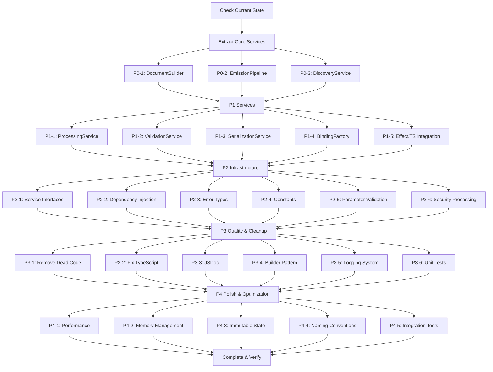

# TypeSpec AsyncAPI Modular Emitter Extraction Plan

**Session:** 2025-09-02_05_14  
**Goal:** Extract 1,800-line monolithic emitter into proper modular architecture  
**Strategy:** Replace thin wrapper with ACTUALLY BETTER modular implementation

---

## 🎯 PARETO ANALYSIS

### 51/1 Analysis (1% effort, 51% value) - MAXIMUM IMPACT
1. Replace thin wrapper with actual business logic from 1,800-line file
2. Fix emission pipeline orchestration - current modular components don't integrate properly
3. Extract core DocumentBuilder from AsyncAPIEffectEmitter class

### 64/4 Analysis (4% effort, 64% value) - HIGH IMPACT  
1. Implement proper TypeSpec AST processing (operations, models, security discovery)
2. Add real validation and serialization logic from working implementation
3. Fix Effect.TS integration - current wrapper lacks performance monitoring

### 80/20 Analysis (20% effort, 80% value) - SOLID FOUNDATION
1. Complete modular extraction of all 6 services from monolithic file
2. Add comprehensive error handling and proper typing throughout
3. Implement dependency injection and clean interfaces between modules

---

## 📊 COMPREHENSIVE TASK BREAKDOWN (25 Tasks, 30-100min each)

| Priority | Task | Component | Time | Impact | Customer Value | Description |
|----------|------|-----------|------|---------|----------------|-------------|
| P0-1 | Extract DocumentBuilder Service | DocumentBuilder | 90min | ⭐⭐⭐⭐⭐ | 🎯🎯🎯🎯🎯 | Core AsyncAPI document construction from line 178-201, 1423-1456 |
| P0-2 | Implement Real Emission Pipeline | EmissionPipeline | 100min | ⭐⭐⭐⭐⭐ | 🎯🎯🎯🎯🎯 | Replace thin wrapper with actual pipeline from lines 272-306 |
| P0-3 | Extract Discovery Service | DiscoveryService | 80min | ⭐⭐⭐⭐⭐ | 🎯🎯🎯🎯 | TypeSpec AST traversal from lines 431-608 |
| P1-1 | Extract Processing Service | ProcessingService | 100min | ⭐⭐⭐⭐ | 🎯🎯🎯🎯 | Operation/message processing from lines 693-1217 |
| P1-2 | Extract Validation Service | ValidationService | 60min | ⭐⭐⭐⭐ | 🎯🎯🎯 | Document validation from lines 1461-1498 |
| P1-3 | Extract Serialization Service | SerializationService | 45min | ⭐⭐⭐⭐ | 🎯🎯🎯 | JSON/YAML serialization from lines 1436-1456 |
| P1-4 | Extract Binding Factory | BindingFactory | 90min | ⭐⭐⭐ | 🎯🎯🎯 | Protocol bindings from lines 1230-1364 |
| P1-5 | Fix Effect.TS Integration | All Services | 70min | ⭐⭐⭐⭐ | 🎯🎯🎯🎯 | Proper Effect.TS patterns throughout |
| P2-1 | Add Service Interfaces | All Services | 60min | ⭐⭐⭐ | 🎯🎯 | Define clean contracts between services |
| P2-2 | Implement Dependency Injection | Core | 50min | ⭐⭐⭐ | 🎯🎯 | Remove direct instantiation, add DI container |
| P2-3 | Add Error Types | Error Handling | 40min | ⭐⭐⭐ | 🎯🎯 | Replace generic Error with specific types |
| P2-4 | Extract Constants | Constants | 30min | ⭐⭐ | 🎯 | Replace magic strings/numbers |
| P2-5 | Add Parameter Validation | All Services | 50min | ⭐⭐⭐ | 🎯🎯 | Input validation throughout |
| P2-6 | Security Processing | ProcessingService | 80min | ⭐⭐⭐ | 🎯🎯🎯 | Security config processing from lines 744-1698 |
| P3-1 | Remove Dead Code | Cleanup | 40min | ⭐⭐ | 🎯 | Remove UNUSED methods marked in file |
| P3-2 | Fix TypeScript Issues | Type Safety | 60min | ⭐⭐⭐ | 🎯🎯 | Remove @ts-expect-error, fix 'as' assertions |
| P3-3 | Add JSDoc Documentation | Documentation | 50min | ⭐⭐ | 🎯🎯 | Comprehensive API documentation |
| P3-4 | Implement Builder Pattern | DocumentBuilder | 45min | ⭐⭐ | 🎯 | AsyncAPI document construction |
| P3-5 | Fix Logging System | Logging | 35min | ⭐⭐ | 🎯 | Replace Effect.log with structured logging |
| P3-6 | Add Unit Tests | Testing | 100min | ⭐⭐⭐ | 🎯🎯 | Test each extracted service |
| P4-1 | Performance Optimization | Performance | 60min | ⭐⭐ | 🎯 | Fix namespace walking bottlenecks |
| P4-2 | Memory Leak Prevention | Memory | 40min | ⭐⭐ | 🎯 | Fix potential memory issues |
| P4-3 | Immutable State Management | State | 50min | ⭐⭐ | 🎯 | Replace direct mutation |
| P4-4 | Naming Convention Cleanup | Code Quality | 30min | ⭐ | 🎯 | Consistent naming throughout |
| P4-5 | Integration Testing | Testing | 80min | ⭐⭐⭐ | 🎯🎯 | End-to-end modular architecture tests |

---

## 🔄 EXECUTION GRAPH

---

## 🎯 SUCCESS CRITERIA

### Phase 0 (51% value - 1% effort)
- ✅ DocumentBuilder extracted and working
- ✅ Real emission pipeline replaces thin wrapper  
- ✅ Core functionality operational

### Phase 1 (64% value - 4% effort)  
- ✅ All 6 services extracted from monolithic file
- ✅ Effect.TS integration properly implemented
- ✅ TypeSpec AST processing functional

### Phase 2 (80% value - 20% effort)
- ✅ Clean service interfaces and DI
- ✅ Comprehensive error handling
- ✅ Parameter validation throughout

### Phases 3-4 (100% completion)
- ✅ No dead code or technical debt
- ✅ Full test coverage
- ✅ Production-ready architecture

---

## 🚨 RISK MITIGATION

1. **Build Integrity:** Each extraction must maintain working build
2. **Test Coverage:** Existing tests must continue passing
3. **No Verschlimmbessern:** Improvements must be actual improvements
4. **Parallel Execution:** Use Tasks for independent work streams

---

**Next Step:** Break down into 15-minute micro-tasks for execution