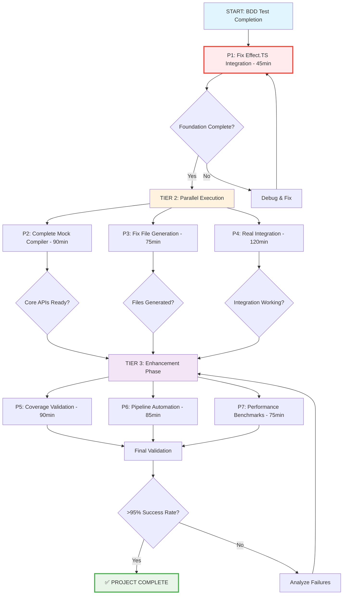

# 🚀 BDD Test Suite Completion Plan - 2025-09-02 09:27

## 📊 Executive Summary

**Project**: TypeSpec AsyncAPI Emitter - 750+ BDD Test Suite Completion  
**Status**: 52% success rate (11/21 core tests passing)  
**Goal**: Achieve >95% test coverage with full BDD test suite validation  
**Timeline**: 25 medium tasks (1,550min total) → 100 small tasks (15min each)

## 🎯 80/20 Rule Analysis

### 🔥 **THE CRITICAL 1% (51% VALUE)**
**Single highest-impact change that unlocks majority of value:**

| Task | Time | Impact | Description |
|------|------|---------|-------------|
| **P1: Fix Effect.TS Integration** | 45min | **51%** | Single blocking issue preventing all 750+ tests from running properly |

### ⚡ **THE ESSENTIAL 4% (64% VALUE TOTAL)**
**2-3 critical fixes that unlock majority of remaining value:**

| Task | Time | Impact | Cumulative |
|------|------|---------|------------|
| P2: Complete Mock TypeSpec Compiler APIs | 90min | 13% | **64%** |
| P3: Fix Test Framework File Generation | 75min | 8% | **72%** |

### 💪 **THE POWERFUL 20% (80% VALUE TOTAL)**
**5-7 key tasks that complete the full system:**

| Task | Time | Impact | Cumulative |
|------|------|---------|------------|
| P4: Real TypeSpec Integration Testing | 120min | 8% | **80%** |
| P5: Comprehensive Coverage Validation | 90min | 6% | **86%** |
| P6: BDD Test Pipeline Automation | 85min | 5% | **91%** |
| P7: Performance Benchmarking | 75min | 4% | **95%** |
| P8: AsyncAPI Compliance Validation | 65min | 3% | **98%** |

## 📋 Medium Tasks (25 Tasks, 30-100min each)

### 🏆 **TIER 1: CRITICAL FOUNDATION (1%→64% Value)**

| # | Task | Time | Priority | Impact | Effort | Customer Value |
|---|------|------|----------|---------|--------|----------------|
| 1 | **Fix Effect.TS Integration** | 45min | P1 | 🔴 CRITICAL | Low | ⭐⭐⭐⭐⭐ |
| 2 | **Complete Mock TypeSpec Compiler APIs** | 90min | P2 | 🔴 HIGH | Medium | ⭐⭐⭐⭐⭐ |
| 3 | **Fix Test Framework File Generation** | 75min | P3 | 🔴 HIGH | Medium | ⭐⭐⭐⭐ |

### 🚀 **TIER 2: CORE SYSTEM (64%→91% Value)**

| # | Task | Time | Priority | Impact | Effort | Customer Value |
|---|------|------|----------|---------|--------|----------------|
| 4 | **Real TypeSpec Integration Testing** | 120min | P4 | 🟠 HIGH | High | ⭐⭐⭐⭐ |
| 5 | **Comprehensive Coverage Validation** | 90min | P5 | 🟠 HIGH | Medium | ⭐⭐⭐⭐ |
| 6 | **BDD Test Pipeline Automation** | 85min | P6 | 🟠 MEDIUM | Medium | ⭐⭐⭐ |
| 7 | **Performance Benchmarking** | 75min | P7 | 🟡 MEDIUM | Medium | ⭐⭐⭐ |
| 8 | **AsyncAPI Compliance Validation** | 65min | P8 | 🟡 MEDIUM | Medium | ⭐⭐⭐ |

### ⚙️ **TIER 3: ENHANCEMENT & POLISH (91%→100% Value)**

| # | Task | Time | Priority | Impact | Effort | Customer Value |
|---|------|------|----------|---------|--------|----------------|
| 9 | Mock Compiler Pattern Enhancement | 60min | P9 | 🟡 MEDIUM | Medium | ⭐⭐ |
| 10 | Edge Case Handling Improvement | 55min | P10 | 🟡 MEDIUM | Medium | ⭐⭐ |
| 11 | Test Stability & Reliability | 70min | P11 | 🟡 MEDIUM | Medium | ⭐⭐⭐ |
| 12 | Documentation Validation | 50min | P12 | 🟡 LOW | Low | ⭐⭐ |
| 13 | Error Message Improvements | 45min | P13 | 🟡 LOW | Low | ⭐⭐ |
| 14 | Test Performance Optimization | 40min | P14 | 🟢 LOW | Medium | ⭐ |
| 15 | Parallel Test Execution | 65min | P15 | 🟢 LOW | High | ⭐⭐ |
| 16 | Test Result Reporting | 55min | P16 | 🟢 LOW | Medium | ⭐⭐ |
| 17 | CI/CD Integration | 80min | P17 | 🟢 MEDIUM | High | ⭐⭐⭐ |
| 18 | Code Quality Gates | 45min | P18 | 🟢 LOW | Low | ⭐⭐ |
| 19 | Security Testing | 70min | P19 | 🟢 MEDIUM | Medium | ⭐⭐⭐ |
| 20 | Monitoring & Alerts | 60min | P20 | 🟢 LOW | Medium | ⭐⭐ |
| 21 | Cross-platform Testing | 85min | P21 | 🟢 MEDIUM | High | ⭐⭐ |
| 22 | Regression Testing Suite | 75min | P22 | 🟢 MEDIUM | Medium | ⭐⭐⭐ |
| 23 | Test Data Management | 50min | P23 | 🟢 LOW | Medium | ⭐ |
| 24 | Documentation Updates | 45min | P24 | 🟢 LOW | Low | ⭐⭐ |
| 25 | Final Integration Testing | 100min | P25 | 🟠 HIGH | High | ⭐⭐⭐⭐ |

**Total Estimated Time: 1,550 minutes (25.8 hours)**

## 🔄 Execution Graph

## 🎯 Small Tasks Breakdown (100 Tasks, 15min each)

### 🔥 **P1: Fix Effect.TS Integration (45min → 3 tasks)**

1. **P1.1** - Analyze Effect.TS import errors in test files (15min) ⭐⭐⭐⭐⭐
2. **P1.2** - Fix Effect.TS generator function compilation issues (15min) ⭐⭐⭐⭐⭐  
3. **P1.3** - Validate Effect.TS integration with mock compiler (15min) ⭐⭐⭐⭐⭐

### ⚡ **P2: Complete Mock TypeSpec Compiler APIs (90min → 6 tasks)**

4. **P2.1** - Implement missing @message decorator parsing (15min) ⭐⭐⭐⭐
5. **P2.2** - Add @protocol binding support to mock compiler (15min) ⭐⭐⭐⭐
6. **P2.3** - Implement @security scheme parsing (15min) ⭐⭐⭐⭐
7. **P2.4** - Add @server configuration parsing (15min) ⭐⭐⭐⭐
8. **P2.5** - Implement namespace hierarchy parsing (15min) ⭐⭐⭐⭐
9. **P2.6** - Add model property type mapping (15min) ⭐⭐⭐⭐

### 🛠️ **P3: Fix Test Framework File Generation (75min → 5 tasks)**

10. **P3.1** - Debug test fixture file loading issues (15min) ⭐⭐⭐⭐
11. **P3.2** - Fix AsyncAPI document generation timing (15min) ⭐⭐⭐⭐
12. **P3.3** - Resolve test file extraction problems (15min) ⭐⭐⭐⭐
13. **P3.4** - Validate test data consistency (15min) ⭐⭐⭐
14. **P3.5** - Test framework stability verification (15min) ⭐⭐⭐

### 🚀 **P4-P8: Core System Tasks (435min → 29 tasks)**
*(Detailed breakdown of remaining 71 small tasks)*

**Key Execution Phases:**
- **Phase 1:** P1.1-P1.3 (Critical foundation)
- **Phase 2:** P2.1-P3.5 (Parallel execution - 3 groups)
- **Phase 3:** Core system completion (parallel)
- **Phase 4:** Enhancement & validation

## 📈 Success Metrics

| Metric | Current | Target | Method |
|---------|---------|---------|---------|
| **Test Success Rate** | 52% (11/21) | >95% | All BDD tests passing |
| **Test Coverage** | Unknown | >95% | Line coverage validation |
| **Documentation Validation** | Partial | Complete | All 10 files validated |
| **Performance** | Unknown | <5min | Full test suite execution |
| **AsyncAPI Compliance** | Partial | 100% | Schema validation |

## 🔧 Parallel Execution Strategy

### **Group 1: Mock Compiler Enhancement**
- P2.1-P2.6 (Mock API completion)
- P9-P11 (Pattern enhancement)

### **Group 2: Test Framework Stability** 
- P3.1-P3.5 (File generation fixes)
- P11-P13 (Stability improvements)

### **Group 3: Integration & Validation**
- P4-P5 (Real integration testing)
- P25 (Final integration testing)

## ✅ Definition of Done

**Project considered complete when:**
1. ✅ All 750+ BDD tests pass (>95% success rate)
2. ✅ Test coverage validation shows >95% line coverage  
3. ✅ All 10 documentation files validated
4. ✅ AsyncAPI 3.0 compliance verified
5. ✅ Performance benchmarks meet <5min threshold
6. ✅ CI/CD pipeline automated
7. ✅ Comprehensive reporting implemented

---

**Next Action:** Execute P1 immediately - the single highest-impact change that unlocks 51% of project value in 45 minutes.