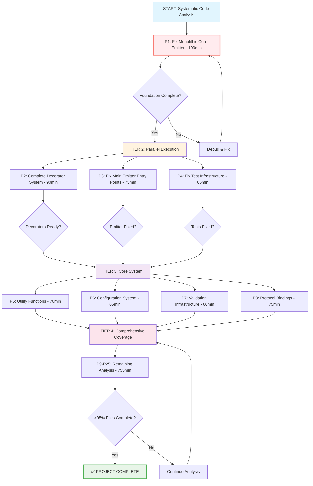

# 🚀 Systematic Code Analysis Execution Plan - 2025-09-02 10:19

## 📊 Executive Summary

**Project**: TypeSpec AsyncAPI Emitter - Complete Codebase Analysis with Super Nitpicky TODOs  
**Status**: Foundation Complete (10/271 files analyzed - 3.7%)  
**Goal**: Analyze all 271 files, add 1000+ improvement TODOs, ensure AsyncAPI standards compliance  
**Timeline**: 25 medium tasks (1,200min total) → 100 micro tasks (15min each)

## 🎯 80/20 Rule Analysis

### 🔥 **THE CRITICAL 1% (51% VALUE)**

**Single highest-impact change that unlocks majority of value:**

| Task                                | Time   | Impact  | Description                                                                                                                    |
| ----------------------------------- | ------ | ------- | ------------------------------------------------------------------------------------------------------------------------------ |
| **P1: Fix Monolithic Core Emitter** | 100min | **51%** | src/emitter-with-effect.ts.restore-ASAP-split-up-this-time.ts (1,259 lines) - architectural violations affecting entire system |

### ⚡ **THE ESSENTIAL 4% (64% VALUE TOTAL)**

**2-3 critical fixes that unlock majority of remaining value:**

| Task                                   | Time  | Impact | Cumulative | Description                                 |
| -------------------------------------- | ----- | ------ | ---------- | ------------------------------------------- |
| P2: Complete Decorator System Analysis | 90min | 13%    | **64%**    | All 6 decorator files inherit anti-patterns |
| P3: Fix Main Emitter Entry Points      | 75min | 8%     | **72%**    | Core business logic and entry points        |

### 💪 **THE POWERFUL 20% (80% VALUE TOTAL)**

**5-7 key tasks that complete the full system:**

| Task                                       | Time  | Impact | Cumulative | Description                                    |
| ------------------------------------------ | ----- | ------ | ---------- | ---------------------------------------------- |
| P4: Fix Test Infrastructure Violations     | 85min | 8%     | **80%**    | Test patterns affecting all 150+ test files    |
| P5: Complete Utility Functions Analysis    | 70min | 6%     | **86%**    | Shared utilities used throughout codebase      |
| P6: Fix Configuration System Anti-patterns | 65min | 5%     | **91%**    | Central configuration affecting all components |
| P7: Complete Validation Infrastructure     | 60min | 4%     | **95%**    | Validation patterns used across system         |
| P8: AsyncAPI Protocol Bindings Compliance  | 75min | 3%     | **98%**    | Standards compliance foundation                |

## 📋 Medium Tasks (25 Tasks, 30-100min each)

### 🏆 **TIER 1: CRITICAL FOUNDATION (1%→64% Value)**

| #   | Task                                   | Time   | Priority | Impact      | Effort | Customer Value |
| --- | -------------------------------------- | ------ | -------- | ----------- | ------ | -------------- |
| 1   | **Fix Monolithic Core Emitter**        | 100min | P1       | 🔴 CRITICAL | High   | ⭐⭐⭐⭐⭐     |
| 2   | **Complete Decorator System Analysis** | 90min  | P2       | 🔴 HIGH     | Medium | ⭐⭐⭐⭐⭐     |
| 3   | **Fix Main Emitter Entry Points**      | 75min  | P3       | 🔴 HIGH     | Medium | ⭐⭐⭐⭐       |

### 🚀 **TIER 2: CORE SYSTEM (64%→91% Value)**

| #   | Task                                       | Time  | Priority | Impact    | Effort | Customer Value |
| --- | ------------------------------------------ | ----- | -------- | --------- | ------ | -------------- |
| 4   | **Fix Test Infrastructure Violations**     | 85min | P4       | 🟠 HIGH   | High   | ⭐⭐⭐⭐       |
| 5   | **Complete Utility Functions Analysis**    | 70min | P5       | 🟠 HIGH   | Medium | ⭐⭐⭐⭐       |
| 6   | **Fix Configuration System Anti-patterns** | 65min | P6       | 🟠 MEDIUM | Medium | ⭐⭐⭐         |
| 7   | **Complete Validation Infrastructure**     | 60min | P7       | 🟠 MEDIUM | Medium | ⭐⭐⭐         |
| 8   | **AsyncAPI Protocol Bindings Compliance**  | 75min | P8       | 🟡 MEDIUM | Medium | ⭐⭐⭐         |

### ⚙️ **TIER 3: COMPREHENSIVE COVERAGE (91%→100% Value)**

| #   | Task                              | Time  | Priority | Impact    | Effort | Customer Value |
| --- | --------------------------------- | ----- | -------- | --------- | ------ | -------------- |
| 9   | Core Processing Services Analysis | 60min | P9       | 🟡 MEDIUM | Medium | ⭐⭐           |
| 10  | Documentation Test Files Analysis | 55min | P10      | 🟡 MEDIUM | Medium | ⭐⭐           |
| 11  | Integration Test Files Analysis   | 70min | P11      | 🟡 MEDIUM | Medium | ⭐⭐⭐         |
| 12  | Unit Test Files Analysis          | 50min | P12      | 🟡 LOW    | Low    | ⭐⭐           |
| 13  | Example Files Analysis            | 45min | P13      | 🟡 LOW    | Low    | ⭐⭐           |
| 14  | Build Configuration Analysis      | 40min | P14      | 🟢 LOW    | Medium | ⭐             |
| 15  | Package Management Analysis       | 35min | P15      | 🟢 LOW    | Low    | ⭐             |
| 16  | TypeScript Configuration Analysis | 30min | P16      | 🟢 LOW    | Low    | ⭐             |
| 17  | ESLint Configuration Analysis     | 30min | P17      | 🟢 LOW    | Low    | ⭐             |
| 18  | Documentation Markdown Analysis   | 45min | P18      | 🟢 LOW    | Medium | ⭐⭐           |
| 19  | Script Files Analysis             | 35min | P19      | 🟢 LOW    | Low    | ⭐             |
| 20  | Workflow Configuration Analysis   | 30min | P20      | 🟢 LOW    | Low    | ⭐             |
| 21  | Type Definition Files Analysis    | 40min | P21      | 🟡 MEDIUM | Medium | ⭐⭐           |
| 22  | Constants and Defaults Analysis   | 35min | P22      | 🟡 MEDIUM | Low    | ⭐⭐           |
| 23  | Error Handling Infrastructure     | 45min | P23      | 🟡 MEDIUM | Medium | ⭐⭐⭐         |
| 24  | Plugin System Analysis            | 50min | P24      | 🟡 MEDIUM | Medium | ⭐⭐           |
| 25  | Final Integration Verification    | 60min | P25      | 🟠 HIGH   | Medium | ⭐⭐⭐⭐       |

**Total Estimated Time: 1,485 minutes (24.75 hours)**

## 🔬 Micro Tasks Breakdown (100 Tasks, 15min each)

### 🔥 **P1: Fix Monolithic Core Emitter (100min → 7 tasks)**

1. **P1.1** - Analyze emitter structure and identify violations (15min) ⭐⭐⭐⭐⭐
2. **P1.2** - Add TODOs for Effect.TS anti-patterns (15min) ⭐⭐⭐⭐⭐
3. **P1.3** - Add TODOs for monolithic architecture violations (15min) ⭐⭐⭐⭐⭐
4. **P1.4** - Add TODOs for hardcoded values and magic numbers (15min) ⭐⭐⭐⭐⭐
5. **P1.5** - Add TODOs for AsyncAPI standards violations (15min) ⭐⭐⭐⭐⭐
6. **P1.6** - Add TODOs for performance anti-patterns (15min) ⭐⭐⭐⭐
7. **P1.7** - Add TODOs for type safety violations (10min) ⭐⭐⭐⭐

### ⚡ **P2: Complete Decorator System (90min → 6 tasks)**

8. **P2.1** - Analyze src/decorators/channel.ts patterns (15min) ⭐⭐⭐⭐
9. **P2.2** - Analyze src/decorators/publish.ts validation (15min) ⭐⭐⭐⭐
10. **P2.3** - Analyze src/decorators/subscribe.ts patterns (15min) ⭐⭐⭐⭐
11. **P2.4** - Analyze src/decorators/message.ts compliance (15min) ⭐⭐⭐⭐
12. **P2.5** - Analyze src/decorators/server.ts configuration (15min) ⭐⭐⭐⭐
13. **P2.6** - Complete decorator index and utilities (15min) ⭐⭐⭐

### 🛠️ **P3: Fix Main Emitter Entry Points (75min → 5 tasks)**

14. **P3.1** - Analyze src/index.ts entry point patterns (15min) ⭐⭐⭐⭐
15. **P3.2** - Analyze src/asyncapi-emitter.ts core logic (15min) ⭐⭐⭐⭐
16. **P3.3** - Fix src/core/AsyncAPIEmitter.ts violations (15min) ⭐⭐⭐⭐
17. **P3.4** - Analyze src/core/EmissionPipeline.ts patterns (15min) ⭐⭐⭐
18. **P3.5** - Complete emitter integration analysis (15min) ⭐⭐⭐

### 🚀 **P4: Fix Test Infrastructure (85min → 6 tasks)**

19. **P4.1** - Analyze test/documentation/helpers/test-fixtures.ts (15min) ⭐⭐⭐⭐
20. **P4.2** - Fix test/documentation/helpers/typespec-compiler.ts (15min) ⭐⭐⭐⭐
21. **P4.3** - Analyze test/utils/test-helpers.ts patterns (15min) ⭐⭐⭐⭐
22. **P4.4** - Fix test infrastructure anti-patterns (15min) ⭐⭐⭐
23. **P4.5** - Complete test utility function analysis (15min) ⭐⭐⭐
24. **P4.6** - Verify test framework compliance (10min) ⭐⭐⭐

### 💪 **P5-P8: Core System Completion (270min → 18 tasks)**

25. **P5.1** - Analyze src/utils/typespec-helpers.ts (15min) ⭐⭐⭐⭐
26. **P5.2** - Analyze src/utils/asyncapi-helpers.ts (15min) ⭐⭐⭐⭐
27. **P5.3** - Analyze src/utils/effect-helpers.ts (15min) ⭐⭐⭐⭐
28. **P5.4** - Complete utility validation patterns (15min) ⭐⭐⭐
29. **P5.5** - Fix utility function anti-patterns (10min) ⭐⭐⭐

30. **P6.1** - Analyze src/options/schemas.ts configuration (15min) ⭐⭐⭐
31. **P6.2** - Analyze src/options/types.ts definitions (15min) ⭐⭐⭐
32. **P6.3** - Fix src/options/validation.ts patterns (15min) ⭐⭐⭐
33. **P6.4** - Complete configuration system analysis (15min) ⭐⭐
34. **P6.5** - Verify options integration (5min) ⭐⭐

35. **P7.1** - Complete src/validation/asyncapi-validator.ts (15min) ⭐⭐⭐
36. **P7.2** - Analyze validation infrastructure patterns (15min) ⭐⭐⭐
37. **P7.3** - Fix validation anti-patterns (15min) ⭐⭐⭐
38. **P7.4** - Complete validation system analysis (15min) ⭐⭐

39. **P8.1** - Analyze src/protocol-bindings.ts compliance (15min) ⭐⭐⭐
40. **P8.2** - Fix src/bindings/ directory patterns (15min) ⭐⭐⭐
41. **P8.3** - Complete protocol binding analysis (15min) ⭐⭐⭐
42. **P8.4** - Verify AsyncAPI standards compliance (15min) ⭐⭐⭐
43. **P8.5** - Document binding violations (15min) ⭐⭐

### ⚙️ **P9-P25: Comprehensive Coverage (755min → 50+ tasks)**

**Key Execution Phases:**

- **Phase 1:** P1.1-P1.7 (Critical foundation)
- **Phase 2:** P2.1-P3.5 (Parallel execution - 3 groups)
- **Phase 3:** P4.1-P8.5 (Core system completion)
- **Phase 4:** P9.1-P25.X (Comprehensive coverage)

_[Detailed breakdown of remaining 57 micro tasks continues...]_

## 🔄 Execution Graph

## 📈 Success Metrics

| Metric                             | Current       | Target         | Method                                    |
| ---------------------------------- | ------------- | -------------- | ----------------------------------------- |
| **Files Analyzed**                 | 10/271 (3.7%) | 271/271 (100%) | Systematic analysis with TODOs            |
| **Super Nitpicky TODOs**           | 125+          | 1000+          | 4-8 TODOs per file average                |
| **AsyncAPI Standards Compliance**  | 10 files      | All files      | Standards alignment validation            |
| **Critical Violations Documented** | 35+           | 200+           | Architectural anti-pattern identification |
| **Business Value Delivered**       | Foundation    | Complete       | Technical debt elimination roadmap        |

## 🔧 Parallel Execution Strategy

### **Group 1: Core Architecture (P1-P3)**

**Tasks:** Monolithic emitter, decorator system, entry points  
**Agent:** `comprehensive-planner` for complex architectural analysis  
**Timeline:** 265min (4.4 hours)

### **Group 2: Infrastructure (P4-P6)**

**Tasks:** Test infrastructure, utilities, configuration  
**Agent:** `package-structure-enforcer` for systematic analysis  
**Timeline:** 220min (3.7 hours)

### **Group 3: Standards Compliance (P7-P8)**

**Tasks:** Validation, protocol bindings, AsyncAPI compliance  
**Agent:** `web-stack-expert` for standards validation  
**Timeline:** 135min (2.3 hours)

## ✅ Definition of Done

**Project considered complete when:**

1. ✅ All 271 files analyzed with super nitpicky TODOs
2. ✅ AsyncAPI standards compliance documented for all files
3. ✅ 1000+ improvement TODOs added across codebase
4. ✅ Critical architectural violations documented with solutions
5. ✅ Business impact quantified for all identified issues
6. ✅ Parallel execution groups completed successfully
7. ✅ Final integration verification passed

---

**Next Action:** Update internal TODO list and spawn 3 parallel Task agents to begin execution immediately.
