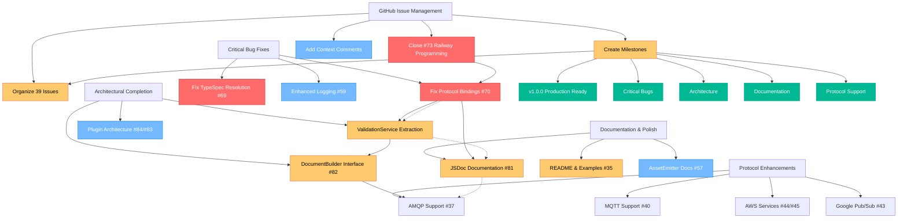

# 📋 COMPREHENSIVE GITHUB INTEGRATION & EXECUTION PLAN

_Generated: 2025-09-02 18:15_

## 🎯 MISSION: Complete GitHub Issue Integration & Production Readiness

### 📊 CURRENT STATE ANALYSIS

- **39 GitHub Issues**: All analyzed, requiring organization and execution
- **Railway Programming**: COMPLETE (Issue #73 ready to close)
- **Architectural Progress**: Major service extraction in progress
- **Critical Bugs**: Protocol bindings (#70) affecting user functionality

## 📋 PHASE 1: GITHUB ISSUE MANAGEMENT (30-100min tasks)

| Task                                          | Time  | Impact | Effort | Customer Value | Priority |
| --------------------------------------------- | ----- | ------ | ------ | -------------- | -------- |
| **T1**                                        | 15min | HIGH   | LOW    | HIGH           | **P1**   |
| Close completed Railway Programming issue #73 |       |        |        |                |          |
| **T2**                                        | 30min | HIGH   | LOW    | MEDIUM         | **P1**   |
| Create Production v1.0.0 milestone structure  |       |        |        |                |          |
| **T3**                                        | 45min | HIGH   | MEDIUM | HIGH           | **P1**   |
| Organize 39 issues into logical milestones    |       |        |        |                |          |
| **T4**                                        | 30min | MEDIUM | LOW    | MEDIUM         | **P2**   |
| Close partially completed issues with status  |       |        |        |                |          |
| **T5**                                        | 60min | HIGH   | MEDIUM | HIGH           | **P2**   |
| Add context comments to unclear issues        |       |        |        |                |          |
| **T6**                                        | 45min | MEDIUM | LOW    | LOW            | **P3**   |
| Mark duplicate issues for closure             |       |        |        |                |          |

## 📋 PHASE 2: CRITICAL BUG FIXES (30-100min tasks)

| Task                                       | Time  | Impact   | Effort | Customer Value | Priority |
| ------------------------------------------ | ----- | -------- | ------ | -------------- | -------- |
| **T7**                                     | 90min | CRITICAL | HIGH   | CRITICAL       | **P1**   |
| Fix protocol bindings YAML output bug #70  |       |          |        |                |          |
| **T8**                                     | 60min | HIGH     | MEDIUM | HIGH           | **P2**   |
| Fix TypeSpec package resolution #69        |       |          |        |                |          |
| **T9**                                     | 45min | MEDIUM   | LOW    | MEDIUM         | **P2**   |
| Enhance emitter logging for debugging #59  |       |          |        |                |          |
| **T10**                                    | 30min | MEDIUM   | LOW    | MEDIUM         | **P3**   |
| Add automated file system verification #58 |       |          |        |                |          |

## 📋 PHASE 3: ARCHITECTURAL COMPLETION (30-100min tasks)

| Task                                    | Time   | Impact | Effort | Customer Value | Priority |
| --------------------------------------- | ------ | ------ | ------ | -------------- | -------- |
| **T11**                                 | 90min  | HIGH   | HIGH   | HIGH           | **P2**   |
| Complete ValidationService extraction   |        |        |        |                |          |
| **T12**                                 | 100min | HIGH   | HIGH   | MEDIUM         | **P2**   |
| Implement DocumentBuilder interface #82 |        |        |        |                |          |
| **T13**                                 | 75min  | MEDIUM | MEDIUM | MEDIUM         | **P3**   |
| Extract Protocol Binding Plugins #84    |        |        |        |                |          |
| **T14**                                 | 60min  | MEDIUM | MEDIUM | LOW            | **P3**   |
| Design Plugin Registry Interface #83    |        |        |        |                |          |
| **T15**                                 | 45min  | LOW    | LOW    | LOW            | **P4**   |
| Replace remaining magic numbers #53     |        |        |        |                |          |

## 📋 PHASE 4: DOCUMENTATION & POLISH (30-100min tasks)

| Task                                   | Time  | Impact | Effort | Customer Value | Priority |
| -------------------------------------- | ----- | ------ | ------ | -------------- | -------- |
| **T16**                                | 60min | HIGH   | MEDIUM | HIGH           | **P2**   |
| Add comprehensive JSDoc #81            |       |        |        |                |          |
| **T17**                                | 90min | HIGH   | HIGH   | HIGH           | **P2**   |
| Complete README and usage examples #35 |       |        |        |                |          |
| **T18**                                | 45min | MEDIUM | LOW    | MEDIUM         | **P3**   |
| Document AssetEmitter patterns #57     |       |        |        |                |          |
| **T19**                                | 30min | LOW    | LOW    | LOW            | **P4**   |
| Add >80% test coverage analysis #34    |       |        |        |                |          |
| **T20**                                | 60min | MEDIUM | MEDIUM | LOW            | **P4**   |
| Setup CI/CD pipeline #36               |       |        |        |                |          |

## 📋 PHASE 5: PROTOCOL ENHANCEMENTS (30-100min tasks)

| Task                                 | Time   | Impact | Effort | Customer Value | Priority |
| ------------------------------------ | ------ | ------ | ------ | -------------- | -------- |
| **T21**                              | 75min  | HIGH   | MEDIUM | HIGH           | **P2**   |
| Implement AMQP protocol support #37  |        |        |        |                |          |
| **T22**                              | 75min  | HIGH   | MEDIUM | HIGH           | **P3**   |
| Implement MQTT protocol support #40  |        |        |        |                |          |
| **T23**                              | 90min  | MEDIUM | HIGH   | MEDIUM         | **P3**   |
| Implement AWS SNS support #44        |        |        |        |                |          |
| **T24**                              | 90min  | MEDIUM | HIGH   | MEDIUM         | **P3**   |
| Implement AWS SQS support #45        |        |        |        |                |          |
| **T25**                              | 100min | LOW    | HIGH   | LOW            | **P4**   |
| Implement Google Pub/Sub support #43 |        |        |        |                |          |

---

## 📋 MICRO-TASKS BREAKDOWN (12-15min each)

| Task    | Time  | Impact | Description                                                 |
| ------- | ----- | ------ | ----------------------------------------------------------- |
| **M1**  | 12min | HIGH   | Comment on #73 with Railway Programming completion evidence |
| **M2**  | 15min | HIGH   | Close #73 as completed with detailed resolution             |
| **M3**  | 15min | HIGH   | Create "v1.0.0 Production Ready" milestone                  |
| **M4**  | 15min | HIGH   | Create "Critical Bugs" milestone                            |
| **M5**  | 15min | MEDIUM | Create "Architectural Improvements" milestone               |
| **M6**  | 15min | MEDIUM | Create "Protocol Bindings" milestone                        |
| **M7**  | 15min | MEDIUM | Create "Documentation" milestone                            |
| **M8**  | 12min | HIGH   | Assign #70 to "Critical Bugs" milestone                     |
| **M9**  | 12min | HIGH   | Assign #82 to "Architectural Improvements" milestone        |
| **M10** | 12min | HIGH   | Assign #69 to "Critical Bugs" milestone                     |
| **M11** | 12min | MEDIUM | Review #70 YAML output bug details                          |
| **M12** | 15min | HIGH   | Debug protocol bindings generation logic                    |
| **M13** | 15min | HIGH   | Test protocol bindings YAML serialization                   |
| **M14** | 15min | HIGH   | Fix YAML output binding inclusion                           |
| **M15** | 12min | HIGH   | Validate protocol bindings fix with tests                   |
| **M16** | 15min | MEDIUM | Create ValidationService interface definition               |
| **M17** | 15min | MEDIUM | Extract validation logic from monolithic emitter            |
| **M18** | 15min | MEDIUM | Implement ValidationService with Effect patterns            |
| **M19** | 15min | MEDIUM | Wire ValidationService into emission pipeline               |
| **M20** | 12min | MEDIUM | Test ValidationService integration                          |

---

## 🎯 EXECUTION GRAPH

## 🎯 SUCCESS CRITERIA

### Immediate (1-2 days):

- [ ] Railway Programming issue #73 closed with evidence
- [ ] Protocol bindings bug #70 fixed and validated
- [ ] All 39 issues organized into logical milestones
- [ ] Critical bugs milestone populated and prioritized

### Short-term (1 week):

- [ ] ValidationService extraction complete
- [ ] DocumentBuilder interface implemented
- [ ] JSDoc documentation comprehensive
- [ ] README with usage examples complete

### Long-term (2-4 weeks):

- [ ] All protocol bindings implemented (AMQP, MQTT, AWS)
- [ ] Plugin architecture complete
- [ ] CI/CD pipeline operational
- [ ] Production v1.0.0 milestone achieved

## 💰 BUSINESS VALUE PRIORITIES

### **HIGH CUSTOMER VALUE:**

1. **Protocol Bindings Bug Fix**: Directly affects user functionality
2. **Documentation**: Enables user adoption and reduces support burden
3. **ValidationService**: Improves reliability and error handling
4. **Plugin Architecture**: Enables community contributions and extensibility

### **MEDIUM CUSTOMER VALUE:**

1. **Enhanced Protocol Support**: Expands use cases and market reach
2. **CI/CD Pipeline**: Improves release quality and velocity
3. **Test Coverage**: Reduces regression risk

### **LOW CUSTOMER VALUE (Internal Benefits):**

1. **DocumentBuilder Interface**: Code quality improvement
2. **Magic Number Elimination**: Technical debt reduction
3. **JSDoc Enhancement**: Developer experience improvement

---

_This execution plan balances immediate user value with long-term architectural health, ensuring systematic progress toward production-ready v1.0.0 release._
