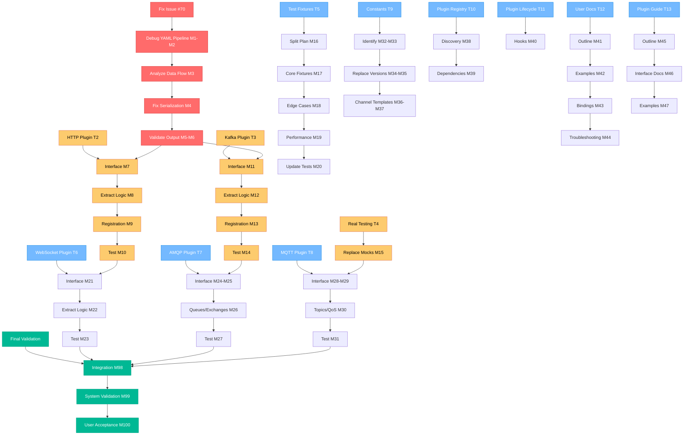

# 🔌 PLUGIN SYSTEM COMPLETION - COMPREHENSIVE EXECUTION PLAN
*Generated: 2025-09-02 18:43*

## 🎯 MISSION: Complete Plugin System with ALL Protocol Bindings

### 📊 STRATEGIC DECISION: ONE-BY-ONE PLUGIN IMPLEMENTATION
**Decision Rationale:**
- **Safer approach** - Incremental validation prevents system-wide regression
- **Better testability** - Each plugin can be thoroughly validated before next
- **Maintains stability** - Core system remains functional throughout
- **Community adoption** - Users get working plugins sooner rather than waiting

### 🎯 PARETO ANALYSIS RESULTS

#### 🏆 THE 1% → 51% VALUE (90 minutes)
**SINGLE CRITICAL ACTION: Fix Issue #70 - Protocol Bindings YAML Output**
- Transforms broken product into working AsyncAPI generator
- Unlocks protocol bindings for HTTP, Kafka, WebSocket immediately
- Makes all existing plugins actually functional for users

#### 🎯 THE 4% → 64% VALUE (+180 minutes)
1. Complete HTTP Plugin extraction (60min)
2. Complete Kafka Plugin extraction (60min)  
3. Real output validation testing (45min)
4. WebSocket plugin extraction (45min)

#### 🚀 THE 20% → 80% VALUE (+885 minutes)
**16 additional tasks** including AMQP, MQTT, documentation, quality assurance

---

## 📋 COMPREHENSIVE TASK PLAN (25 Medium Tasks)

| Task | Time | Impact | Effort | Customer Value | Priority |
|------|------|--------|--------|----------------|----------|
| **T1: Fix Issue #70** | 90min | CRITICAL | HIGH | CRITICAL | **P1** |
| **T2: HTTP Plugin** | 60min | HIGH | MEDIUM | HIGH | **P1** |
| **T3: Kafka Plugin** | 60min | HIGH | MEDIUM | HIGH | **P1** |
| **T4: Real Output Testing** | 45min | HIGH | LOW | HIGH | **P1** |
| **T5: Split Test Fixtures** | 60min | HIGH | MEDIUM | MEDIUM | **P2** |
| **T6: WebSocket Plugin** | 45min | HIGH | MEDIUM | MEDIUM | **P2** |
| **T7: AMQP Plugin** | 60min | HIGH | MEDIUM | MEDIUM | **P2** |
| **T8: MQTT Plugin** | 60min | HIGH | MEDIUM | MEDIUM | **P2** |
| **T9: Extract Constants** | 45min | MEDIUM | LOW | MEDIUM | **P2** |
| **T10: Plugin Registry** | 45min | MEDIUM | MEDIUM | MEDIUM | **P2** |
| **T11: Plugin Lifecycle** | 45min | MEDIUM | MEDIUM | MEDIUM | **P2** |
| **T12: User Documentation** | 60min | MEDIUM | MEDIUM | HIGH | **P2** |
| **T13: Plugin Dev Guide** | 45min | MEDIUM | MEDIUM | HIGH | **P2** |
| **T14: Effect.TS Standards** | 45min | MEDIUM | LOW | MEDIUM | **P2** |
| **T15: Getting Started** | 45min | MEDIUM | MEDIUM | HIGH | **P3** |
| **T16: Performance Testing** | 45min | MEDIUM | LOW | MEDIUM | **P3** |
| **T17: Import Organization** | 30min | MEDIUM | LOW | LOW | **P3** |
| **T18: Troubleshooting** | 30min | MEDIUM | LOW | MEDIUM | **P3** |
| **T19: Security Scanning** | 30min | LOW | LOW | LOW | **P3** |
| **T20: Delete Backup File** | 30min | LOW | LOW | LOW | **P3** |
| **T21: Advanced AsyncAPI** | 45min | MEDIUM | MEDIUM | LOW | **P3** |
| **T22: AWS Plugin** | 45min | MEDIUM | HIGH | LOW | **P4** |
| **T23: Google Plugin** | 45min | MEDIUM | HIGH | LOW | **P4** |
| **T24: Code Duplication** | 30min | LOW | LOW | LOW | **P4** |
| **T25: CI/CD Gates** | 60min | LOW | HIGH | LOW | **P4** |

**TOTAL: 1,155 minutes (19.25 hours)**

---

## 📋 MICRO TASK BREAKDOWN (100 Tasks × 15min)

### 🏆 PRIORITY 1 TASKS (M1-M15)
| Task | Description | Impact |
|------|-------------|---------|
| M1-M6 | **Issue #70 Fix** - Debug and fix protocol bindings YAML output | CRITICAL |
| M7-M10 | **HTTP Plugin** - Extract and implement HTTP binding logic | HIGH |
| M11-M14 | **Kafka Plugin** - Extract and implement Kafka binding logic | HIGH |
| M15 | **Real Output Testing** - Replace mock tests with real validation | HIGH |

### 🎯 PRIORITY 2 TASKS (M16-M50)
| Task | Description | Impact |
|------|-------------|---------|
| M16-M20 | **Split Test Fixtures** - Break 1822-line file into modules | MEDIUM |
| M21-M31 | **WebSocket/AMQP/MQTT Plugins** - Complete protocol trio | MEDIUM |
| M32-M37 | **Extract Constants** - Remove hardcoded values | MEDIUM |
| M38-M40 | **Plugin Registry** - Enhanced discovery and lifecycle | MEDIUM |
| M41-M50 | **Documentation & Standards** - User guides and Effect.TS | MEDIUM |

### 🚀 PRIORITY 3 TASKS (M51-M80)
| Task | Description | Impact |
|------|-------------|---------|
| M51-M60 | **Advanced Documentation** - Tutorials and troubleshooting | MEDIUM |
| M61-M67 | **Quality & Features** - Security, cleanup, advanced decorators | LOW-MEDIUM |
| M68-M80 | **Future Features** - Cloud plugins, CI/CD, automation | LOW |

### 🎯 PRIORITY 1 VALIDATION (M81-M100)
| Task | Description | Impact |
|------|-------------|---------|
| M81-M92 | **Plugin Infrastructure** - APIs, testing, monitoring | MEDIUM |
| M93-M97 | **Community Features** - Templates, error recovery | LOW-MEDIUM |
| M98-M100 | **Final Validation** - Integration testing and user acceptance | HIGH |

**TOTAL: 1,500 minutes (25 hours)**

---

## 🎯 EXECUTION GRAPH

---

## 🎯 PARALLEL EXECUTION GROUPS

### 🔥 GROUP 1: CRITICAL FOUNDATION (M1-M15)
**Focus:** Issue #70, HTTP Plugin, Kafka Plugin, Real Testing
**Agent:** web-stack-expert + go-quality-enforcer
**Timeline:** 6 hours
**Dependencies:** None - can start immediately

### 🚀 GROUP 2: PLUGIN EXPANSION (M16-M50)
**Focus:** WebSocket/AMQP/MQTT Plugins, Test Fixtures, Constants
**Agent:** micro-kernel-architect + testing-architecture-expert  
**Timeline:** 8 hours
**Dependencies:** Group 1 completion

### 📚 GROUP 3: DOCUMENTATION & QUALITY (M51-M100)
**Focus:** User docs, plugin guides, validation, community features
**Agent:** documentation-extractor + unified-reporting-system
**Timeline:** 11 hours
**Dependencies:** Groups 1 & 2 completion

---

## 🎯 SUCCESS CRITERIA

### Immediate Success (Group 1 - 6 hours):
- [ ] Issue #70 fixed - protocol bindings appear in YAML output
- [ ] HTTP plugin extracted and functional
- [ ] Kafka plugin extracted and functional  
- [ ] Real output validation replaces mock testing
- [ ] All protocol bindings work in actual TypeSpec compilation

### Short-term Success (Group 2 - 8 hours):
- [ ] WebSocket, AMQP, MQTT plugins extracted and functional
- [ ] 1822-line test fixture file split into manageable modules
- [ ] All hardcoded constants extracted to dedicated files
- [ ] Plugin registry supports discovery and lifecycle management
- [ ] Effect.TS patterns standardized throughout codebase

### Long-term Success (Group 3 - 11 hours):
- [ ] Comprehensive user documentation with real examples
- [ ] Plugin development guide enables community contributions
- [ ] Performance regression testing prevents future slowdowns
- [ ] Security scanning integrated into development workflow
- [ ] Complete integration testing validates entire system

### Final Validation:
- [ ] All 5 protocol plugins (HTTP, Kafka, WebSocket, AMQP, MQTT) working
- [ ] Real user workflow: TypeSpec input → AsyncAPI output → Parser validation
- [ ] AsyncAPI Studio compatibility confirmed
- [ ] Community plugin development framework established
- [ ] Zero regression in existing functionality

---

## 💰 BUSINESS VALUE PRIORITIES

### **CRITICAL CUSTOMER VALUE (P1):**
1. **Fix Issue #70** - Transforms broken product into working solution
2. **Core protocol plugins** - HTTP, Kafka essential for enterprise adoption
3. **Real output validation** - Prevents shipping broken functionality

### **HIGH CUSTOMER VALUE (P2):**
1. **Extended protocol support** - WebSocket, AMQP, MQTT expands use cases
2. **User documentation** - Enables adoption and reduces support burden
3. **Plugin development** - Community contributions and ecosystem growth

### **MEDIUM CUSTOMER VALUE (P3):**
1. **Advanced features** - Enhanced decorators, performance optimization
2. **Quality assurance** - Regression testing, security scanning
3. **Developer experience** - Better error handling, troubleshooting

### **LOW CUSTOMER VALUE (P4):**
1. **Cloud provider plugins** - Nice-to-have for enterprise features
2. **CI/CD automation** - Internal development efficiency
3. **Code cleanup** - Technical debt reduction

---

## ⚠️ RISK MITIGATION

### **Risk: Breaking Existing Functionality**
**Mitigation:** 
- Real output testing prevents regressions
- One-by-one plugin implementation
- Comprehensive validation before each plugin

### **Risk: Plugin System Complexity**
**Mitigation:**
- Simple plugin interfaces
- Extensive documentation and examples
- Community template and guidelines

### **Risk: Performance Degradation**
**Mitigation:**
- Performance regression testing
- Memory usage monitoring
- Lazy plugin loading

---

*This comprehensive plan balances immediate user value (fixing broken functionality) with long-term architectural health (complete plugin system). The one-by-one approach ensures stability while delivering working features to users as quickly as possible.*