# 🎯 PARETO EXECUTION PLAN - Maximum Value Delivery

**Generated:** 2025-09-02 18:55  
**Session:** Strategic Pareto Analysis & Systematic Execution

## 📊 PARETO ANALYSIS RESULTS

### 🥇 1% EFFORT → 51% VALUE (THE GOLDEN OPPORTUNITY)

**Single Item**: Complete .tsp Example for Copy-Paste Usage (#87)

- **Effort**: 30 minutes
- **Value**: 51% (Unlocks community adoption completely)
- **Impact**: From technical success to community explosion
- **Customer Value**: First-time users succeed in minutes, not hours

### 🥈 4% EFFORT → 64% VALUE (FOUNDATION SOLIDIFICATION)

**3 Critical Items**:

1. ValidationService Extraction (#85) - 60min - Completes service architecture
2. Complete README & Usage Guide (#35) - 90min - Professional documentation
3. Fix Test Infrastructure (#11, #69) - 100min - CI/CD foundation

### 🥉 20% EFFORT → 80% VALUE (PROFESSIONAL ECOSYSTEM)

**8 High-Impact Items**: 4. JSDoc Documentation (#81) - 90min - Developer experience 5. CI/CD Pipeline Setup (#36) - 100min - Automated quality 6. Replace Remaining Magic Numbers (#53) - 60min - Code quality 7. DocumentBuilder Interface (#82) - 80min - Architecture completion  
8. MQTT Protocol Implementation (#40) - 90min - IoT market capture 9. HTTP Protocol Implementation (implicit) - 80min - REST API integration 10. Performance Constants Implementation - 60min - Monitoring foundation 11. Test Coverage Achievement (#34) - 100min - Quality assurance

### 📋 REMAINING 20% EFFORT → 80% COMPLETION

**16 Enhancement Items**:
12-27. Additional protocol implementations, advanced features, optimizations

---

## 📈 COMPREHENSIVE TASK BREAKDOWN (25 Tasks, 30-100min Each)

| Priority                         | Task                           | Issue   | Effort | Value | Customer Impact           | Technical Impact             |
| -------------------------------- | ------------------------------ | ------- | ------ | ----- | ------------------------- | ---------------------------- |
| **TIER 1: 1% → 51% VALUE**       |
| 1                                | Complete .tsp Example Creation | #87     | 30min  | 51%   | Community adoption unlock | Documentation foundation     |
| **TIER 2: 4% → 64% VALUE**       |
| 2                                | ValidationService Extraction   | #85     | 60min  | 64%   | Architecture completion   | Service pattern finalization |
| 3                                | Complete README & Usage Guide  | #35     | 90min  | 68%   | Professional presentation | User onboarding              |
| 4                                | Fix Test Infrastructure Crisis | #11,#69 | 100min | 72%   | CI/CD reliability         | Quality foundation           |
| **TIER 3: 20% → 80% VALUE**      |
| 5                                | JSDoc Documentation            | #81     | 90min  | 76%   | Developer experience      | Code maintainability         |
| 6                                | CI/CD Pipeline Setup           | #36     | 100min | 78%   | Automated quality         | DevOps foundation            |
| 7                                | Magic Numbers Elimination      | #53     | 60min  | 79%   | Code quality              | Maintainability              |
| 8                                | DocumentBuilder Interface      | #82     | 80min  | 80%   | Architecture purity       | Extensibility                |
| 9                                | MQTT Protocol Implementation   | #40     | 90min  | 81%   | IoT market capture        | Protocol diversity           |
| 10                               | HTTP Protocol Enhancement      | -       | 80min  | 82%   | REST API integration      | Protocol completeness        |
| 11                               | Performance Constants          | -       | 60min  | 83%   | Monitoring foundation     | Operations readiness         |
| 12                               | Test Coverage Achievement      | #34     | 100min | 84%   | Quality assurance         | Reliability confidence       |
| **TIER 4: ENHANCEMENT & POLISH** |
| 13                               | AMQP Protocol Implementation   | #37     | 90min  | 85%   | Enterprise messaging      | Protocol ecosystem           |
| 14                               | Redis Protocol Implementation  | #42     | 80min  | 86%   | Caching systems           | Protocol diversity           |
| 15                               | WebSocket Enhancement          | -       | 70min  | 86%   | Real-time applications    | Protocol optimization        |
| 16                               | AWS SQS Protocol               | #45     | 90min  | 87%   | Cloud integration         | Enterprise features          |
| 17                               | AWS SNS Protocol               | #44     | 80min  | 87%   | Cloud messaging           | Enterprise features          |
| 18                               | Google Pub/Sub Protocol        | #43     | 90min  | 88%   | Cloud diversity           | Multi-cloud support          |
| 19                               | Error Type Hierarchy           | #54     | 70min  | 88%   | Developer experience      | Error handling               |
| 20                               | High-Priority TODOs            | #55     | 80min  | 89%   | Code quality              | Technical debt               |
| 21                               | Emitter Logging Enhancement    | #59     | 60min  | 89%   | Debugging capability      | Operations support           |
| 22                               | File System Verification       | #58     | 50min  | 90%   | Reliability               | Quality assurance            |
| 23                               | AssetEmitter Documentation     | #57     | 70min  | 90%   | Architecture clarity      | Maintainability              |
| 24                               | Multiple Output Files          | #78     | 80min  | 91%   | Flexibility               | User options                 |
| 25                               | Advanced Caching System        | #79     | 100min | 91%   | Performance               | Scalability                  |

---

## 🎯 EXECUTION STRATEGY

### Phase 1: Golden Opportunity (30 minutes)

Execute Task #1 immediately - Complete .tsp example unlocks community adoption

### Phase 2: Foundation Solidification (4 hours)

Execute Tasks #2-4 in parallel where possible - Architecture + Documentation + Quality

### Phase 3: Professional Ecosystem (13 hours)

Execute Tasks #5-12 systematically - Developer experience + Operations + Protocols

### Phase 4: Enhancement & Polish (18 hours)

Execute Tasks #13-25 based on community feedback and priorities

---

## 🔄 EXECUTION GRAPH

```mermaid
graph TD
    A[🥇 Complete .tsp Example - 30min] -->|51% Value Unlocked| B[🥈 Foundation Phase]

    B --> C[ValidationService - 60min]
    B --> D[README Guide - 90min]
    B --> E[Test Infrastructure - 100min]

    C -->|Architecture Complete| F[🥉 Professional Phase]
    D -->|Documentation Complete| F
    E -->|Quality Complete| F

    F --> G[JSDoc - 90min]
    F --> H[CI/CD - 100min]
    F --> I[Magic Numbers - 60min]
    F --> J[DocumentBuilder - 80min]

    G --> K[🏆 Protocol Expansion]
    H --> K
    I --> K
    J --> K

    K --> L[MQTT - 90min]
    K --> M[HTTP - 80min]
    K --> N[AMQP - 90min]
    K --> O[Redis - 80min]

    L --> P[🎉 Community Success]
    M --> P
    N --> P
    O --> P

    style A fill:#ff6b6b,stroke:#333,stroke-width:4px
    style B fill:#4ecdc4,stroke:#333,stroke-width:3px
    style F fill:#45b7d1,stroke:#333,stroke-width:3px
    style K fill:#96ceb4,stroke:#333,stroke-width:2px
    style P fill:#feca57,stroke:#333,stroke-width:4px
```

---

## 📊 SUCCESS METRICS

### Immediate Success (1% → 51%)

- [ ] Complete .tsp example available for copy-paste
- [ ] First-time user success time: Hours → 30 minutes
- [ ] Community adoption barriers eliminated

### Foundation Success (4% → 64%)

- [ ] Service architecture 100% complete
- [ ] Professional documentation published
- [ ] Test infrastructure reliable and comprehensive

### Professional Success (20% → 80%)

- [ ] Full developer documentation
- [ ] Automated CI/CD pipeline
- [ ] Core protocol implementations
- [ ] Production-ready monitoring

### Ecosystem Success (Remaining → 100%)

- [ ] Comprehensive protocol ecosystem
- [ ] Advanced features and optimizations
- [ ] Community contributions flowing
- [ ] Microsoft TypeSpec ecosystem recognition

---

## 🎯 CUSTOMER VALUE REALIZATION

**Week 1**: Community discovers complete .tsp example, adoption begins  
**Week 2**: Professional documentation attracts enterprise evaluation  
**Month 1**: Protocol implementations enable diverse use cases  
**Quarter 1**: Established as definitive TypeSpec AsyncAPI solution

**The strategy transforms the project from technical achievement to community phenomenon through strategic value delivery.**
