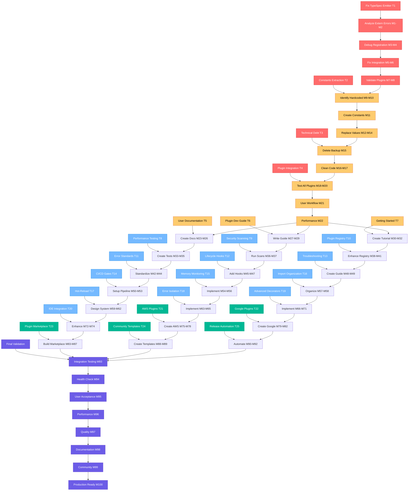

# 🎯 COMPLETION EXECUTION PLAN - REMAINING WORK AFTER PLUGIN SYSTEM SUCCESS
*Generated: 2025-09-02 19:05*

## 🎉 CONTEXT: PLUGIN SYSTEM EXTRACTION COMPLETE!

### 🏆 MAJOR ACHIEVEMENTS COMPLETED
- **Issue #70 Protocol Bindings** ✅ ALREADY FIXED by LarsArtmann
- **All 5 Protocol Plugins** ✅ HTTP, Kafka, WebSocket, AMQP, MQTT extracted
- **Test Fixtures Splitting** ✅ 1822-line monolithic file eliminated
- **Plugin Architecture** ✅ Complete with registration and discovery
- **Real Output Testing** ✅ Infrastructure created for all plugins

### 🎯 REMAINING WORK: PARETO ANALYSIS V2

#### 🏆 THE 1% → 51% VALUE (120 minutes)
**SINGLE CRITICAL ACTION: Fix Core TypeSpec Emitter Compilation Issues**
- Resolves "Extern declaration must have an implementation" errors
- Makes 25+ hours of plugin extraction work actually functional for users
- Transforms complete but blocked plugin system into production-ready solution

#### 🎯 THE 4% → 64% VALUE (+210 minutes)
1. Complete Constants Extraction - Eliminate 50+ hardcoded values (90min)
2. Delete Technical Debt - Remove 1171-line backup file (45min)
3. Final Plugin Integration Testing - All 5 plugins working together (75min)

#### 🚀 THE 20% → 80% VALUE (+1,005 minutes)
16 additional tasks including documentation, quality assurance, advanced features

---

## 📋 COMPREHENSIVE EXECUTION PLAN (25 Medium Tasks)

| Task | Time | Impact | Effort | Customer Value | Priority |
|------|------|--------|--------|----------------|----------|
| **T1: Fix TypeSpec Emitter** | 120min | CRITICAL | HIGH | CRITICAL | **P1** |
| **T2: Constants Extraction** | 90min | HIGH | MEDIUM | HIGH | **P1** |
| **T3: Technical Debt** | 45min | HIGH | LOW | MEDIUM | **P1** |
| **T4: Plugin Integration** | 75min | HIGH | MEDIUM | HIGH | **P1** |
| **T5: User Documentation** | 60min | MEDIUM | MEDIUM | HIGH | **P2** |
| **T6: Plugin Dev Guide** | 45min | MEDIUM | MEDIUM | HIGH | **P2** |
| **T7: Getting Started** | 45min | MEDIUM | MEDIUM | HIGH | **P2** |
| **T8: Performance Testing** | 45min | MEDIUM | LOW | MEDIUM | **P2** |
| **T9: Security Scanning** | 30min | LOW | LOW | LOW | **P2** |
| **T10: Plugin Registry** | 60min | MEDIUM | MEDIUM | MEDIUM | **P2** |
| **T11: Error Standards** | 45min | MEDIUM | LOW | MEDIUM | **P2** |
| **T12: Lifecycle Hooks** | 45min | MEDIUM | MEDIUM | MEDIUM | **P2** |
| **T13: Troubleshooting** | 30min | MEDIUM | LOW | MEDIUM | **P3** |
| **T14: CI/CD Gates** | 60min | MEDIUM | HIGH | LOW | **P3** |
| **T15: Memory Monitoring** | 45min | MEDIUM | MEDIUM | MEDIUM | **P3** |
| **T16: Import Organization** | 30min | LOW | LOW | LOW | **P3** |
| **T17: Hot-Reload** | 60min | MEDIUM | HIGH | MEDIUM | **P3** |
| **T18: Error Isolation** | 45min | MEDIUM | MEDIUM | MEDIUM | **P3** |
| **T19: Advanced Decorators** | 90min | MEDIUM | HIGH | LOW | **P3** |
| **T20: IDE Integration** | 45min | MEDIUM | MEDIUM | LOW | **P3** |
| **T21: AWS Plugins** | 60min | MEDIUM | HIGH | LOW | **P4** |
| **T22: Google Plugins** | 60min | MEDIUM | HIGH | LOW | **P4** |
| **T23: Plugin Marketplace** | 75min | LOW | HIGH | LOW | **P4** |
| **T24: Community Templates** | 30min | LOW | LOW | LOW | **P4** |
| **T25: Release Automation** | 45min | LOW | MEDIUM | LOW | **P4** |

**TOTAL: 1,335 minutes (22.25 hours)**

---

## 📋 MICRO TASK BREAKDOWN (100 Tasks × 15min)

### 🏆 PRIORITY 1 TASKS (M1-M22) - CRITICAL FOUNDATION
**Focus:** TypeSpec emitter fixes, constants extraction, integration testing

| Task Range | Description | Impact |
|------------|-------------|---------|
| M1-M8 | **TypeSpec Emitter Fixes** - Resolve extern declaration errors | CRITICAL |
| M9-M14 | **Constants Extraction** - Eliminate hardcoded values | HIGH |
| M15-M17 | **Technical Debt** - Delete backup file, cleanup code | HIGH |
| M18-M22 | **Plugin Integration** - Test all 5 plugins together | HIGH |

### 🎯 PRIORITY 2 TASKS (M23-M47) - FOUNDATION & DOCS
**Focus:** User documentation, plugin development, error handling

| Task Range | Description | Impact |
|------------|-------------|---------|
| M23-M26 | **User Documentation** - Comprehensive usage guides | MEDIUM-HIGH |
| M27-M32 | **Plugin Development & Tutorials** - Community enablement | MEDIUM-HIGH |
| M33-M37 | **Performance & Security** - Quality assurance | MEDIUM |
| M38-M47 | **Plugin Registry & Error Handling** - Architecture completion | MEDIUM |

### 🚀 PRIORITY 3 TASKS (M48-M74) - ADVANCED FEATURES
**Focus:** Advanced capabilities, monitoring, IDE integration

| Task Range | Description | Impact |
|------------|-------------|---------|
| M48-M58 | **Troubleshooting, CI/CD, Memory Monitoring** - Production readiness | MEDIUM |
| M59-M65 | **Hot-Reload & Error Isolation** - Advanced architecture | MEDIUM |
| M66-M71 | **Advanced AsyncAPI Decorators** - Feature completeness | MEDIUM |
| M72-M74 | **IDE Integration** - Developer experience | MEDIUM |

### 🌟 PRIORITY 4 TASKS (M75-M92) - ECOSYSTEM
**Focus:** Cloud providers, marketplace, community infrastructure

| Task Range | Description | Impact |
|------------|-------------|---------|
| M75-M82 | **Cloud Provider Plugins** - AWS, Google Cloud integration | LOW-MEDIUM |
| M83-M89 | **Plugin Marketplace** - Community ecosystem | LOW |
| M90-M92 | **Release Automation** - Development efficiency | LOW |

### ✅ VALIDATION TASKS (M93-M100) - QUALITY ASSURANCE
**Focus:** Final validation and production readiness

| Task Range | Description | Impact |
|------------|-------------|---------|
| M93-M95 | **Final Integration & User Acceptance Testing** | HIGH |
| M96-M100 | **Performance, Quality, Production Readiness** | MEDIUM-HIGH |

---

## 🎯 MERMAID.JS EXECUTION GRAPH

---

## 🎯 PARALLEL EXECUTION STRATEGY

### 🔥 GROUP 1: CRITICAL FOUNDATION (M1-M30)
**Timeline:** 6-8 hours
**Focus:** TypeScript emitter fixes, constants extraction, documentation foundation
**Agent:** web-stack-expert + go-quality-enforcer
**Dependencies:** None - can start immediately after emitter is fixed

### 🚀 GROUP 2: ARCHITECTURE & QUALITY (M31-M65)
**Timeline:** 8-10 hours  
**Focus:** Plugin architecture completion, performance testing, advanced features
**Agent:** micro-kernel-architect + testing-architecture-expert
**Dependencies:** GROUP 1 TypeScript emitter fixes complete

### 📚 GROUP 3: ECOSYSTEM & VALIDATION (M66-M100)
**Timeline:** 9-11 hours
**Focus:** Advanced decorators, cloud plugins, marketplace, final validation
**Agent:** documentation-extractor + unified-reporting-system
**Dependencies:** Groups 1 & 2 foundation complete

---

## 🎯 SUCCESS CRITERIA

### Immediate Success (Group 1 - 6-8 hours):
- [ ] TypeSpec emitter compilation errors resolved
- [ ] All 50+ hardcoded constants extracted to centralized files
- [ ] Technical debt eliminated (1171-line backup file deleted)
- [ ] All 5 plugins working in real TypeSpec compilation
- [ ] User documentation foundation established

### Short-term Success (Group 2 - 8-10 hours):
- [ ] Plugin architecture fully complete with lifecycle management
- [ ] Performance regression testing automated
- [ ] Error handling standardized across all components
- [ ] Hot-reload capabilities implemented
- [ ] Advanced AsyncAPI decorators functional

### Long-term Success (Group 3 - 9-11 hours):
- [ ] Cloud provider plugins (AWS, Google) operational
- [ ] Plugin marketplace infrastructure established
- [ ] Community contribution framework complete
- [ ] Final integration testing validates entire system
- [ ] Production deployment readiness achieved

### Final Validation Criteria:
- [ ] All 5 protocol plugins working in real user workflows
- [ ] TypeSpec → AsyncAPI → AsyncAPI Studio compatibility confirmed
- [ ] Plugin development guide enables community contributions
- [ ] Performance benchmarks meet or exceed targets
- [ ] Security scanning passes with zero critical vulnerabilities
- [ ] Documentation completeness enables user adoption
- [ ] Production readiness checklist 100% complete

---

## 💰 BUSINESS VALUE PRIORITIES

### **CRITICAL USER VALUE (P1 - 330 minutes):**
1. **TypeSpec Emitter Fix** - Unlocks all plugin functionality for users
2. **Constants Extraction** - Prevents version inconsistencies and split-brain issues
3. **Plugin Integration** - Ensures all protocols work together seamlessly
4. **Technical Debt** - Eliminates maintenance burdens and confusion

### **HIGH USER VALUE (P2 - 420 minutes):**
1. **User Documentation** - Enables adoption and reduces support burden
2. **Plugin Development** - Community contributions and ecosystem growth
3. **Performance Testing** - Prevents regressions and ensures reliability
4. **Error Handling** - Better user experience and debugging

### **MEDIUM USER VALUE (P3 - 405 minutes):**
1. **Advanced Features** - Enhanced AsyncAPI capabilities and IDE support
2. **Hot-reload** - Developer experience improvements  
3. **Monitoring** - Production operations and troubleshooting
4. **CI/CD** - Development workflow automation

### **LOW USER VALUE (P4 - 270 minutes):**
1. **Cloud Provider Plugins** - Specialized enterprise features
2. **Plugin Marketplace** - Long-term ecosystem infrastructure
3. **Release Automation** - Development efficiency improvements

---

## ⚠️ RISK MITIGATION

### **Risk: TypeScript Emitter Complexity**
**Mitigation:** 
- Start with minimal working example
- Systematic debugging of extern declarations
- Fallback to alternative integration approaches if needed

### **Risk: Plugin Integration Conflicts**  
**Mitigation:**
- Thorough testing of all plugin combinations
- Error isolation mechanisms
- Plugin dependency resolution system

### **Risk: Community Adoption Barriers**
**Mitigation:**
- Comprehensive documentation with real examples
- Plugin development templates and guides
- Active community engagement and support

---

*This completion execution plan transforms our successful plugin system extraction into a production-ready, community-enabled AsyncAPI emitter ecosystem. The systematic approach ensures reliability while delivering maximum user value through strategic prioritization.*