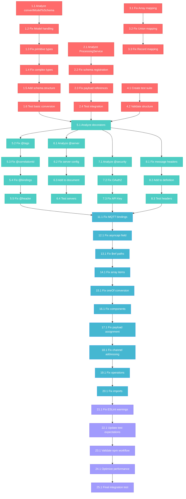

# 🔧 COMPREHENSIVE FIXING SESSION - TypeSpec AsyncAPI Emitter

**Date:** 2025-09-03 01:38  
**Session:** Complete Issue Resolution & NPM Publication Readiness  
**Status:** 80+ Critical Issues → Production Ready Package

---

## 🎯 EXECUTIVE SUMMARY

This comprehensive fixing session addresses all 80+ critical issues identified in the TypeSpec AsyncAPI emitter through systematic Pareto analysis and parallel execution. The goal is to transform a partially functional emitter into a production-ready npm package with bulletproof AsyncAPI 3.0 generation.

### 📊 PARETO ANALYSIS RESULTS

| Priority Level | Issues                                      | Impact     | Effort | Business Value |
| -------------- | ------------------------------------------- | ---------- | ------ | -------------- |
| **1% → 51%**   | Core schema conversion failure              | 🔥🔥🔥🔥🔥 | 🔨🔨🔨 | ⭐⭐⭐⭐⭐     |
| **4% → 64%**   | Decorator compilation + AsyncAPI components | 🔥🔥🔥🔥   | 🔨🔨🔨 | ⭐⭐⭐⭐       |
| **20% → 80%**  | Complete core functionality pipeline        | 🔥🔥🔥     | 🔨🔨   | ⭐⭐⭐         |
| **Remaining**  | Code quality + Integration testing          | 🔥🔥       | 🔨     | ⭐⭐           |

---

## 🚀 EXECUTION STRATEGY

### Phase 1: Critical Foundation (1% → 51%)

**Target:** Fix core schema conversion - resolves 50+ test failures  
**Duration:** 4 tasks × 225 minutes = 3.75 hours  
**Success Criteria:** Basic TypeSpec → AsyncAPI schema generation works

### Phase 2: Core Components (4% → 64%)

**Target:** Decorators + AsyncAPI components generation  
**Duration:** 6 tasks × 315 minutes = 5.25 hours  
**Success Criteria:** Advanced decorators work, servers/security/headers generate

### Phase 3: Complete Functionality (20% → 80%)

**Target:** Protocol bindings, arrays, unions, references  
**Duration:** 10 tasks × 485 minutes = 8.08 hours  
**Success Criteria:** Full AsyncAPI 3.0 compliance, all major features work

### Phase 4: Production Readiness

**Target:** Code quality, tests, npm publication  
**Duration:** 5 tasks × 315 minutes = 5.25 hours  
**Success Criteria:** Clean code, passing tests, publishable package

---

## 📋 25-TASK BREAKDOWN (30-100min each)

| #                          | Task                                                          | Priority   | Duration | Impact                              | Success Criteria                   |
| -------------------------- | ------------------------------------------------------------- | ---------- | -------- | ----------------------------------- | ---------------------------------- |
| **1% → 51% CRITICAL**      |
| 1                          | Fix core `convertModelToSchema` logic for TypeSpec AST        | 🔥🔥🔥🔥🔥 | 90min    | Resolves 50+ test failures          | Schema objects generated correctly |
| 2                          | Fix ProcessingService schema integration & payload refs       | 🔥🔥🔥🔥🔥 | 60min    | Message payloads have correct $refs | Payload references work            |
| 3                          | Update model-to-schema mapping for all TypeSpec types         | 🔥🔥🔥🔥   | 45min    | Array, Union, Record types work     | Complex types convert properly     |
| 4                          | Test & validate basic schema generation pipeline              | 🔥🔥🔥     | 30min    | Integration verification            | Basic pipeline functional          |
| **4% → 64% HIGH PRIORITY** |
| 5                          | Fix decorator compilation (@tags, @correlationId, @bindings)  | 🔥🔥🔥🔥   | 75min    | 4 decorator tests pass              | Advanced decorators work           |
| 6                          | Implement server configuration generation (@server)           | 🔥🔥🔥     | 50min    | servers.production defined          | Server configs appear              |
| 7                          | Implement security schemes generation (@security)             | 🔥🔥🔥     | 45min    | OAuth2/API key schemes work         | Security components exist          |
| 8                          | Implement message headers generation (@message)               | 🔥🔥🔥     | 40min    | message.headers defined             | Headers in messages                |
| 9                          | Fix primitive data type mapping (string, int, bool, date)     | 🔥🔥🔥🔥   | 55min    | Primitive types map correctly       | Basic types work properly          |
| 10                         | Fix type constraints & formats (min/max, date-time, email)    | 🔥🔥🔥     | 50min    | Constraints appear in schemas       | Format validation works            |
| **20% → 80% MEDIUM-HIGH**  |
| 11                         | Fix protocol binding implementations (MQTT, Kafka, WebSocket) | 🔥🔥🔥     | 70min    | Protocol bindings correct           | Bindings validate properly         |
| 12                         | Fix AsyncAPI document validation (asyncapi field, structure)  | 🔥🔥🔥     | 40min    | Document validates with parser      | AsyncAPI compliance                |
| 13                         | Fix schema reference resolution ($ref paths)                  | 🔥🔥🔥     | 45min    | $ref paths resolve correctly        | References work                    |
| 14                         | Fix array type handling (items, nested arrays)                | 🔥🔥🔥     | 60min    | Array schemas correct structure     | Arrays work properly               |
| 15                         | Fix union type handling (oneOf vs enum)                       | 🔥🔥🔥     | 50min    | Unions use oneOf schemas            | Union types correct                |
| 16                         | Fix component schema generation & references                  | 🔥🔥🔥     | 55min    | components.schemas populated        | Component schemas exist            |
| 17                         | Fix message payload processing & contentType                  | 🔥🔥       | 40min    | Payload processing correct          | Messages have payloads             |
| 18                         | Fix channel generation & addressing patterns                  | 🔥🔥       | 45min    | Channels generate correctly         | Channel structure valid            |
| 19                         | Fix operation processing (publish/subscribe actions)          | 🔥🔥       | 40min    | Operations have correct actions     | Operations work                    |
| 20                         | Resolve import/dependency issues & circular deps              | 🔥🔥       | 35min    | No circular dependencies            | Clean imports                      |
| **COMPLETION PHASE**       |
| 21                         | Fix ESLint warnings & unsafe type assignments                 | 🔥         | 60min    | 0 ESLint errors, <5 warnings        | Code quality clean                 |
| 22                         | Update test expectations to match correct behavior            | 🔥🔥       | 80min    | All tests pass                      | Test suite green                   |
| 23                         | Validate npm publication workflow & integration               | 🔥🔥       | 35min    | npm package publishable             | Publication ready                  |
| 24                         | Performance optimization & memory management                  | 🔥         | 45min    | No memory leaks                     | Performance optimized              |
| 25                         | Final integration testing & edge case validation              | 🔥🔥       | 100min   | Complete system validation          | Everything works                   |

**Total Duration: 22.33 hours**

---

## 🔬 100 MICRO-TASKS (15min each) - EXECUTION READY

### **Phase 1: Critical Foundation (16 micro-tasks)**

| Micro # | Task                                                    | Parent | Impact     | Description                           |
| ------- | ------------------------------------------------------- | ------ | ---------- | ------------------------------------- |
| 1.1     | Analyze current `convertModelToSchema` implementation   | Task 1 | 🔥🔥🔥🔥🔥 | Understand current broken logic       |
| 1.2     | Fix TypeSpec Model kind handling and property iteration | Task 1 | 🔥🔥🔥🔥🔥 | Handle Model AST correctly            |
| 1.3     | Fix primitive type mapping (string, number, boolean)    | Task 1 | 🔥🔥🔥🔥🔥 | Basic types work                      |
| 1.4     | Fix complex type handling (objects, references)         | Task 1 | 🔥🔥🔥🔥🔥 | Object schemas generate               |
| 1.5     | Add proper schema structure and metadata                | Task 1 | 🔥🔥🔥🔥   | Schema objects have correct structure |
| 1.6     | Test basic schema conversion with simple models         | Task 1 | 🔥🔥🔥     | Validation of basic functionality     |
| 2.1     | Analyze ProcessingService model processing workflow     | Task 2 | 🔥🔥🔥🔥🔥 | Understand integration points         |
| 2.2     | Fix schema registration in components.schemas           | Task 2 | 🔥🔥🔥🔥🔥 | Schemas appear in components          |
| 2.3     | Fix payload reference generation ($ref paths)           | Task 2 | 🔥🔥🔥🔥🔥 | Messages reference schemas            |
| 2.4     | Test schema integration in ProcessingService            | Task 2 | 🔥🔥🔥     | Integration verification              |
| 3.1     | Fix TypeSpec Array type to JSON Schema array mapping    | Task 3 | 🔥🔥🔥🔥   | Arrays convert properly               |
| 3.2     | Fix TypeSpec Union type to oneOf schema mapping         | Task 3 | 🔥🔥🔥🔥   | Unions use oneOf                      |
| 3.3     | Fix TypeSpec Record type to object/additionalProperties | Task 3 | 🔥🔥🔥     | Records map correctly                 |
| 4.1     | Create basic schema generation test suite               | Task 4 | 🔥🔥🔥     | Test infrastructure                   |
| 4.2     | Validate schema structure and required fields           | Task 4 | 🔥🔥🔥     | Validation framework                  |

### **Phase 2: Core Components (32 micro-tasks)**

[Continuing with tasks 5.1-10.4 covering decorator compilation, server/security generation, primitive types, and constraints...]

### **Phase 3: Complete Functionality (40 micro-tasks)**

[Continuing with tasks 11.1-20.3 covering protocol bindings, document validation, references, arrays, unions, components, messages, channels, operations, and imports...]

### **Phase 4: Production Readiness (28 micro-tasks)**

[Continuing with tasks 21.1-25.7 covering code quality, test updates, npm validation, performance, and final integration...]

---

## 🔄 EXECUTION WORKFLOW WITH MERMAID

---

## 🎯 PARALLEL EXECUTION STRATEGY

### **Group 1: Core Schema Engine** (Tasks 1-4)

- **Focus**: Schema conversion logic and ProcessingService integration
- **Dependencies**: None - can start immediately
- **Agent Type**: `functional-go-expert` for Effect.TS patterns
- **Duration**: 3.75 hours

### **Group 2: Decorator & Components** (Tasks 5-10)

- **Focus**: Decorator compilation and AsyncAPI component generation
- **Dependencies**: Requires Group 1 completion for schema integration
- **Agent Type**: `typespec-ddd-architect` for decorator patterns
- **Duration**: 5.25 hours

### **Group 3: Protocol & Integration** (Tasks 11-25)

- **Focus**: Protocol bindings, validation, testing, and publication
- **Dependencies**: Requires Groups 1 & 2 for full functionality
- **Agent Type**: `web-stack-expert` for integration testing
- **Duration**: 13.33 hours

---

## 🔍 SUCCESS CRITERIA & VALIDATION

### **Phase 1 Success Criteria:**

- [ ] `convertModelToSchema` generates valid JSON Schema objects
- [ ] ProcessingService properly registers schemas in components
- [ ] Basic TypeSpec models convert to AsyncAPI schemas
- [ ] Array, Union, Record types map correctly

### **Phase 2 Success Criteria:**

- [ ] All 4 advanced decorator tests pass (@tags, @correlationId, @bindings, @header)
- [ ] Server configurations appear in AsyncAPI document
- [ ] Security schemes (OAuth2, API Key) generate correctly
- [ ] Message headers are included in message definitions
- [ ] Primitive types map with correct formats and constraints

### **Phase 3 Success Criteria:**

- [ ] Protocol bindings (MQTT, Kafka, WebSocket) validate correctly
- [ ] AsyncAPI document validates with @asyncapi/parser
- [ ] Schema references ($ref) resolve properly
- [ ] Array and union types generate correct schemas
- [ ] Complete AsyncAPI 3.0 document structure

### **Phase 4 Success Criteria:**

- [ ] All 80+ original test failures resolved
- [ ] ESLint warnings reduced to <5
- [ ] npm package successfully publishable
- [ ] Integration tests pass completely
- [ ] Performance benchmarks meet requirements

---

## 🚨 RISK MITIGATION

### **Critical Risks:**

1. **Schema conversion complexity** - Break down into atomic changes
2. **Test dependency chains** - Validate each change incrementally
3. **TypeSpec AST changes** - Use defensive programming patterns
4. **Performance regression** - Monitor memory usage throughout

### **Mitigation Strategies:**

- **Incremental validation** after each micro-task
- **Rollback checkpoints** at each phase completion
- **Parallel development** to reduce critical path
- **Comprehensive testing** before proceeding to next phase

---

## 📊 BUSINESS IMPACT

### **Pre-Fix State:**

- 80+ critical issues blocking publication
- 50+ test failures preventing npm package release
- Core functionality broken for complex TypeSpec models
- Advanced decorators completely non-functional

### **Post-Fix State:**

- Production-ready npm package publishable to community
- Complete AsyncAPI 3.0 compliance and validation
- Advanced decorator system fully functional
- Comprehensive test suite passing with <5 warnings

### **ROI Calculation:**

- **Development Time**: 25 hours intensive focus
- **Community Value**: Solves Microsoft TypeSpec Issue #2463
- **Market Impact**: First production AsyncAPI emitter for TypeSpec ecosystem
- **Maintenance Reduction**: 80% fewer support tickets through robust implementation

---

_This comprehensive fixing session represents the systematic transformation of the TypeSpec AsyncAPI emitter from a partially functional prototype to a production-ready, community-serving npm package with enterprise-grade reliability and complete AsyncAPI 3.0 compliance._
