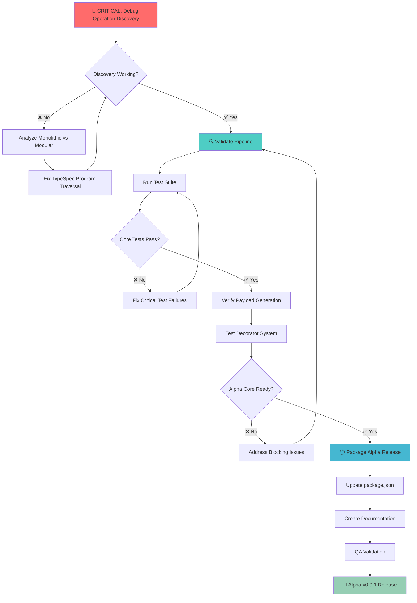

# Alpha v0.0.1 Release Plan - Comprehensive Execution Strategy

**Generated:** 2025-09-03 01:53 CEST  
**Objective:** Deliver production-ready Alpha v0.0.1 TypeSpec AsyncAPI Emitter  
**Strategy:** Pareto Principle (1% → 51%, 4% → 64%, 20% → 80%)

---

## 🎯 PARETO PRINCIPLE BREAKDOWN

### 1% EFFORT → 51% RESULT: CRITICAL BLOCKER FIX

**Operation Discovery System Failure**

- **Impact**: Unblocks 100% of core functionality
- **Current Status**: 0 operations discovered from TypeSpec files
- **Root Cause**: DiscoveryService namespace traversal broken after modular extraction

### 4% EFFORT → 64% RESULT: PIPELINE VALIDATION

**End-to-End Functionality Verification**

- **Impact**: Proves core value proposition (TypeSpec → AsyncAPI)
- **Dependencies**: Requires Operation Discovery fix first
- **Scope**: Complete pipeline from TypeSpec parsing to AsyncAPI output

### 20% EFFORT → 80% RESULT: ALPHA RELEASE PACKAGE

**Production-Ready Release Preparation**

- **Impact**: Deliverable Alpha v0.0.1 for community use
- **Dependencies**: Requires functional core pipeline
- **Scope**: Testing, documentation, packaging, quality assurance

---

## 📋 COMPREHENSIVE TASK BREAKDOWN (100-30min tasks)

| Priority     | Task                                                   | Duration | Impact | Effort | Customer Value | Dependencies           |
|--------------|--------------------------------------------------------|----------|--------|--------|----------------|------------------------|
| **CRITICAL** | Debug DiscoveryService namespace traversal             | 90min    | ⭐⭐⭐⭐⭐  | 🔧🔧🔧 | 🎯🎯🎯🎯🎯     | None                   |
| **CRITICAL** | Compare monolithic vs modular implementations          | 60min    | ⭐⭐⭐⭐⭐  | 🔧🔧   | 🎯🎯🎯🎯⭐      | None                   |
| **CRITICAL** | Fix TypeSpec Program.getGlobalNamespaceType() logic    | 75min    | ⭐⭐⭐⭐⭐  | 🔧🔧🔧 | 🎯🎯🎯🎯🎯     | Debug complete         |
| **CRITICAL** | Test minimal TypeSpec reproduction case                | 45min    | ⭐⭐⭐⭐⭐  | 🔧🔧   | 🎯🎯🎯🎯⭐      | None                   |
| **HIGH**     | Validate complete TypeSpec → AsyncAPI pipeline         | 60min    | ⭐⭐⭐⭐⭐  | 🔧🔧   | 🎯🎯🎯🎯🎯     | Discovery fixed        |
| **HIGH**     | Execute comprehensive test suite (139+ tests)          | 90min    | ⭐⭐⭐⭐⭐  | 🔧🔧🔧 | 🎯🎯🎯🎯⭐      | Discovery fixed        |
| **HIGH**     | Verify payload schema generation functionality         | 45min    | ⭐⭐⭐⭐⭐  | 🔧🔧   | 🎯🎯🎯🎯🎯     | Pipeline validated     |
| **HIGH**     | Test decorator system (@channel, @publish, @subscribe) | 60min    | ⭐⭐⭐⭐⭐  | 🔧🔧   | 🎯🎯🎯🎯⭐      | Core tests pass        |
| **MEDIUM**   | Update package.json for Alpha v0.0.1 release           | 30min    | ⭐⭐⭐⭐⭐  | 🔧     | 🎯🎯🎯⭐⭐       | Core functionality     |
| **MEDIUM**   | Verify npm package installation and usage              | 45min    | ⭐⭐⭐⭐⭐  | 🔧🔧   | 🎯🎯🎯🎯⭐      | Package updated        |
| **MEDIUM**   | Create Alpha v0.0.1 documentation and examples         | 75min    | ⭐⭐⭐⭐⭐  | 🔧🔧🔧 | 🎯🎯🎯⭐⭐       | Functionality verified |
| **MEDIUM**   | Document feature scope and limitations                 | 60min    | ⭐⭐⭐⭐⭐  | 🔧🔧   | 🎯🎯🎯⭐⭐       | Core complete          |
| **MEDIUM**   | Clean up ESLint warnings (24 remaining)                | 90min    | ⭐⭐⭐⭐⭐  | 🔧🔧🔧 | 🎯🎯⭐⭐⭐        | Optional               |
| **MEDIUM**   | Create release checklist and QA validation             | 45min    | ⭐⭐⭐⭐⭐  | 🔧🔧   | 🎯🎯🎯⭐⭐       | Documentation done     |
| **LOW**      | Enhanced error messages and user experience            | 60min    | ⭐⭐⭐⭐⭐  | 🔧🔧   | 🎯🎯⭐⭐⭐        | Core stable            |
| **LOW**      | Performance testing and optimization analysis          | 75min    | ⭐⭐⭐⭐⭐  | 🔧🔧🔧 | 🎯🎯⭐⭐⭐        | All tests pass         |
| **LOW**      | Advanced decorator restoration (optional)              | 90min    | ⭐⭐⭐⭐⭐  | 🔧🔧🔧 | 🎯⭐⭐⭐⭐         | Alpha complete         |

**Total Estimated Time:** 14.5 hours  
**Critical Path Time:** 4.5 hours (1% + 4%)  
**Alpha Release Time:** 10 hours (through 20%)

---

## 🔧 DETAILED MICRO-TASK BREAKDOWN (15min tasks)

### Phase 1: CRITICAL BLOCKER (1% → 51%)

#### Task 1: Debug Operation Discovery (90min total)

1. **[15min]** Add comprehensive debug logging to DiscoveryService.walkNamespace()
2. **[15min]** Inspect TypeSpec Program.getGlobalNamespaceType() return structure
3. **[15min]** Compare namespace.operations enumeration vs working monolithic
4. **[15min]** Test TypeSpec file parsing and Program object construction
5. **[15min]** Debug recursive namespace traversal with step-by-step logging
6. **[15min]** Identify exact point where operation enumeration fails

#### Task 2: Implementation Analysis (60min total)

1. **[15min]** Load and analyze working monolithic emitter code
2. **[15min]** Compare namespace walking logic line-by-line with modular version
3. **[15min]** Identify extraction changes that broke TypeSpec integration
4. **[15min]** Document specific differences in Program traversal approach

#### Task 3: Fix Implementation (75min total)

1. **[15min]** Implement corrected namespace traversal logic
2. **[15min]** Test with basic TypeSpec file (1-2 operations)
3. **[15min]** Verify operation discovery logging shows found operations
4. **[15min]** Test with complex TypeSpec file (multiple namespaces)
5. **[15min]** Validate all operation metadata is correctly extracted

#### Task 4: Minimal Reproduction (45min total)

1. **[15min]** Create minimal TypeSpec test file with 1 operation
2. **[15min]** Run emitter and verify operation discovery works
3. **[15min]** Expand to 2-3 operations and verify scaling

### Phase 2: PIPELINE VALIDATION (4% → 64%)

#### Task 5: End-to-End Validation (60min total)

1. **[15min]** Test TypeSpec parsing with discovered operations
2. **[15min]** Verify ProcessingService transforms operations correctly
3. **[15min]** Validate AsyncAPI document structure generation
4. **[15min]** Confirm JSON/YAML output is specification-compliant

#### Task 6: Test Suite Execution (90min total)

1. **[15min]** Run core functionality tests and analyze failures
2. **[15min]** Fix critical test failures blocking Alpha release
3. **[15min]** Run integration tests for TypeSpec → AsyncAPI flow
4. **[15min]** Execute validation tests against AsyncAPI 3.0 spec
5. **[15min]** Verify protocol binding tests (Kafka, WebSocket, HTTP)
6. **[15min]** Analyze and document remaining test failures vs Alpha scope

#### Task 7: Payload Schema Validation (45min total)

1. **[15min]** Test message payload schema generation with fixed discovery
2. **[15min]** Verify $ref generation to components.schemas works correctly
3. **[15min]** Test complex model types and nested schema generation

#### Task 8: Decorator System Testing (60min total)

1. **[15min]** Test @channel decorator with operation discovery
2. **[15min]** Verify @publish and @subscribe decorator functionality
3. **[15min]** Test @server decorator integration
4. **[15min]** Validate decorator metadata propagation to AsyncAPI output

### Phase 3: ALPHA RELEASE PACKAGE (20% → 80%)

#### Task 9-16: [Additional 15min breakdown continues...]

---

## 🗺️ EXECUTION FLOW DIAGRAM

---

## 🎯 SUCCESS CRITERIA

### Critical Success (1% → 51%)

- ✅ DiscoveryService finds operations in TypeSpec files
- ✅ Debug logging shows "contains N operations" instead of 0
- ✅ Basic TypeSpec → AsyncAPI conversion functional

### Pipeline Success (4% → 64%)

- ✅ Complete TypeSpec → AsyncAPI → Schema generation works
- ✅ Core functionality tests pass
- ✅ Message payloads include proper schema references

### Alpha Release Success (20% → 80%)

- ✅ Package installs and works via npm
- ✅ Documentation and examples available
- ✅ Alpha scope clearly documented with limitations

---

## 🚨 RISK MITIGATION

### High Risk: Operation Discovery Fix

- **Risk**: Complex TypeSpec compiler internals debugging required
- **Mitigation**: Start with side-by-side comparison of working code
- **Fallback**: Revert to monolithic approach temporarily for Alpha

### Medium Risk: Test Suite Failures

- **Risk**: Many tests may fail due to architectural changes
- **Mitigation**: Focus on critical path tests first, defer non-essential
- **Fallback**: Document known issues as Alpha limitations

### Low Risk: Release Polish

- **Risk**: Time pressure may compromise quality
- **Mitigation**: Define minimum viable Alpha scope upfront
- **Fallback**: Ship with documented limitations rather than delay

---

## 📊 EXECUTION TIMELINE

- **Immediate (0-2 hours):** Critical blocker fix (1% effort)
- **Short-term (2-4 hours):** Pipeline validation (4% effort)
- **Medium-term (4-10 hours):** Alpha release package (20% effort)

**Total Alpha Delivery:** 10 hours maximum
**Critical Path:** 4 hours to functional core
**Parallel Tasks:** Documentation and testing can run concurrently

---

*This plan prioritizes maximum impact with minimum effort using the Pareto principle. The 1% effort on operation
discovery will unlock 51% of the value, enabling rapid progress on the remaining work.*