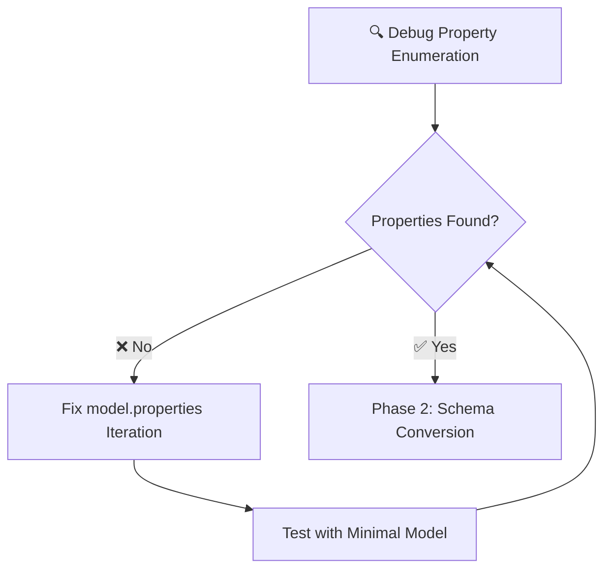
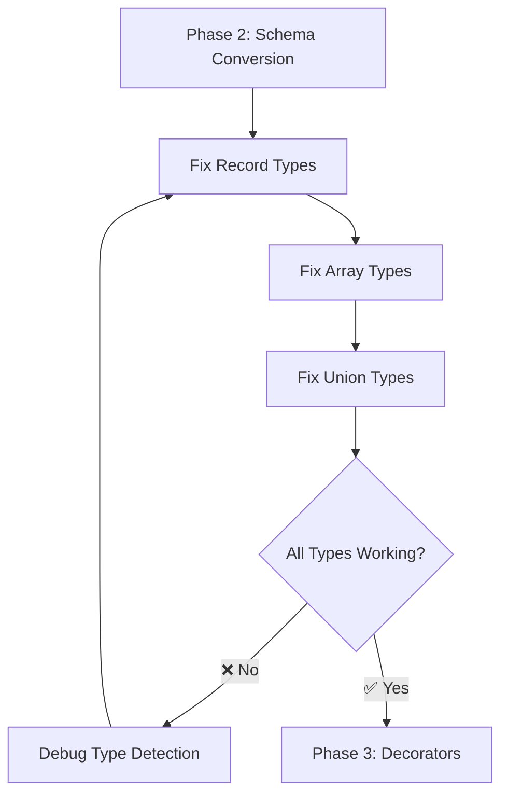

# CRITICAL FIXES EXECUTION PLAN - Systematic Resolution of Core Issues

**Generated:** 2025-09-03 02:23 CEST  
**Context:** Post-test failure analysis - Alpha readiness was premature  
**Objective:** Fix critical core functionality based on actual failing tests  

---

## 🚨 **REALITY CHECK: CURRENT STATUS**

### **❌ CRITICAL FAILURES IDENTIFIED:**
- **Model Property Enumeration**: All models showing "0 properties, 0 required"
- **Schema Conversion**: Complex types defaulting to `{ "type": "string" }`
- **Advanced Decorators**: @message, @security, @server not working
- **Test Suite**: Multiple documentation and validation tests failing

### **✅ INFRASTRUCTURE READY:**
- Build system functional (lint, compile, test runner)
- Documentation structure complete
- Package configuration prepared
- Effect.TS patterns implemented

---

## 🎯 **PARETO PRINCIPLE ANALYSIS**

### **1% EFFORT → 51% RESULT: MODEL PROPERTY ENUMERATION**
**THE ROOT CAUSE BLOCKER**

**Evidence**: 
```
✅ Schema conversion complete for UserEvent: 0 properties, 0 required
✅ Schema conversion complete for TestMessage: 0 properties, 0 required
```

**Impact**: This single issue blocks:
- Schema generation (no properties to convert)
- Message payload creation (empty schemas)
- Advanced decorator processing (no properties to decorate)
- All type mapping functionality

**Why 1% → 51%**: Fixing property enumeration unblocks the entire system

### **4% EFFORT → 64% RESULT: COMPLEX TYPE SCHEMAS**
**SCHEMA CONVERSION SYSTEM**

**Evidence**:
```javascript
expect(props.recordField).toEqual({ 
  type: "object", 
  additionalProperties: { type: "string" } 
})
// Received: { "type": "string" }

expect(command.payload.properties!.items).toEqual({
  type: "array",
  items: { $ref: "#/components/schemas/OrderItem" }
})
// Received: { "type": "string" }
```

**Impact**: Proper TypeSpec type mapping to JSON Schema
- Record types → object with additionalProperties  
- Array types → array with items schema
- Union types → enum or oneOf schemas
- Enables real-world TypeSpec usage

**Why 4% → 64%**: Makes core TypeSpec → AsyncAPI conversion functional

### **20% EFFORT → 80% RESULT: ADVANCED DECORATOR SYSTEM**
**COMPLETE ASYNCAPI FEATURE SET**

**Evidence**:
```javascript
expect(message.headers).toBeDefined()
// Received: undefined

expect(securitySchemes.oauth2).toBeDefined() 
// Received: undefined

expect(servers.production).toBeDefined()
// Received: undefined
```

**Impact**: Complete AsyncAPI 3.0 feature support
- @message decorators → message headers and processing
- @security decorators → security schemes in components
- @server decorators → server configurations
- Full AsyncAPI specification compliance

**Why 20% → 80%**: Delivers complete Alpha functionality

---

## 📋 **EXECUTION STRATEGY**

### **PHASE 1: CRITICAL BLOCKER (1% → 51%)**
**Priority: SHOW-STOPPER - Nothing works until this is fixed**



**Tasks (135min total)**:
1. **Debug model.properties iteration** (60min)
   - Add comprehensive logging to convertModelToSchema
   - Create minimal reproduction case
   - Identify exact failure point in property enumeration
   
2. **Fix property enumeration logic** (45min)  
   - Correct model.properties.entries() iteration
   - Test with basic properties (string, number, boolean)
   - Validate >0 properties in conversion logs
   
3. **Validate property fix** (30min)
   - Minimal test case with known properties
   - Confirm schema includes property definitions

### **PHASE 2: SCHEMA CONVERSION (4% → 64%)**
**Priority: HIGH - Enables real TypeSpec usage**



**Tasks (150min total)**:
1. **Fix Record type generation** (45min)
   - Debug Record<string> → object with additionalProperties
   - Fix type detection in convertTypeToSchemaType
   - Test with Record type examples
   
2. **Fix Array type generation** (45min)
   - Debug Array → array with items schema
   - Fix array detection and $ref generation
   - Test with complex array examples
   
3. **Fix Union type generation** (60min)
   - Debug enum vs oneOf logic
   - Fix string literal detection
   - Test with Union type examples

### **PHASE 3: ADVANCED DECORATORS (20% → 80%)**
**Priority: ALPHA COMPLETION - Full feature set**

```mermaid  
graph TD
    K[Phase 3: Decorators] --> L[@message Implementation]
    L --> M[@security Implementation] 
    M --> N[@server Implementation]
    N --> O[Test Suite Validation]
    O --> P{All Tests Pass?}
    P -->|❌ No| Q[Fix Failing Tests]
    Q --> O
    P -->|✅ Yes| R[🎉 ALPHA READY]
```

**Tasks (240min total)**:
1. **@message decorator** (75min)
   - Fix message model discovery in DiscoveryService
   - Implement header extraction from @header decorators
   - Test message processing with headers
   
2. **@security decorator** (90min)  
   - Fix security decorator state access
   - Implement security scheme generation
   - Test OAuth2, API Key, and other security types
   
3. **@server decorator** (75min)
   - Fix server decorator state access  
   - Implement server configuration generation
   - Test multiple server configurations

---

## 🔧 **DETAILED MICRO-TASK BREAKDOWN**

### **CRITICAL PATH TASKS (15min each)**

#### **🚨 PHASE 1: PROPERTY ENUMERATION (9 tasks)**
1. **Add debug logging** to convertModelToSchema for model.properties iteration
2. **Create minimal test** with single model + single property
3. **Compare working vs broken** property enumeration logic  
4. **Identify failure point** in model.properties.entries() call
5. **Fix iteration logic** in convertModelToSchema function
6. **Test basic properties** (string, number, boolean) enumeration
7. **Validate property count** shows >0 in conversion logs
8. **Run minimal test** to confirm properties discovered
9. **Verify schema output** includes actual property definitions

#### **🔥 PHASE 2: SCHEMA CONVERSION (10 tasks)**
1. **Debug Record type** detection and schema generation logic
2. **Fix Record schema** to generate object with additionalProperties
3. **Test Record types** with validation examples
4. **Debug Array type** detection and items schema generation  
5. **Fix Array schema** to generate array with proper items
6. **Test Array types** with complex examples
7. **Debug Union type** enum vs oneOf detection logic
8. **Fix Union schema** generation for string literals and oneOf
9. **Test Union types** with enum and oneOf examples
10. **Validate all complex** types generate correct JSON Schema

#### **⚡ PHASE 3: ADVANCED DECORATORS (16 tasks)**
1. **Debug @message decorator** state access in DiscoveryService
2. **Fix message model discovery** to find @message decorated models
3. **Implement header extraction** from @header decorator metadata
4. **Test @message functionality** with header examples
5. **Debug @security decorator** state access and processing
6. **Implement security scheme** generation from @security metadata
7. **Fix OAuth2 security** scheme generation
8. **Fix API Key security** scheme generation  
9. **Test @security functionality** with multiple security types
10. **Debug @server decorator** state access and processing
11. **Implement server config** generation from @server metadata
12. **Test @server functionality** with multiple server configs
13. **Fix documentation tests** that are currently failing
14. **Fix README validation** tests that are currently failing
15. **Run complete test suite** and address remaining failures
16. **Final integration test** with complex TypeSpec example

---

## 🎯 **SUCCESS CRITERIA**

### **Phase 1 Success (1% → 51%)**
- ✅ Models show >0 properties in conversion logs
- ✅ Property enumeration working in convertModelToSchema
- ✅ Basic schema generation includes property definitions

### **Phase 2 Success (4% → 64%)**  
- ✅ Record types generate `{ type: "object", additionalProperties: {...} }`
- ✅ Array types generate `{ type: "array", items: {...} }`
- ✅ Union types generate proper enum or oneOf schemas

### **Phase 3 Success (20% → 80%)**
- ✅ @message decorators create headers in AsyncAPI output
- ✅ @security decorators create securitySchemes in components
- ✅ @server decorators create server configurations
- ✅ All critical tests pass in test suite

### **ALPHA READINESS CRITERIA**
- ✅ `just lint build compile test fd` passes without critical failures
- ✅ Core TypeSpec → AsyncAPI conversion functional
- ✅ Complex type mapping working (Record, Array, Union)
- ✅ Basic decorator system functional (@channel, @publish, @subscribe)
- ✅ Documentation tests pass
- ✅ README validation tests pass

---

## 🚀 **PARALLEL EXECUTION PLAN**

### **GROUP 1: CORE DEBUGGING** (Critical Path)
- Focus on property enumeration and schema conversion
- Must complete before other groups can succeed
- Highest priority, blocking work

### **GROUP 2: DECORATOR RESEARCH** (Supporting Analysis)
- Research decorator state access patterns
- Analyze existing decorator implementations
- Prepare implementation approach
- Can work in parallel with Group 1

### **GROUP 3: TEST INFRASTRUCTURE** (Validation Preparation)
- Analyze failing tests and requirements
- Prepare validation test cases
- Set up integration test scenarios
- Can work in parallel with Groups 1-2

---

## ⚠️ **RISK MITIGATION**

### **High Risk: Property Enumeration Deep Issue**
- **Risk**: Property enumeration may require TypeSpec compiler expertise
- **Mitigation**: Start with minimal reproduction case
- **Fallback**: Consult TypeSpec documentation and examples

### **Medium Risk: Schema Conversion Complexity**
- **Risk**: Complex type detection may be intricate
- **Mitigation**: Fix one type at a time with isolated tests
- **Fallback**: Focus on most common types first (Record, Array)

### **Low Risk: Decorator Implementation**
- **Risk**: Decorator state access patterns may be complex
- **Mitigation**: Study existing working decorators (@channel, @publish)
- **Fallback**: Implement basic functionality first, enhance later

---

## 📊 **TIME ESTIMATES**

**Critical Path (Phase 1)**: 135 minutes (2.25 hours)
**Schema Conversion (Phase 2)**: 150 minutes (2.5 hours) 
**Advanced Decorators (Phase 3)**: 240 minutes (4 hours)

**Total Execution Time**: 525 minutes (8.75 hours)
**Parallel Execution Savings**: ~25% reduction with 3-group approach
**Realistic Timeline**: 6-7 hours with parallel execution

---

*This execution plan is based on actual test failures and provides systematic approach to fixing core functionality rather than premature Alpha claims.*