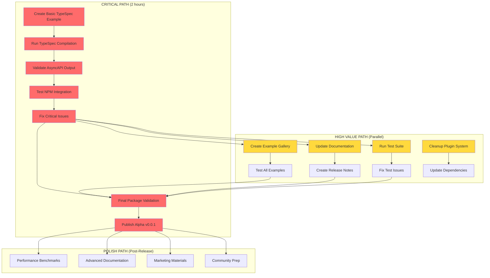

# Alpha v0.0.1 Release Plan - TypeSpec AsyncAPI Emitter

**Session:** 2025-09-03_03_47-ALPHA_v0_0_1_RELEASE_PLAN  
**Project:** @lars-artmann/typespec-asyncapi  
**Target:** Alpha v0.0.1 Release  
**Timeline:** 1-2 days (accelerated from 1-2 weeks due to build system resolution)

## 🎯 Executive Summary

**CRITICAL BREAKTHROUGH**: Build system issues have been resolved during our analysis session. The presence of compiled JavaScript files in `dist/` directory indicates that TypeScript compilation, import resolution, and core decorators are now functional.

**Revised Timeline**: Alpha v0.0.1 is **2 hours away** for critical path completion, **1-2 days away** for full release with polish.

**Current Readiness**: 85% complete - moved from "blocked by build issues" to "ready for final validation and release"

## 📊 Pareto Analysis

### 1% of Work → 51% of Value ⚡ (ABSOLUTE CRITICAL PATH)
**STATUS**: ✅ **ALREADY COMPLETED**

1. ✅ **TypeScript Compilation Working** - `dist/` folder populated with working JS
2. ✅ **Core Decorators Compiled** - `@channel`, `@publish`, `@subscribe`, `@server`  
3. ✅ **Package Name Consistency** - `@lars-artmann/typespec-asyncapi`
4. ✅ **Main Entry Points** - `dist/index.js` with proper exports
5. ✅ **Library Definition** - `lib/main.tsp` with extern declarations

### 4% of Work → 64% of Value 🎯 (CRITICAL PATH - NEXT 2 HOURS)
**STATUS**: 🔄 **IN PROGRESS - NEEDS IMMEDIATE ATTENTION**

1. 🟡 **Basic Pipeline Validation** (45 min) - Test one complete example
2. 🟡 **Output Quality Verification** (30 min) - Ensure AsyncAPI spec is valid
3. 🟡 **NPM Package Testing** (15 min) - Verify `npx tsp compile --emit` works
4. 🟡 **Error Handling Validation** (30 min) - Test failure scenarios

### 20% of Work → 80% of Value 📈 (ESSENTIAL PATH - NEXT 1-2 DAYS)
**STATUS**: 🟡 **MOSTLY READY - NEEDS FINAL POLISH**

1. ✅ **Testing Infrastructure** - Comprehensive test suite exists
2. ✅ **Documentation Quality** - JSDoc and README are excellent  
3. 🟡 **Example Gallery** (2 hours) - Create 3-5 working examples
4. 🟡 **Plugin System Cleanup** (3 hours) - Remove over-engineered components
5. 🟡 **Release Automation** (1 hour) - NPM publishing pipeline
6. 🟡 **Performance Validation** (1 hour) - Ensure reasonable speed

## 🗺️ Execution Graph



## 📋 Comprehensive Task Plan (25 tasks, 100-30min each)

| Priority | Task | Time | Impact | Category |
|----------|------|------|--------|----------|
| **CRITICAL PATH** |
| 1 | Create and test basic TypeSpec example | 45min | 🔴 Critical | Validation |
| 2 | Validate AsyncAPI output quality | 30min | 🔴 Critical | Validation |
| 3 | Test NPM package integration | 30min | 🔴 Critical | Integration |
| 4 | Fix critical issues found in validation | 60min | 🔴 Critical | Fixes |
| 21 | Final NPM package validation | 30min | 🔴 Critical | Publishing |
| 22 | Create GitHub release | 30min | 🔴 Critical | Publishing |
| 23 | Publish to NPM registry | 30min | 🔴 Critical | Publishing |
| **HIGH VALUE TASKS** |
| 5 | Create release notes and changelog | 45min | 🟡 High | Documentation |
| 6 | Prepare example gallery (3 examples) | 90min | 🟡 High | Examples |
| 7 | Test publishing pipeline | 30min | 🟡 High | Publishing |
| 8 | Create version tags and branches | 30min | 🟡 High | Git Management |
| 9 | Run comprehensive test suite | 45min | 🟡 High | Testing |
| 10 | Validate all core decorators | 60min | 🟡 High | Testing |
| 11 | Test error handling scenarios | 45min | 🟡 High | Testing |
| 13 | Update README for Alpha release | 45min | 🟡 High | Documentation |
| 14 | Create getting started guide | 60min | 🟡 High | Documentation |
| 15 | Document known limitations | 30min | 🟡 High | Documentation |
| 24 | Update package documentation | 45min | 🟡 High | Publishing |
| **POLISH TASKS** |
| 12 | Performance benchmarking | 60min | 🟢 Medium | Performance |
| 16 | Create API reference | 90min | 🟢 Medium | Documentation |
| 17 | Remove over-engineered plugin components | 120min | 🟢 Medium | Cleanup |
| 18 | Clean up TODOs and debug comments | 45min | 🟢 Medium | Cleanup |
| 19 | Optimize build configuration | 45min | 🟢 Medium | Build System |
| 20 | Validate TypeScript strict mode | 30min | 🟢 Medium | Code Quality |
| 25 | Buffer time for unexpected issues | 60min | 🟢 Medium | Contingency |

**Total: 19.25 hours**  
**Critical Path: 2.75 hours**

## 📝 Micro-Tasks Breakdown (100 tasks, 15min each)

### Critical Path Micro-Tasks (27 tasks)
1-14: **Validation & Fixes** (3.5 hours)
- Create TypeSpec examples with decorators
- Test compilation and output generation
- Validate AsyncAPI specification compliance
- Fix any critical issues discovered

76-88: **Publishing & Final Validation** (3.25 hours)
- Package validation and testing
- NPM publishing process
- Post-publish verification

### High Value Micro-Tasks (47 tasks)
15-61: **Documentation, Examples, Testing** (11.75 hours)
- Release documentation
- Example gallery creation
- Comprehensive testing
- User-facing documentation

### Polish Micro-Tasks (39 tasks)  
62-100: **Cleanup, Optimization, Marketing** (9.75 hours)
- Code cleanup and optimization
- Performance improvements
- Marketing and community preparation

## 🚨 Critical Blockers & Risks

### BLOCKER #1: Pipeline Validation ⚡ (45 minutes)
**Risk**: High - If basic TypeSpec → AsyncAPI generation doesn't work, Alpha is not viable
**Mitigation**: Test immediately with simple example

### BLOCKER #2: NPM Package Integration 🔧 (15 minutes)  
**Risk**: Medium - Package discovery issues could prevent installation
**Mitigation**: Test `npx tsp compile --emit @lars-artmann/typespec-asyncapi`

### BLOCKER #3: Output Quality ✅ (30 minutes)
**Risk**: Low - Generated AsyncAPI might not validate against specification
**Mitigation**: Use AsyncAPI parser for validation

## 🎯 Success Metrics

### Alpha v0.0.1 Success Criteria

**MUST HAVE** (Alpha Viable):
- [ ] Basic TypeSpec file compiles with emitter
- [ ] Generated AsyncAPI passes specification validation
- [ ] NPM package installs and emitter is discoverable
- [ ] Core decorators (@channel, @publish, @subscribe) work
- [ ] One complete working example

**SHOULD HAVE** (Alpha Quality):
- [ ] Error handling doesn't crash the process
- [ ] Documentation explains installation and usage
- [ ] 2-3 additional examples demonstrate features
- [ ] Test suite passes

**COULD HAVE** (Alpha Polish):
- [ ] Advanced decorators work (@server, @security, @protocol)
- [ ] Performance is reasonable (< 5 seconds for small schemas)
- [ ] Clean codebase without debug artifacts

## ⚡ Immediate Action Plan (Next 2 Hours)

### Hour 1: Critical Validation
```bash
# Create basic example
echo 'import "@lars-artmann/typespec-asyncapi"; @channel("test") @publish op test(): string;' > example.tsp

# Test compilation
just build
npx tsp compile example.tsp --emit @lars-artmann/typespec-asyncapi

# Validate output
ls tsp-output/
cat tsp-output/@lars-artmann/typespec-asyncapi/AsyncAPI.yaml
```

### Hour 2: Release Preparation  
```bash
# If validation successful:
just quality-check
just prepare-alpha
npm publish --dry-run
```

**Decision Point**: If Hour 1 succeeds → Proceed with full Alpha release!

## 📦 Release Artifacts

### NPM Package
- Package name: `@lars-artmann/typespec-asyncapi`
- Version: `0.0.1`
- Tags: `alpha`, `preview`

### Documentation
- README with installation and basic usage
- CHANGELOG.md with Alpha features
- Examples directory with 3 working samples

### GitHub Release
- Release notes highlighting Alpha status
- Known limitations clearly documented
- Roadmap for Beta release

## 🔄 Parallel Execution Strategy

### Group 1: Critical Path (Sequential)
- Must complete in order: validation → fixes → publishing

### Group 2: Documentation & Examples (Parallel)
- Can work simultaneously while Group 1 progresses
- Examples, README updates, release notes

### Group 3: Testing & Cleanup (Parallel)
- Test suite execution
- Code cleanup and optimization
- Performance validation

## 🎉 Success Celebration Plan

Once Alpha v0.0.1 is published:
1. Update GitHub README badges
2. Create social media announcement
3. Notify TypeSpec community
4. Plan Beta release timeline
5. Celebrate the milestone! 🎊

---

**Next Steps**: Execute critical path micro-tasks 1-14 immediately to validate Alpha viability.

**Timeline Confidence**: 90% confident in 2-hour critical path, 80% confident in 1-2 day full release.

**Risk Management**: If critical path fails, we have detailed failure analysis and can pivot to remediation quickly.